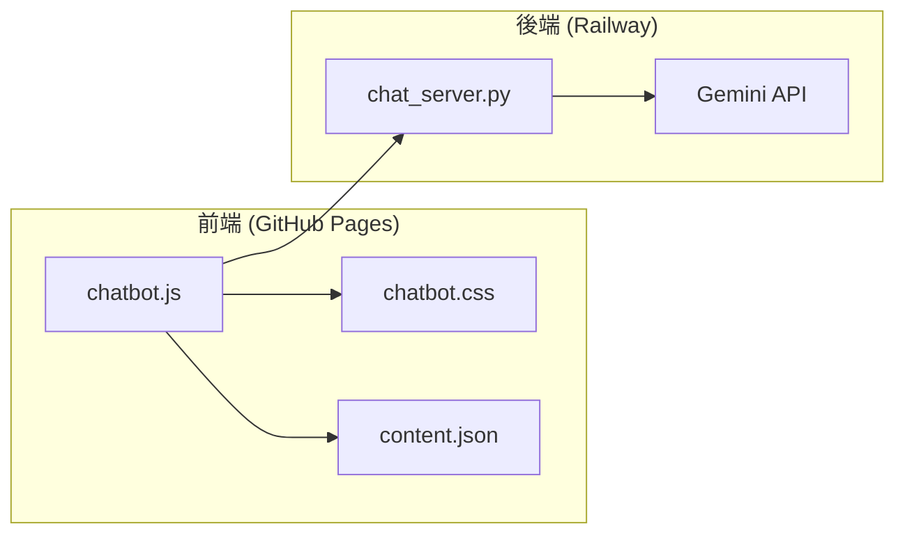

# AI Chatbot 設定與維護 Skill

## 概述

本 Skill 定義 DCKA 課程網站 AI Chatbot 的架構、設定與維護流程。

## 觸發條件

當使用者提到以下關鍵字時啟用：
- Chatbot、聊天機器人、AI 助教
- Gemini API、LLM
- Railway 部署、後端

---

## 架構概覽



---

## 檔案結構

| 檔案 | 位置 | 說明 |
|------|------|------|
| **chatbot.js** | `docs/assets/js/` | 前端邏輯、System Prompt |
| **chatbot.css** | `docs/assets/css/` | 聊天室 UI 樣式 |
| **chat_server.py** | `backend/` | FastAPI 後端 |
| **content.json** | `site/` | 自動生成的文件內容 |

---

## 關鍵設定

### 前端設定 (chatbot.js)

#### API URL
```javascript
// 第 14 行
window.BACKEND_API_URL = "https://dcka-class-notes-production.up.railway.app";
```

#### System Prompt
```javascript
// 第 188-210 行
const systemInstruction = `你是 DCKA 課程的 AI 助教...`;
```

#### 連結修正函數
```javascript
// 第 61-85 行
function fixBrokenLinks(text) { ... }
```

### 後端設定 (chat_server.py)

#### Gemini Model
```python
# 第 24 行
MODEL_ID = "gemini-2.0-flash-lite-preview-02-05"
```

#### API Key (環境變數)
```python
api_key = os.getenv("GEMINI_API_KEY")
```

---

## Railway 部署

### 環境變數

| 變數名 | 說明 |
|--------|------|
| `GEMINI_API_KEY` | Google AI Studio API Key |
| `PORT` | 自動由 Railway 設定 |

### 部署流程

1. 推送到 GitHub main 分支
2. Railway 自動偵測並部署
3. 使用 `backend/Dockerfile` 建置

### 手動重新部署
在 Railway Dashboard → Deployments → Redeploy

---

## UI 客製化

### 標題列 (第 127-182 行 chatbot.css)
```css
#chat-header {
    background: var(--chatbot-header-bg);
    padding: 14px 16px;
}
```

### 按鈕圖示 (第 252-266 行 chatbot.js)
- 🗑️ 清除歷史: `#clear-history-btn`
- ⛶ 全螢幕: `#toggle-fullscreen-btn`  
- ✕ 關閉: `#close-chat`

### 訊息氣泡 (第 268-315 行 chatbot.css)
```css
.user-message { ... }  /* 使用者訊息 */
.bot-message { ... }   /* AI 回覆 */
```

---

## 維護指南

### 更新 AI Model
1. 編輯 `backend/chat_server.py`
2. 修改 `MODEL_ID` 變數
3. 推送到 GitHub，Railway 自動部署

### 更新 System Prompt
1. 編輯 `docs/assets/js/chatbot.js`
2. 修改 `systemInstruction` 變數
3. 執行 `uv run mkdocs gh-deploy --force`

### 修改聊天室樣式
1. 編輯 `docs/assets/css/chatbot.css`
2. 執行 `uv run mkdocs gh-deploy --force`

---

## 故障排除

### 問題：聊天室沒有出現
**檢查**：
1. `mkdocs.yml` 是否有載入 JS/CSS
2. 瀏覽器 Console 是否有錯誤

### 問題：AI 回覆錯誤
**檢查**：
1. Railway 是否正常運行
2. `GEMINI_API_KEY` 是否有效
3. 後端 logs 是否有錯誤

### 問題：連結格式錯誤
**解決**：更新 `fixBrokenLinks()` 函數

---

## 相關連結

- [Railway Dashboard](https://railway.app/)
- [Google AI Studio](https://aistudio.google.com/)
- [Gemini API 文件](https://ai.google.dev/docs)
