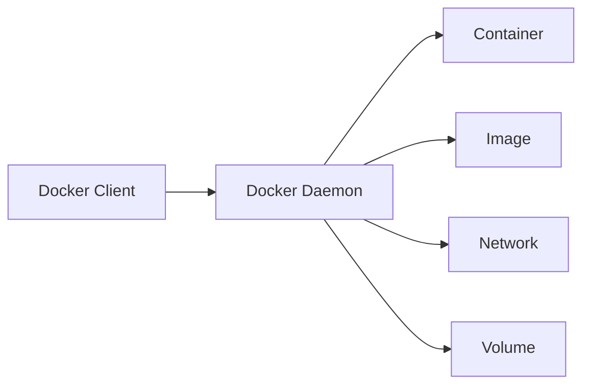

# Docker Containers 與 Kubernetes 系統管理課程撰寫 Skill

## Description
專為恆逸教育訓練中心「DCKA - Docker Containers與Kubernetes系統管理」課程設計的 MkDocs 課程內容撰寫助手。本 Skill 依據 21 小時的課程大綱，幫助建立結構化、實務導向的技術課程文件。

## Trigger
當使用者提到以下關鍵字時啟用此 Skill：
- 撰寫課程、寫課程內容、新增章節
- Docker、Container、容器
- Kubernetes、K8S、Pod、Deployment
- MkDocs 文件、課程筆記

---

## Course Information

### 課程資訊
- **課程名稱**：Docker Containers與Kubernetes系統管理
- **課程代號**：DCKA
- **總時數**：21 小時（3 天）
- **適合對象**：網路工程師、雲端運算工程師
- **預備知識**：Linux 基礎指令、Linux 基本管理、建議具備 RHCE 認證能力

### 學習目標
完成本課程後，學員將能夠：
1. Docker Container 建立與管理
2. Docker Images 客製化
3. Kubernetes 管理
4. 了解 Container 化服務

---

## Official Course Outline

請嚴格依照以下恆逸官方課程大綱結構撰寫內容：

### 第 1 章：Docker Container & Micro Service Introduction
- 1.1 容器化的好處
- 1.2 Docker 架構
- 1.3 Docker 基本架構
- 1.4 Docker 與 podman

### 第 2 章：Docker 容器化管理
- 2.1 publics registry 與 private registry
- 2.2 Docker 基本操作
- 2.3 Persistent Storage
- 2.4 Docker network
- 2.5 Docker search
- 2.6 Docker pull
- 2.7 Docker push
- 2.8 使用 Docker 架設 wordpress+mysql

### 第 3 章：客製化 Docker images
- 3.1 Docker commit
- 3.2 Dockerfile
- 3.3 Source-to-image 簡介

### 第 4 章：Kubernetes management
- 4.1 Kubernetes 與 OpenShift/OKD
- 4.2 minikube vs minishift
- 4.3 Kubernetes 架構
- 4.4 安裝 Kubernetes
- 4.5 YAML 與 JSON 檔
- 4.6 Kubernetes resource type
- 4.7 Kubernetes 管理
  - 4.7.1 deployment
  - 4.7.2 service
  - 4.7.3 RollingUpdate 與 Recreate
  - 4.7.4 Canary 與 Blue/Green
  - 4.7.5 可用資源管理
- 4.8 Kubernetes 網路
- 4.9 Persistent Volumes
- 4.10 configMaps 與 secret
- 4.11 RBAC (Role Base Access Control)
- 4.12 使用 Kubernetes 架設 wordpress+mysql
- 4.13 Logging、Monitoring 與疑難排除

---

## Instructions

### 撰寫原則

1. **語言規範**
   - 使用**繁體中文**撰寫所有內容
   - 技術名詞保留英文原文，首次出現時附上中文說明
   - 例如：Container（容器）、Pod（最小部署單位）

2. **內容導向**
   - 每個概念都要有**實作範例**
   - 強調**實務操作**而非純理論
   - 程式碼區塊必須標註語言類型和用途
   - 包含**常見錯誤**與**疑難排解**

3. **結構規範**
   - 檔案命名：使用章節編號，如 `01_docker_intro.md`、`02_docker_management.md`
   - 圖片路徑：`docs/assets/images/`
   - 每個章節獨立一個 `.md` 檔案

### MkDocs Material 語法規範

#### Admonition 使用指南
```markdown
!!! note "注意"
    重要提示內容

!!! warning "警告"
    可能導致問題的操作

!!! tip "小技巧"
    實用的操作技巧

!!! example "實作範例"
    動手操作的步驟

!!! danger "危險"
    不可逆或高風險操作

!!! info "補充資訊"
    背景知識或額外說明

??? question "常見問題"
    可摺疊的 FAQ 區塊
```

#### 程式碼區塊格式
```markdown
```bash title="建立 nginx 容器"
docker run -d --name my-nginx -p 8080:80 nginx:latest
```

```yaml title="docker-compose.yml"
version: '3.8'
services:
  web:
    image: nginx
    ports:
      - "8080:80"
```

```yaml title="deployment.yaml"
apiVersion: apps/v1
kind: Deployment
metadata:
  name: nginx-deployment
spec:
  replicas: 3
  selector:
    matchLabels:
      app: nginx
```
```

#### Tab 分頁（多種方式比較）
```markdown
=== "Docker"
    ```bash
    docker run -d nginx
    ```

=== "Podman"
    ```bash
    podman run -d nginx
    ```

=== "Kubernetes"
    ```bash
    kubectl run nginx --image=nginx
    ```
```

#### Mermaid 流程圖
```markdown

```

### 課程內容模板

每個章節應包含以下結構：

```markdown
# 章節標題

## 學習目標

完成本章節後，你將能夠：

- [ ] 目標 1
- [ ] 目標 2
- [ ] 目標 3

## 前置知識

開始之前，請確保你已經：

- 完成前一章節內容
- 具備 XXX 基礎知識

---

## 主要內容

### 小節標題

（概念說明）

!!! info "背景知識"
    補充說明...

#### 實作步驟

1. 第一步
2. 第二步
3. 第三步

```bash title="範例指令"
# 指令內容
```

**預期結果**：

```
輸出內容
```

---

## Lab 實作練習

### Lab X-1：練習標題

**目標**：說明練習目的

**情境**：模擬的實務情境

**步驟**：

1. 步驟說明
   ```bash
   指令
   ```

2. 步驟說明
   ```bash
   指令
   ```

**驗證**：

```bash
# 驗證指令
```

---

## 常見問題

??? question "問題 1：錯誤訊息 XXX"
    **原因**：說明原因
    
    **解決方案**：
    ```bash
    解決指令
    ```

??? question "問題 2：如何 XXX"
    解答內容...

---

## 小結

本章節重點回顧：

- ✅ 重點 1
- ✅ 重點 2
- ✅ 重點 3

## 延伸閱讀

- [官方文件](URL)
- [相關資源](URL)
```

---

## Commands

### 新增章節
當使用者說「新增 [章節名稱]」或「撰寫 [主題] 內容」時：
1. 確認對應的課程大綱章節
2. 在 `docs/` 建立對應的 `.md` 檔案
3. 使用課程內容模板
4. 更新 `mkdocs.yml` 的 nav 設定

### 生成 Lab 練習
當使用者說「生成 [主題] 的 Lab」時：
1. 根據該章節內容設計實作練習
2. 包含情境說明、步驟、驗證方式
3. 提供預期輸出結果

### 生成指令速查表
當使用者說「生成 [Docker/K8S] 指令速查表」時：
1. 整理該主題的常用指令
2. 使用表格格式呈現
3. 包含指令說明和範例

### 預覽課程
```bash
uv run mkdocs serve
```

### 建置靜態網站
```bash
uv run mkdocs build
```

---

## Resources

### 專有名詞對照表

| 英文 | 中文 | 說明 |
|------|------|------|
| Container | 容器 | 輕量級的應用程式封裝單位 |
| Image | 映像檔 | 容器的唯讀模板 |
| Registry | 倉庫 | 儲存映像檔的服務 |
| Pod | Pod | K8S 最小部署單位 |
| Deployment | 部署 | K8S 工作負載資源 |
| Service | 服務 | K8S 網路抽象層 |
| ConfigMap | 設定對應 | 儲存非機密設定 |
| Secret | 密鑰 | 儲存機密資訊 |
| Volume | 儲存卷 | 持久化儲存 |
| Namespace | 命名空間 | 資源隔離單位 |
| Node | 節點 | K8S 工作節點 |
| Cluster | 叢集 | K8S 集群 |
| RBAC | 角色存取控制 | 權限管理機制 |

### 課程相關連結

- [恆逸 DCKA 課程頁面](https://www.uuu.com.tw/Course/Show/1552/Docker-Containers%E8%88%87Kubernetes%E7%B3%BB%E7%B5%B1%E7%AE%A1%E7%90%86)
- [Docker 官方文件](https://docs.docker.com/)
- [Kubernetes 官方文件](https://kubernetes.io/docs/)
- [Docker Hub](https://hub.docker.com/)
- [Podman 官方文件](https://podman.io/)

---

## File Structure

建議的 MkDocs 專案結構：

```
docker-k8s-course/
├── .agent/
│   └── skills/
│       └── dcka-course-writer/
│           └── SKILL.md              # 本文件
├── docs/
│   ├── index.md                      # 課程首頁
│   ├── 01_docker_intro.md            # Ch1: Docker 介紹
│   ├── 02_docker_management.md       # Ch2: Docker 容器化管理
│   ├── 03_docker_images.md           # Ch3: 客製化 Docker images
│   ├── 04_kubernetes.md              # Ch4: Kubernetes management
│   ├── appendix/
│   │   ├── docker_cheatsheet.md      # Docker 指令速查
│   │   ├── k8s_cheatsheet.md         # K8S 指令速查
│   │   └── troubleshooting.md        # 疑難排解
│   └── assets/
│       └── images/
├── mkdocs.yml
├── pyproject.toml
└── .python-version
```
