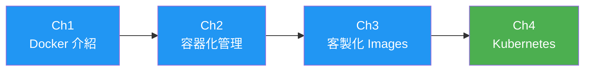

# Docker Containers 與 Kubernetes 系統管理

歡迎來到 **DCKA 課程學習筆記**！本課程為恆逸教育訓練中心的 Docker 與 Kubernetes 系統管理課程。

---

## 課程資訊

| 項目 | 內容 |
|------|------|
| **課程代號** | DCKA |
| **課程名稱** | Docker Containers 與 Kubernetes 系統管理 |
| **總時數** | 21 小時（3 天） |
| **適合對象** | 網路工程師、雲端運算工程師 |

---

## 學習目標

完成本課程後，你將能夠：

- [x] Docker Container 建立與管理
- [x] Docker Images 客製化
- [x] Kubernetes 管理
- [x] 了解 Container 化服務

---

## 課程大綱

### 第 1 章：Docker Container & Micro Service Introduction
- 容器化的好處
- Docker 架構
- Docker 與 podman 比較

### 第 2 章：Docker 容器化管理
- Registry 管理（public / private）
- Docker 基本操作
- Persistent Storage & Network
- **Lab**：使用 Docker 架設 WordPress + MySQL

### 第 3 章：客製化 Docker Images
- Docker commit
- Dockerfile 撰寫
- Source-to-image 簡介

### 第 4 章：Kubernetes Management
- Kubernetes 架構與安裝
- 資源類型與 YAML 檔
- Deployment、Service、RollingUpdate
- Canary 與 Blue/Green 部署
- ConfigMaps、Secret、RBAC
- **Lab**：使用 Kubernetes 架設 WordPress + MySQL

---

## 環境需求

### 必備工具

=== "Docker 環境"
    - Docker Desktop 或 Docker Engine
    - Docker Compose

=== "Kubernetes 環境"
    - kubectl CLI
    - minikube 或 kind（本地 K8S 環境）

### 建議配備

- 記憶體：至少 8GB RAM
- 硬碟空間：至少 20GB 可用空間
- 作業系統：Linux / macOS / Windows 10+

---

## 開始學習

!!! tip "學習建議"
    建議按照章節順序學習，每個章節都包含實作練習，請務必動手操作！

👉 從 [第 1 章 - Docker 介紹](01_docker_intro.md) 開始你的容器化之旅！

---

## 相關資源

- [恆逸 DCKA 課程頁面](https://www.uuu.com.tw/Course/Show/1552/Docker-Containers%E8%88%87Kubernetes%E7%B3%BB%E7%B5%B1%E7%AE%A1%E7%90%86)
- [Docker 官方文件](https://docs.docker.com/)
- [Kubernetes 官方文件](https://kubernetes.io/docs/)
- [Docker Hub](https://hub.docker.com/)
