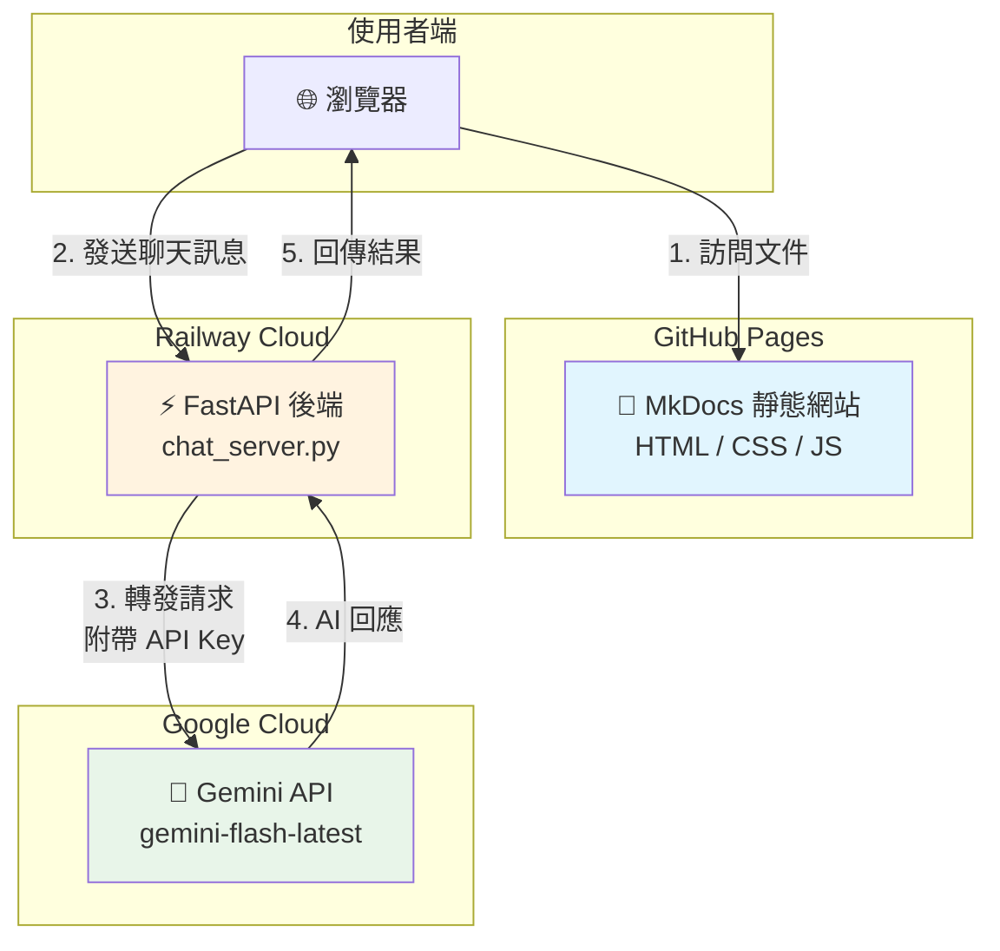

# DCKA 學習筆記

[](https://squidfunk.github.io/mkdocs-material/)
[](https://caocharles.github.io/dcka-class-notes/)
[](https://www.python.org/)

> **Docker Containers 與 Kubernetes 系統管理** 課程的學習筆記與實作指南

🌐 **線上文件**：[https://caocharles.github.io/dcka-class-notes/](https://caocharles.github.io/dcka-class-notes/)

---

## 📚 專案簡介

本專案是恆逸教育訓練中心 DCKA 課程的學習筆記，使用 MkDocs Material 主題建置，並整合 Gemini AI 聊天機器人提供即時問答功能。

### 主要功能

- 📖 **課程文件** - 完整的 LAB 01-20 實作教學
- 🤖 **AI 聊天機器人** - 整合 Google Gemini API 的智慧問答
- 🌙 **深色/淺色模式** - 自適應佈景主題切換
- 🔍 **全文搜尋** - 支援中文搜尋的文件檢索

---

## 🏗️ 專案架構

```
dcka-class-notes/
├── docs/                    # MkDocs 文件來源
│   ├── index.md             # 首頁
│   ├── lab01_*.md ~ lab20_*.md  # LAB 實作文件
│   ├── appendix/            # 附錄（速查表、疑難排解）
│   ├── assets/              # 靜態資源
│   │   ├── css/chatbot.css  # 聊天機器人樣式
│   │   └── js/chatbot.js    # 聊天機器人邏輯 (v2.0)
│   └── images/              # 文件圖片
├── backend/                 # FastAPI 後端服務
│   ├── chat_server.py       # Gemini API Proxy
│   ├── Dockerfile           # Docker 容器設定 (Python 3.12 + uv)
│   ├── pyproject.toml       # 後端依賴（uv 格式）
│   └── README.md            # 後端詳細說明
├── hooks/                   # MkDocs Hooks
│   └── generate_content.py  # 自動生成 content.json
├── overrides/               # MkDocs 主題覆寫
├── mkdocs.yml               # MkDocs 設定檔
├── pyproject.toml           # Python 專案設定（uv）
├── start_dev.ps1            # 本地開發啟動腳本
└── .env                     # 環境變數（不納入版控）
```

---

## 🔄 系統架構與 API 串接流程



### API 端點

| 端點 | 方法 | 說明 |
|------|------|------|
| `/` | GET | 健康檢查 |
| `/api/chat` | POST | 聊天訊息處理 |

### 聊天請求格式

```json
{
  "history": [
    {"role": "user", "parts": [{"text": "什麼是 Docker？"}]},
    {"role": "model", "parts": [{"text": "Docker 是一個容器化平台..."}]}
  ],
  "message": "如何安裝 Docker？",
  "system_instruction": "你是 Docker 與 Kubernetes 課程的助教..."
}
```

---

## 🚀 快速開始

### 前置需求

- Python 3.12+
- [uv](https://docs.astral.sh/uv/) (Python 套件管理工具)
- Git

### 安裝步驟

1. **Clone 專案**

```bash
git clone https://github.com/CaoCharles/dcka-class-notes.git
cd dcka-class-notes
```

2. **設定環境變數**

```bash
# 複製範例設定檔
cp .env.example .env

# 編輯 .env，填入你的 Gemini API Key
# GEMINI_API_KEY=your_api_key_here
```

3. **安裝依賴**

```bash
uv sync
```

### 本地開發

#### 方法 1：使用啟動腳本（推薦）

```powershell
# Windows PowerShell
.\start_dev.ps1
```

此腳本會同時啟動：
- **MkDocs 前端**：`http://localhost:8000`
- **FastAPI 後端**：`http://localhost:8001`

#### 方法 2：手動啟動

```bash
# 終端 1 - 啟動後端
uv run uvicorn backend.chat_server:app --reload --port 8001

# 終端 2 - 啟動前端
uv run mkdocs serve
```

---

## ☁️ 部署指南

### 前端部署 (GitHub Pages)

1. **建置靜態網站**

```bash
uv run mkdocs build
```

2. **手動部署**

```bash
uv run mkdocs gh-deploy
```

3. **GitHub Actions 自動部署**（可選）

建議建立 `.github/workflows/deploy.yml`：

```yaml
name: Deploy to GitHub Pages

on:
  push:
    branches: [main]

jobs:
  deploy:
    runs-on: ubuntu-latest
    steps:
      - uses: actions/checkout@v4
        with:
          fetch-depth: 0
      
      - name: Setup Python
        uses: actions/setup-python@v5
        with:
          python-version: '3.12'
      
      - name: Install uv
        run: curl -LsSf https://astral.sh/uv/install.sh | sh
      
      - name: Install dependencies
        run: uv sync
      
      - name: Deploy
        run: uv run mkdocs gh-deploy --force
```

### 後端部署 (Railway)

1. **建立 Railway 專案**
   - 前往 [Railway](https://railway.app/) 建立新專案
   - 連結 GitHub Repository

2. **設定環境變數**
   - 在 Railway Dashboard 設定 `GEMINI_API_KEY`

3. **設定部署目錄**
   - Root Directory: `backend`
   - Start Command: `uvicorn chat_server:app --host 0.0.0.0 --port $PORT`

4. **更新前端 API URL**
   - 編輯 `docs/assets/js/chatbot.js`
   - 將 API URL 改為 Railway 提供的網址

---

## 📝 課程大綱

### Docker 基礎與管理 (LAB 01-08)

| LAB | 主題 |
|-----|------|
| 01 | LAB 環境初始化 |
| 02 | 安裝 Docker/Docker-CE |
| 03 | 安裝 Podman |
| 04 | Docker Hub Rate Limiting |
| 05 | 建置 Private Registry |
| 06 | Docker 基本操作 |
| 07 | Persistent Storage |
| 08 | 架設 WordPress |

### Docker 進階應用 (LAB 09-10)

| LAB | 主題 |
|-----|------|
| 09 | 客製化 Images - docker commit |
| 10 | 客製化 Images - Dockerfile |

### Kubernetes 基礎 (LAB 11-15)

| LAB | 主題 |
|-----|------|
| 11 | Standalone Kubernetes 安裝 |
| 12 | Kubernetes 叢集安裝 |
| 13 | Kubernetes 常用指令 |
| 14 | Namespaces 與 Rolling Update |
| 15 | Service 負載均衡 |

### Kubernetes 進階管理 (LAB 16-20)

| LAB | 主題 |
|-----|------|
| 16 | PV/PVC 儲存管理 |
| 17 | Secret 密鑰管理 |
| 18 | RBAC 與 Event/Log |
| 19 | WordPress + MySQL 部署 |
| 20 | Kubernetes Dashboard |

---

## 🛠️ 技術棧

| 類別 | 技術 |
|------|------|
| **文件框架** | MkDocs + Material Theme |
| **後端服務** | FastAPI + Uvicorn |
| **AI 整合** | Google Gemini API |
| **套件管理** | uv (Astral) |
| **前端部署** | GitHub Pages |
| **後端部署** | Railway |

---

## 📄 授權

本專案僅供學習用途。課程內容版權歸恆逸教育訓練中心所有。
