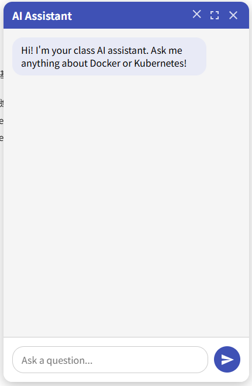
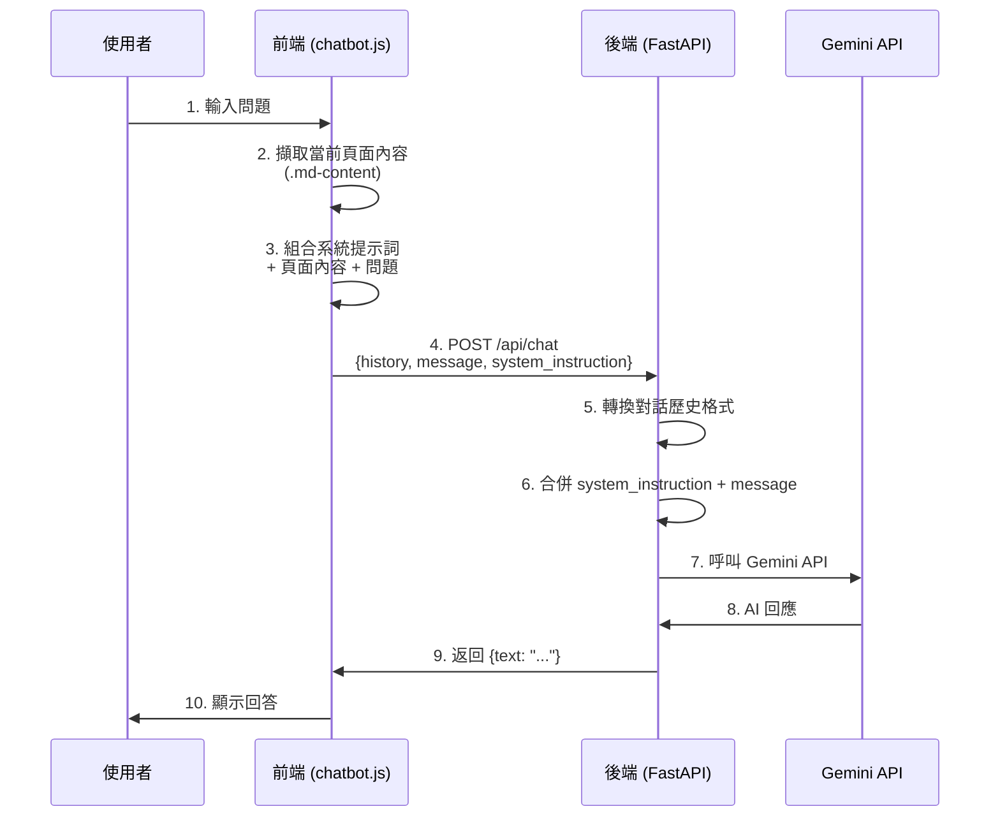
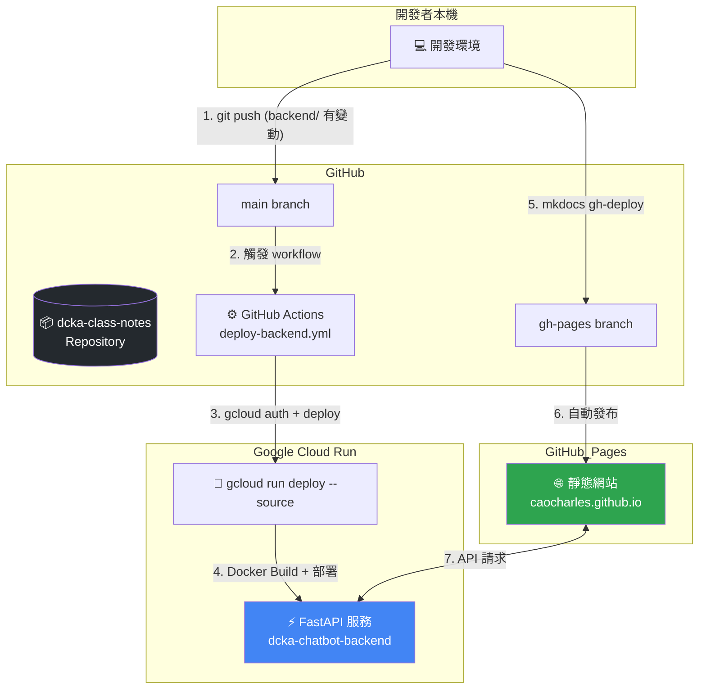

# AI 聊天機器人後端服務

本目錄包含 DCKA 課程文件網站的 AI 聊天機器人後端服務，使用 FastAPI 建置並整合 Google Gemini API。



---

## 📌 為什麼需要後端服務？

直接在前端呼叫 Gemini API 會導致 **API Key 外洩**，因為：

1. JavaScript 程式碼可在瀏覽器開發者工具中被檢視
2. API Key 一旦外洩，可能被濫用產生高額費用
3. 無法控制誰可以使用你的 API 配額

**解決方案**：建立後端 Proxy 服務，將 API Key 安全地存放在伺服器端。

---

## 🏗️ 系統架構

```
┌─────────────────────────────────────────────────────────────────────────┐
│                            使用者瀏覽器                                   │
└─────────────────────────────────────────────────────────────────────────┘
                                    │
                                    │ 1. 訪問 GitHub Pages
                                    ▼
┌─────────────────────────────────────────────────────────────────────────┐
│                   GitHub Pages (前端靜態網站)                            │
│  ┌─────────────┐  ┌─────────────┐  ┌─────────────┐                     │
│  │  MkDocs     │  │ chatbot.js  │  │ chatbot.css │                     │
│  │  HTML 頁面  │  │  聊天邏輯   │  │  聊天樣式   │                     │
│  └─────────────┘  └─────────────┘  └─────────────┘                     │
└─────────────────────────────────────────────────────────────────────────┘
                                    │
                                    │ 2. POST /api/chat
                                    │    (傳送聊天訊息)
                                    ▼
┌─────────────────────────────────────────────────────────────────────────┐
│                Google Cloud Run (後端 API 服務)                          │
│  ┌─────────────────────────────────────────────────────────┐           │
│  │  FastAPI (chat_server.py)                               │           │
│  │  - 接收前端請求                                          │           │
│  │  - 組合對話歷史 + 系統指令                                │           │
│  │  - 安全存放 GEMINI_API_KEY                               │           │
│  └─────────────────────────────────────────────────────────┘           │
└─────────────────────────────────────────────────────────────────────────┘
                                    │
                                    │ 3. 呼叫 Gemini API
                                    │    (附帶 API Key)
                                    ▼
┌─────────────────────────────────────────────────────────────────────────┐
│                   Google Cloud (Gemini API)                             │
│  ┌─────────────────────────────────────────────────────────┐           │
│  │  Gemini 3.5 Flash                                       │           │
│  │  - 上下文窗口: 1,000,000 (1M) Tokens                     │           │
│  │  - 生成 AI 回應                                          │           │
│  └─────────────────────────────────────────────────────────┘           │
└─────────────────────────────────────────────────────────────────────────┘
                                    │
                                    │ 4. 返回 AI 回應
                                    ▼
                              使用者瀏覽器
```

---

## 📁 檔案結構

```
backend/
├── chat_server.py      # FastAPI 主程式
├── Dockerfile          # Docker 容器設定 (Python 3.12 + uv)
├── pyproject.toml      # Python 依賴套件（uv 格式）
├── requirements.txt    # Python 依賴套件（pip 格式，備用）
└── README.md           # 本文件
```

---

## 🤖 使用的模型資訊：Gemini 3.5 Flash

本專案使用 **Gemini 3.5 Flash** (`gemini-3.5-flash`)。

> 📌 **為什麼不用最新的 3.7-flash？** 實測時 gemini-3.7-flash 正值發布初期，Google 端容量吃緊，經常要 30-50 秒才回應、甚至偶發 503 高負載錯誤；3.6-flash 也要接近 30 秒。反觀 3.5-flash 多次測試都穩定落在 3-6 秒內完成。對於即時問答的 chatbot，穩定與速度比「最新」更重要，因此選用 3.5-flash。之後 Google 容量狀況改善，可再評估換回更新版本。

### 模型規格

- **模型名稱**: Gemini 3.5 Flash
- **Context Window (上下文窗口)**: 1,000,000 Tokens
- **特點**:
  - 穩定版（GA）模型，適合生產環境
  - 支援可調 thinking level（low/medium/high），本專案設為 `low` 以降低延遲
  - 高效能，適合 RAG 應用
  - 100 萬 tokens 足以放入數百篇教學文章

> 📌 模型會持續迭代，若要換成更新版本，直接修改 `chat_server.py` 裡 `client.models.generate_content(model="gemini-3.5-flash", ...)` 的字串即可，換版本前建議先實測延遲與穩定性（可參考 `backend/` 內的測試方式：連續呼叫同一 prompt 幾次比較耗時）。可到 [Gemini API 模型列表](https://ai.google.dev/gemini-api/docs/models) 查詢目前可用的模型 ID。

### 費用參考

實際費率請以 [Gemini 模型定價頁](https://ai.google.dev/gemini-api/docs/models/gemini) 為準；本專案用量小，Gemini API 走的是 AI Studio 的預付額度制（prepay），額度用完會回傳 `429`，需到 [AI Studio](https://ai.studio/projects) 加值。

### 相關連結

- [Gemini 模型列表與定價](https://ai.google.dev/gemini-api/docs/models/gemini)
- [Google AI Studio](https://aistudio.google.com/)

---

## 🔧 chat_server.py 運作原理

### 1. API 端點

| 端點 | 方法 | 說明 |
|------|------|------|
| `/` | GET | 健康檢查，回傳 `{"status": "ok"}` |
| `/api/chat` | POST | 處理聊天請求 |

### 2. 請求格式

```json
{
  "history": [
    {"role": "user", "parts": [{"text": "什麼是 Docker？"}]},
    {"role": "model", "parts": [{"text": "Docker 是一個容器化平台..."}]}
  ],
  "message": "如何安裝 Docker？",
  "system_instruction": "你是課程助教，請根據以下頁面內容回答..."
}
```

| 欄位 | 說明 |
|------|------|
| `history` | 完整對話歷史（無狀態設計） |
| `message` | 使用者的新訊息 |
| `system_instruction` | RAG 上下文（當前頁面內容） |

### 3. 回應格式

```json
{
  "text": "要安裝 Docker，請執行以下步驟..."
}
```

### 4. 程式碼流程

```python
# 1. 接收請求
@app.post("/api/chat")
async def chat_endpoint(request: ChatRequest):

    # 2. 轉換對話歷史格式（user/bot → user/model），組成 Content 物件
    contents = []
    for msg in request.history:
        role = "user" if msg.role == "user" else "model"
        contents.append(types.Content(role=role, parts=[...]))
    contents.append(types.Content(role="user", parts=[types.Part.from_text(text=request.message)]))

    # 3. 呼叫 Gemini API，system_instruction 透過 config 傳入（非字串拼接）
    response = client.models.generate_content(
        model="gemini-3.5-flash",
        contents=contents,
        config=types.GenerateContentConfig(
            system_instruction=request.system_instruction,
            thinking_config=types.ThinkingConfig(thinking_level="low"),
        ),
    )

    # 4. 返回結果
    return {"text": response.text}
```

> 📌 本專案用的是新版 `google-genai` SDK（`from google import genai`），不是舊版 `google-generativeai`。兩者 import 路徑與 API 都不同，若參考網路上的舊教學要留意版本差異。

---

## 🧠 RAG 提示詞與文章串接流程

本聊天機器人使用 **RAG（Retrieval-Augmented Generation）** 技術，將當前頁面內容作為上下文傳遞給 AI，讓回答更精準。

### RAG 資料流程


```mermaid
sequenceDiagram
    participant U as 使用者
    participant F as 前端 (chatbot.js)
    participant B as 後端 (FastAPI)
    participant G as Gemini API

    U->>F: 1. 輸入問題
    F->>F: 2. 擷取當前頁面內容<br/>(.md-content)
    F->>F: 3. 組合系統提示詞<br/>+ 頁面內容 + 問題
    F->>B: 4. POST /api/chat<br/>{history, message, system_instruction}
    B->>B: 5. 轉換對話歷史格式
    B->>B: 6. 合併 system_instruction + message
    B->>G: 7. 呼叫 Gemini API
    G->>B: 8. AI 回應
    B->>F: 9. 返回 {text: "..."}
    F->>U: 10. 顯示回答
```

### 完整 System Prompt 範例（v2.0 - 全站預載版）

> ⚠️ **v2.0 更新**：現在使用 `content.json` 預載全站文件，而非僅抓取當前頁面。

前端 `chatbot.js` 會在使用者開啟聊天視窗時，載入 `content.json` 並組合以下系統提示詞：

```javascript
// 載入全站文件
const res = await fetch('./content.json');
const data = await res.json();

// 組合成 DOCUMENTATION 字串
allDocsContent = data
  .map(doc => `Page: ${doc.title}\nURL: ${doc.url}\nContent:\n${doc.content}`)
  .join("\n\n---\n\n");

// 系統提示詞
const systemInstruction = `你是 DCKA 課程（Docker Containers 與 Kubernetes 系統管理）的 AI 助教。

## 回答規則
1. **語言**：使用繁體中文回答
2. **連結**：當提到相關主題時，提供文章的 Markdown 連結（使用 URL 欄位）
3. **格式**：使用清晰的 Markdown 格式（標題、列點、程式碼區塊）
4. **精準**：優先使用文件內容回答，如果沒有相關內容才用一般知識
5. **程式碼**：提供可執行的命令範例時，使用 \`\`\`bash 格式

## 連結格式範例
當提到某個主題時，這樣提供連結：
- 想了解更多，請參考 [LAB 02 安裝 Docker](/lab02_docker_install/)
- 詳細步驟請見 [Private Registry 建置](/lab05_private_registry/)

## 課程文件
以下是完整的課程文件內容，請根據這些內容回答：

---
${allDocsContent}  // ← 全站 24 個頁面的完整內容
---`;
```

### content.json 生成機制

`content.json` 由 MkDocs Hook 自動生成：

```
hooks/
└── generate_content.py  # 在 mkdocs build 時自動執行
```

**生成流程：**

1. `mkdocs build` 或 `mkdocs gh-deploy` 執行
2. Hook `on_post_build()` 自動觸發
3. 掃描 `docs/` 目錄下所有 `.md` 檔案
4. 輸出 `site/content.json`

### 提示詞組成結構

| 組成部分 | 來源 | 說明 |
|----------|------|------|
| **角色設定** | 寫死在程式碼 | "你是 DCKA 課程的 AI 助教" |
| **回答規則** | 寫死在程式碼 | 繁體中文、提供連結、格式要求 |
| **全站文件** | `content.json` (動態載入) | 24 個頁面的完整 Markdown 內容 |
| **對話歷史** | sessionStorage | 保持對話上下文連貫 |

### 後端如何處理提示詞

```python
# chat_server.py
response = client.models.generate_content(
    model="gemini-3.5-flash",
    contents=contents,  # 對話歷史 + 這次的使用者訊息
    config=types.GenerateContentConfig(
        system_instruction=request.system_instruction,  # RAG 上下文透過 system_instruction 傳入
        thinking_config=types.ThinkingConfig(thinking_level="low"),
    ),
)
```

---

## 🔄 CI/CD：GitHub Actions 與 Cloud Run 互動流程


```mermaid
flowchart TB
    subgraph GitHub
        GH_Repo[("📦 dcka-class-notes<br/>Repository")]
        GH_Main["main branch"]
        GH_Pages["gh-pages branch"]
        GH_Action["⚙️ GitHub Actions<br/>deploy-backend.yml"]
    end

    subgraph 開發者本機
        DEV["💻 開發環境"]
    end

    subgraph "Google Cloud Run"
        CR_Build["🔨 gcloud run deploy --source"]
        CR_Service["⚡ FastAPI 服務<br/>dcka-chatbot-backend"]
    end

    subgraph GitHub_Pages
        GP["🌐 靜態網站<br/>caocharles.github.io"]
    end

    DEV -->|"1. git push (backend/ 有變動)"| GH_Main
    GH_Main -->|"2. 觸發 workflow"| GH_Action
    GH_Action -->|"3. gcloud auth + deploy"| CR_Build
    CR_Build -->|"4. Docker Build + 部署"| CR_Service

    DEV -->|"5. mkdocs gh-deploy"| GH_Pages
    GH_Pages -->|"6. 自動發布"| GP

    GP <-->|"7. API 請求"| CR_Service

    style GH_Repo fill:#24292e,color:#fff
    style CR_Service fill:#4285F4,color:#fff
    style GP fill:#2ea44f,color:#fff
```

### 部署流程說明

| 步驟 | 動作 | 說明 |
|------|------|------|
| 1 | `git push` | 推送程式碼到 GitHub main 分支，且 `backend/` 有變動 |
| 2 | GitHub Actions 觸發 | [`deploy-backend.yml`](../.github/workflows/deploy-backend.yml) 開始執行 |
| 3 | 驗證 GCP | 用 `GCP_SA_KEY` Secret 登入 Service Account |
| 4 | 建置並部署 | `gcloud run deploy --source backend`，Cloud Build 建置 Docker image 並部署到 Cloud Run |
| 5 | `mkdocs gh-deploy` | 建置並推送到 gh-pages 分支（前端仍需手動或另設 workflow） |
| 6 | GitHub Pages | 自動發布靜態網站 |
| 7 | API 請求 | 前端透過 HTTPS 呼叫 Cloud Run 服務 |

---

## 🚀 本地開發

### 1. 設定環境變數

在專案根目錄建立 `.env` 檔案：

```
GEMINI_API_KEY=your_api_key_here
```

> 📌 **取得 API Key**：前往 [Google AI Studio](https://aistudio.google.com/apikey) 建立

### 2. 啟動後端服務

```bash
# 方法 1：使用 uv（從專案根目錄）
uv run uvicorn backend.chat_server:app --reload --port 8001

# 方法 2：進入 backend 目錄
cd backend
pip install -r requirements.txt
uvicorn chat_server:app --reload --port 8001
```

### 3. 測試 API

```bash
# 健康檢查
curl http://localhost:8001/

# 測試聊天
curl -X POST http://localhost:8001/api/chat \
  -H "Content-Type: application/json" \
  -d '{
    "history": [],
    "message": "什麼是 Docker？",
    "system_instruction": ""
  }'
```

---

## ☁️ 部署到 Google Cloud Run

### 一次性設定

**Step 1：建立/選擇 GCP 專案，啟用必要 API**

```bash
gcloud services enable run.googleapis.com cloudbuild.googleapis.com artifactregistry.googleapis.com --project=<PROJECT_ID>
```

**Step 2：確認帳單帳戶已連結**

Cloud Run 需要專案綁定有效帳單帳戶才能部署（用量在免費額度內通常不會實際收費）：

```bash
gcloud billing projects link <PROJECT_ID> --billing-account=<BILLING_ACCOUNT_ID>
```

> ⚠️ 免費帳單帳戶預設只能連結 **5 個專案**，超過需申請額度提升，或改用已連結帳單的既有專案。

**Step 3：建立 Service Account 供 GitHub Actions 使用**

授予角色：`Cloud Run Admin`、`Cloud Build Editor`、`Artifact Registry Writer`、`Service Account User`，並下載 JSON key。

**Step 4：在 GitHub repo 設定 Secrets**

Settings → Secrets and variables → Actions：

| Secret | 說明 |
|--------|------|
| `GCP_SA_KEY` | Service Account 的 JSON key 全文 |
| `GCP_PROJECT_ID` | GCP 專案 ID |
| `GEMINI_API_KEY` | Gemini API Key（[AI Studio](https://aistudio.google.com/apikey) 取得，建議跟部署用的 GCP 專案掛同一個） |

之後 push 到 `main` 且 `backend/` 有變動，[`deploy-backend.yml`](../.github/workflows/deploy-backend.yml) 就會自動部署，不用再手動操作。

### 手動部署（首次測試或緊急修復用）

```bash
gcloud run deploy dcka-chatbot-backend \
  --source backend \
  --region asia-east1 \
  --project <PROJECT_ID> \
  --allow-unauthenticated \
  --set-env-vars "GEMINI_API_KEY=<your_api_key>"
```

部署完成後會印出服務網址，格式類似 `https://dcka-chatbot-backend-<hash>.asia-east1.run.app`。

本專案目前網址：`https://dcka-chatbot-backend-978572634545.asia-east1.run.app`

### 更新前端 API URL

編輯 `docs/assets/js/chatbot.js`：

```javascript
window.BACKEND_API_URL = window.BACKEND_API_URL || "https://dcka-chatbot-backend-<hash>.asia-east1.run.app";
```

改完後重新發布 GitHub Pages：

```bash
uv run mkdocs gh-deploy --force
```

---

## 💰 費用說明

Cloud Run 依實際使用量計費，免費額度相當大方（每月 200 萬次請求、360,000 GB-秒記憶體、180,000 vCPU-秒），一個小型 chatbot 後端通常落在免費額度內、實質 $0。但這跟 Railway 那種「額度用完直接停」不同——理論上用量爆量超過免費額度會被收費，需留意帳單通知。

另外，Gemini API 走的是 AI Studio 的**預付額度制**：額度用完會回傳 `429 prepayment credits depleted`，這跟 Cloud Run 帳單是分開兩件事，需要到 [AI Studio](https://ai.studio/projects) 另外加值。

---

## 🔒 安全性考量

### CORS 設定

目前 `chat_server.py` 設定為允許所有來源（開發方便）：

```python
allow_origins=["*"]  # 開發環境
```

**生產環境建議**：限制只允許你的網站：

```python
allow_origins=[
    "https://caocharles.github.io",
    "http://localhost:8000"
]
```

### API Key 保護

- ✅ API Key 以 GitHub Secret（`GEMINI_API_KEY`）存放，部署時才注入 Cloud Run 環境變數
- ✅ 不納入 Git 版控（在 `.gitignore` 中）
- ✅ 前端無法直接存取 API Key

---

## 🐛 疑難排解

### Q1: GitHub Actions 顯示 "Build Failed" 或部署失敗

**原因**：可能是 Dockerfile、Service Account 權限，或 Secrets 設定問題

**解決**：
1. 檢查 GitHub Actions 的執行紀錄（repo → Actions → 對應的 workflow run）
2. 確認 `GCP_SA_KEY`、`GCP_PROJECT_ID`、`GEMINI_API_KEY` 三個 Secret 都存在且正確
3. 確認 Service Account 有 `Cloud Run Admin`、`Cloud Build Editor`、`Artifact Registry Writer`、`Service Account User` 角色
4. 本地先測試 Docker 建置：

```bash
cd backend
docker build -t test-backend .
docker run -p 8001:8000 -e GEMINI_API_KEY=xxx test-backend
```

### Q2: 前端顯示 "CORS Error"

**原因**：後端 CORS 設定未包含前端網址

**解決**：修改 `chat_server.py` 的 `allow_origins`

### Q3: 服務出現 "Application not found" 或健康檢查 404

**原因**：Cloud Run 服務不存在（尚未部署，或帳單/額度問題被移除）

**解決**：
1. 確認 GCP 專案帳單帳戶是否還有效連結：`gcloud billing projects describe <PROJECT_ID>`
2. 手動重新部署一次確認狀況（見上方「手動部署」段落）
3. 確認 `chatbot.js` 裡的 `BACKEND_API_URL` 網址跟實際 Cloud Run 服務網址一致

### Q4: Gemini API 返回 429 或錯誤

**原因**：API Key 無效、預付額度用盡，或配額超限

**解決**：
1. 到 [AI Studio](https://ai.studio/projects) 檢查該專案的 API 使用狀況與預付額度
2. 額度用完需在 AI Studio 加值（跟 Cloud Run 帳單是分開的兩件事）
3. 確認 API Key 未過期、`GEMINI_API_KEY` Secret 內容正確

---

## 📚 相關資源

- [FastAPI 官方文件](https://fastapi.tiangolo.com/)
- [Google Cloud Run 官方文件](https://cloud.google.com/run/docs)
- [Google Gemini API 文件](https://ai.google.dev/gemini-api/docs)
- [Gemini API 模型列表](https://ai.google.dev/gemini-api/docs/models)
- [Uvicorn 官方文件](https://www.uvicorn.org/)
