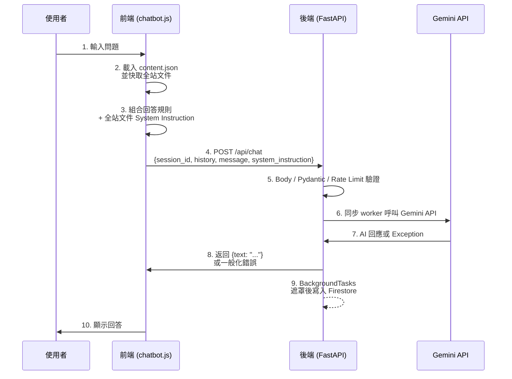
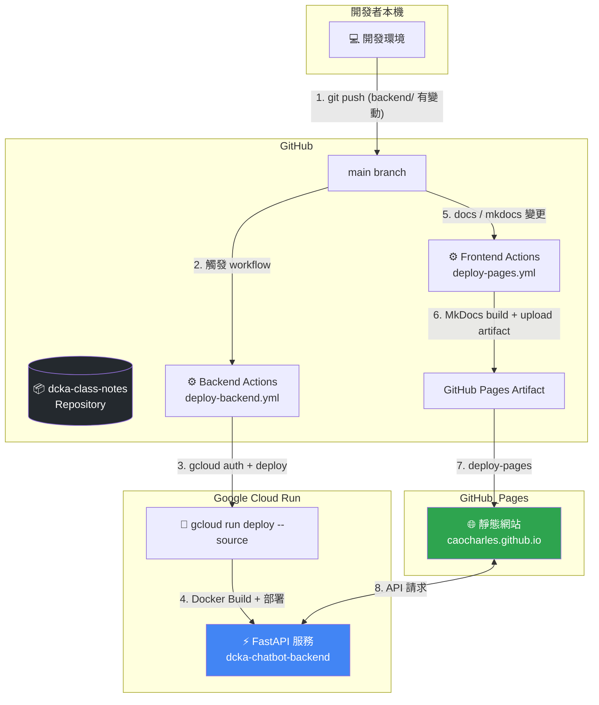

# AI 聊天機器人後端服務

本目錄包含 DCKA 課程文件網站的 AI 聊天機器人後端服務，使用 FastAPI 建置並整合 Google Gemini API。


---

## 📌 為什麼需要後端服務？

直接在前端呼叫 Gemini API 會導致 **API Key 外洩**，因為：

1. JavaScript 程式碼可在瀏覽器開發者工具中被檢視
2. API Key 一旦外洩，可能被濫用產生高額費用
3. 無法控制誰可以使用你的 API 配額

**解決方案**：建立後端 Proxy 服務，將 API Key 安全地存放在伺服器端。

---

## 🏗️ 系統架構

```
┌─────────────────────────────────────────────────────────────────────────┐
│                            使用者瀏覽器                                   │
└─────────────────────────────────────────────────────────────────────────┘
                                    │
                                    │ 1. 訪問 GitHub Pages
                                    ▼
┌─────────────────────────────────────────────────────────────────────────┐
│                   GitHub Pages (前端靜態網站)                            │
│  ┌─────────────┐  ┌─────────────┐  ┌─────────────┐                     │
│  │  MkDocs     │  │ chatbot.js  │  │ chatbot.css │                     │
│  │  HTML 頁面  │  │  聊天邏輯   │  │  聊天樣式   │                     │
│  └─────────────┘  └─────────────┘  └─────────────┘                     │
└─────────────────────────────────────────────────────────────────────────┘
                                    │
                                    │ 2. POST /api/chat
                                    │    (傳送聊天訊息)
                                    ▼
┌─────────────────────────────────────────────────────────────────────────┐
│                Google Cloud Run (後端 API 服務)                          │
│  ┌─────────────────────────────────────────────────────────┐           │
│  │  FastAPI (chat_server.py)                               │           │
│  │  - 接收前端請求                                          │           │
│  │  - 組合對話歷史 + 系統指令                                │           │
│  │  - 安全存放 GEMINI_API_KEY                               │           │
│  └─────────────────────────────────────────────────────────┘           │
└─────────────────────────────────────────────────────────────────────────┘
                                    │
                                    │ 3. 呼叫 Gemini API
                                    │    (附帶 API Key)
                                    ▼
┌─────────────────────────────────────────────────────────────────────────┐
│                   Google Cloud (Gemini API)                             │
│  ┌─────────────────────────────────────────────────────────┐           │
│  │  Gemini 3.5 Flash                                       │           │
│  │  - 上下文窗口: 1,000,000 (1M) Tokens                     │           │
│  │  - 生成 AI 回應                                          │           │
│  └─────────────────────────────────────────────────────────┘           │
└─────────────────────────────────────────────────────────────────────────┘
                                    │
                                    │ 4. 返回 AI 回應
                                    ▼
                              使用者瀏覽器
```

---

## 📁 檔案結構

```
backend/
├── .dockerignore         # 排除本機環境與測試檔，避免進入 image
├── .gcloudignore         # 排除 Cloud Build 上傳不需要的檔案
├── chat_server.py      # FastAPI 主程式
├── Dockerfile          # Docker 容器設定 (Python 3.12 + uv)
├── pyproject.toml      # Python 依賴套件（uv 格式）
├── uv.lock             # 可重現的完整依賴版本
├── tests/              # CORS、限制、遮罩與錯誤處理測試
├── requirements.txt    # Python 依賴套件（pip 格式，備用）
└── README.md           # 本文件
```

---

## 🤖 使用的模型資訊：Gemini 3.5 Flash

本專案使用 **Gemini 3.5 Flash** (`gemini-3.5-flash`)。

> 📌 **為什麼不用最新的 3.7-flash？** 實測時 gemini-3.7-flash 正值發布初期，Google 端容量吃緊，經常要 30-50 秒才回應、甚至偶發 503 高負載錯誤；3.6-flash 也要接近 30 秒。反觀 3.5-flash 多次測試都穩定落在 3-6 秒內完成。對於即時問答的 chatbot，穩定與速度比「最新」更重要，因此選用 3.5-flash。之後 Google 容量狀況改善，可再評估換回更新版本。

### 模型規格

- **模型名稱**: Gemini 3.5 Flash
- **Context Window (上下文窗口)**: 1,000,000 Tokens
- **特點**:
  - 穩定版（GA）模型，適合生產環境
  - 支援可調 thinking level（low/medium/high），本專案設為 `low` 以降低延遲
  - 高效能，適合 RAG 應用
  - 100 萬 tokens 足以放入數百篇教學文章

> 📌 模型會持續迭代，若要換成更新版本，直接修改 `chat_server.py` 裡 `client.models.generate_content(model="gemini-3.5-flash", ...)` 的字串即可，換版本前建議先實測延遲與穩定性（可參考 `backend/` 內的測試方式：連續呼叫同一 prompt 幾次比較耗時）。可到 [Gemini API 模型列表](https://ai.google.dev/gemini-api/docs/models) 查詢目前可用的模型 ID。

### 費用參考

實際費率請以 [Gemini 模型定價頁](https://ai.google.dev/gemini-api/docs/models/gemini) 為準；本專案用量小，Gemini API 走的是 AI Studio 的預付額度制（prepay），額度用完會回傳 `429`，需到 [AI Studio](https://ai.studio/projects) 加值。

### 相關連結

- [Gemini 模型列表與定價](https://ai.google.dev/gemini-api/docs/models/gemini)
- [Google AI Studio](https://aistudio.google.com/)

---

## 🔧 chat_server.py 運作原理

### 1. API 端點

| 端點 | 方法 | 說明 |
|------|------|------|
| `/` | GET | 健康檢查，回傳 `{"status": "ok"}` |
| `/api/chat` | POST | 處理聊天請求 |

### 2. 請求格式

```json
{
  "history": [
    {"role": "user", "parts": [{"text": "什麼是 Docker？"}]},
    {"role": "model", "parts": [{"text": "Docker 是一個容器化平台..."}]}
  ],
  "message": "如何安裝 Docker？",
  "system_instruction": "你是課程助教，請根據以下頁面內容回答..."
}
```

| 欄位 | 說明 |
|------|------|
| `history` | 完整對話歷史（無狀態設計） |
| `message` | 使用者的新訊息 |
| `system_instruction` | 回答規則與 `content.json` 內的全站文件上下文 |
| `session_id` | Browser 產生的匿名對話關聯 ID，不是登入憑證 |

### 3. 回應格式

```json
{
  "text": "要安裝 Docker，請執行以下步驟..."
}
```

### 4. 程式碼流程

```python
# 1. 接收請求
@app.post("/api/chat")
def chat_endpoint(payload: ChatRequest, request: Request, background_tasks: BackgroundTasks):

    # 2. 轉換對話歷史格式（user/bot → user/model），組成 Content 物件
    contents = []
    for msg in payload.history:
        role = "user" if msg.role == "user" else "model"
        contents.append(types.Content(role=role, parts=[...]))
    contents.append(types.Content(role="user", parts=[types.Part.from_text(text=payload.message)]))

    # 3. 呼叫 Gemini API，system_instruction 透過 config 傳入（非字串拼接）
    response = client.models.generate_content(
        model="gemini-3.5-flash",
        contents=contents,
        config=types.GenerateContentConfig(
            system_instruction=payload.system_instruction,
            thinking_config=types.ThinkingConfig(thinking_level="low"),
        ),
    )

    # 4. 返回結果
    # 回應送出後再執行同步 Firestore client，避免增加主要 response latency
    background_tasks.add_task(log_chat, ...)
    return {"text": response.text}
```

> 📌 本專案用的是新版 `google-genai==2.18.1` SDK（`from google import genai`），不是舊版 `google-generativeai`。版本已由 `pyproject.toml` 與 `uv.lock` 鎖定，確保 `ThinkingConfig` 與 Cloud Run 建置可重現。

---

## 🗄️ Firestore 問答紀錄

在此之前，整個架構是完全無狀態的：問答紀錄只存在瀏覽器的 `sessionStorage`，關掉分頁就消失，不同裝置也看不到彼此的對話，後端也沒有寫入任何地方（`content.json` 是教材靜態資料，不是問答紀錄）。

現在每次呼叫 `/api/chat` 後，無論成功或失敗，都會透過 FastAPI `BackgroundTasks` 在 HTTP response 送出後寫一筆紀錄到 Firestore 的 `chat_logs` collection：

| 欄位 | 說明 |
|------|------|
| `session_id` | 前端在 `sessionStorage` 產生的 UUID，同一次對話（同一個分頁、未按清除歷史）共用同一個值 |
| `question` | 使用者這次問的問題 |
| `answer` | Gemini 的回答（失敗時為 `null`） |
| `model` | 呼叫的模型名稱 |
| `latency_ms` | 這次呼叫 Gemini API 花費的時間（毫秒） |
| `status` | `success` 或 `error` |
| `error` | 失敗時的例外類型（成功時為 `null`），完整 stack trace 只進 Cloud Logging |
| `created_at` | 伺服器時間戳記（Firestore `SERVER_TIMESTAMP`） |
| `expires_at` | 建立時間加上保留天數；預設 90 天，供 Firestore TTL 使用 |

**設計重點**：問題與回答在寫入前會遮罩 Email、台灣身分證字號、手機號碼、付款卡號與常見 Secret／Token；`log_chat()` 內部包了 `try/except`，寫入失敗只會進 Cloud Logging，**不會**讓聊天功能跟著壞掉。

### 一次性設定

```bash
# 啟用 API
gcloud services enable firestore.googleapis.com --project=<PROJECT_ID>

# 建立 Native mode 資料庫（建議跟 Cloud Run 同區域）
gcloud firestore databases create \
  --project=<PROJECT_ID> \
  --location=asia-east1 \
  --type=firestore-native

# 授權專用 Cloud Run Runtime Service Account 可以讀寫 Firestore
gcloud projects add-iam-policy-binding <PROJECT_ID> \
  --member="serviceAccount:dcka-chatbot-runtime@<PROJECT_ID>.iam.gserviceaccount.com" \
  --role="roles/datastore.user"

# 啟用 chat_logs.expires_at 的 TTL；文件到期後由 Firestore 自動刪除
gcloud firestore fields ttls update expires_at \
  --collection-group=chat_logs \
  --enable-ttl \
  --project=<PROJECT_ID>
```

> 📌 本專案的 workflow 以 `--service-account` 明確指定 `dcka-chatbot-runtime`，避免讓應用程式沿用權限過大的 Compute Engine 預設服務帳號。若 Runtime 帳號缺少 `roles/datastore.user`，`log_chat()` 會只在 Cloud Logging 留下錯誤，不會讓聊天回應跟著失敗。

### 資料治理與管理者查閱

- 預設保留 90 天，可用 `CHAT_LOG_RETENTION_DAYS` 調整；正式 `(default)` database 的 `chat_logs.expires_at` TTL policy 已於 2026-08-19 啟用並確認為 `ACTIVE`。
- TTL 刪除不是即時排程；到期資料可能要等待一段時間才會由 Firestore 清除。
- Cloud Run Runtime Service Account 只授予 `roles/datastore.user`。
- 建議建立專用管理者群組，只有需要查閱問答紀錄的人加入，並授予唯讀 `roles/datastore.viewer`；不要把此角色開給一般網站使用者。
- 管理者不得把問答紀錄下載到個人裝置或長期另存；如需匯出分析，應再次去識別化並另訂刪除日期。

### 查詢紀錄

Firestore Console 可以直接看，或用指令快速查最新幾筆：

```bash
TOKEN=$(gcloud auth print-access-token)
curl -s -H "Authorization: Bearer $TOKEN" \
  "https://firestore.googleapis.com/v1/projects/<PROJECT_ID>/databases/(default)/documents/chat_logs?pageSize=10&orderBy=created_at%20desc"
```

---

## 🧠 RAG 提示詞與文章串接流程

本聊天機器人目前使用 **full-context RAG**：MkDocs 建置時把全站 Markdown 產生為 `content.json`，Browser 載入後將完整文件內容放進 `system_instruction`。目前尚未執行 embedding、vector search 或 top-k retrieval。

### RAG 資料流程


```mermaid
sequenceDiagram
    participant U as 使用者
    participant F as 前端 (chatbot.js)
    participant B as 後端 (FastAPI)
    participant G as Gemini API

    U->>F: 1. 輸入問題
    F->>F: 2. 載入 content.json<br/>並快取全站文件
    F->>F: 3. 組合回答規則<br/>+ 全站文件 System Instruction
    F->>B: 4. POST /api/chat<br/>{session_id, history, message, system_instruction}
    B->>B: 5. Body / Pydantic / Rate Limit 驗證
    B->>G: 6. 同步 worker 呼叫 Gemini API
    G->>B: 7. AI 回應或 Exception
    B->>F: 8. 返回 {text: "..."}<br/>或一般化錯誤
    B-->>B: 9. BackgroundTasks<br/>遮罩後寫入 Firestore
    F->>U: 10. 顯示回答
```

### 完整 System Prompt 範例（v2.0 - 全站預載版）

> ⚠️ **v2.0 更新**：現在使用 `content.json` 預載全站文件，而非僅抓取當前頁面。

前端 `chatbot.js` 會在使用者開啟聊天視窗時，載入 `content.json` 並組合以下系統提示詞：

```javascript
// 載入全站文件
const res = await fetch('./content.json');
const data = await res.json();

// 組合成 DOCUMENTATION 字串
allDocsContent = data
  .map(doc => `Page: ${doc.title}\nURL: ${doc.url}\nContent:\n${doc.content}`)
  .join("\n\n---\n\n");

// 系統提示詞
const systemInstruction = `你是 DCKA 課程（Docker Containers 與 Kubernetes 系統管理）的 AI 助教。

## 回答規則
1. **語言**：使用繁體中文回答
2. **連結**：當提到相關主題時，提供文章的 Markdown 連結（使用 URL 欄位）
3. **格式**：使用清晰的 Markdown 格式（標題、列點、程式碼區塊）
4. **精準**：優先使用文件內容回答，如果沒有相關內容才用一般知識
5. **程式碼**：提供可執行的命令範例時，使用 \`\`\`bash 格式

## 連結格式範例
當提到某個主題時，這樣提供連結：
- 想了解更多，請參考 [LAB 02 安裝 Docker](/lab02_docker_install/)
- 詳細步驟請見 [Private Registry 建置](/lab05_private_registry/)

## 課程文件
以下是完整的課程文件內容，請根據這些內容回答：

---
${allDocsContent}  // ← 建置時收錄的全站頁面內容
---`;
```

### content.json 生成機制

`content.json` 由 MkDocs Hook 自動生成：

```
hooks/
└── generate_content.py  # 在 mkdocs build 時自動執行
```

**生成流程：**

1. `mkdocs build` 或 `mkdocs gh-deploy` 執行
2. Hook `on_post_build()` 自動觸發
3. 掃描 `docs/` 目錄下所有 `.md` 檔案
4. 輸出 `site/content.json`

### 提示詞組成結構

| 組成部分 | 來源 | 說明 |
|----------|------|------|
| **角色設定** | 寫死在程式碼 | "你是 DCKA 課程的 AI 助教" |
| **回答規則** | 寫死在程式碼 | 繁體中文、提供連結、格式要求 |
| **全站文件** | `content.json` (動態載入) | 建置當下所有頁面的完整 Markdown 內容 |
| **對話歷史** | sessionStorage | 保持對話上下文連貫 |

### 後端如何處理提示詞

```python
# chat_server.py
response = client.models.generate_content(
    model="gemini-3.5-flash",
    contents=contents,  # 對話歷史 + 這次的使用者訊息
    config=types.GenerateContentConfig(
        system_instruction=payload.system_instruction,  # RAG 上下文透過 system_instruction 傳入
        thinking_config=types.ThinkingConfig(thinking_level="low"),
    ),
)
```

---

## 🔄 CI/CD：GitHub Actions 與 Cloud Run 互動流程


```mermaid
flowchart TB
    subgraph GitHub
        GH_Repo[("📦 dcka-class-notes<br/>Repository")]
        GH_Main["main branch"]
        GH_Pages["GitHub Pages Artifact"]
        GH_Action["⚙️ Backend Actions<br/>deploy-backend.yml"]
        GH_Pages_Action["⚙️ Frontend Actions<br/>deploy-pages.yml"]
    end

    subgraph 開發者本機
        DEV["💻 開發環境"]
    end

    subgraph "Google Cloud Run"
        CR_Build["🔨 gcloud run deploy --source"]
        CR_Service["⚡ FastAPI 服務<br/>dcka-chatbot-backend"]
    end

    subgraph GitHub_Pages
        GP["🌐 靜態網站<br/>caocharles.github.io"]
    end

    DEV -->|"1. git push (backend/ 有變動)"| GH_Main
    GH_Main -->|"2. 觸發 workflow"| GH_Action
    GH_Action -->|"3. gcloud auth + deploy"| CR_Build
    CR_Build -->|"4. Docker Build + 部署"| CR_Service

    GH_Main -->|"5. docs / mkdocs 變更"| GH_Pages_Action
    GH_Pages_Action -->|"6. MkDocs build + upload artifact"| GH_Pages
    GH_Pages -->|"7. deploy-pages"| GP

    GP <-->|"8. API 請求"| CR_Service

    style GH_Repo fill:#24292e,color:#fff
    style CR_Service fill:#4285F4,color:#fff
    style GP fill:#2ea44f,color:#fff
```

### 部署流程說明

| 步驟 | 動作 | 說明 |
|------|------|------|
| 1 | `git push` | 推送程式碼到 GitHub main 分支，且 `backend/` 有變動 |
| 2 | GitHub Actions 觸發 | [`deploy-backend.yml`](../.github/workflows/deploy-backend.yml) 開始執行 |
| 3 | 驗證 GCP | GitHub OIDC 經 WIF 換取 `github-actions-deployer` 的短效憑證，不保存 JSON key |
| 4 | 建置並部署 | `gcloud run deploy --source backend`，Cloud Build 建置 Docker image 並部署到 Cloud Run |
| 5 | Frontend Workflow | `docs/**`、MkDocs 設定或前端 workflow 變更時觸發 |
| 6 | MkDocs Build | 依 `uv.lock` 安裝依賴、建置 `site/` 並上傳 Pages artifact |
| 7 | GitHub Pages | `deploy-pages` 將 artifact 發布為靜態網站 |
| 8 | API 請求 | 前端透過 HTTPS 呼叫 Cloud Run 服務 |

> Repository **Settings → Pages → Build and deployment → Source** 已設定為 **GitHub Actions**。

---

## 🚀 本地開發

### 1. 設定環境變數

在專案根目錄建立 `.env` 檔案：

```
GEMINI_API_KEY=your_api_key_here
```

> 📌 **取得 API Key**：前往 [Google AI Studio](https://aistudio.google.com/apikey) 建立

### 2. 啟動後端服務

```bash
# 方法 1：使用 uv（從專案根目錄）
uv run uvicorn backend.chat_server:app --reload --port 8001

# 方法 2：進入 backend 目錄
cd backend
pip install -r requirements.txt
uvicorn chat_server:app --reload --port 8001
```

### 3. 測試 API

```bash
# 健康檢查
curl http://localhost:8001/

# 測試聊天
curl -X POST http://localhost:8001/api/chat \
  -H "Content-Type: application/json" \
  -d '{
    "history": [],
    "message": "什麼是 Docker？",
    "system_instruction": ""
  }'
```

---

## ☁️ 部署到 Google Cloud Run

### 一次性設定

**Step 1：建立/選擇 GCP 專案，啟用必要 API**

```bash
gcloud services enable run.googleapis.com cloudbuild.googleapis.com artifactregistry.googleapis.com --project=<PROJECT_ID>
```

**Step 2：確認帳單帳戶已連結**

Cloud Run 需要專案綁定有效帳單帳戶才能部署（用量在免費額度內通常不會實際收費）：

```bash
gcloud billing projects link <PROJECT_ID> --billing-account=<BILLING_ACCOUNT_ID>
```

> ⚠️ 免費帳單帳戶預設只能連結 **5 個專案**，超過需申請額度提升，或改用已連結帳單的既有專案。

**Step 3：以 Workload Identity Federation 連接 GitHub Actions**

本專案不保存 Service Account JSON key。GitHub Actions 透過 OIDC 向 Workload Identity Provider 換取短效憑證，再 impersonate 專用部署帳號：

```text
CaoCharles/dcka-class-notes main branch
  → GitHub OIDC token
  → github-actions WIF Provider
  → github-actions-deployer
  → gcloud run deploy --source backend
```

目前權限分工：

| 身分 | 權限／用途 |
|------|-----------|
| `github-actions-deployer` | `roles/run.sourceDeveloper`、`roles/serviceusage.serviceUsageConsumer` |
| `dcka-chatbot-runtime` | `roles/datastore.user`，供 Cloud Run Runtime 寫入 Firestore |
| WIF principal | 只能從 `CaoCharles/dcka-class-notes` 的 `main` branch impersonate deployer |

**Step 4：設定 GitHub Actions Variables 與 Secret**

Settings → Secrets and variables → Actions：

| 類型 | 名稱 | 說明 |
|------|------|------|
| Variable | `GCP_PROJECT_ID` | GCP Project ID |
| Variable | `GCP_WIF_PROVIDER` | Workload Identity Provider 完整 resource name |
| Variable | `GCP_DEPLOYER_SA` | `github-actions-deployer` email |
| Variable | `GCP_RUNTIME_SA` | `dcka-chatbot-runtime` email |
| Secret | `GEMINI_API_KEY` | Gemini API Key（[AI Studio](https://aistudio.google.com/apikey) 取得） |

之後 push 到 `main` 且 `backend/` 有變動，[`deploy-backend.yml`](../.github/workflows/deploy-backend.yml) 就會自動部署，不用再手動操作。

### 手動部署（首次測試或緊急修復用）

```bash
gcloud run deploy dcka-chatbot-backend \
  --source backend \
  --region asia-east1 \
  --project <PROJECT_ID> \
  --service-account dcka-chatbot-runtime@<PROJECT_ID>.iam.gserviceaccount.com \
  --allow-unauthenticated \
  --set-env-vars "GEMINI_API_KEY=<your_api_key>"
```

部署完成後會印出服務網址，格式類似 `https://dcka-chatbot-backend-<hash>.asia-east1.run.app`。

本專案目前網址：`https://dcka-chatbot-backend-978572634545.asia-east1.run.app`

### 更新前端 API URL

編輯 `docs/assets/js/chatbot.js`：

```javascript
window.BACKEND_API_URL = window.BACKEND_API_URL || "https://dcka-chatbot-backend-<hash>.asia-east1.run.app";
```

改完後 commit 並 push；`deploy-pages.yml` 會自動發布 GitHub Pages。若要使用下列 branch-based fallback，需先把 Pages Source 暫時切回 **Deploy from a branch**：

```bash
uv run mkdocs gh-deploy --force
```

---

## 💰 費用說明

Cloud Run 依實際使用量計費，免費額度相當大方（每月 200 萬次請求、360,000 GB-秒記憶體、180,000 vCPU-秒），一個小型 chatbot 後端通常落在免費額度內、實質 $0。但這跟 Railway 那種「額度用完直接停」不同——理論上用量爆量超過免費額度會被收費，需留意帳單通知。

另外，Gemini API 走的是 AI Studio 的**預付額度制**：額度用完會回傳 `429 prepayment credits depleted`，這跟 Cloud Run 帳單是分開兩件事，需要到 [AI Studio](https://ai.studio/projects) 另外加值。

---

## 🔒 安全性考量

### CORS 設定

`chat_server.py` 預設只允許正式 GitHub Pages Origin 與本機預覽：

```python
allow_origins=[
    "https://caocharles.github.io",
    "http://localhost:8000",
    "http://127.0.0.1:8000"
]
```

可用 `ALLOWED_ORIGINS` 覆寫，但必須填 Origin，不可包含 `/dcka-class-notes/` 路徑。

### 公開 API 防護

| 設定 | 預設值 | 用途 |
|---|---:|---|
| `RATE_LIMIT_REQUESTS` | 20 | 單一來源在視窗內最多請求數 |
| `RATE_LIMIT_WINDOW_SECONDS` | 60 | Rate limit 視窗秒數 |
| `MAX_REQUEST_BODY_BYTES` | 1,048,576 | `/api/chat` JSON body 上限 |
| `MAX_MESSAGE_CHARS` | 4,000 | 單次問題字元上限 |
| `MAX_HISTORY_MESSAGES` | 20 | 最近對話訊息上限 |
| `MAX_SYSTEM_INSTRUCTION_CHARS` | 750,000 | 全站文件 System Instruction 上限 |
| `CHAT_LOG_RETENTION_DAYS` | 90 | Firestore 問答紀錄保留日數 |

目前 rate limiter 是 Cloud Run **單一 instance 記憶體內**的滑動視窗，適合先阻擋一般誤用；如果未來需要跨 instance 的全域配額，應改接 Cloud Armor／API Gateway 或集中式計數儲存。

### 錯誤資訊

- 使用者只會收到一般化 4xx／5xx 訊息，不會看到 Gemini 或 Python 的完整例外。
- 詳細 stack trace 使用標準 Python logging 輸出，由 Cloud Run 收進 Cloud Logging。
- Firestore 的 `error` 欄位只保存例外類型，不保存完整例外文字。

### API Key 保護

- ✅ API Key 以 GitHub Secret（`GEMINI_API_KEY`）存放，部署時才注入 Cloud Run 環境變數
- ✅ 不納入 Git 版控（在 `.gitignore` 中）
- ✅ 前端無法直接存取 API Key

---

## 🐛 疑難排解

### Q1: GitHub Actions 顯示 "Build Failed" 或部署失敗

**原因**：可能是 Dockerfile、WIF assertion／IAM、GitHub Variables 或 Secret 設定問題

**解決**：
1. 檢查 GitHub Actions 的執行紀錄（repo → Actions → 對應的 workflow run）
2. 確認 `GCP_PROJECT_ID`、`GCP_WIF_PROVIDER`、`GCP_DEPLOYER_SA`、`GCP_RUNTIME_SA` 四個 Variables 與 `GEMINI_API_KEY` Secret 都存在
3. 確認 WIF Provider 為 `ACTIVE`，attribute condition 限制正確 repository 與 `refs/heads/main`
4. 確認 deployer 具備 `roles/run.sourceDeveloper`、`roles/serviceusage.serviceUsageConsumer`，並可對 Runtime Service Account 使用 `roles/iam.serviceAccountUser`
5. 本地先測試 Docker 建置：

```bash
cd backend
docker build -t test-backend .
docker run -p 8001:8000 -e GEMINI_API_KEY=xxx test-backend
```

### Q2: 前端顯示 "CORS Error"

**原因**：後端 CORS 設定未包含前端網址

**解決**：確認 Request 的 Origin 位於 `ALLOWED_ORIGINS`；正式網址只填 Origin（例如 `https://caocharles.github.io`），不要包含 repository path。

### Q3: 服務出現 "Application not found" 或健康檢查 404

**原因**：Cloud Run 服務不存在（尚未部署，或帳單/額度問題被移除）

**解決**：
1. 確認 GCP 專案帳單帳戶是否還有效連結：`gcloud billing projects describe <PROJECT_ID>`
2. 手動重新部署一次確認狀況（見上方「手動部署」段落）
3. 確認 `chatbot.js` 裡的 `BACKEND_API_URL` 網址跟實際 Cloud Run 服務網址一致

### Q4: Gemini API 返回 429 或錯誤

**原因**：API Key 無效、預付額度用盡，或配額超限

**解決**：
1. 到 [AI Studio](https://ai.studio/projects) 檢查該專案的 API 使用狀況與預付額度
2. 額度用完需在 AI Studio 加值（跟 Cloud Run 帳單是分開的兩件事）
3. 確認 API Key 未過期、`GEMINI_API_KEY` Secret 內容正確

---

## 📚 相關資源

- [FastAPI 官方文件](https://fastapi.tiangolo.com/)
- [Google Cloud Run 官方文件](https://cloud.google.com/run/docs)
- [Google Gemini API 文件](https://ai.google.dev/gemini-api/docs)
- [Gemini API 模型列表](https://ai.google.dev/gemini-api/docs/models)
- [Uvicorn 官方文件](https://www.uvicorn.org/)
