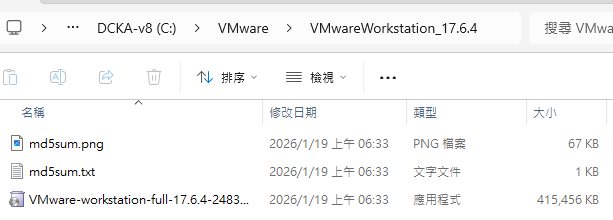
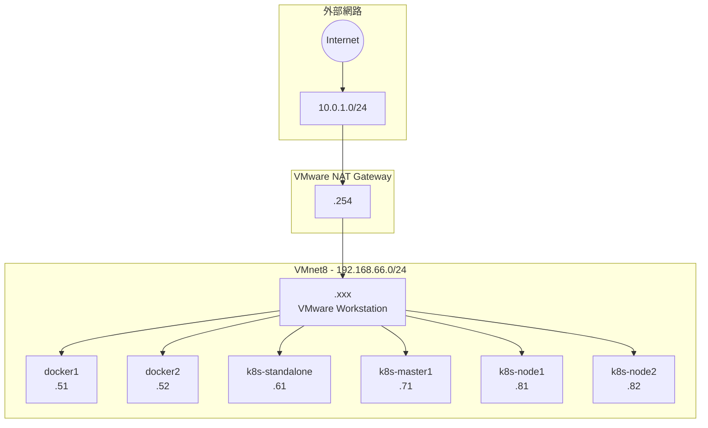
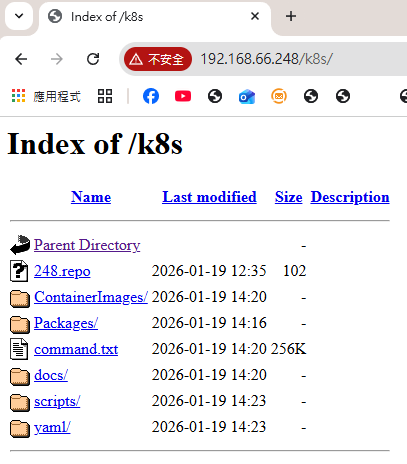

# 第 0 章：環境準備

## 學習目標

完成本章節後，你將能夠：

- [ ] 安裝並設定 VMware Workstation
- [ ] 設定虛擬網路（Virtual Network Editor）
- [ ] 啟動並驗證六台 Rocky Linux 虛擬機

## 前置知識

開始之前，請確保你已經：

- 準備好 Windows 主機（建議 16GB+ RAM）
- 下載 DCKA 課程虛擬機映像檔
- 下載 VMware Workstation 安裝程式

---

## 0.1 安裝 VMware Workstation

### 取得安裝程式

課程提供的 VMware Workstation 17.6.4 安裝檔案位於：

```
C:\DCKA-v8 (C:)\VMware\VMwareWorkstation_17.6.4\
```



資料夾內包含：

| 檔案 | 說明 |
|------|------|
| `VMware-workstation-full-17.6.4-2483....exe` | VMware Workstation 安裝程式 |
| `md5sum.txt` | MD5 校驗碼 |
| `md5sum.png` | 校驗碼截圖 |

### 安裝步驟

1. 執行 `VMware-workstation-full-17.6.4-2483....exe`
2. 依照安裝精靈完成安裝
3. 安裝完成後重新啟動電腦

!!! tip "安裝提示"
    安裝過程中建議選擇「典型安裝」，使用預設設定即可。

---

## 0.2 設定虛擬網路

### 開啟 Virtual Network Editor

1. 開啟 VMware Workstation
2. 選擇 **Edit** → **Virtual Network Editor**
3. 點選 **Change Settings** 取得管理員權限


### 設定 VMnet8 (NAT)

選擇 **VMnet8**（NAT 模式），進行以下設定：

#### 步驟 1：設定 Subnet IP

將 **Subnet IP** 修改為：

```
192.168.66.0
```

#### 步驟 2：設定 NAT Settings

點選 **NAT Settings...**，將 **Gateway IP** 設定為：

```
192.168.66.2
```

#### 步驟 3：設定 DHCP Settings

點選 **DHCP Settings...**，確認以下設定：

| 設定項目 | 值 |
|----------|-----|
| Starting IP address | `192.168.66.128` |
| Ending IP address | `192.168.66.254` |

!!! warning "重要"
    請確保 Subnet IP 為 `192.168.66.0`，Gateway 為 `192.168.66.2`，否則後續實作可能無法正常連線。

點選 **OK** 儲存設定。

---

## 0.3 網路拓樸與虛擬機

### 網路架構

課程環境使用 VMware Workstation 的 NAT 網路（VMnet8），網段為 `192.168.66.0/24`：




### 虛擬機清單與 IP 配置

課程提供六台已預先設定好的 Rocky Linux 9 虛擬機：


| 虛擬機名稱 | IP 位址 | 用途 |
|------------|---------|------|
| `docker1` | 192.168.66.**51** | Docker 實作主機 1 |
| `docker2` | 192.168.66.**52** | Docker 實作主機 2 |
| `k8s-standalone` | 192.168.66.**61** | 獨立 Kubernetes 環境（單節點） |
| `k8s-master1` | 192.168.66.**71** | Kubernetes Master（控制平面）節點 |
| `k8s-node1` | 192.168.66.**81** | Kubernetes Worker 節點 1 |
| `k8s-node2` | 192.168.66.**82** | Kubernetes Worker 節點 2 |
| `mirror` | - | 本地 Mirror 伺服器（套件庫映射） |

!!! info "IP 配置規則"
    - **Docker 環境**：192.168.66.5x
    - **K8s Standalone**：192.168.66.6x
    - **K8s Master**：192.168.66.7x
    - **K8s Worker**：192.168.66.8x
    - **NAT Gateway**：192.168.66.254

### 啟動所有虛擬機

#### 方法 1：使用批次檔

執行 `PowerON-allVM.bat` 一次啟動所有虛擬機。

#### 方法 2：手動啟動

1. 在 VMware Workstation 中依序開啟每台虛擬機的 `.vmx` 檔案
2. 點選 **Power on this virtual machine**

### 驗證虛擬機狀態

啟動完成後，應該可以看到所有虛擬機都在運行中，並顯示 Rocky Linux 登入畫面：


### 登入資訊

| 帳號 | 密碼 |
|------|------|
| `root` | `container` |

!!! success "環境準備完成"
    當所有虛擬機都成功啟動並可以登入後，即可開始進行 Docker 與 Kubernetes 實作練習。

---

## 0.4 Mirror 伺服器

課程提供本地 Mirror 伺服器，加速套件下載並支援離線環境。

### Mirror 網址

| 網路環境 | 網址 |
|----------|------|
| **內部網路**（VMnet8） | `http://192.168.66.248/k8s/` |
| **外部網路**（教室網路） | `http://10.0.1.249/k8s/` |




### Mirror 資源內容

| 資料夾/檔案 | 用途 |
|-------------|------|
| `248.repo` | YUM/DNF 套件庫設定檔 |
| `ContainerImages/` | Docker/Container 映像檔 |
| `Packages/` | RPM 套件 |
| `command.txt` | 指令參考 |
| `docs/` | 課程文件 |
| `scripts/` | 自動化腳本 |
| `yaml/` | Kubernetes YAML 設定檔 |
| `VMwareWorkstation_17.6.4/` | VMware 安裝程式（外部網路） |

!!! tip "為什麼需要 Mirror？"
    - **加速下載**：從本地伺服器下載比網際網路快很多
    - **離線環境**：教室可能沒有對外網路
    - **版本一致**：確保所有學員使用相同版本的套件。

---

## 常見問題

??? question "Q1：虛擬機無法開機，顯示 VT-x 錯誤"
    **原因**：BIOS 未啟用虛擬化技術
    
    **解決方案**：
    1. 重新啟動電腦，進入 BIOS 設定
    2. 找到 Intel VT-x 或 AMD-V 選項
    3. 將其設定為 Enabled
    4. 儲存並重新啟動

??? question "Q2：網路無法連線"
    **原因**：Virtual Network Editor 設定錯誤
    
    **解決方案**：
    1. 確認 VMnet8 的 Subnet IP 為 `192.168.66.0`
    2. 確認 Gateway IP 為 `192.168.66.2`
    3. 確認虛擬機網路介面設定為 NAT 模式

??? question "Q3：記憶體不足"
    **原因**：主機記憶體不足以運行所有虛擬機
    
    **解決方案**：
    - 依序啟動需要的虛擬機，不要一次全部啟動
    - 或升級主機記憶體至 16GB 以上

---

## 小結

本章節重點回顧：

- ✅ **VMware 安裝**：安裝 VMware Workstation 17.6.4
- ✅ **網路設定**：VMnet8 設定為 192.168.66.0/24 網段
- ✅ **虛擬機啟動**：六台 Rocky Linux 虛擬機全部啟動
- ✅ **環境驗證**：確認可以正常登入虛擬機

## 下一步

環境準備完成後，請繼續前往 [第 1 章：Docker Container & Micro Service Introduction](01_docker_intro.md)
