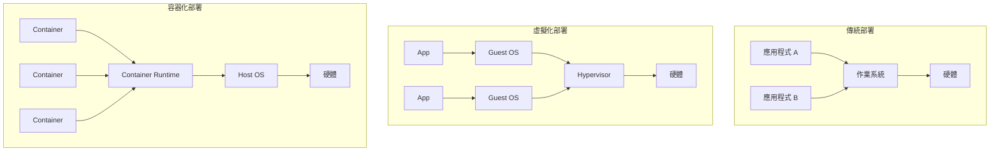
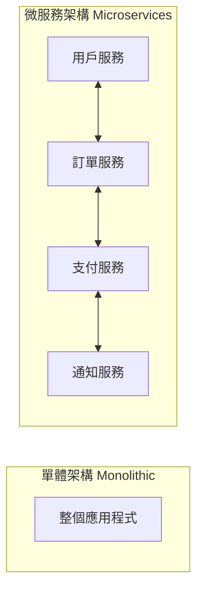
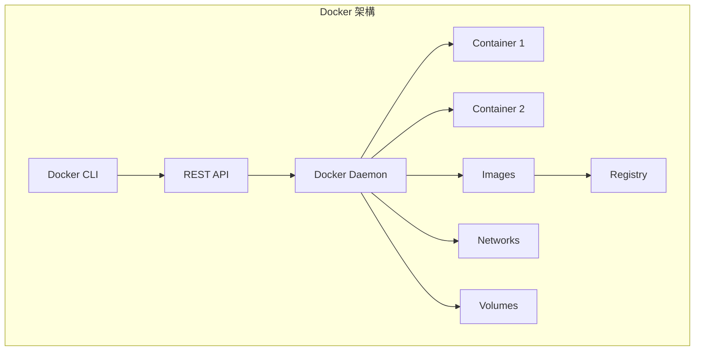
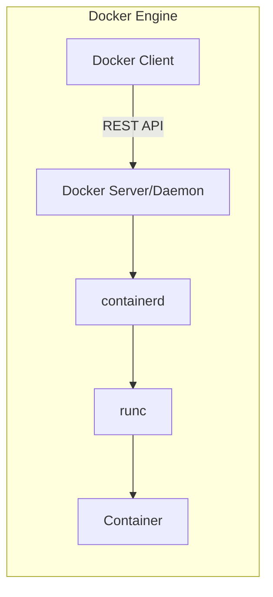
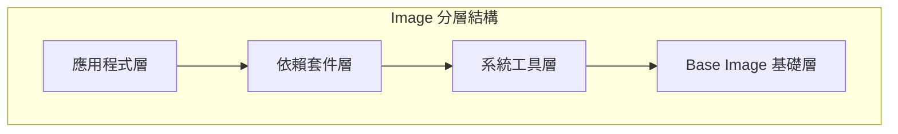
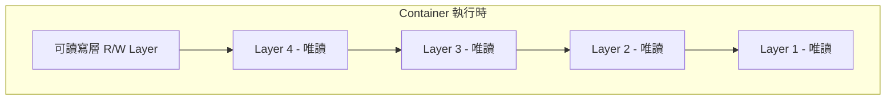

# 第 1 章：Docker Container & Micro Service Introduction

## 學習目標

完成本章節後，你將能夠：

- [ ] 理解容器化技術的優勢與傳統部署方式的差異
- [ ] 說明 Docker 的整體架構與核心元件
- [ ] 區分 Docker 與 Podman 的差異與適用場景
- [ ] 理解微服務架構（Microservices）的基本概念

## 前置知識

開始之前，請確保你已經：

- 具備 Linux 基礎指令操作能力
- 理解基本的網路概念（IP、Port）
- 了解傳統應用程式部署的基本流程

---

## 1.1 容器化的好處

### 什麼是容器化？

Container（容器）是一種輕量級的虛擬化技術，它將應用程式及其所有依賴項打包在一起，確保應用程式在任何環境中都能一致地運行。

!!! info "容器 vs 虛擬機"
    容器與傳統虛擬機（VM）的最大差異在於：
    
    - **虛擬機**：包含完整的作業系統，資源消耗大
    - **容器**：共享主機的作業系統核心，啟動快速、資源效率高

### 傳統部署 vs 容器化部署



### 容器化的核心優勢

| 優勢 | 說明 |
|------|------|
| **可移植性** | 「Build once, run anywhere」- 一次建置，到處運行 |
| **資源效率** | 容器共享 OS 核心，比 VM 更輕量 |
| **快速啟動** | 容器啟動時間以秒計，VM 需要數分鐘 |
| **一致性環境** | 開發、測試、生產環境完全一致 |
| **隔離性** | 各容器之間相互隔離，互不影響 |
| **版本控制** | Image 可以版本化管理 |
| **易於擴展** | 快速複製容器實現水平擴展 |

!!! tip "實務應用場景"
    - 微服務架構部署
    - CI/CD 持續整合與部署
    - 開發環境標準化
    - 多租戶應用程式隔離
    - 應用程式快速擴展

### 微服務架構簡介

Microservices（微服務）是一種軟體架構風格，將單一應用程式拆分為一組小型、獨立部署的服務。



!!! example "微服務範例"
    以電商平台為例，可拆分為：
    
    - **用戶服務**：處理註冊、登入、個人資料
    - **商品服務**：商品目錄、庫存管理
    - **訂單服務**：購物車、訂單處理
    - **支付服務**：金流整合
    - **通知服務**：Email、簡訊通知

---

## 1.2 Docker 架構

### Docker 是什麼？

Docker 是目前最流行的容器化平台，由 Docker, Inc. 開發。它提供了一套完整的工具來建立、運行和管理容器。

### Docker 核心元件



| 元件 | 說明 |
|------|------|
| **Docker Client** | 使用者操作介面，透過 CLI 或 API 與 Daemon 溝通 |
| **Docker Daemon** | 背景服務程式，負責建立和管理容器 |
| **Docker Image** | 容器的唯讀模板，包含應用程式和依賴 |
| **Docker Container** | Image 的執行實例 |
| **Docker Registry** | 儲存和分發 Image 的服務 |

### Docker 運作流程

```bash title="Docker 基本運作流程"
# 1. 從 Registry 拉取 Image
docker pull nginx

# 2. 使用 Image 建立並啟動 Container
docker run -d --name my-nginx -p 8080:80 nginx

# 3. 檢視運行中的 Container
docker ps

# 4. 停止 Container
docker stop my-nginx

# 5. 刪除 Container
docker rm my-nginx
```

---

## 1.3 Docker 基本架構

### Docker Engine

Docker Engine 是 Docker 的核心，採用 Client-Server 架構：



!!! note "底層技術"
    Docker 底層依賴 Linux 的以下技術：
    
    - **Namespaces**：提供隔離（PID、Network、Mount 等）
    - **cgroups**：資源限制（CPU、Memory）
    - **UnionFS**：分層檔案系統

### Docker Objects

#### Image（映像檔）

Image 是建立 Container 的模板，具有以下特性：

- **唯讀**：Image 本身不可修改
- **分層結構**：由多個 Layer 堆疊而成
- **可繼承**：可以基於現有 Image 建立新 Image



#### Container（容器）

Container 是 Image 的執行實例：

- **可讀寫**：Container 有自己的讀寫層
- **短暫性**：Container 停止後資料不會保留（除非使用 Volume）
- **隔離性**：每個 Container 有獨立的檔案系統、網路、程序空間

```bash title="Container 生命週期"
# 建立 Container（未啟動）
docker create --name my-app nginx

# 啟動 Container
docker start my-app

# 暫停 Container
docker pause my-app

# 繼續 Container
docker unpause my-app

# 停止 Container
docker stop my-app

# 刪除 Container
docker rm my-app
```

### Layer 分層機制



!!! tip "分層優點"
    - **節省空間**：相同 Layer 可被多個 Image 共用
    - **加速建置**：只有變更的 Layer 需要重建
    - **快速傳輸**：只需下載缺少的 Layer

---

## 1.4 Docker 與 Podman

### Podman 簡介

Podman 是 Red Hat 開發的容器工具，提供與 Docker 相容的 CLI 介面，但採用不同的架構設計。

### Docker vs Podman 比較

| 比較項目 | Docker | Podman |
|----------|--------|--------|
| **架構** | Daemon-based（需要背景服務） | Daemonless（無需背景服務） |
| **Root 權限** | 預設需要 root | 支援 Rootless 模式 |
| **SystemD 整合** | 較弱 | 原生支援 |
| **Pod 支援** | 不支援 | 原生支援 Pod 概念 |
| **指令相容** | - | 幾乎 100% 相容 Docker CLI |
| **映像格式** | Docker/OCI | Docker/OCI |

### 架構差異

=== "Docker 架構"
    ```mermaid
    graph TB
        CLI[Docker CLI] --> Daemon[Docker Daemon]
        Daemon --> Container1[Container]
        Daemon --> Container2[Container]
        
        style Daemon fill:#f96,stroke:#333
    ```
    
    Docker Daemon 作為單點服務，管理所有容器。

=== "Podman 架構"
    ```mermaid
    graph TB
        CLI[Podman CLI] --> Container1[Container]
        CLI --> Container2[Container]
        
        style CLI fill:#9f6,stroke:#333
    end
    ```
    
    Podman 直接 fork 出容器程序，無需中央 Daemon。

### 指令對照

```bash title="Docker 指令"
docker run -d nginx
docker ps
docker images
docker build -t myapp .
```

```bash title="Podman 指令（幾乎相同）"
podman run -d nginx
podman ps
podman images
podman build -t myapp .
```

!!! tip "快速切換技巧"
    可以在 `.bashrc` 或 `.zshrc` 加入：
    ```bash
    alias docker=podman
    ```

### 何時選擇 Podman？

!!! note "建議使用 Podman 的場景"
    - RHEL/CentOS/Fedora 環境
    - 需要 Rootless 容器的安全需求
    - 企業環境需要與 Kubernetes 更好的整合
    - 不希望運行持續的背景服務

---

## Lab 實作練習

### Lab 1-1：安裝 Docker

**目標**：在 Linux 系統上安裝 Docker

**環境**：Ubuntu 22.04 或 CentOS 8+

=== "Ubuntu"
    ```bash title="Ubuntu 安裝 Docker"
    # 1. 更新套件索引
    sudo apt-get update
    
    # 2. 安裝必要套件
    sudo apt-get install -y ca-certificates curl gnupg
    
    # 3. 添加 Docker 官方 GPG 金鑰
    sudo install -m 0755 -d /etc/apt/keyrings
    curl -fsSL https://download.docker.com/linux/ubuntu/gpg | sudo gpg --dearmor -o /etc/apt/keyrings/docker.gpg
    sudo chmod a+r /etc/apt/keyrings/docker.gpg
    
    # 4. 設定 Docker 套件庫
    echo \
      "deb [arch=$(dpkg --print-architecture) signed-by=/etc/apt/keyrings/docker.gpg] https://download.docker.com/linux/ubuntu \
      $(. /etc/os-release && echo "$VERSION_CODENAME") stable" | \
      sudo tee /etc/apt/sources.list.d/docker.list > /dev/null
    
    # 5. 安裝 Docker
    sudo apt-get update
    sudo apt-get install -y docker-ce docker-ce-cli containerd.io docker-buildx-plugin docker-compose-plugin
    
    # 6. 將目前使用者加入 docker 群組
    sudo usermod -aG docker $USER
    
    # 7. 重新登入後生效，或執行
    newgrp docker
    ```

=== "CentOS/RHEL"
    ```bash title="CentOS/RHEL 安裝 Docker"
    # 1. 移除舊版本
    sudo yum remove docker docker-client docker-client-latest docker-common docker-latest docker-latest-logrotate docker-logrotate docker-engine
    
    # 2. 安裝 yum-utils
    sudo yum install -y yum-utils
    
    # 3. 設定 Docker 套件庫
    sudo yum-config-manager --add-repo https://download.docker.com/linux/centos/docker-ce.repo
    
    # 4. 安裝 Docker
    sudo yum install -y docker-ce docker-ce-cli containerd.io docker-buildx-plugin docker-compose-plugin
    
    # 5. 啟動 Docker
    sudo systemctl start docker
    sudo systemctl enable docker
    
    # 6. 將目前使用者加入 docker 群組
    sudo usermod -aG docker $USER
    ```

**驗證安裝**：

```bash title="驗證 Docker 安裝"
# 檢查 Docker 版本
docker --version

# 檢查 Docker 服務狀態
sudo systemctl status docker

# 執行測試容器
docker run hello-world
```

**預期結果**：

```
Hello from Docker!
This message shows that your installation appears to be working correctly.
...
```

### Lab 1-2：Docker 基本操作練習

**目標**：熟悉 Docker 基本指令

```bash title="步驟 1：拉取 Image"
# 拉取 nginx Image
docker pull nginx:latest

# 檢視本地 Image
docker images
```

```bash title="步驟 2：建立並執行 Container"
# 執行 nginx Container
docker run -d --name my-nginx -p 8080:80 nginx:latest

# 檢視運行中的 Container
docker ps
```

```bash title="步驟 3：存取服務"
# 使用 curl 測試
curl http://localhost:8080

# 或在瀏覽器開啟 http://localhost:8080
```

```bash title="步驟 4：進入 Container"
# 執行互動式 Shell
docker exec -it my-nginx /bin/bash

# 在 Container 內檢視 nginx 設定
cat /etc/nginx/nginx.conf

# 離開 Container
exit
```

```bash title="步驟 5：清理資源"
# 停止 Container
docker stop my-nginx

# 刪除 Container
docker rm my-nginx

# 刪除 Image
docker rmi nginx:latest
```

---

## 常見問題

??? question "Q1：docker: Cannot connect to the Docker daemon"
    **原因**：Docker Daemon 未啟動
    
    **解決方案**：
    ```bash
    # 啟動 Docker 服務
    sudo systemctl start docker
    
    # 設定開機自動啟動
    sudo systemctl enable docker
    ```

??? question "Q2：permission denied while trying to connect to the Docker daemon socket"
    **原因**：目前使用者沒有權限存取 Docker
    
    **解決方案**：
    ```bash
    # 將使用者加入 docker 群組
    sudo usermod -aG docker $USER
    
    # 重新登入或執行
    newgrp docker
    ```

??? question "Q3：Docker 與 Podman 可以同時安裝嗎？"
    **回答**：可以，但建議選擇其中一個作為主要工具。
    
    如果需要同時使用，注意以下幾點：
    
    - 兩者的 Image 儲存位置不同
    - Container 不會互相顯示
    - 可能造成 Port 衝突

??? question "Q4：如何查看 Container 的 Log？"
    **解答**：
    ```bash
    # 查看 Log
    docker logs my-nginx
    
    # 持續追蹤 Log
    docker logs -f my-nginx
    
    # 顯示最後 100 行
    docker logs --tail 100 my-nginx
    ```

---

## 小結

本章節重點回顧：

- ✅ **容器化優勢**：可移植性、資源效率、快速啟動、環境一致性
- ✅ **Docker 架構**：Client-Server 模式，包含 Daemon、Image、Container、Registry
- ✅ **Docker 基本元件**：Image 是模板，Container 是執行實例
- ✅ **分層機制**：Image 由多個 Layer 組成，Container 有額外的讀寫層
- ✅ **Docker vs Podman**：Podman 無需 Daemon、支援 Rootless、與 Docker CLI 相容

## 延伸閱讀

- [Docker 官方文件 - Get Started](https://docs.docker.com/get-started/)
- [Docker 架構說明](https://docs.docker.com/get-started/overview/)
- [Podman 官方文件](https://podman.io/getting-started/)
- [容器技術原理 - Namespaces & Cgroups](https://man7.org/linux/man-pages/man7/namespaces.7.html)
- [OCI 容器規範](https://opencontainers.org/)
