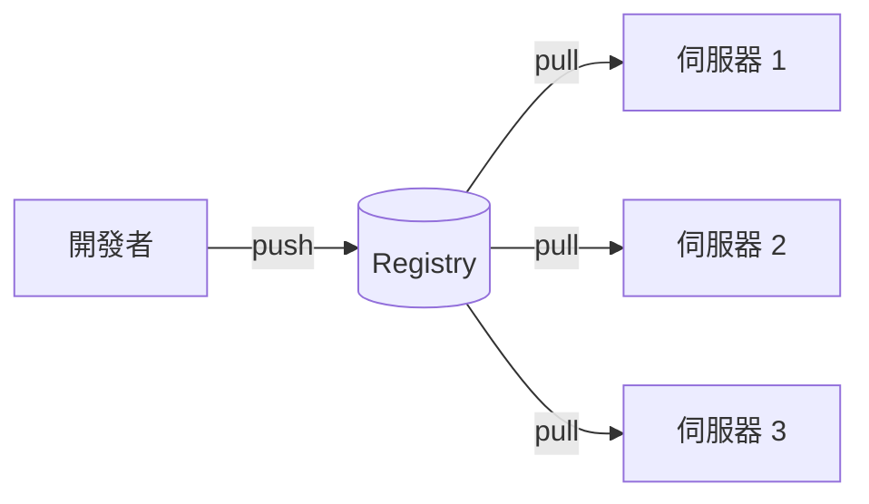
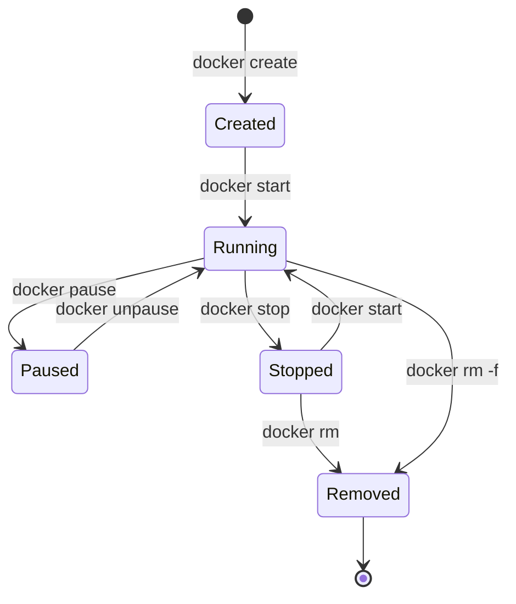
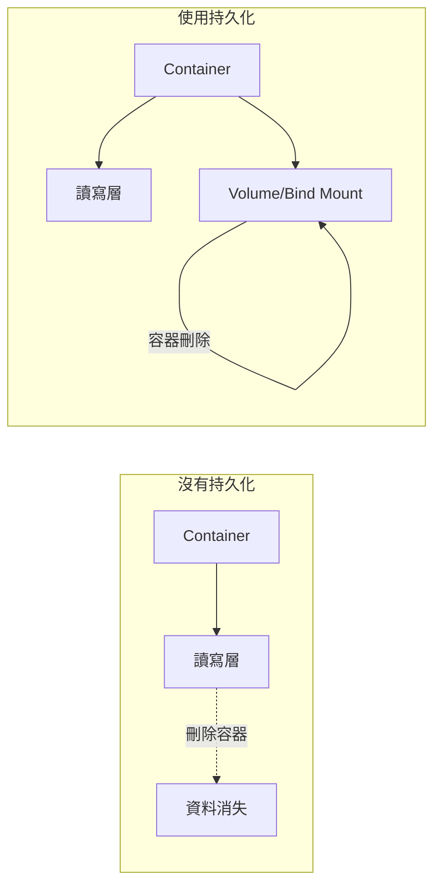
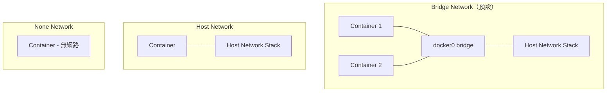
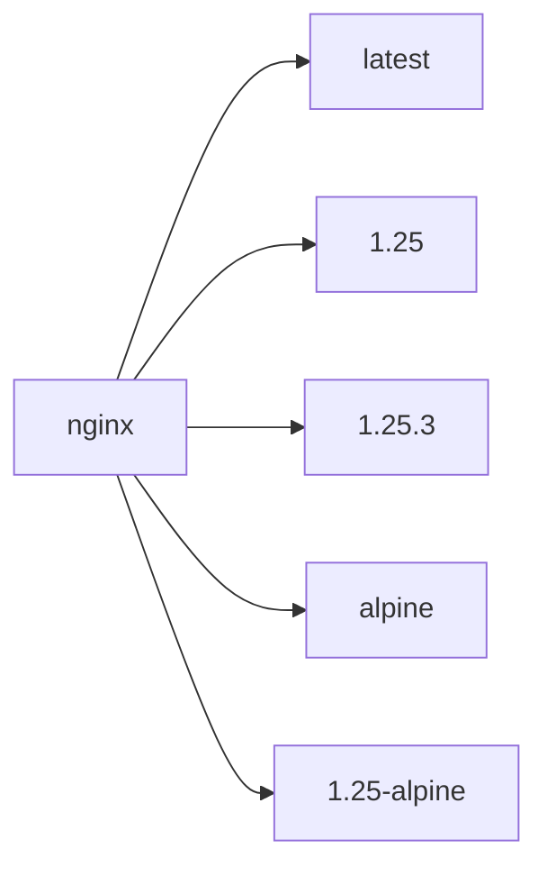
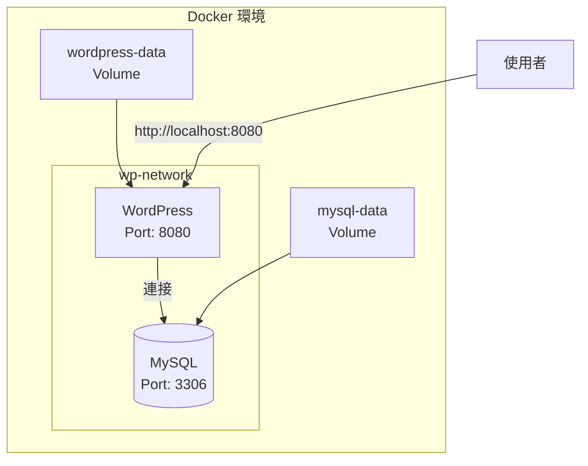

# 第 2 章：Docker 容器化管理

## 學習目標

完成本章節後，你將能夠：

- [ ] 區分 Public Registry 與 Private Registry 的用途
- [ ] 熟練操作 Docker 基本指令（run、exec、logs、inspect 等）
- [ ] 設定 Docker 持久化儲存（Volumes 與 Bind Mounts）
- [ ] 理解並設定 Docker 網路
- [ ] 從 Docker Hub 搜尋、拉取、推送 Image
- [ ] 完成 WordPress + MySQL 容器化部署實作

## 前置知識

開始之前，請確保你已經：

- 完成第 1 章的內容
- Docker 已正確安裝並可執行
- 理解 Image 與 Container 的關係

---

## 2.1 Public Registry 與 Private Registry

### 什麼是 Registry？

Registry（倉庫）是用來儲存和分發 Docker Image 的服務。就像 GitHub 儲存程式碼一樣，Registry 儲存容器映像檔。



### Public Registry

公開的 Registry 服務，任何人都可以存取公開的 Image。

| Registry | 說明 | 網址 |
|----------|------|------|
| **Docker Hub** | 官方預設 Registry，最大的公開 Image 倉庫 | hub.docker.com |
| **Quay.io** | Red Hat 提供的 Registry | quay.io |
| **GitHub Container Registry** | GitHub 提供的容器 Registry | ghcr.io |
| **Google Container Registry** | Google Cloud 提供 | gcr.io |
| **Amazon ECR Public** | AWS 提供的公開 Registry | public.ecr.aws |

!!! tip "Docker Hub 使用技巧"
    - **官方 Image**：沒有前綴，如 `nginx`、`mysql`、`redis`
    - **社群 Image**：包含使用者名稱，如 `bitnami/nginx`
    - **標籤**：指定版本，如 `nginx:1.25`、`nginx:alpine`

### Private Registry

私有 Registry 用於儲存企業內部的 Image，不對外公開。

#### 常見私有 Registry 方案

| 方案 | 說明 | 適用場景 |
|------|------|----------|
| **Docker Registry** | Docker 官方提供的輕量級 Registry | 小型團隊、測試環境 |
| **Harbor** | VMware 開源的企業級 Registry | 大型企業、需要 RBAC |
| **Nexus Repository** | Sonatype 的多功能倉庫 | 已使用 Nexus 管理套件 |
| **JFrog Artifactory** | 企業級製品管理 | 大型企業 |
| **AWS ECR** | AWS 私有 Registry | AWS 雲端環境 |
| **Azure ACR** | Azure 私有 Registry | Azure 雲端環境 |
| **GCP GCR** | Google 私有 Registry | GCP 雲端環境 |

#### 建立簡易 Private Registry

```bash title="使用 Docker 建立私有 Registry"
# 啟動 Registry Container
docker run -d \
  --name my-registry \
  -p 5000:5000 \
  -v registry-data:/var/lib/registry \
  registry:2

# 為 Image 加上私有 Registry 標籤
docker tag nginx:latest localhost:5000/my-nginx:v1

# 推送到私有 Registry
docker push localhost:5000/my-nginx:v1

# 從私有 Registry 拉取
docker pull localhost:5000/my-nginx:v1
```

!!! warning "生產環境注意事項"
    - 私有 Registry 應配置 TLS 憑證
    - 設定適當的存取控制
    - 定期備份 Registry 資料
    - 考慮使用企業級方案如 Harbor

---

## 2.2 Docker 基本操作

### Container 生命週期管理



### 核心指令詳解

#### docker run - 執行容器

```bash title="docker run 常用選項"
# 基本執行
docker run nginx

# 背景執行 (detached)
docker run -d nginx

# 指定名稱
docker run -d --name my-nginx nginx

# Port 對應 (主機:容器)
docker run -d -p 8080:80 nginx

# 環境變數
docker run -d -e MYSQL_ROOT_PASSWORD=secret mysql

# 自動刪除（結束後自動移除）
docker run --rm nginx echo "Hello"

# 互動模式
docker run -it ubuntu /bin/bash

# 資源限制
docker run -d --memory="512m" --cpus="1.0" nginx

# 重啟策略
docker run -d --restart=always nginx
```

!!! note "docker run 選項說明"
    | 選項 | 說明 |
    |------|------|
    | `-d` | Detached mode，背景執行 |
    | `-it` | 互動模式 + TTY |
    | `-p` | Port mapping |
    | `-v` | Volume mapping |
    | `-e` | 環境變數 |
    | `--name` | 指定容器名稱 |
    | `--rm` | 結束後自動刪除 |
    | `--restart` | 重啟策略 |

#### docker exec - 執行指令

```bash title="在運行中的容器執行指令"
# 執行單一指令
docker exec my-nginx cat /etc/nginx/nginx.conf

# 進入互動式 Shell
docker exec -it my-nginx /bin/bash

# 以特定使用者執行
docker exec -u root my-nginx whoami

# 設定環境變數
docker exec -e VAR=value my-nginx printenv VAR
```

#### docker logs - 檢視日誌

```bash title="Container 日誌操作"
# 檢視全部日誌
docker logs my-nginx

# 持續追蹤日誌
docker logs -f my-nginx

# 顯示最後 N 行
docker logs --tail 100 my-nginx

# 顯示時間戳記
docker logs -t my-nginx

# 指定時間範圍
docker logs --since 2024-01-01 my-nginx
docker logs --since 10m my-nginx  # 最近 10 分鐘
```

#### docker inspect - 檢視詳細資訊

```bash title="檢視容器/映像檔詳細資訊"
# 檢視容器詳細資訊（JSON 格式）
docker inspect my-nginx

# 取得特定資訊（使用 Go 模板）
docker inspect --format='{{.NetworkSettings.IPAddress}}' my-nginx

# 取得 Port 對應
docker inspect --format='{{range $p, $conf := .NetworkSettings.Ports}}{{$p}} -> {{(index $conf 0).HostPort}}{{end}}' my-nginx

# 取得掛載資訊
docker inspect --format='{{json .Mounts}}' my-nginx | jq .
```

#### 其他常用指令

```bash title="容器管理指令"
# 列出運行中的容器
docker ps

# 列出所有容器（包含已停止）
docker ps -a

# 停止容器
docker stop my-nginx

# 啟動已停止的容器
docker start my-nginx

# 重啟容器
docker restart my-nginx

# 刪除容器
docker rm my-nginx

# 強制刪除運行中的容器
docker rm -f my-nginx

# 刪除所有已停止的容器
docker container prune

# 檢視容器資源使用
docker stats

# 複製檔案到容器
docker cp ./index.html my-nginx:/usr/share/nginx/html/

# 從容器複製檔案
docker cp my-nginx:/etc/nginx/nginx.conf ./nginx.conf
```

---

## 2.3 Persistent Storage

### 為什麼需要持久化儲存？

Container 預設的資料是短暫的（ephemeral），當 Container 被刪除時，所有資料都會消失。



### 三種儲存方式

| 類型 | 說明 | 適用場景 |
|------|------|----------|
| **Volume** | 由 Docker 管理的儲存區域 | 生產環境、資料持久化 |
| **Bind Mount** | 將主機目錄掛載到容器 | 開發環境、程式碼同步 |
| **tmpfs Mount** | 儲存在主機記憶體中 | 暫存敏感資料 |

### Volumes

```bash title="Volume 基本操作"
# 建立 Volume
docker volume create my-data

# 列出所有 Volume
docker volume ls

# 檢視 Volume 詳細資訊
docker volume inspect my-data

# 使用 Volume 執行容器
docker run -d \
  --name my-nginx \
  -v my-data:/usr/share/nginx/html \
  nginx

# 刪除 Volume
docker volume rm my-data

# 清理未使用的 Volume
docker volume prune
```

!!! tip "Volume 位置"
    Docker Volume 預設儲存在：
    
    - **Linux**: `/var/lib/docker/volumes/`
    - **macOS/Windows**: Docker Desktop 管理的虛擬磁碟內

### Bind Mounts

```bash title="Bind Mount 使用方式"
# 使用 -v 語法
docker run -d \
  --name my-nginx \
  -v /path/on/host:/usr/share/nginx/html \
  -p 8080:80 \
  nginx

# 使用 --mount 語法（推薦）
docker run -d \
  --name my-nginx \
  --mount type=bind,source=/path/on/host,target=/usr/share/nginx/html \
  -p 8080:80 \
  nginx

# 唯讀掛載
docker run -d \
  --name my-nginx \
  -v /path/on/host:/usr/share/nginx/html:ro \
  nginx
```

!!! example "開發環境範例"
    ```bash title="前端開發即時同步"
    # 將本地專案目錄掛載到容器
    docker run -d \
      --name frontend-dev \
      -v $(pwd)/src:/app/src \
      -p 3000:3000 \
      node:18
    ```
    
    修改本地 `src` 目錄的檔案會立即反映到容器中。

### Volume vs Bind Mount 比較

| 比較項目 | Volume | Bind Mount |
|----------|--------|------------|
| 儲存位置 | Docker 管理 | 指定主機路徑 |
| 可移植性 | 高 | 依賴主機路徑 |
| 效能 | 較佳 | 取決於主機檔案系統 |
| 備份 | 容易 | 需手動處理 |
| 適用場景 | 生產環境 | 開發環境 |

---

## 2.4 Docker Network

### 預設網路類型

Docker 提供多種網路驅動，滿足不同的使用場景。



| 網路類型 | 說明 | 適用場景 |
|----------|------|----------|
| **bridge** | 預設網路，Container 透過虛擬橋接器連接 | 單機多容器通訊 |
| **host** | Container 直接使用主機網路 | 需要最高網路效能 |
| **none** | 無網路連接 | 安全隔離需求 |
| **overlay** | 跨主機容器通訊 | Docker Swarm 叢集 |
| **macvlan** | 分配真實 MAC 地址 | 需要直接連接實體網路 |

### 網路基本操作

```bash title="Docker 網路管理"
# 列出所有網路
docker network ls

# 檢視網路詳細資訊
docker network inspect bridge

# 建立自訂網路
docker network create my-network

# 建立指定子網路的網路
docker network create \
  --driver bridge \
  --subnet 172.20.0.0/16 \
  --gateway 172.20.0.1 \
  my-custom-network

# 刪除網路
docker network rm my-network

# 清理未使用的網路
docker network prune
```

### 容器連接網路

```bash title="容器網路連接"
# 執行容器時指定網路
docker run -d --name app1 --network my-network nginx

# 將運行中的容器連接到網路
docker network connect my-network container-name

# 將容器從網路斷開
docker network disconnect my-network container-name
```

### 容器間通訊

!!! tip "使用自訂網路實現容器間通訊"
    在同一個自訂網路中的容器，可以使用**容器名稱**作為 hostname 互相存取。

```bash title="容器間通訊範例"
# 建立網路
docker network create app-network

# 啟動 MySQL Container
docker run -d \
  --name mysql-db \
  --network app-network \
  -e MYSQL_ROOT_PASSWORD=secret \
  mysql:8

# 啟動應用程式 Container，使用 mysql-db 作為資料庫主機
docker run -d \
  --name my-app \
  --network app-network \
  -e DB_HOST=mysql-db \
  -e DB_PASSWORD=secret \
  my-application

# 測試連線
docker exec my-app ping mysql-db
```

### Port 對應

```bash title="Port Mapping"
# 對應單一 Port
docker run -d -p 8080:80 nginx

# 對應多個 Port
docker run -d -p 8080:80 -p 8443:443 nginx

# 對應到所有介面的隨機 Port
docker run -d -P nginx

# 只對應到 localhost
docker run -d -p 127.0.0.1:8080:80 nginx

# 對應 UDP Port
docker run -d -p 53:53/udp dns-server
```

---

## 2.5 Docker Search

### 搜尋 Image

```bash title="搜尋 Docker Hub"
# 基本搜尋
docker search nginx

# 限制結果數量
docker search --limit 5 nginx

# 只顯示官方 Image
docker search --filter is-official=true nginx

# 只顯示自動建置的 Image
docker search --filter is-automated=true nginx

# 根據星星數過濾
docker search --filter stars=100 nginx
```

**搜尋結果說明**：

| 欄位 | 說明 |
|------|------|
| NAME | Image 名稱 |
| DESCRIPTION | 描述 |
| STARS | 星星數（人氣指標） |
| OFFICIAL | 是否為官方 Image |
| AUTOMATED | 是否自動建置 |

!!! tip "選擇 Image 的建議"
    1. 優先選擇**官方 Image**（OFFICIAL = [OK]）
    2. 查看**星星數**和**下載次數**
    3. 到 Docker Hub 網站查看**文件**和**更新頻率**
    4. 檢查 Image 的**安全掃描結果**

---

## 2.6 Docker Pull

### 拉取 Image

```bash title="拉取 Image"
# 拉取最新版本（預設 latest tag）
docker pull nginx

# 拉取特定版本
docker pull nginx:1.25

# 拉取特定版本（alpine 輕量版）
docker pull nginx:alpine

# 從其他 Registry 拉取
docker pull quay.io/bitnami/nginx

# 拉取特定平台的 Image
docker pull --platform linux/amd64 nginx
```

### Image 標籤（Tag）



!!! warning "避免使用 latest"
    - `latest` 標籤會隨時間變化
    - 生產環境應使用**明確版本號**
    - 例如：`nginx:1.25.3` 而非 `nginx:latest`

### 管理本地 Image

```bash title="Image 管理指令"
# 列出本地 Image
docker images

# 列出所有 Image（包含中間層）
docker images -a

# 檢視 Image 詳細資訊
docker image inspect nginx

# 檢視 Image 歷史（分層）
docker history nginx

# 刪除 Image
docker rmi nginx

# 刪除未使用的 Image
docker image prune

# 刪除所有未使用的 Image（包含未標記的）
docker image prune -a
```

---

## 2.7 Docker Push

### 推送 Image 到 Registry

#### 推送到 Docker Hub

```bash title="推送到 Docker Hub"
# 1. 登入 Docker Hub
docker login

# 2. 為 Image 加上標籤（必須包含使用者名稱）
docker tag my-app:v1 username/my-app:v1

# 3. 推送 Image
docker push username/my-app:v1

# 4. 登出（選用）
docker logout
```

#### 推送到私有 Registry

```bash title="推送到私有 Registry"
# 1. 登入私有 Registry
docker login my-registry.example.com

# 2. 為 Image 加上私有 Registry 標籤
docker tag my-app:v1 my-registry.example.com/my-app:v1

# 3. 推送
docker push my-registry.example.com/my-app:v1
```

!!! note "Image 命名規則"
    ```
    [registry/][username/]repository[:tag]
    ```
    
    例如：
    
    - `nginx` = `docker.io/library/nginx:latest`
    - `bitnami/nginx` = `docker.io/bitnami/nginx:latest`
    - `gcr.io/project/app:v1`

### 標籤管理

```bash title="Image 標籤操作"
# 加上新標籤
docker tag my-app:v1 my-app:latest
docker tag my-app:v1 my-app:stable

# 推送多個標籤
docker push my-app:v1
docker push my-app:latest
docker push my-app:stable
```

---

## 2.8 使用 Docker 架設 WordPress + MySQL

### Lab 實作目標

部署一個完整的 WordPress 網站，包含：

- MySQL 資料庫容器
- WordPress 應用程式容器
- 使用 Docker Network 連接
- 使用 Volume 持久化資料

### 架構圖



### 實作步驟

#### 步驟 1：建立網路

```bash title="建立專用網路"
docker network create wp-network
```

#### 步驟 2：啟動 MySQL 容器

```bash title="啟動 MySQL"
docker run -d \
  --name wp-mysql \
  --network wp-network \
  -v mysql-data:/var/lib/mysql \
  -e MYSQL_ROOT_PASSWORD=rootpassword \
  -e MYSQL_DATABASE=wordpress \
  -e MYSQL_USER=wpuser \
  -e MYSQL_PASSWORD=wppassword \
  mysql:8.0
```

!!! note "MySQL 環境變數說明"
    | 環境變數 | 說明 |
    |----------|------|
    | `MYSQL_ROOT_PASSWORD` | root 密碼（必填） |
    | `MYSQL_DATABASE` | 自動建立的資料庫 |
    | `MYSQL_USER` | 自動建立的使用者 |
    | `MYSQL_PASSWORD` | 使用者密碼 |

#### 步驟 3：啟動 WordPress 容器

```bash title="啟動 WordPress"
docker run -d \
  --name wp-app \
  --network wp-network \
  -p 8080:80 \
  -v wordpress-data:/var/www/html \
  -e WORDPRESS_DB_HOST=wp-mysql:3306 \
  -e WORDPRESS_DB_NAME=wordpress \
  -e WORDPRESS_DB_USER=wpuser \
  -e WORDPRESS_DB_PASSWORD=wppassword \
  wordpress:latest
```

#### 步驟 4：驗證部署

```bash title="驗證容器狀態"
# 檢查容器是否運行
docker ps

# 檢查容器日誌
docker logs wp-mysql
docker logs wp-app

# 測試 MySQL 連線
docker exec wp-mysql mysql -uwpuser -pwppassword -e "SHOW DATABASES;"
```

#### 步驟 5：存取 WordPress

開啟瀏覽器，前往 `http://localhost:8080`，完成 WordPress 安裝精靈。

### 使用 Docker Compose（額外說明）

!!! tip "更簡潔的方式"
    使用 Docker Compose 可以將以上所有設定集中在一個檔案中。

```yaml title="docker-compose.yml"
version: '3.8'

services:
  db:
    image: mysql:8.0
    container_name: wp-mysql
    volumes:
      - mysql-data:/var/lib/mysql
    environment:
      MYSQL_ROOT_PASSWORD: rootpassword
      MYSQL_DATABASE: wordpress
      MYSQL_USER: wpuser
      MYSQL_PASSWORD: wppassword
    networks:
      - wp-network

  wordpress:
    image: wordpress:latest
    container_name: wp-app
    depends_on:
      - db
    ports:
      - "8080:80"
    volumes:
      - wordpress-data:/var/www/html
    environment:
      WORDPRESS_DB_HOST: db:3306
      WORDPRESS_DB_NAME: wordpress
      WORDPRESS_DB_USER: wpuser
      WORDPRESS_DB_PASSWORD: wppassword
    networks:
      - wp-network

networks:
  wp-network:
    driver: bridge

volumes:
  mysql-data:
  wordpress-data:
```

```bash title="使用 Docker Compose 啟動"
# 啟動所有服務
docker compose up -d

# 檢視狀態
docker compose ps

# 檢視日誌
docker compose logs -f

# 停止並移除
docker compose down

# 停止並移除（包含 Volume）
docker compose down -v
```

### 清理資源

```bash title="清理實作環境"
# 停止容器
docker stop wp-app wp-mysql

# 刪除容器
docker rm wp-app wp-mysql

# 刪除網路
docker network rm wp-network

# 刪除 Volume（警告：會刪除所有資料）
docker volume rm mysql-data wordpress-data
```

---

## 常見問題

??? question "Q1：Container 啟動後立即退出怎麼辦？"
    **診斷步驟**：
    ```bash
    # 檢視容器日誌
    docker logs container-name
    
    # 檢視容器詳細資訊
    docker inspect container-name
    
    # 檢視最後退出狀態
    docker ps -a --filter "name=container-name"
    ```
    
    **常見原因**：
    
    - 啟動指令錯誤
    - 環境變數缺失
    - 依賴服務未就緒
    - 設定檔錯誤

??? question "Q2：如何讓容器在主機重啟後自動啟動？"
    **解決方案**：使用 `--restart` 選項
    ```bash
    # always: 總是重啟
    docker run -d --restart=always nginx
    
    # unless-stopped: 除非手動停止
    docker run -d --restart=unless-stopped nginx
    
    # on-failure: 只在異常退出時重啟
    docker run -d --restart=on-failure:3 nginx
    ```

??? question "Q3：Volume 資料如何備份？"
    **解決方案**：
    ```bash
    # 方法 1：使用臨時容器備份
    docker run --rm \
      -v mysql-data:/source:ro \
      -v $(pwd):/backup \
      alpine tar cvf /backup/mysql-backup.tar /source
    
    # 方法 2：使用 docker cp（需要先掛載到容器）
    docker cp container-name:/var/lib/mysql ./mysql-backup
    ```

??? question "Q4：如何查看 Docker 佔用的磁碟空間？"
    **解決方案**：
    ```bash
    # 檢視整體使用情況
    docker system df
    
    # 詳細資訊
    docker system df -v
    
    # 清理未使用的資源
    docker system prune
    
    # 清理所有未使用資源（包含 Volume）
    docker system prune -a --volumes
    ```

??? question "Q5：容器間無法通訊怎麼辦？"
    **診斷步驟**：
    ```bash
    # 1. 確認容器在同一個網路
    docker network inspect my-network
    
    # 2. 確認容器 IP
    docker inspect --format='{{.NetworkSettings.IPAddress}}' container-name
    
    # 3. 在容器內測試連線
    docker exec container1 ping container2
    
    # 4. 確認 Port 是否開放
    docker exec container1 nc -zv container2 port
    ```

---

## 小結

本章節重點回顧：

- ✅ **Registry 類型**：Public Registry（如 Docker Hub）與 Private Registry（如 Harbor）
- ✅ **Container 管理**：run、exec、logs、inspect 等核心指令
- ✅ **持久化儲存**：Volume（Docker 管理）vs Bind Mount（主機目錄）
- ✅ **Docker 網路**：bridge、host、none 網路類型，自訂網路實現容器間通訊
- ✅ **Image 操作**：search、pull、push、tag 完整流程
- ✅ **實作經驗**：WordPress + MySQL 容器化部署

## 延伸閱讀

- [Docker 官方文件 - Storage](https://docs.docker.com/storage/)
- [Docker 官方文件 - Networking](https://docs.docker.com/network/)
- [Docker Hub 官方網站](https://hub.docker.com/)
- [Harbor - 企業級 Registry](https://goharbor.io/)
- [Docker Compose 官方文件](https://docs.docker.com/compose/)
