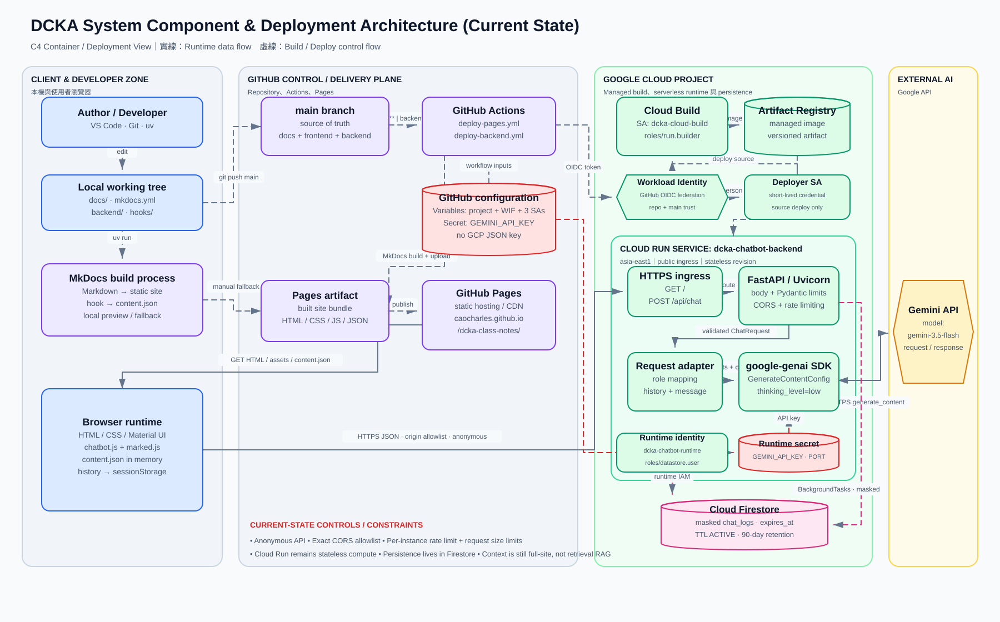
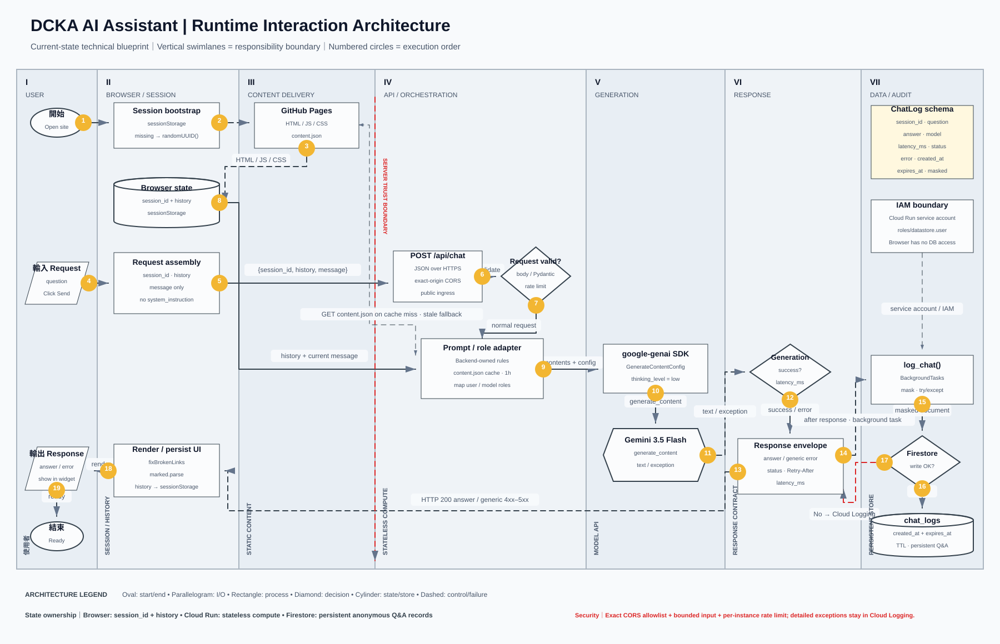
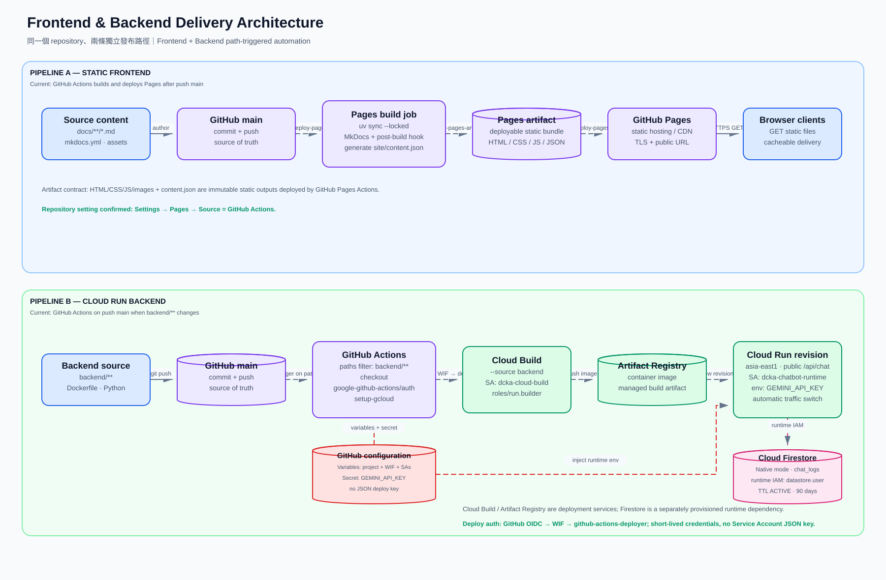

---
authors:
  - name: Charles Cao
    email: author@example.com
date: 2026-08-19
updated: 2026-08-19
tags:
  - Architecture
  - MkDocs
  - GitHub Pages
  - AI Assistant
---

# DCKA 專案技術架構

## 學習目標

完成本章節後，你將能夠：

- [ ] 說明 Markdown 如何透過 MkDocs 發布到 GitHub Pages。
- [ ] 理解 Browser、Cloud Run、Gemini 與 Firestore 的責任邊界。
- [ ] 追蹤一次 AI 助教問答的端到端資料流。
- [ ] 區分 Frontend 與 Backend 的建置及部署流程。

!!! info "為什麼把架構文件放進網站"
    這個章節不只記錄課程內容，也說明本網站本身如何建置、部署與串接 AI。它適合用於技術分享、維護交接與問題診斷。

!!! success "目前正式環境"
    Frontend 由 GitHub Actions 建置 MkDocs Pages Artifact 並發布至 GitHub Pages；Backend 透過 GitHub OIDC／Workload Identity Federation 部署至 Cloud Run。部署流程不保存 GCP Service Account JSON，問答紀錄由 Cloud Run 寫入啟用 90 天 TTL 的 Firestore。

---

## Architecture Views

### 1. System Component & Deployment Architecture

這張圖從系統與部署角度呈現本機開發環境、GitHub、GitHub Pages、Google Cloud Run、Gemini 與 Firestore 的關係。

{ loading=lazy }

[:octicons-arrow-right-24: 查看元件與部署說明](system-component-deployment.md){ .md-button }

---

### 2. AI Assistant Runtime Interaction Architecture

這張圖使用垂直責任泳道，說明使用者送出問題後，Browser Session、FastAPI、Gemini 與 Firestore 如何依序協作。

{ loading=lazy }

[:octicons-arrow-right-24: 查看 AI Runtime 說明](ai-assistant-runtime.md){ .md-button }

---

### 3. Frontend & Backend Delivery Architecture

這張圖將同一個 GitHub Repository 中的兩條 Delivery Pipeline 分開呈現：靜態網站發布到 GitHub Pages，Chatbot Backend 則部署到 Cloud Run。

{ loading=lazy }

[:octicons-arrow-right-24: 查看 Delivery Pipeline 說明](frontend-backend-delivery.md){ .md-button }

---

## 三張圖分別回答什麼問題？

| Architecture View | 主要問題 | 適合使用情境 |
|---|---|---|
| System Component & Deployment | 系統有哪些元件？部署在哪裡？ | 架構總覽、系統交接 |
| AI Assistant Runtime Interaction | 一次問答如何跨系統執行？ | API 串接、問題診斷 |
| Frontend & Backend Delivery | 程式碼如何建置並發布？ | CI/CD、部署維護 |

## 身分與責任邊界

| 身分 | 使用階段 | 最小權限與責任 |
|---|---|---|
| `github-actions-deployer` | GitHub Actions Deployment | 透過 WIF 取得短效憑證，執行 Cloud Run source deploy |
| `dcka-cloud-build` | Cloud Build | 以 `roles/run.builder` 建置並保存 Container Image |
| `dcka-chatbot-runtime` | Cloud Run Runtime | 執行 FastAPI，並以 `roles/datastore.user` 寫入 Firestore |

GitHub Variables 保存 Project、WIF Provider 與三個 Service Account 識別資訊；`GEMINI_API_KEY` 才使用 GitHub Secret。Browser 不會取得任何 GCP 身分或模型 API Key。

!!! warning "網站內容也會成為 AI 上下文"
    `docs/` 下的 Markdown 會在 MkDocs Build 時寫入 `content.json`，並由 AI 助教載入。請勿在本章放置 API Key、Service Account JSON、密碼或其他敏感資料。

## 小結

- ✅ **內容層**：Markdown 是課程與架構知識的 Source of Truth。
- ✅ **網站層**：MkDocs 產生靜態網站，由 GitHub Pages 對外提供。
- ✅ **AI 層**：Browser 呼叫 Cloud Run 上的 FastAPI，再由 Backend 呼叫 Gemini。
- ✅ **資料層**：Firestore 保存匿名問答紀錄，Cloud Run 本身維持 Stateless Compute。
- ✅ **部署身分**：WIF、Build SA 與 Runtime SA 分工，Repository 不保存長效 GCP JSON Key。
- ✅ **驗證狀態**：GitHub Pages、Cloud Run、正式 CORS、Gemini 問答、Firestore 寫入與 TTL 均已完成線上驗證。
