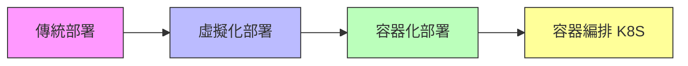

# Docker Containers 與 Kubernetes 系統管理

歡迎來到 **恆逸教育訓練中心 DCKA 課程** 學習筆記！

!!! info "課程資訊"
    - **課程名稱**：Docker Containers 與 Kubernetes 系統管理
    - **課程代號**：DCKA
    - **總時數**：21 小時（3 天）
    - **適合對象**：網路工程師、雲端運算工程師

---

## 課程簡介

本課程旨在幫助學員掌握 Docker Container（容器）技術與 Kubernetes（簡稱 K8S）容器編排平台的核心概念與實務操作。透過理論講解與動手實作，你將學會如何建立、管理和部署容器化應用程式。

---

## 學習目標

完成本課程後，你將能夠：

- [x] 理解容器化技術的優勢與應用場景
- [x] 熟練操作 Docker 容器的建立、啟動、停止與刪除
- [x] 客製化 Docker Image（映像檔）
- [x] 使用 Kubernetes 部署與管理容器化應用
- [x] 實作 WordPress + MySQL 的容器化部署

---

## 課程大綱

### 第 1 章：Docker Container & Micro Service Introduction

- 容器化的好處
- Docker 架構
- Docker 基本架構
- Docker 與 Podman 比較

[:octicons-arrow-right-24: 開始學習](01_docker_intro.md)

---

### 第 2 章：Docker 容器化管理

- Public Registry 與 Private Registry
- Docker 基本操作
- Persistent Storage（持久化儲存）
- Docker Network（網路）
- 實作：使用 Docker 架設 WordPress + MySQL

[:octicons-arrow-right-24: 開始學習](02_docker_management.md)

---

### 第 3 章：客製化 Docker Images

- Docker commit
- Dockerfile 撰寫
- Source-to-Image 簡介

[:octicons-arrow-right-24: 開始學習](03_docker_images.md)

---

### 第 4 章：Kubernetes Management

- Kubernetes 與 OpenShift/OKD
- Kubernetes 架構與安裝
- YAML 與 JSON 設定檔
- Kubernetes 資源類型與管理
- 部署策略：RollingUpdate、Recreate、Canary、Blue/Green
- Persistent Volumes、ConfigMaps、Secrets
- RBAC 權限控制
- 實作：使用 Kubernetes 架設 WordPress + MySQL

[:octicons-arrow-right-24: 開始學習](04_kubernetes.md)

---

## 預備知識

開始本課程之前，建議你具備：

!!! note "必備知識"
    - Linux 基礎指令操作（cd、ls、cat、vim 等）
    - Linux 基本系統管理概念
    - 建議具備 RHCE 認證能力或同等經驗

---

## 附錄資源

| 資源 | 說明 |
|------|------|
| [Docker 指令速查表](appendix/docker_cheatsheet.md) | 常用 Docker 指令快速參考 |
| [Kubernetes 指令速查表](appendix/k8s_cheatsheet.md) | 常用 kubectl 指令快速參考 |
| [疑難排解指南](appendix/troubleshooting.md) | 常見問題與解決方案 |

---

## 相關資源

- :fontawesome-brands-docker: [Docker 官方文件](https://docs.docker.com/)
- :material-kubernetes: [Kubernetes 官方文件](https://kubernetes.io/docs/)
- :fontawesome-brands-docker: [Docker Hub](https://hub.docker.com/)
- :material-podman: [Podman 官方文件](https://podman.io/)
- :material-school: [恆逸 DCKA 課程頁面](https://www.uuu.com.tw/Course/Show/1552/Docker-Containers與Kubernetes系統管理)

---

!!! tip "學習建議"
    1. 建議按章節順序學習
    2. 每個章節的 Lab 實作務必親自動手操作
    3. 遇到問題先查閱 FAQ，再參考疑難排解指南
    4. 善用指令速查表加速學習
