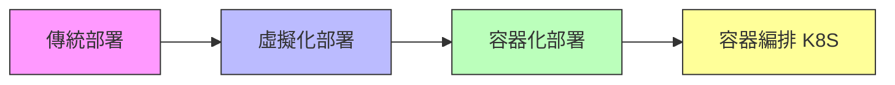

# Docker Containers 與 Kubernetes 系統管理

歡迎來到 **恆逸教育訓練中心 DCKA 課程** 學習筆記！

!!! info "課程資訊"
    - **課程名稱**：Docker Containers 與 Kubernetes 系統管理
    - **課程代號**：DCKA
    - **總時數**：21 小時（3 天）
    - **適合對象**：網路工程師、雲端運算工程師

---

## 課程簡介

本課程旨在幫助學員掌握 Docker Container（容器）技術與 Kubernetes（簡稱 K8S）容器編排平台的核心概念與實務操作。透過理論講解與動手實作，你將學會如何建立、管理和部署容器化應用程式。

---

## 📚 學習資源

!!! tip "多元學習管道"
    我們提供多種學習資源，讓您可以選擇最適合的方式深入了解課程內容！

-   :material-podcast:{ .lg .middle } **課程介紹音檔**

    ---

    透過音檔快速了解課程重點與學習目標

    <audio controls style="width: 100%;">
      <source src="Docker_與_K8s_容器實戰筆記.m4a" type="audio/mp4">
      您的瀏覽器不支援音訊播放
    </audio>

-   :material-robot:{ .lg .middle } **AI 互動問答**

    ---

    使用 Google NotebookLM 與 AI 進行課程內容問答

    [:octicons-link-external-24: 開啟 NotebookLM](https://notebooklm.google.com/notebook/09af28d2-79ac-434c-af2e-30b182f0e099?artifactId=1083ab41-ec2c-4015-ba16-811fa32f6606){ .md-button target="_blank" }

### :material-file-pdf-box: 完整課程簡報預覽

可直接在下方滑動查看簡報，或 [:octicons-download-24: 點此下載 PDF (15MB)](Kubernetes_Container_System_Administration.pdf)

{ type=application/pdf style="min-height:600px;width:100%" }

---

## 學習目標

完成本課程後，你將能夠：

- [x] 理解容器化技術的優勢與應用場景
- [x] 熟練操作 Docker 容器的建立、啟動、停止與刪除
- [x] 客製化 Docker Image（映像檔）
- [x] 使用 Kubernetes 部署與管理容器化應用
- [x] 實作 WordPress + MySQL 的容器化部署

---

## 課程大綱

### 1. Docker 基礎與管理 (LAB 01-08)

- 環境初始化與基本操作
- Docker 安裝 (Docker/Podman)
- Private Registry 建置
- Persistent Storage 與 WordPress 實作

[:octicons-arrow-right-24: 開始學習](lab01_environment_setup.md)

---

### 2. Docker 進階應用 (LAB 09-10)

- 客製化 Docker Images (commit & Dockerfile)
- Dockerfile 指令與最佳實踐

[:octicons-arrow-right-24: 開始學習](lab09_commit.md)

---

### 3. Kubernetes 基礎 (LAB 11-15)

- Kubernetes 安裝 (Standalone & Cluster)
- 常用指令與 Namespaces
- Rolling Update 與 Service 負載均衡

[:octicons-arrow-right-24: 開始學習](lab11_standalone_k8s.md)

---

### 4. Kubernetes 進階管理 (LAB 16-21)

- 儲存管理 (PV/PVC)
- 設定管理 (Secret/ConfigMap)
- 權限控制 (RBAC)
- 實作：WordPress + MySQL 完整部署
- Kubernetes Dashboard
- Private Registry 圖形管理 (docker-registry-web)

[:octicons-arrow-right-24: 開始學習](lab16_pv_pvc.md)

---

## 預備知識

開始本課程之前，建議你具備：

!!! note "必備知識"
    - Linux 基礎指令操作（cd、ls、cat、vim 等）
    - Linux 基本系統管理概念
    - 建議具備 RHCE 認證能力或同等經驗

---

## 附錄資源

| 資源 | 說明 |
|------|------|
| [Docker 指令速查表](appendix/docker_cheatsheet.md) | 常用 Docker 指令快速參考 |
| [Kubernetes 指令速查表](appendix/k8s_cheatsheet.md) | 常用 kubectl 指令快速參考 |
| [疑難排解指南](appendix/troubleshooting.md) | 常見問題與解決方案 |

---

## 相關資源

- :fontawesome-brands-docker: [Docker 官方文件](https://docs.docker.com/)
- :material-kubernetes: [Kubernetes 官方文件](https://kubernetes.io/docs/)
- :fontawesome-brands-docker: [Docker Hub](https://hub.docker.com/)
- :material-podman: [Podman 官方文件](https://podman.io/)
- :material-school: [恆逸 DCKA 課程頁面](https://www.uuu.com.tw/Course/Show/1552/Docker-Containers與Kubernetes系統管理)

---

!!! tip "學習建議"
    1. 建議按章節順序學習
    2. 每個章節的 Lab 實作務必親自動手操作
    3. 遇到問題先查閱 FAQ，再參考疑難排解指南
    4. 善用指令速查表加速學習
