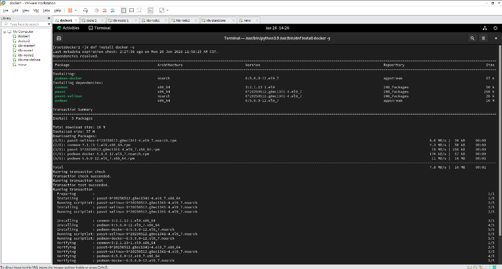

# LAB 02 安裝 DOCKER/DOCKER-CE

## 學習目標

完成本 Lab 後，你將能夠：

- [ ] 理解 RHEL/Rocky Linux 預設 `docker` 指令的行為 (Podman Emulation)
- [ ] 移除預設的 `podman-docker` 套件
- [ ] 設定 Docker CE 官方 Repository
- [ ] 安裝並啟動 Docker CE (Community Edition)
- [ ] 使用 `docker pull` 下載 Image 並備份

---

## 實作步驟

### 步驟 1：觀察預設的 Docker 套件 (Podman)

在 RHEL 9 / Rocky Linux 9 中，官方預設的 `docker` 指令其實是 `podman` 的模擬器。

1.  **安裝預設 docker 套件**
    ```bash
    dnf install docker -y
    ```
    

2.  **檢查 docker 指令來源**
    ```bash
    ls -l /usr/bin/docker
    file /usr/bin/docker
    cat /usr/bin/docker
    ```
    > 你會發現 `/usr/bin/docker` 其實是一個 Shell Script，內容是執行 `/usr/bin/podman`。
    > ```bash
    > exec /usr/bin/podman "$@"
    > ```

3.  **嘗試啟動 Docker 服務**
    ```bash
    systemctl start docker
    ```
    > ❌ **失敗**：因為根本沒有安裝真正的 Docker Daemon，顯示 `Unit docker.service not found`。

4.  **檢查版本**
    ```bash
    docker version
    ```
    > 輸出顯示 `Client: Podman Engine`，並提示 `Emulate Docker CLI using podman`。

---

### 步驟 2：移除 Podman-Docker 並安裝 Docker CE

為了使用原生的 Docker Engine，我們需要移除模擬套件並安裝官方版本。

1.  **移除預設套件**
    ```bash
    dnf remove docker -y
    ```
    > 這會移除 `podman-docker` 套件。

2.  **新增 Docker CE Repository**
    ```bash
    dnf config-manager --add-repo=https://download.docker.com/linux/centos/docker-ce.repo
    ```
    > 驗證 Repo 是否加入成功：
    > ```bash
    > cat /etc/yum.repos.d/docker-ce.repo
    > ```

3.  **安裝 Docker CE**
    ```bash
    dnf install docker-ce -y
    ```
    > 安裝過程中會下載 `docker-ce`, `docker-ce-cli`, `containerd.io` 等套件。

---

### 步驟 3：啟動 Docker 服務

安裝完成後，真正的 Docker Daemon (`dockerd`) 就已經就緒了。

1.  **啟動並設定開機自動啟動**
    ```bash
    systemctl start docker
    systemctl enable docker
    ```

2.  **檢查服務狀態**
    ```bash
    systemctl status docker
    ```
    > ✅ 應顯示 `Active: active (running)`。

3.  **檢查版本**
    ```bash
    docker version
    ```
    > 現在應該顯示 `Client: Docker Engine - Community` 和 `Server: Docker Engine - Community`。

---

### 步驟 4：下載與管理 Container Image

1.  **下載映像檔**
    ```bash
    docker pull rockylinux:9
    ```

2.  **查看映像檔列表**
    ```bash
    docker images
    ```

3.  **查看映像檔歷史**
    ```bash
    docker history rockylinux:9
    ```

4.  **備份映像檔 (Docker Save)**
    將映像檔匯出為 tar 檔案。
    ```bash
    docker save --output=/root/rockylinux-9.tar rockylinux:9
    ls -lh /root/rockylinux-9.tar
    ```

---

## 小結

在本 Lab 中，我們發現 Linux 發行版可能會用 Podman 來模擬 Docker。若要使用標準 Docker Engine，必須手動設定 Docker 官方 Repository 並安裝 `docker-ce`。
