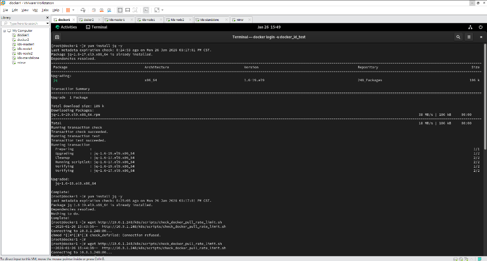

# LAB 04 如何檢查 Docker Hub Rate Limiting

## 學習目標

完成本 Lab 後，你將能夠：

- [ ] 理解 Docker Hub 的下載限制 (Rate Limiting)
- [ ] 使用 `curl` 與 `jq` 指令檢查當前的 Rate Limit 狀態
- [ ] 比較匿名使用者與免費帳號 (Free Account) 的限制差異

---

## 1.1 什麼是 Docker Hub Rate Limiting？

Docker Hub 為了防止資源濫用，對 Container Image 的 `pull` (下載) 次數進行了限制：

| 帳號類型 | 限制內容 |
|----------|----------|
| **匿名使用者 (Anonymous)** | 每 6 小時 **100** 次 pull (以 IP 為準) |
| **免費帳號 (Free Account)** | 每 6 小時 **200** 次 pull (以帳號為準) |
| **Pro / Team / Business** | **5000** 次 (每日) 或 無限制 |

當你遇到 `Before you can look around... 429 Too Many Requests` 錯誤時，通常就是被限流了。

---

## 實作步驟

### 步驟 1：安裝必要工具 jq

為了方便解析 Docker Hub API 回傳的 JSON 格式 Token，我們需要安裝 `jq` 工具。

1.  **安裝 jq**
    ```bash
    yum install jq -y
    ```
    > **指令說明**：`jq` 是一個輕量級且靈活的 command-line JSON 處理器。

    

---

### 步驟 2：下載檢查腳本

我們使用一段 Shell Script 來簡化檢查流程。這個 Script 會向 Docker Hub 申請 Token 並查詢 Header 資訊。

1.  **下載 Script** (假設課堂環境提供)
    ```bash
    # 使用 wget 下載腳本
    wget http://10.0.1.248/k8s/scripts/check_docker_pull_rate_limit.sh
    
    # 若上述連結無法連線 (Connection refused)，請嘗試備用位置
    wget http://10.0.1.249/k8s/scripts/check_docker_pull_rate_limit.sh
    ```

2.  **賦予執行權限**
    ```bash
    chmod 755 check_docker_pull_rate_limit.sh
    ```

---

### 步驟 3：檢查匿名使用者限制 (Anonymous)

1.  **執行 Script**
    ```bash
    ./check_docker_pull_rate_limit.sh
    ```

2.  **觀察輸出結果**
    ```yaml
    ratelimit-limit: 100;w=21600
    ratelimit-remaining: 58;w=21600
    docker-ratelimit-source: 118.163.116.129
    ```
    > **輸出解析**：
    > - `ratelimit-limit: 100;w=21600`: 限制為每 21600 秒 (6小時) **100** 次。
    > - `ratelimit-remaining: 58`: 目前剩餘 **58** 次額度。
    > - `docker-ratelimit-source`: 識別來源 IP。

---

### 步驟 4：檢查免費帳號限制 (Free Account)

若要獲得更高的額度，可以登入 Docker Hub 帳號。

1.  **修改 Script 加入認證資訊**
    編輯 `check_docker_pull_rate_limit.sh`，將你的 Docker Hub 帳號密碼填入變數 (或是透過 `docker login` 後修改 Script 以使用 Token)。
    
    *假設 Script 支援以變數方式帶入帳密：*
    ```bash
    # 編輯腳本填入 USER="你的帳號" PASSWORD="你的密碼"
    vi check_docker_pull_rate_limit.sh
    ```

    !!! tip "手動檢查指令 (參考)"
        如果沒有 Script，你也可以用以下指令手動檢查 (記得替換帳密)：
        ```bash
        # 1. 取得 Token
        TOKEN=$(curl -s -u "你的帳號:你的密碼" "https://auth.docker.io/token?service=registry.docker.io&scope=repository:ratelimitpreview/test:pull" | jq -r .token)
        
        # 2. 查詢 Header
        curl --head -H "Authorization: Bearer $TOKEN" https://registry-1.docker.io/v2/ratelimitpreview/test/manifests/latest
        ```

2.  **再次執行 Script**
    ```bash
    ./check_docker_pull_rate_limit.sh
    ```

3.  **預期結果**
    ```yaml
    ratelimit-limit: 200;w=21600   <-- 額度變為 200
    ratelimit-remaining: 198;w=21600
    docker-ratelimit-source: [你的帳號UUID]
    ```
    > 登入後，`ratelimit-source` 通常會變成你的 User ID，且額度會提升至 **200** 次。

---

## 小結

- **匿名下載**：方便但限制嚴格 (100次/6hr)，多台機器共用 Public IP 時容易被鎖。
- **登入下載**：建議在 Server 上透過 `docker login` 登入，可將額度提升至 (200次/6hr)，或購買 Pro 方案解除限制。
