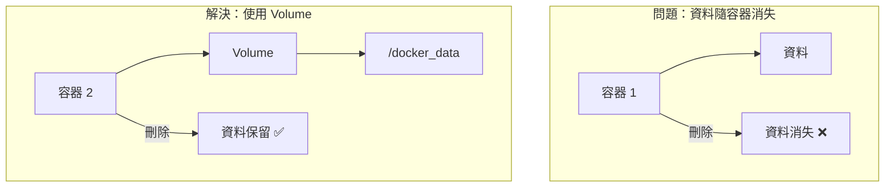

# LAB 07 Persistent Storage

## 學習目標

完成本章節後，你將能夠：

- [ ] 理解 Docker Volume 的用途
- [ ] 使用 `-v` 參數掛載目錄
- [ ] 使用 Docker Volume 管理資料持久化
- [ ] 實作 MariaDB 資料持久化

## 前置知識

開始之前，請確保你已經：

- 完成 LAB 06 Docker 基本操作
- 熟悉 `docker run` 指令
- 準備好 docker2 虛擬機環境

---

## 核心概念說明

### 為什麼需要 Persistent Storage？

Docker 容器是「無狀態」的，當容器被刪除時，容器內的所有資料也會一併消失。對於資料庫這類需要持久化資料的應用，我們需要使用 **Volume** 來保存資料。



### Volume 類型

| 類型 | 說明 | 範例 |
|------|------|------|
| **Bind Mount** | 掛載主機目錄 | `-v /host/path:/container/path` |
| **Named Volume** | Docker 管理的 Volume | `-v myvolume:/container/path` |
| **Anonymous Volume** | 自動建立的 Volume | 映像檔中 VOLUME 指令定義 |

---

## Lab 實作練習

!!! note "操作環境"
    本 Lab 在 **docker2** 虛擬機上執行。

---

### 步驟 1：準備主機目錄

在主機上建立用於存放資料庫資料的目錄：

```bash title="建立資料目錄"
mkdir -p /docker_data/db1
```

```bash title="確認目錄"
ls -l /docker_data/
```

**預期結果**：

```
total 0
drwxr-xr-x 2 root root 6 Feb  4 12:22 db1
```

---

### 步驟 2：啟動 MariaDB 並掛載 Volume

使用 `-v` 參數將主機目錄掛載到容器內：

```bash title="下載 MariaDB 映像檔"
docker pull docker1.training.lab:5000/mariadb
```

```bash title="啟動 MariaDB 並掛載 Volume"
docker run -itd \
  --name db1 \
  -p 3306:3306 \
  -v /docker_data/db1:/var/lib/mysql \
  -e MYSQL_ROOT_PASSWORD=container \
  docker1.training.lab:5000/mariadb
```

**參數說明**：

| 參數 | 說明 |
|------|------|
| `-p 3306:3306` | 將主機 3306 埠對應到容器 3306 埠 |
| `-v /docker_data/db1:/var/lib/mysql` | 掛載主機目錄到容器的 MySQL 資料目錄 |
| `-e MYSQL_ROOT_PASSWORD=container` | 設定 root 密碼 |

---

### 步驟 3：確認資料已寫入主機目錄

等待容器啟動完成後，檢查主機目錄：

```bash title="檢查資料目錄"
ls -l /docker_data/db1/
```

**預期結果**：

```
total 122928
-rw-rw---- 1 systemd-coredump root    417792 Feb  4 12:24 aria_log.00000001
-rw-rw---- 1 systemd-coredump root        52 Feb  4 12:24 aria_log_control
-rw-rw---- 1 systemd-coredump root         0 Feb  4 12:24 multi-master.info
drwx------ 2 systemd-coredump root      4096 Feb  4 12:24 mysql
drwx------ 2 systemd-coredump root        20 Feb  4 12:24 performance_schema
...
```

!!! success "資料持久化成功"
    看到這些檔案表示 MariaDB 的資料已經寫入到主機的 `/docker_data/db1` 目錄中！

---

### 步驟 4：驗證資料持久化

建立測試資料庫：

```bash title="連線到 MariaDB"
docker exec -it db1 mysql -u root -pcontainer
```

```sql title="建立測試資料庫"
CREATE DATABASE testdb;
SHOW DATABASES;
EXIT;
```

**預期結果**：

```
+--------------------+
| Database           |
+--------------------+
| information_schema |
| mysql              |
| performance_schema |
| testdb             |
+--------------------+
```

---

### 步驟 5：刪除容器並重新建立

刪除容器：

```bash title="停止並刪除容器"
docker stop db1
docker rm db1
```

重新建立容器（使用相同的 Volume）：

```bash title="重新建立容器"
docker run -itd \
  --name db1 \
  -p 3306:3306 \
  -v /docker_data/db1:/var/lib/mysql \
  -e MYSQL_ROOT_PASSWORD=container \
  docker1.training.lab:5000/mariadb
```

驗證資料是否保留：

```bash title="確認資料庫仍然存在"
docker exec -it db1 mysql -u root -pcontainer -e "SHOW DATABASES;"
```

**預期結果**：

```
+--------------------+
| Database           |
+--------------------+
| information_schema |
| mysql              |
| performance_schema |
| testdb             |   <-- 資料保留！
+--------------------+
```

!!! success "資料持久化驗證成功"
    即使容器被刪除重建，資料仍然保留！

---

### 步驟 6：查看 Docker Volume

使用 `docker volume` 指令管理 Volume：

```bash title="列出所有 Volume"
docker volume ls
```

```bash title="檢查容器的 Volume 掛載"
docker inspect db1 | grep -A 10 Mounts
```

**預期結果**：

```json
"Mounts": [
    {
        "Type": "bind",
        "Source": "/docker_data/db1",
        "Destination": "/var/lib/mysql",
        "Mode": "",
        "RW": true,
        "Propagation": "rprivate"
    }
],
```

---

### 步驟 7：使用 Named Volume

除了 Bind Mount，也可以使用 Docker 管理的 Named Volume：

```bash title="建立 Named Volume"
docker volume create mydata
```

```bash title="使用 Named Volume"
docker run -itd \
  --name db2 \
  -v mydata:/var/lib/mysql \
  -e MYSQL_ROOT_PASSWORD=container \
  docker1.training.lab:5000/mariadb
```

```bash title="查看 Volume 詳細資訊"
docker volume inspect mydata
```

**預期結果**：

```json
[
    {
        "CreatedAt": "2025-02-04T12:30:00+08:00",
        "Driver": "local",
        "Labels": {},
        "Mountpoint": "/var/lib/docker/volumes/mydata/_data",
        "Name": "mydata",
        "Options": {},
        "Scope": "local"
    }
]
```

---

## Bind Mount vs Named Volume

| 特性 | Bind Mount | Named Volume |
|------|------------|--------------|
| 路徑指定 | 必須指定完整路徑 | 只需指定名稱 |
| 資料位置 | 自訂路徑 | `/var/lib/docker/volumes/` |
| 備份方便性 | 較方便 | 需透過 Docker 指令 |
| 適用場景 | 開發環境、需要直接存取 | 生產環境、資料隔離 |

---

## 清理資源

```bash title="清理容器和 Volume"
docker stop db1 db2
docker rm db1 db2
docker volume rm mydata
```

---

## 常見問題

??? question "Q1：掛載目錄後容器內看不到資料"
    **原因**：容器內原有的資料被主機空目錄覆蓋
    
    **解決方案**：
    確保主機目錄是空的，讓容器初始化資料

??? question "Q2：權限問題導致無法寫入"
    **原因**：主機目錄權限不足
    
    **解決方案**：
    ```bash
    chmod 777 /docker_data/db1
    ```

??? question "Q3：Volume 佔用空間如何清理"
    **解決方案**：
    ```bash
    # 刪除未使用的 Volume
    docker volume prune
    ```

---

## 小結

本章節重點回顧：

- ✅ **Bind Mount**：使用 `-v /host/path:/container/path` 掛載主機目錄
- ✅ **Named Volume**：使用 `docker volume create` 建立管理型 Volume
- ✅ **資料持久化**：容器刪除後資料仍保留在 Volume 中
- ✅ **Volume 管理**：使用 `docker volume ls/inspect/rm/prune` 管理

## 延伸閱讀

- [Docker Volume 官方文件](https://docs.docker.com/storage/volumes/)
- [Bind Mounts 官方文件](https://docs.docker.com/storage/bind-mounts/)
