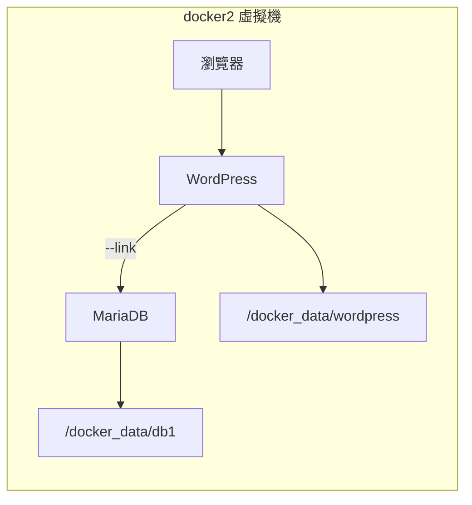

# LAB 08 架設部落格 - WordPress

## 學習目標

完成本章節後，你將能夠：

- [ ] 使用 `--link` 連接多個容器
- [ ] 部署 WordPress + MariaDB 架構
- [ ] 設定 WordPress 環境變數
- [ ] 完成 WordPress 初始化設定

## 前置知識

開始之前，請確保你已經：

- 完成 LAB 07 Persistent Storage
- 熟悉 Docker Volume 掛載
- 準備好 docker2 虛擬機環境

---

## 核心概念說明

### WordPress 架構

WordPress 是一個開源的部落格/CMS 系統，需要搭配資料庫使用。本 Lab 將部署：



### 容器間通訊

使用 `--link` 可以讓容器之間透過名稱互相存取：

| 參數 | 說明 |
|------|------|
| `--link db1:mysql` | 連接到 db1 容器，並建立別名 mysql |

連接後，WordPress 容器可以透過 `mysql` 這個名稱存取 MariaDB。

---

## Lab 實作練習

!!! note "操作環境"
    本 Lab 在 **docker2** 虛擬機上執行。

---

### 步驟 1：準備資料目錄

建立 WordPress 和資料庫的資料目錄：

```bash title="建立資料目錄"
mkdir -p /docker_data/db1
mkdir -p /docker_data/wordpress
```

```bash title="確認目錄"
ls -l /docker_data/
```

**預期結果**：

```
total 4
drwxr-xr-x 4 systemd-coredump root 4096 Feb  4 12:24 db1
drwxr-xr-x 2 root             root    6 Feb  4 12:25 wordpress
```

---

### 步驟 2：啟動 MariaDB 資料庫

首先啟動資料庫容器：

```bash title="下載 MariaDB"
docker pull docker1.training.lab:5000/mariadb
```

```bash title="啟動 MariaDB"
docker run -itd \
  --name db1 \
  -p 3306:3306 \
  -v /docker_data/db1:/var/lib/mysql \
  -e MYSQL_ROOT_PASSWORD=container \
  docker1.training.lab:5000/mariadb
```

驗證資料庫啟動：

```bash title="檢查容器狀態"
docker ps
```

```bash title="查看日誌確認啟動完成"
docker logs db1
```

!!! tip "等待資料庫初始化"
    首次啟動 MariaDB 需要一些時間初始化，請等待看到 `ready for connections` 訊息後再繼續。

---

### 步驟 3：啟動 WordPress

下載並啟動 WordPress 容器：

```bash title="下載 WordPress"
docker pull docker1.training.lab:5000/wordpress
```

```bash title="啟動 WordPress"
docker run -itd \
  --name wordpress \
  -p 80:80 \
  --link db1:mysql \
  -v /docker_data/wordpress:/var/www/html \
  -e WORDPRESS_DB_NAME=wp \
  -e WORDPRESS_DB_USER=root \
  -e WORDPRESS_DB_PASSWORD=container \
  -e ServerName=localhost \
  docker1.training.lab:5000/wordpress
```

**參數說明**：

| 參數 | 說明 |
|------|------|
| `-p 80:80` | 將主機 80 埠對應到容器 80 埠 |
| `--link db1:mysql` | 連接到 db1 容器，別名為 mysql |
| `-v /docker_data/wordpress:/var/www/html` | 掛載 WordPress 檔案目錄 |
| `WORDPRESS_DB_NAME=wp` | WordPress 使用的資料庫名稱 |
| `WORDPRESS_DB_USER=root` | 資料庫使用者 |
| `WORDPRESS_DB_PASSWORD=container` | 資料庫密碼 |

---

### 步驟 4：驗證部署

檢查兩個容器都在運行：

```bash title="檢查容器狀態"
docker ps
```

**預期結果**：

```
CONTAINER ID   IMAGE                                   COMMAND                  STATUS         PORTS                 NAMES
36aa6bc3480c   docker1.training.lab:5000/wordpress    "docker-entrypoint.s…"   Up 10 seconds  0.0.0.0:80->80/tcp    wordpress
45f821b7df69   docker1.training.lab:5000/mariadb      "docker-entrypoint.s…"   Up 2 minutes   0.0.0.0:3306->3306/tcp db1
```

檢查 WordPress 檔案是否已建立：

```bash title="檢查 WordPress 目錄"
ls -l /docker_data/wordpress/
```

**預期結果**：

```
total 236
-rw-r--r--  1 www-data www-data   405 Feb  6  2020 index.php
-rw-r--r--  1 www-data www-data 19915 Jan  1  2020 license.txt
-rw-r--r--  1 www-data www-data  7278 Jun 26  2020 readme.html
-rw-r--r--  1 www-data www-data  7101 Jul 28  2020 wp-activate.php
drwxr-xr-x  9 www-data www-data  4096 Dec  8  2020 wp-admin
...
```

---

### 步驟 5：開啟 WordPress 網頁

在圖形環境中開啟瀏覽器，連線到 docker2：

```
http://192.168.66.22
```

或在本機：

```
http://localhost
```

你會看到 WordPress 安裝頁面！

---

### 步驟 6：完成 WordPress 安裝

1. 選擇語言（繁體中文）
2. 填寫網站資訊：
   - **網站標題**：My Blog
   - **使用者名稱**：admin
   - **密碼**：設定你的密碼
   - **電子郵件**：your@email.com
3. 點選「安裝 WordPress」

!!! success "安裝完成"
    看到「成功！」訊息表示 WordPress 已安裝完成！

---

### 步驟 7：驗證資料持久化

刪除並重建 WordPress 容器：

```bash title="刪除 WordPress 容器"
docker stop wordpress
docker rm wordpress
```

重新建立（使用相同的 Volume）：

```bash title="重新建立 WordPress"
docker run -itd \
  --name wordpress \
  -p 80:80 \
  --link db1:mysql \
  -v /docker_data/wordpress:/var/www/html \
  -e WORDPRESS_DB_NAME=wp \
  -e WORDPRESS_DB_USER=root \
  -e WORDPRESS_DB_PASSWORD=container \
  docker1.training.lab:5000/wordpress
```

重新開啟瀏覽器，你的 WordPress 網站和所有設定都還在！

---

## 架構總覽

| 容器 | 映像檔 | Port | Volume | 說明 |
|------|--------|------|--------|------|
| db1 | mariadb | 3306 | /docker_data/db1 | 資料庫 |
| wordpress | wordpress | 80 | /docker_data/wordpress | 網頁伺服器 |

---

## 清理資源

```bash title="停止並刪除容器"
docker stop wordpress db1
docker rm wordpress db1
```

如需清除資料：

```bash title="清除資料目錄"
rm -rf /docker_data/db1/*
rm -rf /docker_data/wordpress/*
```

---

## 常見問題

??? question "Q1：WordPress 顯示無法連接資料庫"
    **原因**：MariaDB 尚未啟動完成，或 --link 設定錯誤
    
    **解決方案**：
    1. 確認 db1 容器已啟動：`docker ps`
    2. 確認 --link 參數正確：`--link db1:mysql`
    3. 等待 MariaDB 初始化完成後再啟動 WordPress

??? question "Q2：無法連線到 80 埠"
    **原因**：防火牆阻擋或 WordPress 容器未啟動
    
    **解決方案**：
    ```bash
    # 確認容器運行中
    docker ps
    
    # 確認埠對應
    docker port wordpress
    ```

??? question "Q3：WordPress 安裝後資料消失"
    **原因**：沒有使用 Volume 掛載
    
    **解決方案**：
    確保使用 `-v /docker_data/wordpress:/var/www/html` 參數

---

## 小結

本章節重點回顧：

- ✅ **--link**：連接容器，讓 WordPress 可以存取 MariaDB
- ✅ **多容器架構**：分離應用程式和資料庫
- ✅ **環境變數**：透過 `-e` 設定 WordPress 資料庫連線資訊
- ✅ **資料持久化**：使用 Volume 保存 WordPress 檔案和資料庫

## 延伸閱讀

- [WordPress Docker Hub](https://hub.docker.com/_/wordpress)
- [MariaDB Docker Hub](https://hub.docker.com/_/mariadb)
- [Docker Compose 簡化多容器部署](https://docs.docker.com/compose/)
