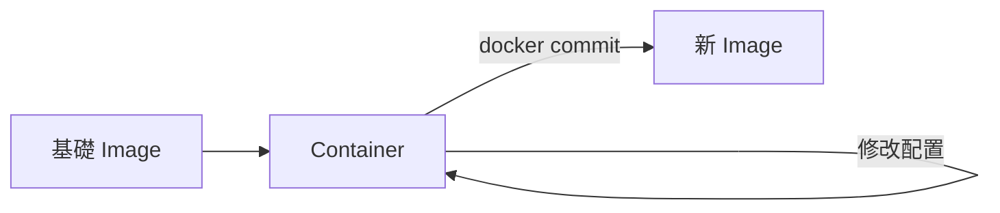
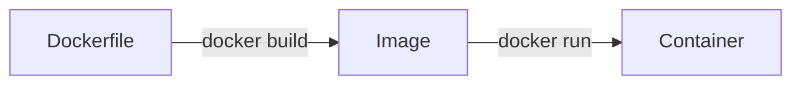
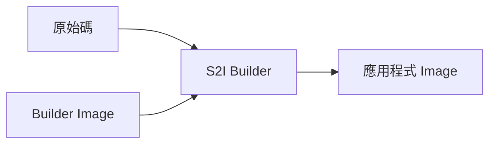
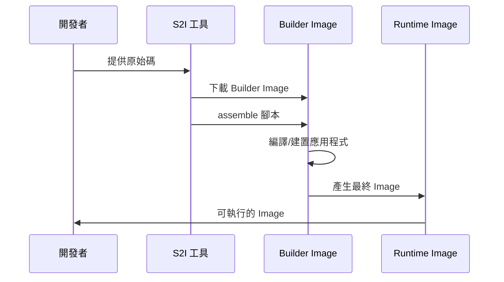

# LAB 09 客製化 Container Images - docker commit

## 學習目標

完成本章節後，你將能夠：

- [ ] 使用 `docker commit` 從容器建立 Image
- [ ] 撰寫 Dockerfile 建立客製化 Image
- [ ] 理解 Dockerfile 指令與最佳實踐
- [ ] 優化 Image 大小與建置效率
- [ ] 了解 Source-to-Image（S2I）的概念與用途

## 前置知識

開始之前，請確保你已經：

- 完成第 1、2 章的內容
- 熟悉 Docker 基本操作
- 具備基本的 Linux 指令操作能力

---

## 3.1 Docker Commit

### 什麼是 Docker Commit？

`docker commit` 是將執行中的 Container 狀態儲存為新 Image 的指令。這是建立客製化 Image 的簡易方式。



### 使用時機

!!! note "適用場景"
    - 快速測試與原型開發
    - 保存除錯後的修改
    - 臨時產生一次性 Image

!!! warning "不建議用於生產環境"
    - 無法追蹤變更歷史
    - 不具備可重現性
    - 建議使用 Dockerfile 替代

### 實作步驟

```bash title="步驟 1：啟動基礎容器"
# 啟動 Ubuntu 容器
docker run -it --name my-ubuntu ubuntu:22.04 /bin/bash
```

```bash title="步驟 2：在容器內進行修改"
# 在容器內執行（Container 內部）
apt-get update
apt-get install -y nginx vim curl
echo "Custom Nginx Image" > /var/www/html/index.html
exit
```

```bash title="步驟 3：建立新 Image"
# 從容器建立 Image
docker commit my-ubuntu my-nginx:v1

# 加上作者與訊息
docker commit -a "Your Name" -m "Added nginx and custom page" my-ubuntu my-nginx:v1
```

```bash title="步驟 4：驗證新 Image"
# 檢視 Image
docker images | grep my-nginx

# 檢視 Image 歷史
docker history my-nginx:v1

# 使用新 Image 啟動容器
docker run -d -p 8080:80 my-nginx:v1 nginx -g "daemon off;"

# 測試
curl http://localhost:8080
```

### docker commit 選項

| 選項 | 說明 | 範例 |
|------|------|------|
| `-a` | 指定作者 | `-a "John Doe"` |
| `-m` | 提交訊息 | `-m "Added nginx"` |
| `-c` | 套用 Dockerfile 指令 | `-c 'CMD ["nginx"]'` |
| `-p` | 提交前暫停容器 | `-p` |

---

## 3.2 Dockerfile

### 什麼是 Dockerfile？

Dockerfile 是一個文字檔，包含一系列指令來定義如何建立 Docker Image。它提供了可追蹤、可重現的 Image 建置流程。



### Dockerfile 基本結構

```dockerfile title="基本 Dockerfile 範例"
# 基礎映像
FROM ubuntu:22.04

# 維護者資訊（已棄用，建議用 LABEL）
LABEL maintainer="your-email@example.com"

# 設定環境變數
ENV APP_HOME=/app

# 執行指令
RUN apt-get update && apt-get install -y nginx

# 複製檔案
COPY ./src /app

# 設定工作目錄
WORKDIR /app

# 開放 Port
EXPOSE 80

# 啟動指令
CMD ["nginx", "-g", "daemon off;"]
```

### Dockerfile 指令詳解

#### FROM - 基礎映像

```dockerfile title="FROM 指令"
# 使用官方 Image
FROM nginx:1.25

# 使用 Alpine 輕量版本
FROM python:3.12-alpine

# 多階段建置
FROM node:18 AS builder
FROM nginx:alpine AS production
```

!!! tip "選擇基礎映像的建議"
    - **Alpine**：最小化映像，適合生產環境
    - **Slim**：精簡版，平衡大小與功能
    - **完整版**：開發環境，功能完整

#### RUN - 執行指令

```dockerfile title="RUN 指令"
# Shell 格式
RUN apt-get update && apt-get install -y nginx

# Exec 格式
RUN ["apt-get", "install", "-y", "nginx"]

# 多個指令合併（減少 Layer）
RUN apt-get update \
    && apt-get install -y \
        nginx \
        vim \
        curl \
    && rm -rf /var/lib/apt/lists/*
```

!!! warning "RUN 最佳實踐"
    - 合併多個 RUN 指令減少 Layer 數量
    - 清理 apt cache 減少 Image 大小
    - 將變動頻率低的放前面（利用快取）

#### COPY vs ADD

```dockerfile title="COPY 與 ADD"
# COPY：單純複製檔案
COPY ./src /app
COPY requirements.txt /app/

# ADD：額外支援 URL 和自動解壓縮
ADD https://example.com/file.tar.gz /app/
ADD archive.tar.gz /app/  # 自動解壓縮
```

!!! note "COPY vs ADD 選擇"
    | 特性 | COPY | ADD |
    |------|------|-----|
    | 複製本地檔案 | ✅ | ✅ |
    | 支援 URL | ❌ | ✅ |
    | 自動解壓縮 | ❌ | ✅ |
    | 推薦使用 | ✅ | 特定情況 |
    
    **建議**：除非需要自動解壓縮，否則優先使用 COPY

#### WORKDIR - 工作目錄

```dockerfile title="WORKDIR 指令"
# 設定工作目錄（不存在會自動建立）
WORKDIR /app

# 後續指令都在此目錄執行
COPY . .
RUN npm install
```

#### ENV - 環境變數

```dockerfile title="ENV 指令"
# 單一變數
ENV APP_ENV production

# 多個變數
ENV APP_HOME=/app \
    NODE_ENV=production \
    PORT=3000
```

#### EXPOSE - 暴露 Port

```dockerfile title="EXPOSE 指令"
# 暴露單一 Port
EXPOSE 80

# 暴露多個 Port
EXPOSE 80 443

# 指定協議
EXPOSE 53/udp
```

!!! info "EXPOSE 說明"
    EXPOSE 只是**文件用途**，說明容器監聽的 Port。
    實際對外開放需要在 `docker run` 時使用 `-p` 選項。

#### CMD vs ENTRYPOINT

```dockerfile title="CMD 指令"
# Shell 格式
CMD nginx -g "daemon off;"

# Exec 格式（推薦）
CMD ["nginx", "-g", "daemon off;"]

# 作為 ENTRYPOINT 的預設參數
CMD ["--help"]
```

```dockerfile title="ENTRYPOINT 指令"
# Exec 格式
ENTRYPOINT ["python", "app.py"]

# 結合 CMD 提供預設參數
ENTRYPOINT ["python"]
CMD ["app.py"]
```

!!! note "CMD vs ENTRYPOINT 比較"
    | 比較 | CMD | ENTRYPOINT |
    |------|-----|------------|
    | 覆蓋方式 | `docker run` 直接覆蓋 | 需要 `--entrypoint` |
    | 用途 | 預設指令或參數 | 固定的執行程式 |
    | 組合使用 | 作為 ENTRYPOINT 的參數 | 主要執行程式 |

#### ARG - 建置參數

```dockerfile title="ARG 指令"
# 定義建置時參數
ARG VERSION=1.0
ARG APP_NAME

# 使用參數
ENV APP_VERSION=$VERSION
LABEL app.version=$VERSION

# 建置時傳入參數
# docker build --build-arg VERSION=2.0 .
```

#### VOLUME - 掛載點

```dockerfile title="VOLUME 指令"
# 定義 Volume 掛載點
VOLUME /data
VOLUME ["/data", "/logs"]
```

#### USER - 執行身份

```dockerfile title="USER 指令"
# 建立非 root 使用者
RUN useradd -r -u 1001 appuser

# 切換使用者
USER appuser

# 後續指令以 appuser 身份執行
```

#### HEALTHCHECK - 健康檢查

```dockerfile title="HEALTHCHECK 指令"
# 設定健康檢查
HEALTHCHECK --interval=30s --timeout=3s --start-period=5s --retries=3 \
    CMD curl -f http://localhost/ || exit 1

# 停用健康檢查
HEALTHCHECK NONE
```

### 完整 Dockerfile 範例

#### Python Web 應用程式

```dockerfile title="Dockerfile - Python Flask"
# 基礎映像
FROM python:3.12-slim

# 維護者資訊
LABEL maintainer="developer@example.com"
LABEL version="1.0"

# 設定環境變數
ENV PYTHONDONTWRITEBYTECODE=1 \
    PYTHONUNBUFFERED=1 \
    APP_HOME=/app

# 建立工作目錄
WORKDIR $APP_HOME

# 複製並安裝依賴
COPY requirements.txt .
RUN pip install --no-cache-dir -r requirements.txt

# 複製應用程式
COPY . .

# 建立非 root 使用者
RUN useradd -r -u 1001 appuser && \
    chown -R appuser:appuser $APP_HOME
USER appuser

# 暴露 Port
EXPOSE 5000

# 健康檢查
HEALTHCHECK --interval=30s --timeout=3s \
    CMD curl -f http://localhost:5000/health || exit 1

# 啟動指令
CMD ["python", "app.py"]
```

#### Node.js 應用程式（多階段建置）

```dockerfile title="Dockerfile - Node.js 多階段建置"
# ===== 建置階段 =====
FROM node:18-alpine AS builder

WORKDIR /app

# 複製 package 檔案
COPY package*.json ./

# 安裝依賴
RUN npm ci --only=production

# 複製原始碼
COPY . .

# 建置應用程式
RUN npm run build

# ===== 生產階段 =====
FROM node:18-alpine AS production

WORKDIR /app

# 從建置階段複製需要的檔案
COPY --from=builder /app/node_modules ./node_modules
COPY --from=builder /app/dist ./dist
COPY --from=builder /app/package.json ./

# 建立非 root 使用者
RUN addgroup -g 1001 -S nodejs && \
    adduser -S nextjs -u 1001
USER nextjs

EXPOSE 3000

CMD ["node", "dist/index.js"]
```

### 建置 Image

```bash title="docker build 指令"
# 基本建置
docker build -t my-app:v1 .

# 指定 Dockerfile
docker build -f Dockerfile.prod -t my-app:prod .

# 傳入建置參數
docker build --build-arg VERSION=2.0 -t my-app:v2 .

# 不使用快取
docker build --no-cache -t my-app:v1 .

# 顯示建置過程
docker build --progress=plain -t my-app:v1 .

# 多平台建置
docker buildx build --platform linux/amd64,linux/arm64 -t my-app:v1 .
```

### Dockerfile 最佳實踐

!!! tip "優化建議"
    **1. 減少 Layer 數量**
    ```dockerfile
    # 不好
    RUN apt-get update
    RUN apt-get install -y nginx
    RUN apt-get install -y vim
    
    # 好
    RUN apt-get update && apt-get install -y \
        nginx \
        vim \
        && rm -rf /var/lib/apt/lists/*
    ```
    
    **2. 善用建置快取**
    ```dockerfile
    # 將不常變動的放前面
    COPY package.json .
    RUN npm install
    COPY . .  # 程式碼變動頻繁，放後面
    ```
    
    **3. 使用 .dockerignore**
    ```text title=".dockerignore"
    node_modules
    .git
    .env
    *.log
    Dockerfile
    docker-compose.yml
    ```
    
    **4. 使用多階段建置**
    
    - 分離建置環境與執行環境
    - 大幅減少最終 Image 大小

### .dockerignore 檔案

```text title=".dockerignore"
# 版本控制
.git
.gitignore

# Node.js
node_modules
npm-debug.log

# Python
__pycache__
*.pyc
.venv

# IDE
.idea
.vscode
*.swp

# Docker
Dockerfile*
docker-compose*.yml
.docker

# 其他
*.md
*.log
.env*
```

---

## 3.3 Source-to-Image 簡介

### 什麼是 Source-to-Image？

Source-to-Image（S2I）是 Red Hat 開發的框架，可以將原始碼直接轉換成可執行的 Docker Image，無需手動撰寫 Dockerfile。



### S2I 運作原理



### S2I 優點

| 優點 | 說明 |
|------|------|
| **簡化流程** | 開發者不需要了解 Docker |
| **標準化** | 使用統一的 Builder Image |
| **安全性** | 由平台團隊維護 Builder |
| **快速迭代** | 只需提交程式碼即可建置 |

### S2I 使用場景

!!! info "適用場景"
    - **OpenShift/OKD 平台**：原生支援 S2I
    - **企業標準化**：統一的應用程式建置流程
    - **CI/CD 流程**：自動化建置

### S2I 安裝與使用

```bash title="安裝 S2I"
# macOS
brew install source-to-image

# Linux
curl -L https://github.com/openshift/source-to-image/releases/download/v1.3.8/source-to-image-v1.3.8-linux-amd64.tar.gz | tar xz
mv s2i /usr/local/bin/
```

```bash title="S2I 基本使用"
# 使用 Python Builder 建置
s2i build https://github.com/user/python-app \
    registry.access.redhat.com/ubi8/python-39 \
    my-python-app

# 使用本地原始碼
s2i build ./myapp \
    registry.access.redhat.com/ubi8/nodejs-14 \
    my-node-app

# 執行建置的 Image
docker run -d -p 8080:8080 my-python-app
```

### 常見 Builder Images

| Builder | 說明 | 來源 |
|---------|------|------|
| Python | Python 應用程式 | Red Hat UBI |
| Node.js | Node.js 應用程式 | Red Hat UBI |
| Ruby | Ruby/Rails 應用程式 | Red Hat UBI |
| Java | Java/Maven/Gradle | Red Hat UBI |
| .NET | .NET Core 應用程式 | Red Hat UBI |

### S2I 與 Dockerfile 比較

| 比較項目 | Dockerfile | S2I |
|----------|------------|-----|
| 學習曲線 | 需要學習語法 | 較低 |
| 靈活性 | 高 | 受限於 Builder |
| 標準化 | 需自行維護 | 由 Builder 維護 |
| OpenShift 整合 | 需額外配置 | 原生支援 |
| 適用場景 | 通用 | 特定平台 |

---

## Lab 實作練習

### Lab 3-1：使用 Dockerfile 建立 Nginx 自訂 Image

**目標**：建立一個包含自訂首頁的 Nginx Image

**步驟**：

```bash title="步驟 1：建立專案目錄"
mkdir nginx-custom && cd nginx-custom
```

```html title="步驟 2：建立 index.html"
<!DOCTYPE html>
<html lang="zh-TW">
<head>
    <meta charset="UTF-8">
    <title>DCKA 課程 - 自訂 Nginx</title>
    <style>
        body {
            font-family: 'Noto Sans TC', sans-serif;
            display: flex;
            justify-content: center;
            align-items: center;
            height: 100vh;
            margin: 0;
            background: linear-gradient(135deg, #667eea 0%, #764ba2 100%);
            color: white;
        }
        .container {
            text-align: center;
            padding: 2rem;
            background: rgba(255,255,255,0.1);
            border-radius: 10px;
        }
        h1 { margin-bottom: 0.5rem; }
    </style>
</head>
<body>
    <div class="container">
        <h1>🐳 Docker 自訂 Image</h1>
        <p>恭喜你成功建立自訂的 Nginx Image！</p>
        <p>建置時間：<span id="time"></span></p>
    </div>
    <script>
        document.getElementById('time').textContent = new Date().toLocaleString('zh-TW');
    </script>
</body>
</html>
```

```dockerfile title="步驟 3：建立 Dockerfile"
FROM nginx:alpine

LABEL maintainer="student@dcka.course"
LABEL description="Custom Nginx for DCKA course"

# 複製自訂首頁
COPY index.html /usr/share/nginx/html/

# 暴露 Port
EXPOSE 80

# 健康檢查
HEALTHCHECK --interval=30s --timeout=3s \
    CMD wget --quiet --tries=1 --spider http://localhost/ || exit 1
```

```bash title="步驟 4：建立 .dockerignore"
echo -e "Dockerfile\n.git\n*.md" > .dockerignore
```

```bash title="步驟 5：建置 Image"
docker build -t my-nginx:v1 .
```

```bash title="步驟 6：執行並驗證"
# 啟動容器
docker run -d --name my-nginx-test -p 8080:80 my-nginx:v1

# 檢查狀態
docker ps

# 測試存取
curl http://localhost:8080

# 檢查健康狀態
docker inspect --format='{{.State.Health.Status}}' my-nginx-test
```

```bash title="步驟 7：清理"
docker stop my-nginx-test
docker rm my-nginx-test
```

### Lab 3-2：多階段建置 - Go 應用程式

**目標**：使用多階段建置優化 Image 大小

```bash title="步驟 1：建立專案"
mkdir go-app && cd go-app
```

```go title="步驟 2：建立 main.go"
package main

import (
    "fmt"
    "net/http"
    "os"
    "time"
)

func main() {
    http.HandleFunc("/", func(w http.ResponseWriter, r *http.Request) {
        hostname, _ := os.Hostname()
        fmt.Fprintf(w, "Hello from Go! Hostname: %s, Time: %s\n", 
            hostname, time.Now().Format(time.RFC3339))
    })
    
    http.HandleFunc("/health", func(w http.ResponseWriter, r *http.Request) {
        w.WriteHeader(http.StatusOK)
        fmt.Fprintln(w, "OK")
    })
    
    fmt.Println("Server starting on port 8080...")
    http.ListenAndServe(":8080", nil)
}
```

```dockerfile title="步驟 3：建立多階段 Dockerfile"
# ===== 建置階段 =====
FROM golang:1.21-alpine AS builder

WORKDIR /app

# 複製原始碼
COPY main.go .

# 編譯（靜態連結）
RUN CGO_ENABLED=0 GOOS=linux go build -a -installsuffix cgo -o app .

# ===== 生產階段 =====
FROM scratch

# 從建置階段複製執行檔
COPY --from=builder /app/app /app

EXPOSE 8080

ENTRYPOINT ["/app"]
```

```bash title="步驟 4：建置並比較大小"
# 建置多階段 Image
docker build -t go-app:multi .

# 建置單階段 Image（比較用）
docker build -f Dockerfile.single -t go-app:single .

# 比較大小
docker images | grep go-app
```

**預期結果**：

```
go-app    multi    xxxxx    xxx MB ago    ~10 MB
go-app    single   xxxxx    xxx MB ago    ~300 MB
```

---

## 常見問題

??? question "Q1：Dockerfile 建置時出現 'no such file or directory' 錯誤"
    **可能原因**：
    
    1. 路徑錯誤
    2. 檔案被 .dockerignore 排除
    3. 使用相對路徑但 WORKDIR 不正確
    
    **解決方案**：
    ```bash
    # 檢查建置上下文
    docker build --progress=plain -t test .
    
    # 確認 .dockerignore 內容
    cat .dockerignore
    ```

??? question "Q2：如何減少 Image 大小？"
    **解決方案**：
    
    1. 使用 Alpine 基礎映像
    2. 多階段建置
    3. 合併 RUN 指令
    4. 清理不必要的檔案
    5. 使用 .dockerignore
    
    ```dockerfile
    # 清理 apt cache
    RUN apt-get update && apt-get install -y \
        package1 \
        && rm -rf /var/lib/apt/lists/*
    ```

??? question "Q3：COPY 和 ADD 有什麼區別？"
    **解答**：
    
    - `COPY`：單純複製檔案，推薦一般情況使用
    - `ADD`：額外支援 URL 下載和自動解壓縮 tar 檔
    
    **建議**：除非需要自動解壓縮，否則優先使用 `COPY`

??? question "Q4：如何查看 Image 的各層大小？"
    **解決方案**：
    ```bash
    # 使用 docker history
    docker history --no-trunc my-image:tag
    
    # 使用 dive 工具（推薦）
    # 安裝：brew install dive 或 apt install dive
    dive my-image:tag
    ```

??? question "Q5：CMD 和 ENTRYPOINT 如何選擇？"
    **解答**：
    
    - 使用 `ENTRYPOINT` 設定固定的執行程式
    - 使用 `CMD` 提供可覆蓋的預設參數
    
    ```dockerfile
    # 範例：固定執行 python，可變更參數
    ENTRYPOINT ["python"]
    CMD ["app.py"]
    
    # 使用者可以：docker run my-image script.py
    ```

---

## 小結

本章節重點回顧：

- ✅ **docker commit**：快速從容器建立 Image，適合測試但不建議用於生產
- ✅ **Dockerfile 核心指令**：FROM、RUN、COPY、WORKDIR、ENV、EXPOSE、CMD、ENTRYPOINT
- ✅ **多階段建置**：分離建置與執行環境，大幅減少 Image 大小
- ✅ **最佳實踐**：減少 Layer、善用快取、使用 .dockerignore、非 root 使用者
- ✅ **Source-to-Image**：Red Hat 的自動化建置框架，適合 OpenShift 環境

## 延伸閱讀

- [Dockerfile 官方參考](https://docs.docker.com/engine/reference/builder/)
- [Docker 建置最佳實踐](https://docs.docker.com/develop/develop-images/dockerfile_best-practices/)
- [多階段建置說明](https://docs.docker.com/build/building/multi-stage/)
- [Source-to-Image GitHub](https://github.com/openshift/source-to-image)
- [Dive - Image 分析工具](https://github.com/wagoodman/dive)
