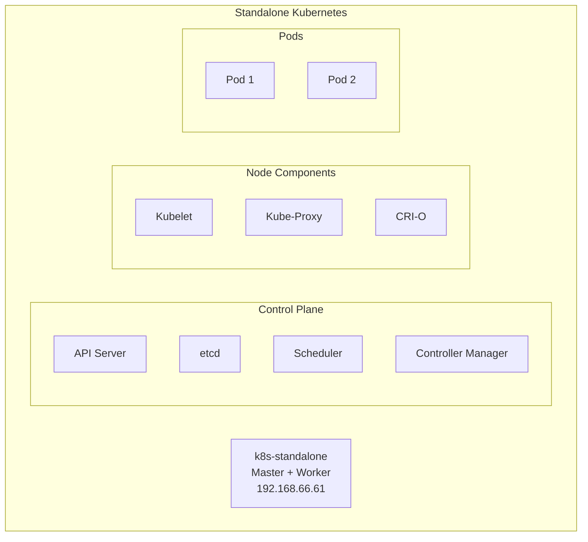

---
authors:
  - name: 課程作者
    email: author@example.com
date: 2026-01-27
updated: 2026-01-27
tags:
  - Kubernetes
  - Installation
  - Standalone
---

# LAB 11 Standalone Kubernetes 安裝

## 學習目標

完成本章節後，你將能夠：

- [ ] 使用 Shell Script 自動化安裝 Kubernetes
- [ ] 了解 Standalone Kubernetes 的架構
- [ ] 監控 Kubernetes 叢集狀態
- [ ] 在 Standalone Master 節點上部署 Pod
- [ ] 建立虛擬機快照保留狀態

## 前置知識

開始之前，請確保你已經：

- 完成 Docker 相關章節
- 了解基本的 Linux 指令操作
- 了解容器化的基本概念

---

## 11.1 環境說明

### 什麼是 Standalone Kubernetes？

Standalone Kubernetes 是一個單節點的 Kubernetes 叢集，Master 節點同時也作為 Worker 節點使用。這種架構適合：

- 學習與測試環境
- 開發環境
- 小型專案



### 虛擬機資訊

| 項目 | 值 |
|------|------|
| 主機名稱 | k8s-standalone.training.lab |
| IP 位址 | 192.168.66.61 |
| 作業系統 | Rocky Linux 9 |
| Kubernetes 版本 | 1.32 |

---

## 11.2 切換到 k8s-standalone 虛擬機

### 確認網路設定

```bash title="檢視網路介面"
ifconfig ens160
```

**預期結果**：

```
ens160: flags=4163<UP,BROADCAST,RUNNING,MULTICAST>  mtu 1500
        inet 192.168.66.61  netmask 255.255.255.0  broadcast 192.168.66.255
        inet6 fe80::20c:29ff:fe91:c3  prefixlen 64  scopeid 0x20<link>
        ether 00:0c:29:91:00:c3  txqueuelen 1000  (Ethernet)
        RX packets 41897  bytes 25015527 (23.8 MiB)
        RX errors 0  dropped 0  overruns 0  frame 0
        TX packets 672  bytes 55461 (54.1 KiB)
        TX errors 0  dropped 0 overruns 0  carrier 0  collisions 0
```

### 確認主機名稱

```bash title="檢視主機名稱"
hostname
```

**預期結果**：

```
k8s-standalone.training.lab
```

### 確認 hosts 檔案

```bash title="檢視 /etc/hosts"
cat /etc/hosts
```

**預期結果**：

```
127.0.0.1   localhost localhost.localdomain localhost4 localhost4.localdomain4
::1         localhost localhost.localdomain localhost6 localhost6.localdomain6

192.168.66.10	master.training.lab	master
192.168.66.11	node1.training.lab	node1
192.168.66.12	node2.training.lab	node2
192.168.66.21	docker.training.lab	docker
192.168.66.22	minikube.training.lab	minikube

192.168.66.51		docker1.training.lab		docker1
192.168.66.52		docker2.training.lab		docker2
192.168.66.61		k8s-standalone.training.lab	k8s-standalone
192.168.66.71		k8s-master1.training.lab	k8s-master1
192.168.66.81		k8s-node1.training.lab		k8s-node1
192.168.66.82		k8s-node2.training.lab		k8s-node2
```

---

## 11.3 下載安裝 Script

### 使用 wget 下載

```bash title="下載安裝腳本"
wget http://10.0.1.249/k8s/scripts/install_k8s-latest.sh
```

**預期結果**：

```
--2026-01-27 11:21:14--  http://10.0.1.249/k8s/scripts/install_k8s-latest.sh
Connecting to 10.0.1.249:80... connected.
HTTP request sent, awaiting response... 200 OK
Length: 22517 (22K) [application/x-sh]
Saving to: 'install_k8s-latest.sh'

install_k8s-latest.sh       100%[========================================>]  21.99K  --.-KB/s    in 0s      

2026-01-27 11:21:14 (61.0 MB/s) - 'install_k8s-latest.sh' saved [22517/22517]
```

### 設定執行權限

```bash title="設定執行權限"
chmod 755 install_k8s-latest.sh
```

---

## 11.4 使用 Shell Script 自動化安裝 Kubernetes

### 查看安裝選項

```bash title="執行腳本查看使用說明"
./install_k8s-latest.sh
```

**預期結果**：

```
請輸入 完整安裝(full) 或是 standalone
./install_k8s-latest.sh -full
或 
./install_k8s-latest.sh -standalone
```

!!! note "安裝模式說明"
    | 模式 | 說明 |
    |------|------|
    | `-full` | 完整安裝，包含 Master 與 Worker 節點設定 |
    | `-standalone` | 單機安裝，Master 節點同時作為 Worker 節點 |

### 執行 Standalone 安裝

```bash title="執行 Standalone 安裝"
./install_k8s-latest.sh -standalone
```

!!! info "安裝過程說明"
    腳本會自動執行以下步驟：
    
    1. **安裝必要套件**：sshpass、bash-completion
    2. **安裝 Docker CE**：包含 containerd.io、docker-ce-cli
    3. **關閉 Swap**：Kubernetes 要求關閉 Swap
    4. **設定核心參數**：啟用 IP 轉發、設定網路參數
    5. **安裝 Kubernetes 套件**：kubelet、kubeadm、kubectl
    6. **安裝 CRI-O**：Container Runtime Interface
    7. **關閉防火牆**：停用 firewalld
    8. **執行 kubeadm init**：初始化 Kubernetes 叢集
    9. **安裝 CNI**：安裝 Antrea 網路套件
    10. **移除 Taint**：允許在 Master 節點上部署 Pod

### 安裝過程輸出（部分）

安裝 Docker CE：

```
Installing:
 docker-ce                    x86_64    3:29.2.0-1.el9    docker-ce-stable     24 M
 containerd.io                x86_64    2.2.1-1.el9       docker-ce-stable     35 M
 docker-ce-cli                x86_64    1:29.2.0-1.el9    docker-ce-stable    8.4 M
 docker-buildx-plugin         x86_64    0.30.1-1.el9      docker-ce-stable     17 M
 docker-compose-plugin        x86_64    5.0.2-1.el9       docker-ce-stable    8.1 M

Complete!
```

安裝 Kubernetes 套件：

```
Installing:
 kubeadm       x86_64    1.32.11-150500.1.1    kubernetes    12 M
 kubectl       x86_64    1.32.11-150500.1.1    kubernetes    11 M
 kubelet       x86_64    1.32.11-150500.1.1    kubernetes    15 M
 cri-tools     x86_64    1.32.0-150500.1.1     kubernetes   7.1 M
 kubernetes-cni x86_64   1.6.0-150500.1.1      kubernetes   8.0 M

Complete!
```

安裝 CRI-O：

```
Installing:
 cri-o         x86_64    1.32.1-150500.1.1     cri-o         20 M

Complete!
```

### kubeadm init 輸出

```
[init] Using Kubernetes version: v1.32.11
[preflight] Running pre-flight checks
[preflight] Pulling images required for setting up a Kubernetes cluster
[certs] Using certificateDir folder "/etc/kubernetes/pki"
[certs] Generating "ca" certificate and key
[certs] Generating "apiserver" certificate and key
[certs] apiserver serving cert is signed for DNS names [k8s-standalone.training.lab kubernetes kubernetes.default kubernetes.default.svc kubernetes.default.svc.cluster.local] and IPs [172.30.0.1 192.168.66.61]
...
[kubelet-start] Starting the kubelet
[kubelet-check] The kubelet is healthy after 515.21134ms
[api-check] The API server is healthy after 3.001460102s
...
[addons] Applied essential addon: CoreDNS
[addons] Applied essential addon: kube-proxy

Your Kubernetes control-plane has initialized successfully!
```

!!! success "初始化成功"
    看到 `Your Kubernetes control-plane has initialized successfully!` 表示 Kubernetes 控制平面已成功初始化。

### 安裝 Antrea CNI

腳本會自動安裝 Antrea 作為 CNI（Container Network Interface）：

```
customresourcedefinition.apiextensions.k8s.io/antreaagentinfos.crd.antrea.io created
serviceaccount/antrea-agent created
serviceaccount/antrea-controller created
clusterrole.rbac.authorization.k8s.io/antrea-agent created
clusterrole.rbac.authorization.k8s.io/antrea-controller created
...
deployment.apps/antrea-controller created
daemonset.apps/antrea-agent created
```

### 移除 Master 節點的 Taint

預設情況下，Kubernetes 不允許在 Master 節點上部署 Pod。腳本會自動移除這個限制：

```
node/k8s-standalone.training.lab untainted
```

!!! note "Taint 說明"
    Taint（汙點）是 Kubernetes 用來限制 Pod 調度的機制。Master 節點預設有 `node-role.kubernetes.io/control-plane:NoSchedule` 的 Taint，表示不接受一般 Pod 的調度。

---

## 11.5 監控 Kubernetes 狀態

### 檢視節點狀態

```bash title="檢視節點狀態"
kubectl get nodes
```

**預期結果**（初始狀態）：

```
NAME                          STATUS     ROLES           AGE   VERSION
k8s-standalone.training.lab   NotReady   control-plane   35s   v1.32.11
```

!!! warning "NotReady 狀態"
    節點剛初始化時會顯示 `NotReady`，等待 CNI 套件完全啟動後會變成 `Ready`。

等待約 30 秒後再次檢查：

```bash title="再次檢視節點狀態"
kubectl get nodes
```

**預期結果**：

```
NAME                          STATUS   ROLES           AGE   VERSION
k8s-standalone.training.lab   Ready    control-plane   2m    v1.32.11
```

### 檢視系統 Pod 狀態

```bash title="檢視 kube-system namespace 的 Pod"
kubectl get pods -n kube-system
```

**預期結果**：

```
NAME                                                  READY   STATUS    RESTARTS   AGE
antrea-agent-xxxxx                                    2/2     Running   0          2m
antrea-controller-xxxxx                               1/1     Running   0          2m
coredns-xxxxx                                         1/1     Running   0          2m
coredns-xxxxx                                         1/1     Running   0          2m
etcd-k8s-standalone.training.lab                      1/1     Running   0          2m
kube-apiserver-k8s-standalone.training.lab            1/1     Running   0          2m
kube-controller-manager-k8s-standalone.training.lab   1/1     Running   0          2m
kube-proxy-xxxxx                                      1/1     Running   0          2m
kube-scheduler-k8s-standalone.training.lab            1/1     Running   0          2m
```

### 持續監控節點狀態

```bash title="使用 watch 持續監控"
watch kubectl get nodes
```

!!! tip "watch 指令"
    `watch` 指令會每 2 秒重新執行一次指令，按 `Ctrl+C` 可以退出。

---

## 11.6 部署測試

### 建立測試 Deployment

```bash title="建立 nginx Deployment"
kubectl create deployment test1 --image=nginx
```

**預期結果**：

```
deployment.apps/test1 created
```

!!! note "kubectl create deployment 語法"
    ```
    kubectl create deployment <name> --image=<image>
    ```
    
    | 參數 | 說明 |
    |------|------|
    | `<name>` | Deployment 名稱 |
    | `--image` | 使用的容器映像 |

### 檢視 Deployment 狀態

```bash title="檢視 Deployment"
kubectl get deployments.apps
```

**預期結果**：

```
NAME    READY   UP-TO-DATE   AVAILABLE   AGE
test1   0/1     1            0           15s
```

!!! info "Deployment 欄位說明"
    | 欄位 | 說明 |
    |------|------|
    | `READY` | 就緒的 Pod 數量 / 預期數量 |
    | `UP-TO-DATE` | 已更新到最新版本的 Pod 數量 |
    | `AVAILABLE` | 可用的 Pod 數量 |

### 檢視 Pod 狀態

```bash title="檢視 Pod 狀態"
kubectl get pods
```

**預期結果**：

```
NAME                     READY   STATUS    RESTARTS   AGE
test1-7d9bdc56f4-mbtc5   0/1     Pending   0          27s
```

### 檢視 Pod 詳細資訊

```bash title="檢視 Pod 詳細資訊（含節點資訊）"
kubectl get pods -o wide
```

**預期結果**：

```
NAME                     READY   STATUS    RESTARTS   AGE   IP       NODE     NOMINATED NODE   READINESS GATES
test1-7d9bdc56f4-mbtc5   0/1     Pending   0          33s   <none>   <none>   <none>           <none>
```

!!! warning "Pod 處於 Pending 狀態"
    如果 Pod 持續處於 `Pending` 狀態且 `NODE` 顯示 `<none>`，可能是因為：
    
    1. 節點尚未就緒（NotReady）
    2. 節點仍有 Taint 限制
    
    需要等待節點變成 Ready 狀態，或確認 Taint 已移除。

### 等待節點就緒後確認

等待節點變成 Ready 後，Pod 會自動調度並啟動：

```bash title="確認節點狀態"
kubectl get nodes
```

當節點顯示 `Ready` 後：

```bash title="再次檢視 Pod 狀態"
kubectl get pods -o wide
```

**預期結果**（節點就緒後）：

```
NAME                     READY   STATUS    RESTARTS   AGE   IP            NODE                          NOMINATED NODE   READINESS GATES
test1-7d9bdc56f4-mbtc5   1/1     Running   0          2m    10.244.0.5    k8s-standalone.training.lab   <none>           <none>
```

!!! success "部署成功"
    當 Pod 狀態變成 `Running` 且 `NODE` 顯示 `k8s-standalone.training.lab`，表示已成功在 Standalone Master 節點上部署 Pod。

### 清理測試 Deployment

```bash title="刪除測試 Deployment"
kubectl delete deployment test1
```

**預期結果**：

```
deployment.apps "test1" deleted
```

---

## 11.7 建立快照 Snapshot

!!! tip "建議"
    完成安裝後，建議在 VMware 中建立虛擬機快照，以便日後需要時可以快速還原到乾淨的 Kubernetes 環境。

### 建立快照步驟

1. 在 VMware vSphere Client 或 VMware Workstation 中
2. 選擇 k8s-standalone 虛擬機
3. 右鍵選擇 **快照** > **拍攝快照**
4. 輸入快照名稱，例如：`K8s 1.32 安裝完成`
5. 點擊確定

---

## 指令參考

### kubectl 基本指令

| 指令 | 說明 |
|------|------|
| `kubectl get nodes` | 檢視節點狀態 |
| `kubectl get pods` | 檢視 Pod 列表 |
| `kubectl get pods -n kube-system` | 檢視系統 Pod |
| `kubectl describe node <name>` | 檢視節點詳細資訊 |
| `kubectl describe pod <name>` | 檢視 Pod 詳細資訊 |
| `kubectl run <name> --image=<image>` | 建立 Pod |
| `kubectl delete pod <name>` | 刪除 Pod |
| `kubectl exec -it <name> -- <cmd>` | 在 Pod 中執行指令 |

### 安裝相關元件版本

| 元件 | 版本 |
|------|------|
| Kubernetes | 1.32.11 |
| Docker CE | 29.2.0 |
| containerd.io | 2.2.1 |
| CRI-O | 1.32.1 |
| Antrea CNI | 最新版 |

---

## 常見問題

??? question "Q1：節點一直顯示 NotReady？"
    **可能原因**：
    
    1. CNI 套件尚未完全啟動
    2. kubelet 服務異常
    
    **解決方案**：
    ```bash
    # 檢視 kubelet 狀態
    systemctl status kubelet
    
    # 檢視 kubelet 日誌
    journalctl -u kubelet -f
    
    # 檢視系統 Pod 狀態
    kubectl get pods -n kube-system
    ```

??? question "Q2：Pod 無法在 Master 節點上執行？"
    **可能原因**：Master 節點有 Taint 限制
    
    **解決方案**：
    ```bash
    # 檢視節點 Taint
    kubectl describe node k8s-standalone.training.lab | grep Taint
    
    # 移除 control-plane Taint
    kubectl taint nodes k8s-standalone.training.lab node-role.kubernetes.io/control-plane:NoSchedule-
    ```

??? question "Q3：如何重新安裝 Kubernetes？"
    **解決方案**：
    ```bash
    # 重置 kubeadm
    kubeadm reset -f
    
    # 清理 iptables
    iptables -F && iptables -t nat -F && iptables -t mangle -F && iptables -X
    
    # 重新執行安裝腳本
    ./install_k8s-latest.sh -standalone
    ```

---

## 小結

本章節重點回顧：

- ✅ **環境準備**：切換到 k8s-standalone 虛擬機，確認網路設定
- ✅ **下載安裝腳本**：使用 wget 下載自動化安裝腳本
- ✅ **自動化安裝**：使用 `-standalone` 參數執行單機安裝
- ✅ **監控狀態**：使用 `kubectl get nodes` 確認節點 Ready
- ✅ **部署測試**：成功在 Standalone Master 上部署 Pod
- ✅ **建立快照**：保留乾淨的 Kubernetes 環境
