# LAB 12 kubernetes 安裝

## 學習目標

完成本章節後，你將能夠：

- [ ] 理解 Kubernetes 與 OpenShift/OKD 的關係與差異
- [ ] 安裝並設定 Kubernetes 環境（minikube）
- [ ] 理解 Kubernetes 架構與核心元件
- [ ] 撰寫 YAML 設定檔定義資源
- [ ] 管理 Deployment、Service、Pod 等資源
- [ ] 實作 RollingUpdate、Recreate、Canary、Blue/Green 部署策略
- [ ] 設定 Persistent Volumes、ConfigMaps、Secrets
- [ ] 配置 RBAC 權限控制
- [ ] 完成 WordPress + MySQL 的 Kubernetes 部署實作
- [ ] 使用 kubectl 進行日誌查看與疑難排解

## 前置知識

開始之前，請確保你已經：

- 完成第 1-3 章的內容
- 熟悉 Docker 基本操作
- 理解容器化的基本概念
- 具備基本的 YAML 語法知識

---

## 4.1 Kubernetes 與 OpenShift/OKD

### Kubernetes 簡介

Kubernetes（簡稱 K8S）是 Google 開源的容器編排平台，用於自動化部署、擴展和管理容器化應用程式。

!!! info "名稱由來"
    Kubernetes 源自希臘語，意為「舵手」或「領航員」。
    K8S 是因為 K 和 S 之間有 8 個字母而得名。

### OpenShift 與 OKD

| 項目 | Kubernetes | OpenShift | OKD |
|------|------------|-----------|-----|
| **開發者** | CNCF | Red Hat | 社群 |
| **授權** | 開源免費 | 商業版（需授權） | 開源免費 |
| **定位** | 容器編排平台 | 企業級 K8S 發行版 | OpenShift 社群版 |
| **支援** | 社群支援 | 商業支援 | 社群支援 |
| **額外功能** | 基礎功能 | 開發者工具、CI/CD、Web Console | 類似 OpenShift |

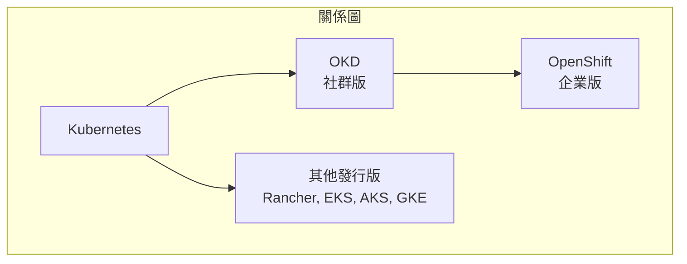

### OpenShift 額外功能

!!! tip "OpenShift 相較於原生 K8S 的優勢"
    - **Web Console**：功能完整的管理介面
    - **Source-to-Image (S2I)**：原始碼直接部署
    - **內建 CI/CD**：整合 Jenkins、Tekton
    - **開發者工具**：odo CLI 簡化開發流程
    - **安全強化**：預設 Security Context Constraints
    - **商業支援**：Red Hat 企業級支援

---

## 4.2 minikube vs minishift

### 本地開發環境比較

| 比較項目 | minikube | minishift |
|----------|----------|-----------|
| **平台** | Kubernetes | OpenShift (OKD) |
| **用途** | K8S 本地開發測試 | OpenShift 本地開發測試 |
| **資源需求** | 較低 | 較高 |
| **維護狀態** | 活躍維護 | 已停止維護 |
| **替代方案** | - | CodeReady Containers (CRC) |

### 安裝 minikube

=== "macOS"
    ```bash title="macOS 安裝 minikube"
    # 使用 Homebrew 安裝
    brew install minikube
    
    # 安裝 kubectl
    brew install kubectl
    ```

=== "Linux"
    ```bash title="Linux 安裝 minikube"
    # 下載 minikube
    curl -LO https://storage.googleapis.com/minikube/releases/latest/minikube-linux-amd64
    sudo install minikube-linux-amd64 /usr/local/bin/minikube
    
    # 安裝 kubectl
    curl -LO "https://dl.k8s.io/release/$(curl -L -s https://dl.k8s.io/release/stable.txt)/bin/linux/amd64/kubectl"
    sudo install kubectl /usr/local/bin/kubectl
    ```

=== "Windows"
    ```powershell title="Windows 安裝 minikube"
    # 使用 Chocolatey 安裝
    choco install minikube
    choco install kubernetes-cli
    ```

### 啟動 minikube

```bash title="minikube 基本操作"
# 啟動 minikube（使用 Docker 驅動）
minikube start --driver=docker

# 指定資源
minikube start --cpus=4 --memory=8192 --driver=docker

# 檢查狀態
minikube status

# 存取 Dashboard
minikube dashboard

# 停止
minikube stop

# 刪除
minikube delete
```

---

## 4.3 Kubernetes 架構

### 整體架構

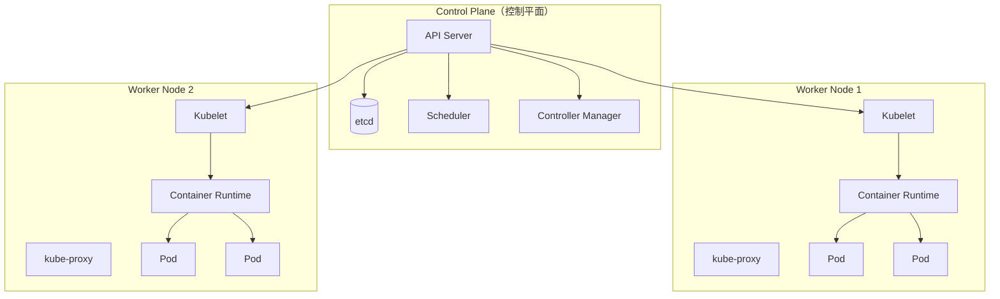

### Control Plane 元件

| 元件 | 說明 |
|------|------|
| **API Server** | K8S 的入口，處理所有 REST API 請求 |
| **etcd** | 分散式鍵值儲存，保存叢集狀態 |
| **Scheduler** | 決定 Pod 要在哪個 Node 執行 |
| **Controller Manager** | 管理各種控制器（Deployment、ReplicaSet 等） |

### Worker Node 元件

| 元件 | 說明 |
|------|------|
| **Kubelet** | Node 的代理程式，管理 Pod 生命週期 |
| **kube-proxy** | 網路代理，實現 Service 的負載均衡 |
| **Container Runtime** | 容器執行環境（containerd、CRI-O） |

---

## 4.4 安裝 Kubernetes

### 使用 minikube 安裝

```bash title="完整安裝流程"
# 1. 確認 Docker 已安裝並運行
docker version

# 2. 啟動 minikube
minikube start --driver=docker --cpus=2 --memory=4096

# 3. 驗證安裝
kubectl cluster-info

# 4. 檢查 Node 狀態
kubectl get nodes

# 5. 檢查系統 Pod
kubectl get pods -n kube-system
```

### 其他安裝選項

!!! note "生產環境安裝選項"
    | 方案 | 適用場景 |
    |------|----------|
    | **kubeadm** | 自建叢集 |
    | **k3s** | 輕量級，適合邊緣運算 |
    | **Amazon EKS** | AWS 雲端 |
    | **Azure AKS** | Azure 雲端 |
    | **Google GKE** | GCP 雲端 |

---

## 4.5 YAML 與 JSON 檔

### YAML 基礎語法

```yaml title="YAML 基本結構"
# 這是註解
apiVersion: v1          # 純量（Scalar）
kind: Pod
metadata:
  name: my-pod          # 縮排表示層級
  labels:               # 對應（Mapping）
    app: web
    tier: frontend
spec:
  containers:           # 列表（Sequence）
    - name: nginx
      image: nginx:1.25
      ports:
        - containerPort: 80
    - name: sidecar
      image: busybox
```

### YAML vs JSON

=== "YAML"
    ```yaml title="Pod 定義 (YAML)"
    apiVersion: v1
    kind: Pod
    metadata:
      name: my-pod
    spec:
      containers:
        - name: nginx
          image: nginx
    ```

=== "JSON"
    ```json title="Pod 定義 (JSON)"
    {
      "apiVersion": "v1",
      "kind": "Pod",
      "metadata": {
        "name": "my-pod"
      },
      "spec": {
        "containers": [
          {
            "name": "nginx",
            "image": "nginx"
          }
        ]
      }
    }
    ```

!!! tip "建議使用 YAML"
    - 更易讀
    - 支援註解
    - 較簡潔

---

## 4.6 Kubernetes Resource Type

### 常見資源類型

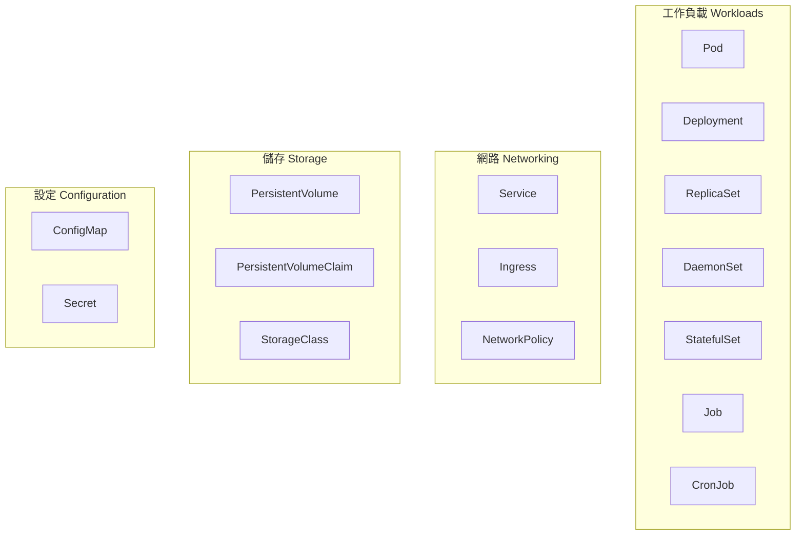

### 資源說明

| 資源 | 用途 | 常用程度 |
|------|------|----------|
| **Pod** | 最小部署單位，包含一或多個容器 | ⭐⭐⭐ |
| **Deployment** | 管理 Pod 的部署與更新 | ⭐⭐⭐ |
| **Service** | 提供穩定的網路端點 | ⭐⭐⭐ |
| **ConfigMap** | 儲存非機密設定 | ⭐⭐⭐ |
| **Secret** | 儲存機密資訊 | ⭐⭐⭐ |
| **Ingress** | HTTP/HTTPS 路由 | ⭐⭐ |
| **PersistentVolume** | 持久化儲存 | ⭐⭐ |
| **StatefulSet** | 有狀態應用程式 | ⭐⭐ |

---

## 4.7 Kubernetes 管理

### 4.7.1 Deployment

Deployment（部署）是管理 Pod 副本的控制器，提供聲明式更新。

```yaml title="deployment.yaml"
apiVersion: apps/v1
kind: Deployment
metadata:
  name: nginx-deployment
  labels:
    app: nginx
spec:
  replicas: 3                    # 副本數量
  selector:
    matchLabels:
      app: nginx
  template:                      # Pod 模板
    metadata:
      labels:
        app: nginx
    spec:
      containers:
        - name: nginx
          image: nginx:1.25
          ports:
            - containerPort: 80
          resources:
            requests:
              memory: "64Mi"
              cpu: "250m"
            limits:
              memory: "128Mi"
              cpu: "500m"
```

```bash title="Deployment 操作"
# 建立 Deployment
kubectl apply -f deployment.yaml

# 查看 Deployment
kubectl get deployments

# 查看詳細資訊
kubectl describe deployment nginx-deployment

# 調整副本數
kubectl scale deployment nginx-deployment --replicas=5

# 刪除 Deployment
kubectl delete deployment nginx-deployment
```

### 4.7.2 Service

Service（服務）提供穩定的網路端點，實現負載均衡。

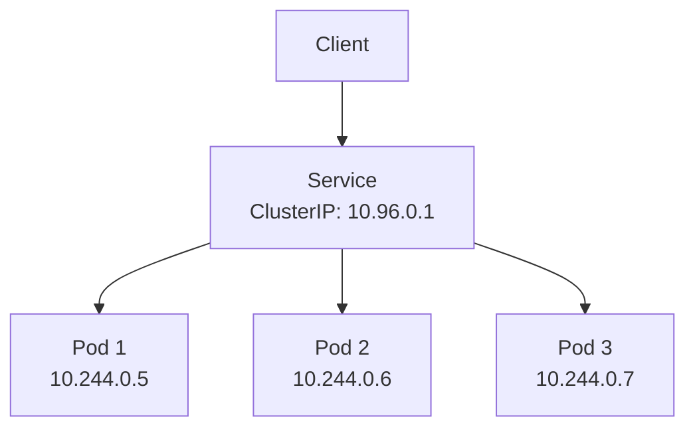

#### Service 類型

| 類型 | 說明 | 用途 |
|------|------|------|
| **ClusterIP** | 僅叢集內部存取（預設） | 內部服務通訊 |
| **NodePort** | 透過 Node IP + Port 存取 | 開發測試 |
| **LoadBalancer** | 雲端負載均衡器 | 生產環境對外服務 |
| **ExternalName** | 對應外部 DNS | 連接外部服務 |

```yaml title="service.yaml"
apiVersion: v1
kind: Service
metadata:
  name: nginx-service
spec:
  type: ClusterIP            # 或 NodePort、LoadBalancer
  selector:
    app: nginx               # 選擇 label 為 app=nginx 的 Pod
  ports:
    - protocol: TCP
      port: 80               # Service Port
      targetPort: 80         # Container Port
      # nodePort: 30080      # NodePort 類型使用
```

```bash title="Service 操作"
# 建立 Service
kubectl apply -f service.yaml

# 查看 Service
kubectl get services

# 查看端點
kubectl get endpoints nginx-service

# 測試連線（在 Pod 內）
kubectl exec -it pod-name -- curl nginx-service
```

### 4.7.3 RollingUpdate 與 Recreate

#### 更新策略比較

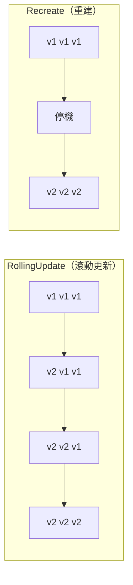

| 策略 | 優點 | 缺點 | 適用場景 |
|------|------|------|----------|
| **RollingUpdate** | 零停機 | 新舊版本共存 | 一般應用 |
| **Recreate** | 簡單、無版本混用 | 有停機時間 | 無法多版本共存 |

```yaml title="更新策略設定"
apiVersion: apps/v1
kind: Deployment
metadata:
  name: my-app
spec:
  replicas: 3
  strategy:
    type: RollingUpdate        # 或 Recreate
    rollingUpdate:
      maxSurge: 1              # 最多額外 Pod 數
      maxUnavailable: 0        # 最多不可用 Pod 數
  # ... 其他設定
```

```bash title="更新操作"
# 更新 Image
kubectl set image deployment/nginx-deployment nginx=nginx:1.26

# 查看更新狀態
kubectl rollout status deployment/nginx-deployment

# 查看更新歷史
kubectl rollout history deployment/nginx-deployment

# 回滾到前一版本
kubectl rollout undo deployment/nginx-deployment

# 回滾到特定版本
kubectl rollout undo deployment/nginx-deployment --to-revision=2
```

### 4.7.4 Canary 與 Blue/Green

#### Canary 部署（金絲雀部署）

將新版本部署給少量使用者測試。

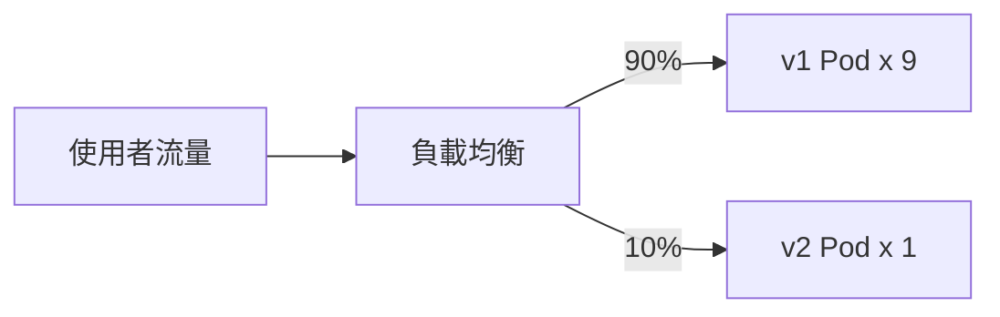

```yaml title="Canary Deployment 範例"
# 穩定版本 Deployment
apiVersion: apps/v1
kind: Deployment
metadata:
  name: app-stable
spec:
  replicas: 9
  selector:
    matchLabels:
      app: myapp
      version: stable
  template:
    metadata:
      labels:
        app: myapp
        version: stable
    spec:
      containers:
        - name: app
          image: myapp:v1
---
# Canary 版本 Deployment
apiVersion: apps/v1
kind: Deployment
metadata:
  name: app-canary
spec:
  replicas: 1
  selector:
    matchLabels:
      app: myapp
      version: canary
  template:
    metadata:
      labels:
        app: myapp
        version: canary
    spec:
      containers:
        - name: app
          image: myapp:v2
---
# Service 同時選擇兩個版本
apiVersion: v1
kind: Service
metadata:
  name: myapp-service
spec:
  selector:
    app: myapp          # 不指定 version，同時包含兩個版本
  ports:
    - port: 80
```

#### Blue/Green 部署（藍綠部署）

同時維護兩個環境，快速切換。

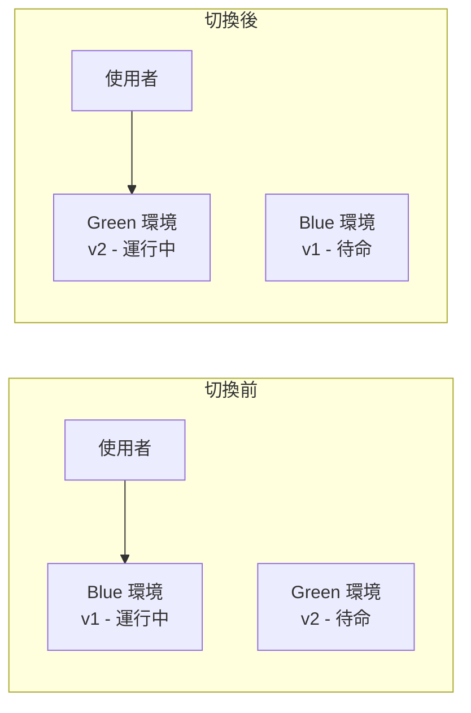

```bash title="Blue/Green 部署切換"
# 假設目前 Service 指向 blue
# 切換到 green
kubectl patch service myapp-service -p '{"spec":{"selector":{"version":"green"}}}'

# 確認切換
kubectl describe service myapp-service
```

### 4.7.5 可用資源管理

#### 資源請求與限制

```yaml title="資源設定"
apiVersion: apps/v1
kind: Deployment
metadata:
  name: resource-demo
spec:
  template:
    spec:
      containers:
        - name: app
          image: nginx
          resources:
            requests:              # 最小需求
              memory: "64Mi"
              cpu: "250m"         # 0.25 CPU
            limits:               # 最大限制
              memory: "128Mi"
              cpu: "500m"         # 0.5 CPU
```

!!! note "CPU 單位說明"
    - `1` = 1 CPU 核心
    - `500m` = 0.5 CPU = 500 millicores
    - `250m` = 0.25 CPU

#### Resource Quota

```yaml title="ResourceQuota 範例"
apiVersion: v1
kind: ResourceQuota
metadata:
  name: compute-quota
  namespace: dev
spec:
  hard:
    requests.cpu: "4"
    requests.memory: 8Gi
    limits.cpu: "8"
    limits.memory: 16Gi
    pods: "10"
```

#### LimitRange

```yaml title="LimitRange 範例"
apiVersion: v1
kind: LimitRange
metadata:
  name: limit-range
  namespace: dev
spec:
  limits:
    - type: Container
      default:
        cpu: "500m"
        memory: "256Mi"
      defaultRequest:
        cpu: "100m"
        memory: "64Mi"
      max:
        cpu: "2"
        memory: "1Gi"
      min:
        cpu: "50m"
        memory: "32Mi"
```

---

## 4.8 Kubernetes 網路

### Pod 網路

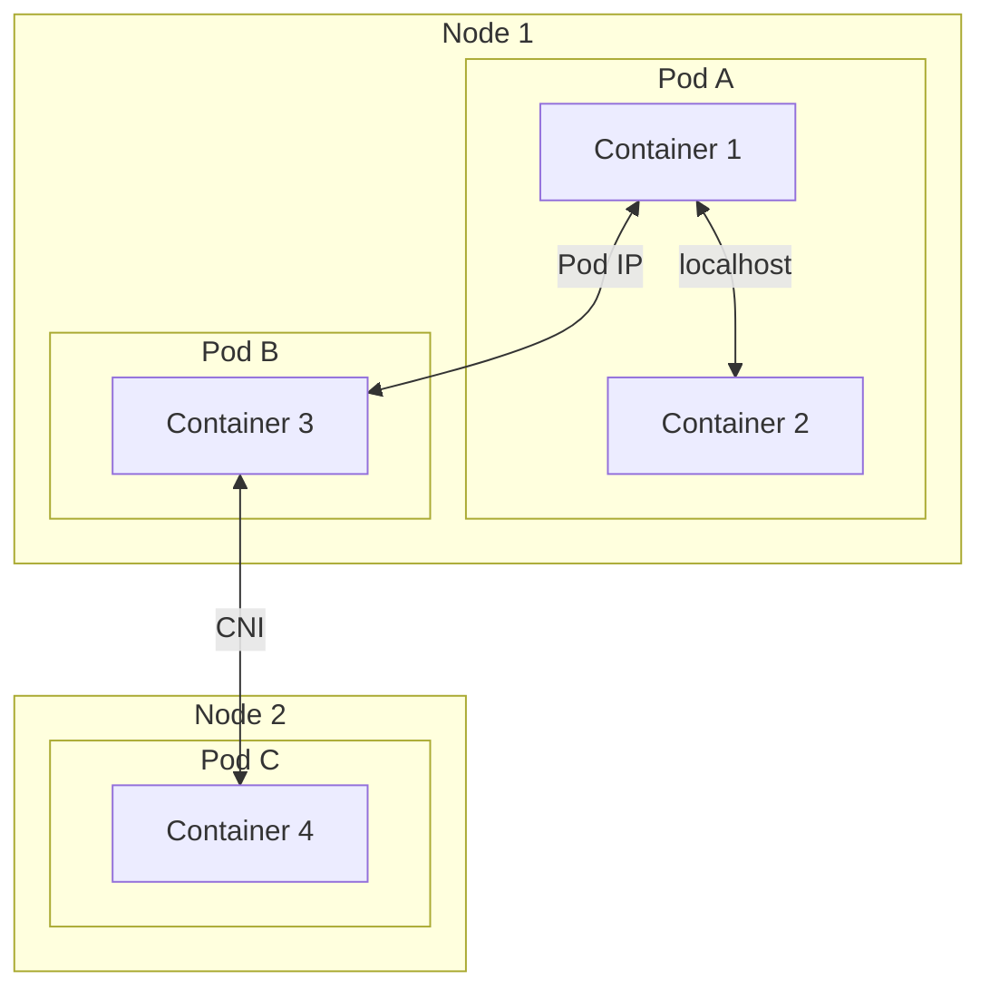

### 網路模型原則

!!! info "Kubernetes 網路原則"
    1. 所有 Pod 可以直接通訊（不需 NAT）
    2. Node 上的代理可以與所有 Pod 通訊
    3. Pod 看到的 IP 與其他 Pod 看到的相同

### CNI 插件

| CNI 插件 | 說明 |
|----------|------|
| **Calico** | 最常用，支援 Network Policy |
| **Flannel** | 簡單易用 |
| **Weave** | 自動發現，易於設定 |
| **Cilium** | eBPF 基礎，高效能 |

### NetworkPolicy

```yaml title="NetworkPolicy 範例"
apiVersion: networking.k8s.io/v1
kind: NetworkPolicy
metadata:
  name: allow-nginx
  namespace: default
spec:
  podSelector:
    matchLabels:
      app: nginx
  policyTypes:
    - Ingress
    - Egress
  ingress:
    - from:
        - podSelector:
            matchLabels:
              app: frontend
      ports:
        - protocol: TCP
          port: 80
  egress:
    - to:
        - podSelector:
            matchLabels:
              app: database
      ports:
        - protocol: TCP
          port: 3306
```

---

## 4.9 Persistent Volumes

### 儲存架構

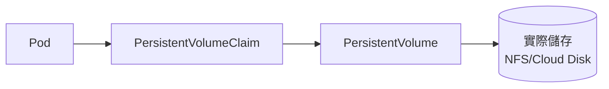

### PersistentVolume (PV)

```yaml title="PersistentVolume 範例"
apiVersion: v1
kind: PersistentVolume
metadata:
  name: pv-demo
spec:
  capacity:
    storage: 10Gi
  accessModes:
    - ReadWriteOnce          # RWO: 單節點讀寫
    # - ReadOnlyMany         # ROX: 多節點唯讀
    # - ReadWriteMany        # RWX: 多節點讀寫
  persistentVolumeReclaimPolicy: Retain
  storageClassName: standard
  hostPath:                  # 僅用於測試
    path: /data/pv-demo
```

### PersistentVolumeClaim (PVC)

```yaml title="PersistentVolumeClaim 範例"
apiVersion: v1
kind: PersistentVolumeClaim
metadata:
  name: pvc-demo
spec:
  accessModes:
    - ReadWriteOnce
  resources:
    requests:
      storage: 5Gi
  storageClassName: standard
```

### 在 Pod 中使用 PVC

```yaml title="Pod 使用 PVC"
apiVersion: v1
kind: Pod
metadata:
  name: pod-with-pvc
spec:
  containers:
    - name: app
      image: nginx
      volumeMounts:
        - name: data
          mountPath: /usr/share/nginx/html
  volumes:
    - name: data
      persistentVolumeClaim:
        claimName: pvc-demo
```

---

## 4.10 ConfigMaps 與 Secrets

### ConfigMap

用於儲存非機密的設定資料。

```yaml title="ConfigMap 範例"
apiVersion: v1
kind: ConfigMap
metadata:
  name: app-config
data:
  # 鍵值對
  APP_ENV: production
  LOG_LEVEL: info
  # 設定檔
  nginx.conf: |
    server {
        listen 80;
        server_name localhost;
        location / {
            root /usr/share/nginx/html;
        }
    }
```

```bash title="建立 ConfigMap"
# 從字面值建立
kubectl create configmap app-config --from-literal=APP_ENV=production

# 從檔案建立
kubectl create configmap nginx-config --from-file=nginx.conf

# 從目錄建立
kubectl create configmap configs --from-file=./config-dir/
```

### Secret

用於儲存敏感資料（Base64 編碼）。

```yaml title="Secret 範例"
apiVersion: v1
kind: Secret
metadata:
  name: db-secret
type: Opaque
data:
  # 使用 base64 編碼
  username: YWRtaW4=           # admin
  password: cGFzc3dvcmQxMjM=   # password123
```

```bash title="建立 Secret"
# 從字面值建立
kubectl create secret generic db-secret \
  --from-literal=username=admin \
  --from-literal=password=password123

# 檢視 Secret（會解碼）
kubectl get secret db-secret -o jsonpath='{.data.password}' | base64 -d
```

### 在 Pod 中使用

```yaml title="使用 ConfigMap 和 Secret"
apiVersion: v1
kind: Pod
metadata:
  name: app-pod
spec:
  containers:
    - name: app
      image: nginx
      # 環境變數方式
      env:
        - name: APP_ENV
          valueFrom:
            configMapKeyRef:
              name: app-config
              key: APP_ENV
        - name: DB_PASSWORD
          valueFrom:
            secretKeyRef:
              name: db-secret
              key: password
      # 掛載為檔案
      volumeMounts:
        - name: config
          mountPath: /etc/nginx/conf.d
        - name: secret
          mountPath: /etc/secrets
          readOnly: true
  volumes:
    - name: config
      configMap:
        name: app-config
    - name: secret
      secret:
        secretName: db-secret
```

---

## 4.11 RBAC (Role-Based Access Control)

### RBAC 概念

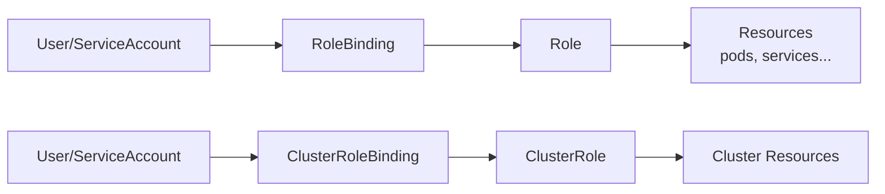

### Role 與 ClusterRole

| 類型 | 範圍 | 用途 |
|------|------|------|
| **Role** | 單一 Namespace | 限定 Namespace 的權限 |
| **ClusterRole** | 整個叢集 | 跨 Namespace 或叢集資源 |

```yaml title="Role 範例"
apiVersion: rbac.authorization.k8s.io/v1
kind: Role
metadata:
  namespace: dev
  name: pod-reader
rules:
  - apiGroups: [""]              # 核心 API 群組
    resources: ["pods"]
    verbs: ["get", "watch", "list"]
  - apiGroups: [""]
    resources: ["pods/log"]
    verbs: ["get"]
```

```yaml title="ClusterRole 範例"
apiVersion: rbac.authorization.k8s.io/v1
kind: ClusterRole
metadata:
  name: secret-reader
rules:
  - apiGroups: [""]
    resources: ["secrets"]
    verbs: ["get", "watch", "list"]
```

### RoleBinding 與 ClusterRoleBinding

```yaml title="RoleBinding 範例"
apiVersion: rbac.authorization.k8s.io/v1
kind: RoleBinding
metadata:
  name: read-pods
  namespace: dev
subjects:
  - kind: User
    name: jane
    apiGroup: rbac.authorization.k8s.io
  - kind: ServiceAccount
    name: default
    namespace: dev
roleRef:
  kind: Role
  name: pod-reader
  apiGroup: rbac.authorization.k8s.io
```

```bash title="RBAC 操作"
# 查看角色
kubectl get roles -n dev
kubectl get clusterroles

# 查看綁定
kubectl get rolebindings -n dev
kubectl get clusterrolebindings

# 測試權限
kubectl auth can-i get pods --as=jane -n dev
kubectl auth can-i delete pods --as=jane -n dev
```

---

## 4.12 使用 Kubernetes 架設 WordPress + MySQL

### Lab 實作目標

在 Kubernetes 上部署完整的 WordPress 網站，包含：

- MySQL 資料庫（StatefulSet）
- WordPress 應用程式（Deployment）
- 持久化儲存（PVC）
- Service 對外服務

### 架構圖

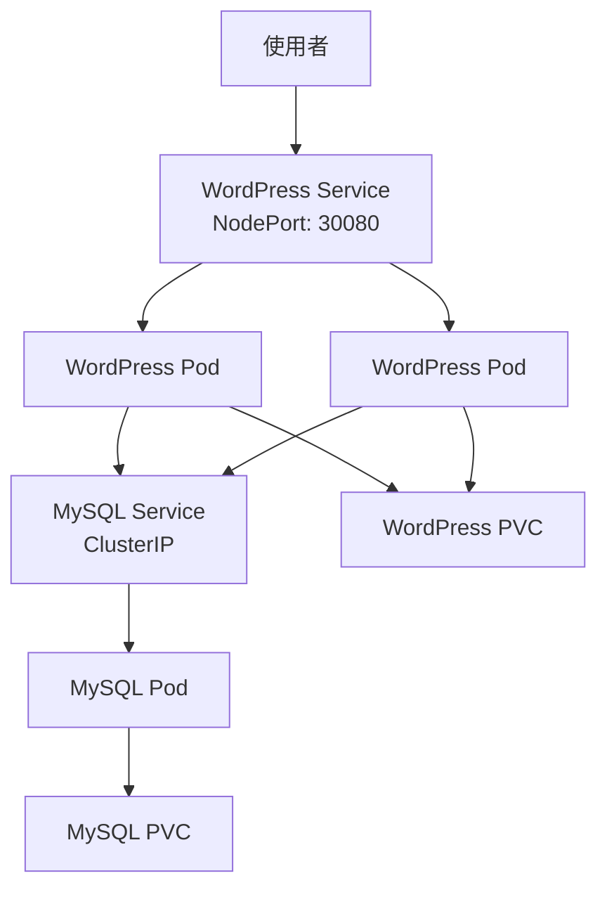

### 實作步驟

#### 步驟 1：建立 Namespace

```yaml title="01-namespace.yaml"
apiVersion: v1
kind: Namespace
metadata:
  name: wordpress
```

```bash
kubectl apply -f 01-namespace.yaml
```

#### 步驟 2：建立 Secret

```yaml title="02-secret.yaml"
apiVersion: v1
kind: Secret
metadata:
  name: mysql-secret
  namespace: wordpress
type: Opaque
data:
  mysql-root-password: cm9vdHBhc3N3b3Jk      # rootpassword
  mysql-password: d3BwYXNzd29yZA==           # wppassword
```

```bash
kubectl apply -f 02-secret.yaml
```

#### 步驟 3：建立 MySQL

```yaml title="03-mysql.yaml"
apiVersion: v1
kind: PersistentVolumeClaim
metadata:
  name: mysql-pvc
  namespace: wordpress
spec:
  accessModes:
    - ReadWriteOnce
  resources:
    requests:
      storage: 5Gi
---
apiVersion: apps/v1
kind: Deployment
metadata:
  name: mysql
  namespace: wordpress
spec:
  replicas: 1
  selector:
    matchLabels:
      app: mysql
  template:
    metadata:
      labels:
        app: mysql
    spec:
      containers:
        - name: mysql
          image: mysql:8.0
          ports:
            - containerPort: 3306
          env:
            - name: MYSQL_ROOT_PASSWORD
              valueFrom:
                secretKeyRef:
                  name: mysql-secret
                  key: mysql-root-password
            - name: MYSQL_DATABASE
              value: wordpress
            - name: MYSQL_USER
              value: wpuser
            - name: MYSQL_PASSWORD
              valueFrom:
                secretKeyRef:
                  name: mysql-secret
                  key: mysql-password
          volumeMounts:
            - name: mysql-data
              mountPath: /var/lib/mysql
      volumes:
        - name: mysql-data
          persistentVolumeClaim:
            claimName: mysql-pvc
---
apiVersion: v1
kind: Service
metadata:
  name: mysql
  namespace: wordpress
spec:
  selector:
    app: mysql
  ports:
    - port: 3306
      targetPort: 3306
  clusterIP: None
```

```bash
kubectl apply -f 03-mysql.yaml
```

#### 步驟 4：建立 WordPress

```yaml title="04-wordpress.yaml"
apiVersion: v1
kind: PersistentVolumeClaim
metadata:
  name: wordpress-pvc
  namespace: wordpress
spec:
  accessModes:
    - ReadWriteOnce
  resources:
    requests:
      storage: 5Gi
---
apiVersion: apps/v1
kind: Deployment
metadata:
  name: wordpress
  namespace: wordpress
spec:
  replicas: 2
  selector:
    matchLabels:
      app: wordpress
  template:
    metadata:
      labels:
        app: wordpress
    spec:
      containers:
        - name: wordpress
          image: wordpress:latest
          ports:
            - containerPort: 80
          env:
            - name: WORDPRESS_DB_HOST
              value: mysql
            - name: WORDPRESS_DB_NAME
              value: wordpress
            - name: WORDPRESS_DB_USER
              value: wpuser
            - name: WORDPRESS_DB_PASSWORD
              valueFrom:
                secretKeyRef:
                  name: mysql-secret
                  key: mysql-password
          volumeMounts:
            - name: wordpress-data
              mountPath: /var/www/html
      volumes:
        - name: wordpress-data
          persistentVolumeClaim:
            claimName: wordpress-pvc
---
apiVersion: v1
kind: Service
metadata:
  name: wordpress
  namespace: wordpress
spec:
  type: NodePort
  selector:
    app: wordpress
  ports:
    - port: 80
      targetPort: 80
      nodePort: 30080
```

```bash
kubectl apply -f 04-wordpress.yaml
```

#### 步驟 5：驗證部署

```bash title="驗證指令"
# 檢查 Pod 狀態
kubectl get pods -n wordpress

# 檢查 Service
kubectl get services -n wordpress

# 檢查 PVC
kubectl get pvc -n wordpress

# 取得 minikube IP
minikube ip

# 存取 WordPress
# 瀏覽器開啟 http://<minikube-ip>:30080
```

#### 使用 minikube service

```bash
# 自動開啟瀏覽器
minikube service wordpress -n wordpress
```

---

## 4.13 Logging、Monitoring 與疑難排除

### 查看 Pod 日誌

```bash title="kubectl logs"
# 查看日誌
kubectl logs pod-name

# 持續追蹤
kubectl logs -f pod-name

# 查看特定容器（多容器 Pod）
kubectl logs pod-name -c container-name

# 查看前一個容器的日誌（重啟後）
kubectl logs pod-name --previous

# 顯示最後 N 行
kubectl logs pod-name --tail=100

# 指定時間範圍
kubectl logs pod-name --since=1h
```

### 疑難排除指令

```bash title="常用診斷指令"
# 查看 Pod 狀態
kubectl get pods -o wide

# 查看詳細資訊
kubectl describe pod pod-name

# 進入 Pod 執行指令
kubectl exec -it pod-name -- /bin/sh

# 查看事件
kubectl get events --sort-by='.lastTimestamp'

# 查看資源使用
kubectl top pods
kubectl top nodes
```

### 常見問題診斷

!!! tip "Pod 狀態說明"
    | 狀態 | 說明 | 處理方式 |
    |------|------|----------|
    | **Pending** | 等待調度 | 檢查資源、Node 狀態 |
    | **ContainerCreating** | 建立容器中 | 檢查 Image 拉取 |
    | **Running** | 運行中 | 正常 |
    | **CrashLoopBackOff** | 持續崩潰重啟 | 查看 logs |
    | **ImagePullBackOff** | Image 拉取失敗 | 檢查 Image 名稱、Registry 存取 |
    | **Error** | 錯誤 | 查看 describe、logs |

```bash title="診斷範例"
# Pod Pending - 檢查原因
kubectl describe pod pending-pod | grep -A 10 Events

# CrashLoopBackOff - 查看日誌
kubectl logs crashing-pod --previous

# ImagePullBackOff - 檢查 Image
kubectl describe pod image-error-pod | grep -A 5 "Image:"
```

### 監控工具

!!! note "常見監控方案"
    | 工具 | 用途 |
    |------|------|
    | **Prometheus** | 指標收集與儲存 |
    | **Grafana** | 視覺化儀表板 |
    | **Loki** | 日誌聚合 |
    | **Jaeger** | 分散式追蹤 |
    | **Kubernetes Dashboard** | 基本 UI |

---

## 常見問題

??? question "Q1：Pod 一直處於 Pending 狀態"
    **可能原因**：
    
    1. 資源不足（CPU/Memory）
    2. Node 標籤不符合 nodeSelector
    3. PVC 未綁定
    
    **診斷步驟**：
    ```bash
    kubectl describe pod pending-pod
    kubectl get events --field-selector involvedObject.name=pending-pod
    ```

??? question "Q2：Service 無法連接到 Pod"
    **檢查步驟**：
    ```bash
    # 1. 確認 Pod 運行中
    kubectl get pods -l app=myapp
    
    # 2. 確認 Service selector 正確
    kubectl describe service myapp-service
    
    # 3. 確認 Endpoints
    kubectl get endpoints myapp-service
    
    # 4. 測試 Pod 內部連線
    kubectl exec -it test-pod -- curl myapp-service
    ```

??? question "Q3：如何回滾到前一個版本？"
    **解決方案**：
    ```bash
    # 查看歷史
    kubectl rollout history deployment/myapp
    
    # 回滾到前一版
    kubectl rollout undo deployment/myapp
    
    # 回滾到特定版本
    kubectl rollout undo deployment/myapp --to-revision=2
    
    # 確認狀態
    kubectl rollout status deployment/myapp
    ```

??? question "Q4：ConfigMap 更新後 Pod 為什麼沒有變化？"
    **原因**：Pod 不會自動重新載入 ConfigMap
    
    **解決方案**：
    ```bash
    # 方法 1：重啟 Deployment
    kubectl rollout restart deployment/myapp
    
    # 方法 2：使用 configmap hash annotation（建議）
    # 在 Deployment template 加入 annotation
    kubectl patch deployment myapp -p \
      '{"spec":{"template":{"metadata":{"annotations":{"configmap-hash":"'$(kubectl get cm myconfig -o jsonpath='{.metadata.resourceVersion}')'"}}}}}' 
    ```

??? question "Q5：如何清理 Evicted 的 Pod？"
    **解決方案**：
    ```bash
    # 查看 Evicted Pod
    kubectl get pods --field-selector=status.phase=Failed
    
    # 刪除所有 Evicted Pod
    kubectl delete pods --field-selector=status.phase=Failed --all-namespaces
    ```

---

## 小結

本章節重點回顧：

- ✅ **Kubernetes 概述**：K8S 與 OpenShift/OKD 的關係，minikube 本地環境
- ✅ **核心架構**：Control Plane（API Server、etcd、Scheduler）與 Worker Node
- ✅ **資源類型**：Pod、Deployment、Service、ConfigMap、Secret 等
- ✅ **部署策略**：RollingUpdate、Recreate、Canary、Blue/Green
- ✅ **網路與儲存**：Service 類型、PV/PVC、NetworkPolicy
- ✅ **安全控管**：RBAC（Role、ClusterRole、RoleBinding）
- ✅ **實作經驗**：WordPress + MySQL 在 K8S 上的完整部署
- ✅ **疑難排解**：kubectl logs、describe、exec 診斷技巧

## 延伸閱讀

- [Kubernetes 官方文件](https://kubernetes.io/docs/)
- [Kubernetes 官方教程](https://kubernetes.io/docs/tutorials/)
- [minikube 官方文件](https://minikube.sigs.k8s.io/docs/)
- [OpenShift 官方文件](https://docs.openshift.com/)
- [Kubernetes Patterns 電子書](https://www.redhat.com/en/resources/oreilly-kubernetes-patterns-cloud-native-apps-ebook)
- [CNCF Landscape](https://landscape.cncf.io/)
