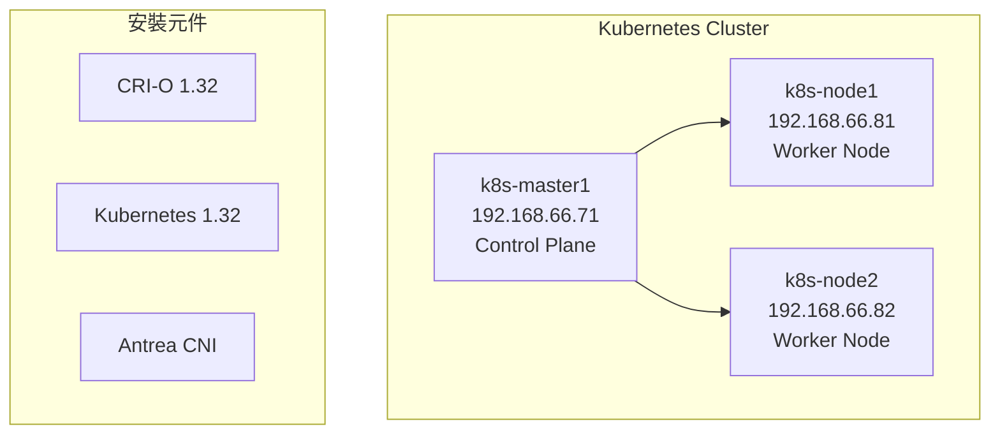
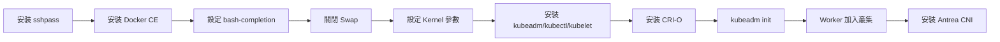

# LAB 12 Kubernetes 叢集安裝

## 學習目標

完成本章節後，你將能夠：

- [ ] 使用 Shell Script 自動化安裝 Kubernetes 叢集
- [ ] 配置多節點（Master + Worker）Kubernetes 環境
- [ ] 理解 kubeadm、kubelet、kubectl 的角色
- [ ] 安裝並配置 CRI-O 容器執行環境
- [ ] 部署 Antrea CNI 網路插件
- [ ] 將 Worker Node 加入叢集
- [ ] 監控叢集狀態與驗證部署

## 前置知識

開始之前，請確保你已經：

- 完成 LAB 11 獨立 Kubernetes 環境
- 熟悉 Docker 基本操作
- 理解容器化的基本概念
- 準備好三台虛擬機（K8S-MASTER1、K8S-NODE1、K8S-NODE2）

---

## Lab 實作練習：使用 Shell Script 安裝 Kubernetes 叢集

### 環境架構



| 主機名稱 | IP 位址 | 角色 |
|---------|---------|------|
| k8s-master1.training.lab | 192.168.66.71 | Control Plane (Master) |
| k8s-node1.training.lab | 192.168.66.81 | Worker Node |
| k8s-node2.training.lab | 192.168.66.82 | Worker Node |

!!! info "安裝特點"
    - **全程在 Master 節點操作**：透過 SSH 自動化安裝 Worker 節點
    - **使用 CRI-O**：Kubernetes 原生的容器執行環境
    - **Antrea CNI**：VMware 開發的高效能網路插件

---

### 步驟 1：啟動虛擬機並確認環境

首先，在 VMware Workstation 中啟動三台虛擬機：

- K8S-MASTER1
- K8S-NODE1  
- K8S-NODE2

登入 `k8s-master1`，確認主機名稱與網路設定：

```bash title="確認主機名稱"
hostname
```

**預期結果**：

```
k8s-master1.training.lab
```

```bash title="確認 IP 位址"
ifconfig ens160
```

**預期結果**：

```
ens160: flags=4163<UP,BROADCAST,RUNNING,MULTICAST>  mtu 1500
        inet 192.168.66.71  netmask 255.255.255.0  broadcast 192.168.66.255
```

```bash title="確認 /etc/hosts 設定"
cat /etc/hosts
```

**預期結果**：

```
127.0.0.1   localhost localhost.localdomain localhost4 localhost4.localdomain4
::1         localhost localhost.localdomain localhost6 localhost6.localdomain6

192.168.66.71		k8s-master1.training.lab	k8s-master1
192.168.66.81		k8s-node1.training.lab		k8s-node1
192.168.66.82		k8s-node2.training.lab		k8s-node2
```

---

### 步驟 2：確認網路連線

測試與其他節點的連線：

```bash title="Ping Worker Node 1"
ping k8s-node1 -c3
```

**預期結果**：

```
PING k8s-node1.training.lab (192.168.66.81) 56(84) bytes of data.
64 bytes from k8s-node1.training.lab (192.168.66.81): icmp_seq=1 ttl=64 time=0.430 ms
64 bytes from k8s-node1.training.lab (192.168.66.81): icmp_seq=2 ttl=64 time=0.345 ms
64 bytes from k8s-node1.training.lab (192.168.66.81): icmp_seq=3 ttl=64 time=0.243 ms

--- k8s-node1.training.lab ping statistics ---
3 packets transmitted, 3 received, 0% packet loss
```

```bash title="Ping Worker Node 2"
ping k8s-node2 -c3
```

```bash title="測試網際網路連線"
ping google.com -c3
```

**預期結果**：

```
PING google.com (142.250.66.78) 56(84) bytes of data.
64 bytes from lctsaa-aa-in-f14.1e100.net (142.250.66.78): icmp_seq=1 ttl=128 time=66.8 ms
...
3 packets transmitted, 3 received, 0% packet loss
```

!!! success "連線確認"
    確保三台虛擬機之間可以互相 ping 通，且可以連接網際網路下載套件。

---

### 步驟 3：下載安裝 Script

從課程伺服器下載 Kubernetes 安裝腳本：

```bash title="下載安裝腳本"
wget http://10.0.1.249/k8s/scripts/install_k8s-latest.sh
```

**預期結果**：

```
--2026-01-27 15:55:16--  http://10.0.1.249/k8s/scripts/install_k8s-latest.sh
Connecting to 10.0.1.249:80... connected.
HTTP request sent, awaiting response... 200 OK
Length: 22517 (22K) [application/x-sh]
Saving to: 'install_k8s-latest.sh'

install_k8s-latest.sh    100%[==>]  21.99K  51.0KB/s    in 0.4s    

2026-01-27 15:55:17 (51.0 KB/s) - 'install_k8s-latest.sh' saved [22517/22517]
```

設定執行權限：

```bash title="設定執行權限"
chmod 755 install_k8s-latest.sh
```

查看使用說明：

```bash title="查看腳本使用方式"
./install_k8s-latest.sh
```

**預期結果**：

```
請輸入 完整安裝(full) 或是 standalone
./install_k8s-latest.sh -full
或 
./install_k8s-latest.sh -standalone
```

---

### 步驟 4：執行完整安裝

執行腳本進行完整叢集安裝（包含 Master 和 Worker 節點）：

```bash title="執行完整安裝"
./install_k8s-latest.sh -full
```

!!! warning "安裝時間"
    完整安裝過程約需 5-10 分鐘，取決於網路速度。請耐心等待。

#### 安裝過程說明

腳本會自動執行以下步驟：



**主要安裝項目**：

| 階段 | 說明 |
|------|------|
| **sshpass** | 用於自動化 SSH 登入 Worker 節點 |
| **Docker CE** | 安裝 Docker 29.2.0（所有節點） |
| **bash-completion** | kubectl 指令自動補齊 |
| **Swap 關閉** | Kubernetes 要求關閉 Swap |
| **Kernel 參數** | 設定 ip_forward、bridge-nf-call 等 |
| **kubeadm/kubectl/kubelet** | Kubernetes 1.32.11 核心元件 |
| **CRI-O** | 容器執行環境 1.32.1 |
| **Antrea** | CNI 網路插件 |

---

### 步驟 5：驗證安裝結果

安裝完成後，腳本會顯示類似以下訊息：

```
Your Kubernetes control-plane has initialized successfully!

To start using your cluster, you need to run the following as a regular user:

  mkdir -p $HOME/.kube
  sudo cp -i /etc/kubernetes/admin.conf $HOME/.kube/config
  sudo chown $(id -u):$(id -g) $HOME/.kube/config

Then you can join any number of worker nodes by running the following on each as root:

kubeadm join 192.168.66.71:6443 --token hv80nh.sji1vjeju8b5l10n \
	--discovery-token-ca-cert-hash sha256:f2af63e6d5dafedcc62702dcb939b51bfa98b96ab996af3556665a05a7cf0a6c
```

!!! success "安裝成功"
    看到 "Your Kubernetes control-plane has initialized successfully!" 表示 Master 節點安裝成功。

---

### 步驟 6：監控叢集狀態

使用 `while` 迴圈持續監控節點狀態：

```bash title="持續監控節點狀態"
while true
do
  date
  kubectl get nodes
  sleep 5
done
```

**初始狀態**（NotReady）：

```
Tue Jan 27 04:05:22 PM CST 2026
NAME                       STATUS     ROLES           AGE   VERSION
k8s-master1.training.lab   NotReady   control-plane   84s   v1.32.11
k8s-node1.training.lab     NotReady   <none>          76s   v1.32.11
k8s-node2.training.lab     NotReady   <none>          75s   v1.32.11
```

!!! info "NotReady 狀態"
    剛安裝完成時，節點會顯示 `NotReady`，等待 CNI 網路插件完成初始化後會變成 `Ready`。

**最終狀態**（Ready）：

```
NAME                       STATUS   ROLES           AGE    VERSION
k8s-master1.training.lab   Ready    control-plane   5m     v1.32.11
k8s-node1.training.lab     Ready    <none>          4m52s  v1.32.11
k8s-node2.training.lab     Ready    <none>          4m51s  v1.32.11
```

按 `Ctrl+C` 停止監控。

---

### 步驟 7：驗證部署功能

建立一個測試 Deployment 來驗證叢集功能：

```bash title="建立測試 Deployment"
kubectl create deployment test1 --image=httpd
```

**預期結果**：

```
deployment.apps/test1 created
```

查看 Deployment 狀態：

```bash title="查看 Deployment"
kubectl get deployments
```

```bash title="查看 Pod 詳細資訊"
kubectl get pods -o wide
```

**預期結果**（Pod Running）：

```
NAME                     READY   STATUS    RESTARTS   AGE   IP            NODE
test1-5b88789dbb-h99dh   1/1     Running   0          30s   10.244.1.2    k8s-node1.training.lab
```

!!! tip "清理測試資源"
    測試完成後，可以刪除測試 Deployment：
    ```bash
    kubectl delete deployment test1
    ```

---

### 常用檢查指令

```bash title="檢查所有 Pod（包含系統 Pod）"
kubectl get pods -A
```

```bash title="檢查叢集資訊"
kubectl cluster-info
```

```bash title="查看節點詳細資訊"
kubectl describe node k8s-master1.training.lab
```

```bash title="檢查 CRI-O 狀態"
systemctl status crio
```

```bash title="檢查 kubelet 狀態"
systemctl status kubelet
```

---

### 安裝摘要

| 項目 | 版本/值 |
|------|---------|
| **Kubernetes** | 1.32.11 |
| **CRI-O** | 1.32.1 |
| **Docker CE** | 29.2.0 |
| **CNI** | Antrea |
| **Pod Network CIDR** | 10.244.0.0/16 |
| **Service CIDR** | 172.30.0.0/16 |

!!! success "完成確認"
    當所有節點顯示 `Ready` 狀態，且測試 Pod 可以正常運行，表示 Kubernetes 叢集安裝成功！

---

## 小結

本章節重點回顧：

- ✅ **環境準備**：啟動三台虛擬機（k8s-master1、k8s-node1、k8s-node2）
- ✅ **網路確認**：確保節點間可以互相通訊，且可連接網際網路
- ✅ **腳本安裝**：使用 `install_k8s-latest.sh -full` 自動化安裝
- ✅ **核心元件**：安裝 kubeadm、kubectl、kubelet v1.32.11
- ✅ **容器執行環境**：安裝 CRI-O v1.32.1
- ✅ **CNI 網路**：部署 Antrea 網路插件
- ✅ **叢集驗證**：確認所有節點 Ready 並測試 Deployment

## 延伸閱讀

- [Kubernetes 官方文件](https://kubernetes.io/docs/)
- [kubeadm 安裝指南](https://kubernetes.io/docs/setup/production-environment/tools/kubeadm/)
- [CRI-O 官方文件](https://cri-o.io/)
- [Antrea CNI](https://antrea.io/)
