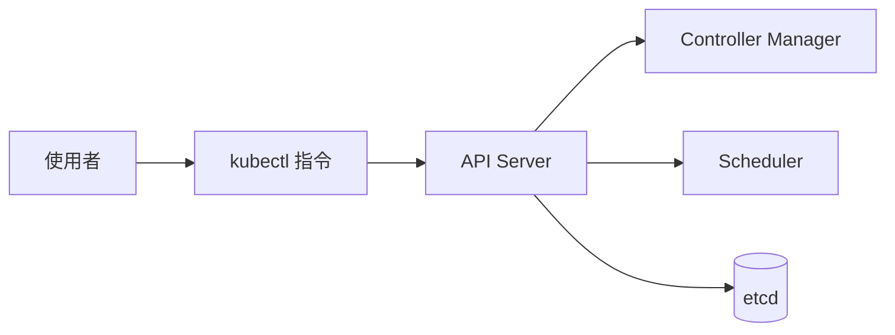
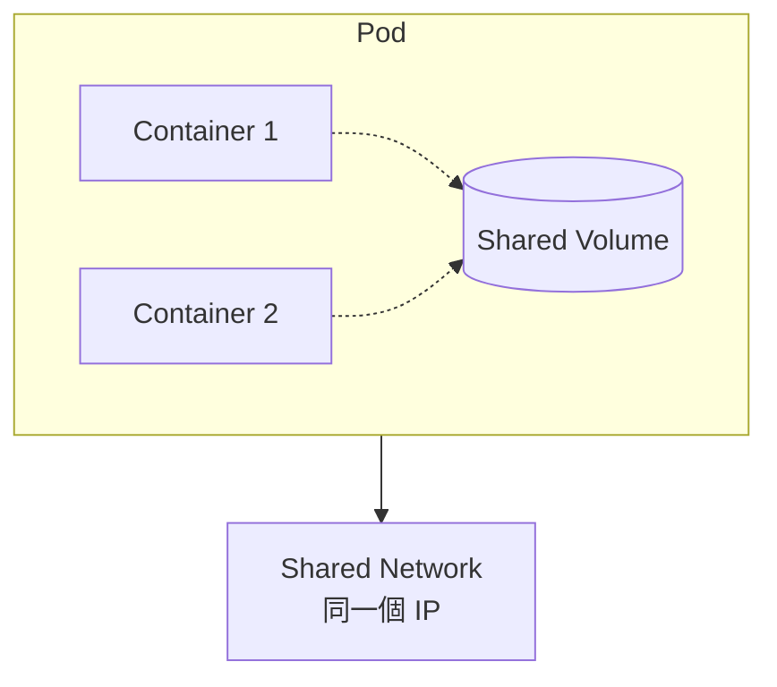
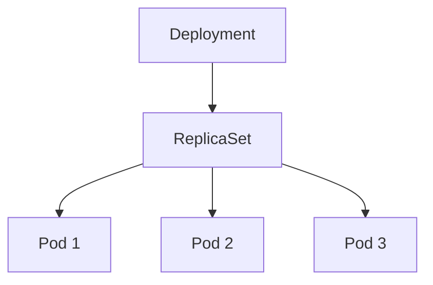
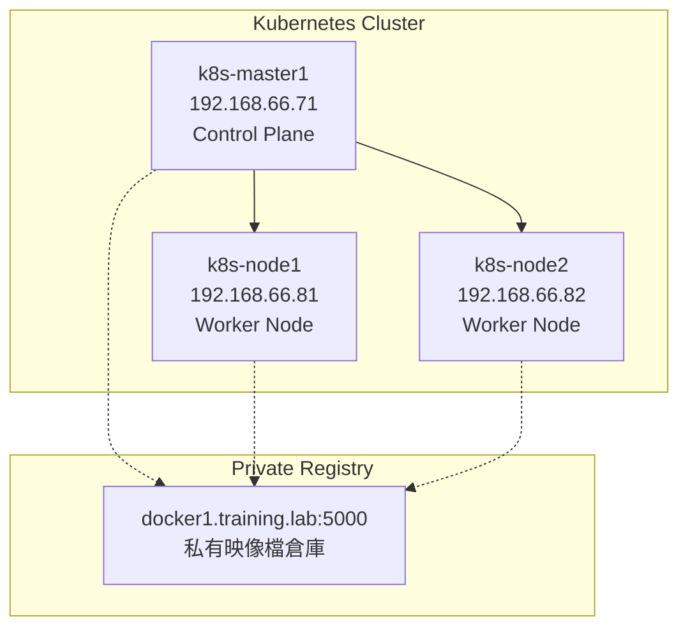

# LAB 13 Kubernetes 常用指令

## 學習目標

完成本章節後，你將能夠：

- [ ] 使用 kubectl 建立與管理 Deployment
- [ ] 使用 kubectl run 建立獨立 Pod
- [ ] 使用 kubectl scale 手動擴展 Deployment
- [ ] 使用 kubectl autoscale 設定自動擴展（HPA）
- [ ] 使用 Labels 標籤管理與查詢 Pod
- [ ] 使用 YAML 檔案部署與刪除資源

## 前置知識

開始之前，請確保你已經：

- 完成 LAB 12 Kubernetes 叢集安裝
- 熟悉 Kubernetes 基本概念（Pod、Deployment、Service）
- 準備好 Kubernetes 叢集環境（k8s-master1）

---

## 核心概念說明

### kubectl 是什麼？

`kubectl`（讀音：kube-control 或 kube-C-T-L）是 Kubernetes 的**命令列工具（CLI）**，用來與 Kubernetes 叢集進行互動。



!!! info "kubectl 功能"
    - 建立、查看、更新、刪除 Kubernetes 資源
    - 查看叢集狀態與日誌
    - 進入容器執行指令
    - 部署應用程式

---

### Pod 是什麼？

**Pod（豆莢）** 是 Kubernetes 中**最小的部署單位**，一個 Pod 可以包含一個或多個容器（Container）。



| 特性 | 說明 |
|------|------|
| **共享網路** | 同一個 Pod 內的容器共享相同的 IP 位址和 Port |
| **共享儲存** | 可以掛載共享的 Volume |
| **生命週期** | Pod 是臨時性的，可能隨時被重新調度 |
| **最小單位** | 無法部署「半個容器」，Pod 是不可分割的 |

---

### Deployment 是什麼？

**Deployment（部署）** 是 Kubernetes 中用來**管理 Pod 副本數量和更新策略**的控制器（Controller）。



| Deployment 功能 | 說明 |
|-----------------|------|
| **副本管理** | 確保指定數量的 Pod 副本始終運行 |
| **自動修復** | Pod 掛掉時自動建立新的 Pod |
| **滾動更新** | 更新應用程式時逐步替換舊 Pod |
| **回滾** | 發現問題時可以回到先前版本 |

!!! tip "Pod vs Deployment"
    - **直接建立 Pod**（使用 `kubectl run`）：適合測試，但 Pod 掛掉後**不會自動重建**
    - **使用 Deployment**（使用 `kubectl create deployment`）：正式環境推薦，會**自動維護指定數量的 Pod**

---

### API 資源簡稱

在 `kubectl` 指令中，你可能會看到不同的資源名稱寫法：

| 完整名稱 | 簡稱 | 說明 |
|----------|------|------|
| `pods` | `po` | Pod 資源 |
| `deployments.apps` | `deploy` | Deployment 資源 |
| `services` | `svc` | Service 資源 |
| `replicasets.apps` | `rs` | ReplicaSet 資源 |
| `namespaces` | `ns` | Namespace 資源 |
| `configmaps` | `cm` | ConfigMap 資源 |
| `secrets` | `secret` | Secret 資源 |
| `persistentvolumeclaims` | `pvc` | PVC 資源 |

**範例**：以下指令效果相同：

```bash
# 完整寫法
kubectl get deployments.apps

# 簡稱寫法
kubectl get deploy
```

!!! note "deployments.apps 的由來"
    `deployments.apps` 表示 Deployment 資源屬於 `apps` API 群組。這是因為 Kubernetes 的 API 分成多個群組（如 `core`、`apps`、`batch`），完整寫法可以明確指定資源來源。

---

## Lab 實作練習：Kubernetes 基本指令操作

### 環境準備



---

### 步驟 1：初始化私有 Registry 連線設定

為了讓所有節點都能從私有 Registry 拉取映像檔，需要先執行初始化腳本：

```bash title="下載初始化腳本"
wget http://10.0.1.249/k8s/scripts/init_pull_from_private_registry.sh
```

**預期結果**：

```
--2026-01-28 10:40:26--  http://10.0.1.249/k8s/scripts/init_pull_from_private_registry.sh
Connecting to 10.0.1.249:80... connected.
HTTP request sent, awaiting response... 200 OK
Length: 3711 (3.6K) [application/x-sh]
Saving to: 'init_pull_from_private_registry.sh'

init_pull_from_private_registry.sh   100%[======>]   3.62K  --.-KB/s    in 0s      

2026-01-28 10:40:26 (760 MB/s) - 'init_pull_from_private_registry.sh' saved [3711/3711]
```

設定執行權限並執行腳本：

```bash title="設定權限並執行"
chmod 755 init_pull_from_private_registry.sh
./init_pull_from_private_registry.sh
```

**預期結果**（部分輸出）：

```
docker1
Warning: Permanently added 'docker1' (ED25519) to the list of known hosts.
docker1.training.lab
docker-ce-29.1.5-1.el9.x86_64
Install docker-ce...
containerd.io-2.2.1-1.el9.x86_64
Install containerd.io...
...
k8s-master1
k8s-master1.training.lab
docker-ce-29.2.0-1.el9.x86_64
Install docker-ce...
containerd.io-2.2.1-1.el9.x86_64
Install containerd.io...
cri-o-1.32.1-150500.1.1.x86_64
Install cri-o...
```

!!! info "腳本功能"
    此腳本會自動設定所有節點（docker1、docker2、k8s-standalone、k8s-master1、k8s-node1、k8s-node2）的 Docker、containerd 和 CRI-O 環境，使其能夠從私有 Registry 拉取映像檔。

---

### 步驟 2：清理現有資源

下載並執行清理腳本：

```bash title="下載清理腳本"
curl -LO http://10.0.1.249/k8s/scripts/kube_clean_all.sh
chmod 755 kube_clean_all.sh
```

執行清理：

```bash title="清理所有資源"
./kube_clean_all.sh
```

**預期結果**：

```
service "kubernetes" deleted
deployment.apps "test1" deleted
No resources found
configmap "kube-root-ca.crt" deleted
namespace "kube-node-lease" deleted
Error from server (Forbidden): namespaces "default" is forbidden: this namespace may not be deleted
Error from server (Forbidden): namespaces "kube-public" is forbidden: this namespace may not be deleted
Error from server (Forbidden): namespaces "kube-system" is forbidden: this namespace may not be deleted
```

!!! warning "系統命名空間"
    `default`、`kube-public`、`kube-system` 為系統保護的命名空間，無法被刪除，出現錯誤訊息是正常的。

---

### 步驟 3：建立 Deployment

使用 `kubectl create deployment` 建立 Deployment：

```bash title="建立 Deployment (4 個副本)"
kubectl create deployment test1 --image=docker1.training.lab:5000/httpd --replicas=4
```

**預期結果**：

```
deployment.apps/test1 created
```

查看 Deployment 狀態：

```bash title="查看 Deployment"
kubectl get deployments.apps
```

**預期結果**：

```
NAME    READY   UP-TO-DATE   AVAILABLE   AGE
test1   0/4     4            0           13s
```

查看 Pod 詳細資訊：

```bash title="查看 Pod 詳細位置"
kubectl get pods -o wide
```

**預期結果**：

```
NAME                    READY   STATUS    RESTARTS   AGE     IP       NODE     NOMINATED NODE   READINESS GATES
test1-dcd787f9d-9rkdj   0/1     Pending   0          5m49s   <none>   <none>   <none>           <none>
test1-dcd787f9d-cqqmc   0/1     Pending   0          5m49s   <none>   <none>   <none>           <none>
test1-dcd787f9d-l5rmx   0/1     Pending   0          5m49s   <none>   <none>   <none>           <none>
test1-dcd787f9d-rznwh   0/1     Pending   0          5m49s   <none>   <none>   <none>           <none>
```

!!! note "Pending 狀態"
    如果 Pod 顯示 `Pending` 狀態，可能是因為：
    
    - Worker Node 尚未 Ready
    - 資源不足
    - 無法拉取映像檔
    
    使用 `kubectl describe pod <pod-name>` 查看詳細原因。

---

### 步驟 4：刪除 Pod 與 Deployment

刪除單一 Pod：

```bash title="刪除指定 Pod"
kubectl delete pod/test1-dcd787f9d-rznwh
```

**預期結果**：

```
pod "test1-dcd787f9d-rznwh" deleted
```

!!! tip "Pod 名稱格式"
    Pod 名稱格式為 `<deployment-name>-<replicaset-hash>-<pod-hash>`。
    注意不要多打連字號（`--`），否則會找不到 Pod。

刪除整個 Deployment（會同時刪除所有相關 Pod）：

```bash title="刪除 Deployment"
kubectl delete deployments.apps test1
```

**預期結果**：

```
deployment.apps "test1" deleted
```

驗證刪除結果：

```bash title="確認刪除完成"
kubectl get deployments.apps
kubectl get pods
```

**預期結果**：

```
No resources found in default namespace.
```

---

### 步驟 5：使用 kubectl run 建立 Pod

使用 `kubectl run` 直接建立獨立 Pod（不透過 Deployment）：

```bash title="建立 Pod 並設定環境變數"
kubectl run test4 --image=docker1.training.lab:5000/nginx --env="TEST=test4"
```

**預期結果**：

```
pod/test4 created
```

進入 Pod 執行指令（使用 `kubectl exec`）：

```bash title="進入 Pod 執行 bash"
kubectl exec test4 -it -- bash
```

!!! warning "常見錯誤"
    **錯誤寫法**：`kubectl exec test4 -it --bash`（缺少 `--` 分隔符）
    
    **正確寫法**：`kubectl exec test4 -it -- bash`
    
    `--` 用來分隔 kubectl 參數和容器內要執行的指令。

---

### 步驟 6：建立與擴展 Deployment

建立 Deployment：

```bash title="建立 test5 Deployment"
kubectl create deployment test5 --image=docker1.training.lab:5000/nginx
```

```bash title="建立 test6 Deployment（2 個副本）"
kubectl create deployment test6 --image=docker1.training.lab:5000/nginx --replicas=2
```

查看 Deployment 狀態：

```bash title="查看特定 Deployment"
kubectl get deployments.apps test5
kubectl get deployments.apps test6
```

**預期結果**：

```
NAME    READY   UP-TO-DATE   AVAILABLE   AGE
test5   0/1     1            0           28s

NAME    READY   UP-TO-DATE   AVAILABLE   AGE
test6   0/2     2            0           4m43s
```

---

### 步驟 7：手動擴展 Deployment（Scale）

使用 `kubectl scale` 手動調整副本數量：

```bash title="擴展 test5 到 3 個副本"
kubectl scale deployment test5 --replicas=3
```

**預期結果**：

```
deployment.apps/test5 scaled
```

驗證擴展結果：

```bash title="查看擴展後的狀態"
kubectl get deployments.apps test5
kubectl get pods | grep test5
```

**預期結果**：

```
NAME    READY   UP-TO-DATE   AVAILABLE   AGE
test5   0/3     3            0           10m

test5-8464657978-5jgj6   0/1     Pending   0          10m
test5-8464657978-fc7zg   0/1     Pending   0          28s
test5-8464657978-sqgql   0/1     Pending   0          28s
```

---

### 步驟 8：設定自動擴展（Autoscale / HPA）

使用 `kubectl autoscale` 建立 Horizontal Pod Autoscaler（HPA）：

```bash title="設定自動擴展"
kubectl autoscale deployment test5 --min=4 --max=9 --cpu-percent=80
```

**預期結果**：

```
horizontalpodautoscaler.autoscaling/test5 autoscaled
```

!!! warning "常見錯誤"
    **錯誤寫法**：
    
    - `--cpu80%`（缺少等號和 percent）
    - `--cpu 80%`（有空格、缺少 percent）
    - `--cpu=80%`（flag 名稱錯誤）
    
    **正確寫法**：`--cpu-percent=80`

驗證 HPA 效果：

```bash title="查看擴展後的 Deployment"
kubectl get deployments.apps test5
```

**預期結果**：

```
NAME    READY   UP-TO-DATE   AVAILABLE   AGE
test5   0/4     4            0           12m
```

!!! info "HPA 說明"
    HPA 會根據 CPU 使用率自動調整 Pod 數量：
    
    - **--min=4**：最少維持 4 個副本
    - **--max=9**：最多擴展到 9 個副本
    - **--cpu-percent=80**：當 CPU 使用率超過 80% 時觸發擴展

---

### 步驟 9：使用 Labels 標籤管理 Pod

建立帶有自訂 Label 的 Pod：

```bash title="建立帶有 Label 的 Pod"
kubectl run test7 --image=docker1.training.lab:5000/nginx --labels="os=linux"
```

**預期結果**：

```
pod/test7 created
```

!!! warning "常見錯誤"
    **錯誤寫法**：`kubectl run test8 --image=nginx ==labels="os=windows"`（兩個等號）
    
    **正確寫法**：`kubectl run test8 --image=nginx --labels="os=windows"`

查看 Pod Labels：

```bash title="顯示所有 Pod 的 Labels"
kubectl get pods --show-labels
```

**預期結果**：

```
NAME                     READY   STATUS    RESTARTS   AGE     LABELS
test4                    0/1     Pending   0          18m     run=test4
test5-8464657978-5jgj6   0/1     Pending   0          14m     app=test5,pod-template-hash=8464657978
test7                    0/1     Pending   0          47s     os=linux
test8                    0/1     Pending   0          13s     run=test8
```

依據 Label 過濾 Pod：

```bash title="過濾包含 os Label 的 Pod"
kubectl get pods --show-labels | grep 'os='
```

```bash title="顯示特定 Label 欄位"
kubectl get pods -L os
```

**預期結果**：

```
NAME                     READY   STATUS    RESTARTS   AGE     OS
test4                    0/1     Pending   0          20m     
test5-8464657978-5jgj6   0/1     Pending   0          16m     
test7                    0/1     Pending   0          2m57s   linux
test8                    0/1     Pending   0          2m23s   
```

!!! tip "Label 使用技巧"
    - `--show-labels`：顯示所有 Labels
    - `-L <label-key>`：將指定的 Label 顯示為獨立欄位
    - `-l <label-selector>`：依據 Label 過濾資源

---

### 步驟 10：使用 YAML 檔案部署

從 URL 直接套用 YAML 檔案：

```bash title="從 URL 套用 YAML"
kubectl apply -f http://10.0.1.249/k8s/yaml/test9.yaml
```

**預期結果**：

```
pod/test9 created
```

!!! warning "常見錯誤"
    注意 URL 路徑要正確（`/k8s/yaml/`），打錯會出現 404 錯誤：
    ```
    error: unable to read URL "http://10.0.1.249/k8s/taml/test9.yaml", 
    server reported 404 Not Found, status code=404
    ```

下載 YAML 檔案查看內容：

```bash title="下載 YAML 檔案"
wget http://10.0.1.249/k8s/yaml/test9.yaml
```

```bash title="查看 YAML 內容"
cat test9.yaml
```

**YAML 內容**：

```yaml title="test9.yaml"
apiVersion: v1
kind: Pod
metadata:
  name: test9
spec:
  containers:
  - name: test9
    image: docker1.training.lab:5000/nginx
```

使用本地 YAML 檔案刪除資源：

```bash title="使用 YAML 刪除資源"
kubectl delete -f test9.yaml
```

**預期結果**：

```
pod "test9" deleted
```

!!! tip "YAML 部署的優點"
    - **版本控制**：可以將 YAML 檔案納入 Git 管理
    - **重複使用**：同一個 YAML 可以重複部署
    - **完整定義**：YAML 可以包含更多進階設定

---

## 常用 kubectl 指令對照表

| 操作 | 指令 | 範例 |
|------|------|------|
| **建立 Deployment** | `kubectl create deployment` | `kubectl create deployment test --image=nginx --replicas=3` |
| **建立 Pod** | `kubectl run` | `kubectl run test --image=nginx --env="KEY=value"` |
| **查看資源** | `kubectl get` | `kubectl get pods -o wide` |
| **擴展副本** | `kubectl scale` | `kubectl scale deployment test --replicas=5` |
| **自動擴展** | `kubectl autoscale` | `kubectl autoscale deployment test --min=2 --max=10 --cpu-percent=80` |
| **進入容器** | `kubectl exec` | `kubectl exec test -it -- bash` |
| **刪除資源** | `kubectl delete` | `kubectl delete pod/test` |
| **套用 YAML** | `kubectl apply -f` | `kubectl apply -f deployment.yaml` |
| **刪除 YAML 資源** | `kubectl delete -f` | `kubectl delete -f deployment.yaml` |

---

## 常見問題

??? question "Q1：Pod 一直處於 Pending 狀態怎麼辦？"
    **原因**：通常是因為沒有可用的 Worker Node 或節點資源不足。
    
    **解決方案**：
    ```bash
    # 查看詳細原因
    kubectl describe pod <pod-name>
    
    # 確認節點狀態
    kubectl get nodes
    ```

??? question "Q2：kubectl exec 出現錯誤 'unknown flag: --bash'"
    **原因**：`--bash` 應該放在 `--` 後面，作為容器內執行的指令。
    
    **解決方案**：
    ```bash
    # 錯誤
    kubectl exec test -it --bash
    
    # 正確
    kubectl exec test -it -- bash
    ```

??? question "Q3：如何查看特定 Label 的 Pod？"
    **解答**：使用 `-l` 或 `-L` 參數：
    
    ```bash
    # 依據 Label 過濾
    kubectl get pods -l os=linux
    
    # 顯示 Label 欄位
    kubectl get pods -L os
    ```

---

## 小結

本章節重點回顧：

- ✅ **環境初始化**：使用腳本設定私有 Registry 連線
- ✅ **Deployment 管理**：使用 `kubectl create deployment` 建立並管理 Deployment
- ✅ **Pod 操作**：使用 `kubectl run` 建立獨立 Pod，`kubectl exec` 進入容器
- ✅ **手動擴展**：使用 `kubectl scale` 調整副本數量
- ✅ **自動擴展**：使用 `kubectl autoscale` 設定 HPA
- ✅ **Labels 管理**：使用 `--labels` 建立標籤，`--show-labels` 和 `-L` 查詢
- ✅ **YAML 部署**：使用 `kubectl apply -f` 和 `kubectl delete -f` 管理資源

## 延伸閱讀

- [kubectl 完整指令參考](https://kubernetes.io/docs/reference/kubectl/)
- [Kubernetes Deployments](https://kubernetes.io/docs/concepts/workloads/controllers/deployment/)
- [Horizontal Pod Autoscaler](https://kubernetes.io/docs/tasks/run-application/horizontal-pod-autoscale/)
- [Labels and Selectors](https://kubernetes.io/docs/concepts/overview/working-with-objects/labels/)
