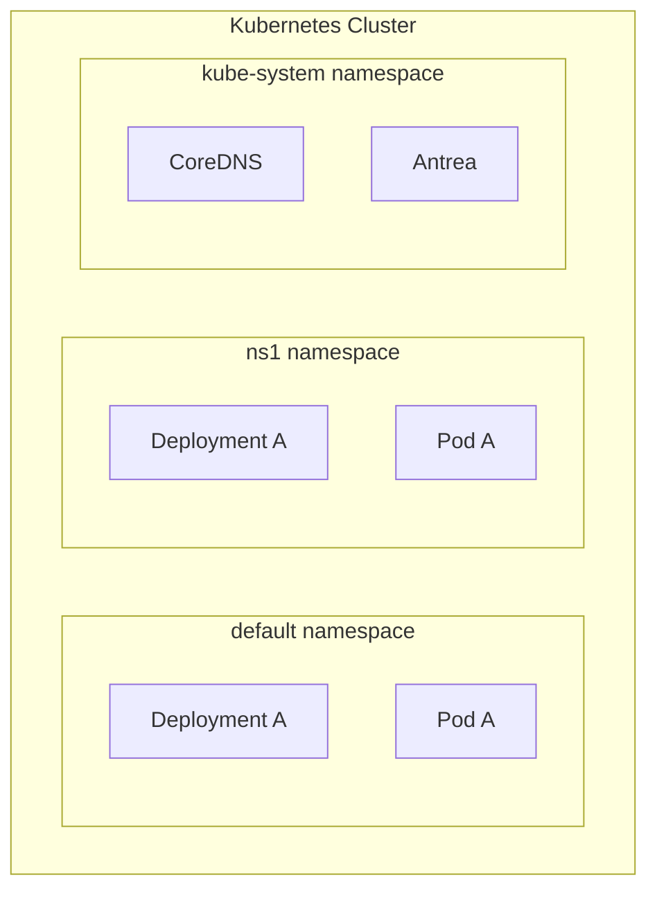
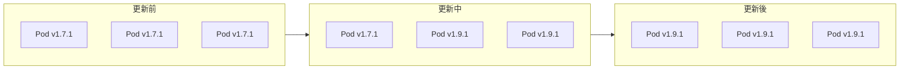

# LAB 14 Namespace 與 Rolling Update

## 學習目標

完成本章節後，你將能夠：

- [ ] 使用 kubectl 建立與管理 Namespace
- [ ] 在不同 Namespace 中部署與查詢資源
- [ ] 使用 `--dry-run=client -o yaml` 產生 YAML 檔案
- [ ] 使用 `kubectl apply -f` 套用 YAML 更新進行 Rolling Update
- [ ] 使用 `kubectl rollout` 查看歷史紀錄與回滾版本

## 前置知識

開始之前，請確保你已經：

- 完成 LAB 13 Kubernetes 常用指令
- 熟悉 Pod、Deployment 基本概念
- 準備好 Kubernetes 叢集環境（k8s-master1）

---

## 核心概念說明

### Namespace 是什麼？

**Namespace（命名空間）** 是 Kubernetes 中用來**隔離資源的虛擬分區**。不同 Namespace 中的資源名稱可以相同，彼此不會衝突。



| Namespace 用途 | 說明 |
|----------------|------|
| **資源隔離** | 不同團隊或專案使用不同 Namespace |
| **權限控制** | 可以設定不同 Namespace 的存取權限 |
| **資源配額** | 可以限制各 Namespace 的資源使用量 |
| **名稱區隔** | 同名資源可以存在於不同 Namespace |

---

### Rolling Update 是什麼？

**Rolling Update（滾動更新）** 是 Kubernetes 更新 Deployment 的預設策略，會**逐步**將舊版 Pod 替換成新版，確保服務不中斷。



| Rolling Update 特性 | 說明 |
|---------------------|------|
| **零停機時間** | 更新過程中服務不中斷 |
| **逐步替換** | 一次只替換部分 Pod |
| **可回滾** | 發現問題可以回到先前版本 |
| **歷史紀錄** | 保留部署版本歷史 |

---

## Lab 實作練習：Namespace 管理

### 步驟 1：啟用 kubectl 指令自動補齊

設定 bash 自動補齊功能，方便操作：

```bash title="啟用 bash completion"
source <(kubectl completion bash)
```

!!! tip "永久生效"
    將上述指令加入 `~/.bashrc`，每次登入自動啟用：
    ```bash
    echo 'source <(kubectl completion bash)' >> ~/.bashrc
    ```

---

### 步驟 2：清理所有資源

使用 `kubectl delete all --all` 刪除目前 Namespace 中的所有資源：

```bash title="刪除所有資源"
kubectl delete all --all
```

**預期結果**：

```
pod "test4" deleted
pod "test5-8464657978-5jgj6" deleted
service "kubernetes" deleted
deployment.apps "test5" deleted
deployment.apps "test6" deleted
replicaset.apps "test5-8464657978" deleted
horizontalpodautoscaler.autoscaling "test5" deleted
```

!!! info "all 包含哪些資源？"
    `kubectl delete all --all` 會刪除以下資源類型：
    
    - Pod
    - Service
    - Deployment
    - ReplicaSet
    - StatefulSet
    - DaemonSet
    - Job
    - CronJob
    
    **不包含**：ConfigMap、Secret、PV、PVC、Namespace 等。

---

### 步驟 3：查看現有 Namespace

```bash title="查看所有 Namespace"
kubectl get namespaces
```

**預期結果**：

```
NAME              STATUS   AGE
default           Active   19h
kube-node-lease   Active   19h
kube-public       Active   19h
kube-system       Active   19h
```

| Namespace | 用途 |
|-----------|------|
| **default** | 預設命名空間，未指定時使用 |
| **kube-system** | Kubernetes 系統元件（CoreDNS、CNI 等） |
| **kube-public** | 公開資源，所有使用者可讀取 |
| **kube-node-lease** | 節點心跳資訊 |

---

### 步驟 4：建立自訂 Namespace

```bash title="建立 Namespace"
kubectl create namespace ns1
kubectl create namespace ns2
```

**預期結果**：

```
namespace/ns1 created
namespace/ns2 created
```

驗證建立結果：

```bash title="查看 Namespace"
kubectl get namespaces
```

**預期結果**：

```
NAME              STATUS   AGE
default           Active   19h
kube-node-lease   Active   19h
kube-public       Active   19h
kube-system       Active   19h
ns1               Active   12s
ns2               Active   8s
```

---

### 步驟 5：在不同 Namespace 建立 Deployment

使用 `--namespace=` 參數指定 Namespace：

```bash title="在 ns1 建立 Deployment"
kubectl create deployment test1 --image=docker1.training.lab:5000/nginx --namespace=ns1
```

```bash title="在 ns2 建立 Deployment"
kubectl create deployment test2 --image=docker1.training.lab:5000/nginx --namespace=ns2
```

**預期結果**：

```
deployment.apps/test1 created
deployment.apps/test2 created
```

---

### 步驟 6：查詢不同 Namespace 的資源

查詢預設 Namespace（會找不到資源）：

```bash title="查詢 default Namespace"
kubectl get deployments.apps
```

**預期結果**：

```
No resources found in default namespace.
```

查詢所有 Namespace：

```bash title="查詢所有 Namespace（完整參數）"
kubectl get deployments.apps --all-namespaces
```

```bash title="查詢所有 Namespace（簡寫）"
kubectl get deployments.apps -A
```

**預期結果**：

```
NAMESPACE     NAME                READY   UP-TO-DATE   AVAILABLE   AGE
kube-system   antrea-controller   1/1     1            1           19h
kube-system   coredns             2/2     2            2           19h
ns1           test1               1/1     1            1           43s
ns2           test2               1/1     1            1           27s
```

查詢特定 Namespace：

```bash title="查詢 ns1 的 Deployment"
kubectl get deployments.apps --namespace=ns1
```

```bash title="查詢 ns2 的 Deployment（簡寫）"
kubectl get deployments.apps -n ns2
```

!!! warning "常見錯誤"
    **錯誤寫法**：`--namespaces=ns1`（多了 s）
    
    **正確寫法**：`--namespace=ns1` 或 `-n ns1`

---

### 步驟 7：刪除 Namespace

刪除 Namespace 會**同時刪除該 Namespace 中的所有資源**：

```bash title="刪除 Namespace"
kubectl delete namespace ns1
kubectl delete namespace ns2
```

!!! warning "刪除時間"
    Namespace 刪除可能需要一段時間，狀態會變成 `Terminating`：
    ```
    NAME   STATUS        AGE
    ns1    Terminating   3m5s
    ns2    Terminating   3m1s
    ```
    等待刪除完成即可。

!!! danger "系統 Namespace 無法刪除"
    `default`、`kube-public`、`kube-system` 為系統保護的 Namespace，無法被刪除。

---

## Lab 實作練習：Rolling Update 滾動更新

### 步驟 1：使用 dry-run 產生 YAML

使用 `--dry-run=client -o yaml` 可以產生 YAML 檔案而不實際建立資源：

```bash title="產生 nginx 1.7.1 的 Deployment YAML"
kubectl create deployment test1 --image=docker1.training.lab:5000/nginx:1.7.1 --replicas=3 --dry-run=client -o yaml > test1-1.7.1.yaml
```

查看產生的 YAML：

```bash title="查看 YAML 內容"
cat test1-1.7.1.yaml
```

**YAML 內容**：

```yaml title="test1-1.7.1.yaml"
apiVersion: apps/v1
kind: Deployment
metadata:
  creationTimestamp: null
  labels:
    app: test1
  name: test1
spec:
  replicas: 3
  selector:
    matchLabels:
      app: test1
  strategy: {}
  template:
    metadata:
      creationTimestamp: null
      labels:
        app: test1
    spec:
      containers:
      - image: docker1.training.lab:5000/nginx:1.7.1
        name: nginx
        resources: {}
status: {}
```

!!! tip "dry-run 的用途"
    - **產生 YAML 模板**：快速產生標準格式的 YAML
    - **版本管理**：將 YAML 存入 Git 進行版本控制
    - **測試指令**：驗證指令語法正確但不實際執行

---

### 步驟 2：套用 YAML 建立 Deployment

```bash title="套用 YAML"
kubectl apply -f test1-1.7.1.yaml
```

**預期結果**：

```
deployment.apps/test1 created
```

---

### 步驟 3：監控 Deployment 狀態

使用 while 迴圈持續監控映像檔版本：

```bash title="監控 Pod 映像檔版本"
while true; do 
  for i in $(kubectl get pods | tail -n +2 | awk '{ print $1 }'); do 
    kubectl get pod ${i} -o yaml | grep "\- image: .*nginx"
  done
  echo
  kubectl get deployments -o wide
  echo
  sleep 1
done
```

**預期結果**：

```
  - image: docker1.training.lab:5000/nginx:1.7.1
  - image: docker1.training.lab:5000/nginx:1.7.1
  - image: docker1.training.lab:5000/nginx:1.7.1

NAME    READY   UP-TO-DATE   AVAILABLE   AGE     CONTAINERS   IMAGES                                  SELECTOR
test1   3/3     3            3           3m45s   nginx        docker1.training.lab:5000/nginx:1.7.1   app=test1
```

按 `Ctrl+C` 停止監控。

---

### 步驟 4：產生新版本 YAML

產生 nginx 1.9.1 版本的 YAML：

```bash title="產生 nginx 1.9.1 的 YAML"
kubectl create deployment test1 --image=docker1.training.lab:5000/nginx:1.9.1 --replicas=3 --dry-run=client -o yaml > test1-1.9.1.yaml
```

---

### 步驟 5：執行 Rolling Update

使用 `kubectl apply -f` 套用新版本 YAML，觸發滾動更新：

```bash title="套用新版本進行滾動更新"
kubectl apply -f test1-1.9.1.yaml
```

!!! info "apply vs create"
    - `kubectl create`：建立新資源，如果已存在會報錯
    - `kubectl apply`：建立或更新資源，如果已存在會進行更新

---

### 步驟 6：查看 Rollout 歷史紀錄

```bash title="查看部署歷史"
kubectl rollout history deployment test1
```

**預期結果**：

```
deployment.apps/test1
REVISION  CHANGE-CAUSE
1         <none>
2         <none>
```

| 欄位 | 說明 |
|------|------|
| **REVISION** | 版本號，每次更新遞增 |
| **CHANGE-CAUSE** | 變更原因（可用 `--record` 記錄） |

---

### 步驟 7：回滾到先前版本

```bash title="回滾 Deployment"
kubectl rollout undo deployment test1
```

**預期結果**：

```
deployment.apps/test1 rolled back
```

查看回滾後的歷史：

```bash title="查看回滾後的歷史"
kubectl rollout history deployment test1
```

**預期結果**：

```
deployment.apps/test1
REVISION  CHANGE-CAUSE
2         <none>
3         <none>
```

!!! note "版本號說明"
    回滾後，REVISION 不會回到 1，而是產生新的版本號 3。這是因為回滾操作本身也算是一次部署。

---

### 步驟 8：從 URL 套用與刪除 YAML

可以直接從 URL 套用 YAML 檔案：

```bash title="從 URL 套用 YAML"
kubectl apply -f https://raw.githubusercontent.com/kubernetes/website/main/content/en/examples/controllers/nginx-deployment.yaml
```

**預期結果**：

```
deployment.apps/nginx-deployment created
```

查看部署結果：

```bash title="查看 Deployment"
kubectl get deployments.apps
kubectl get pods
```

**預期結果**：

```
NAME               READY   UP-TO-DATE   AVAILABLE   AGE
nginx-deployment   3/3     3            3           77s
test1              3/3     3            3           9m18s

NAME                                READY   STATUS    RESTARTS   AGE
nginx-deployment-647677fc66-2m6ww   1/1     Running   0          82s
nginx-deployment-647677fc66-4zmqw   1/1     Running   0          82s
nginx-deployment-647677fc66-8h9zg   1/1     Running   0          82s
```

從 URL 刪除資源：

```bash title="從 URL 刪除 YAML 定義的資源"
kubectl delete -f https://raw.githubusercontent.com/kubernetes/website/main/content/en/examples/controllers/nginx-deployment.yaml
```

**預期結果**：

```
deployment.apps "nginx-deployment" deleted
```

---

## 常用指令對照表

### Namespace 操作

| 操作 | 指令 | 範例 |
|------|------|------|
| **建立 Namespace** | `kubectl create namespace` | `kubectl create namespace ns1` |
| **查看 Namespace** | `kubectl get namespaces` | `kubectl get ns` |
| **刪除 Namespace** | `kubectl delete namespace` | `kubectl delete namespace ns1` |
| **指定 Namespace** | `--namespace=` 或 `-n` | `kubectl get pods -n ns1` |
| **查看所有 Namespace** | `--all-namespaces` 或 `-A` | `kubectl get pods -A` |

### Rolling Update 操作

| 操作 | 指令 | 範例 |
|------|------|------|
| **產生 YAML** | `--dry-run=client -o yaml` | `kubectl create deploy test --image=nginx --dry-run=client -o yaml` |
| **套用 YAML** | `kubectl apply -f` | `kubectl apply -f deployment.yaml` |
| **查看歷史** | `kubectl rollout history` | `kubectl rollout history deployment test` |
| **回滾版本** | `kubectl rollout undo` | `kubectl rollout undo deployment test` |
| **回滾到指定版本** | `--to-revision` | `kubectl rollout undo deployment test --to-revision=1` |
| **查看狀態** | `kubectl rollout status` | `kubectl rollout status deployment test` |

---

## 常見問題

??? question "Q1：Namespace 刪除一直卡在 Terminating 狀態？"
    **原因**：Namespace 中可能有無法正常刪除的資源。
    
    **解決方案**：
    ```bash
    # 查看卡住的資源
    kubectl get all -n <namespace>
    
    # 強制刪除
    kubectl delete namespace <namespace> --force --grace-period=0
    ```

??? question "Q2：如何回滾到特定版本？"
    **解答**：使用 `--to-revision` 參數：
    
    ```bash
    # 先查看版本歷史
    kubectl rollout history deployment test1
    
    # 回滾到指定版本
    kubectl rollout undo deployment test1 --to-revision=1
    ```

??? question "Q3：--dry-run=client 和 --dry-run=server 的差別？"
    **解答**：
    
    - `--dry-run=client`：在客戶端執行，不與 API Server 通訊
    - `--dry-run=server`：送到 API Server 驗證，但不實際建立資源
    
    一般產生 YAML 使用 `--dry-run=client` 即可。

---

## 小結

本章節重點回顧：

- ✅ **Namespace 管理**：使用 `kubectl create/delete namespace` 建立與刪除命名空間
- ✅ **跨 Namespace 查詢**：使用 `--namespace=`、`-n`、`-A` 參數
- ✅ **YAML 產生**：使用 `--dry-run=client -o yaml` 產生 YAML 模板
- ✅ **Rolling Update**：使用 `kubectl apply -f` 進行滾動更新
- ✅ **歷史紀錄**：使用 `kubectl rollout history` 查看部署歷史
- ✅ **版本回滾**：使用 `kubectl rollout undo` 回滾到先前版本

## 延伸閱讀

- [Kubernetes Namespaces](https://kubernetes.io/docs/concepts/overview/working-with-objects/namespaces/)
- [Deployment 滾動更新](https://kubernetes.io/docs/concepts/workloads/controllers/deployment/#updating-a-deployment)
- [Rollback 部署回滾](https://kubernetes.io/docs/concepts/workloads/controllers/deployment/#rolling-back-a-deployment)
