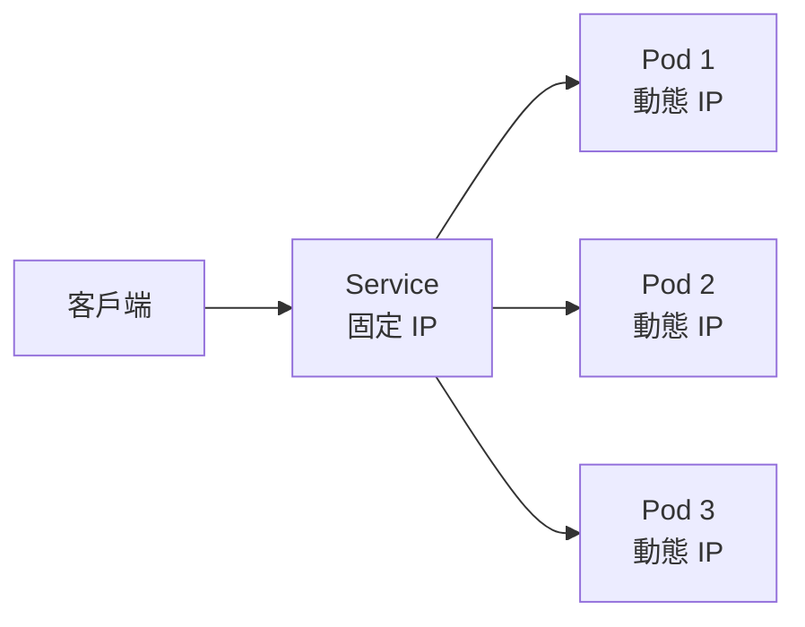
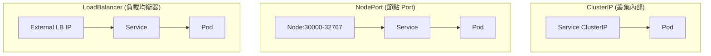
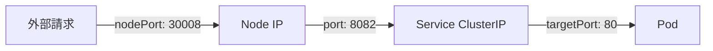
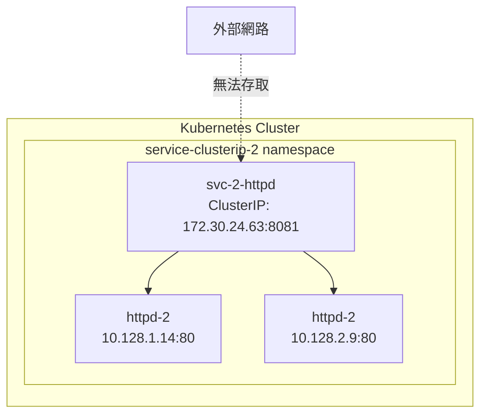
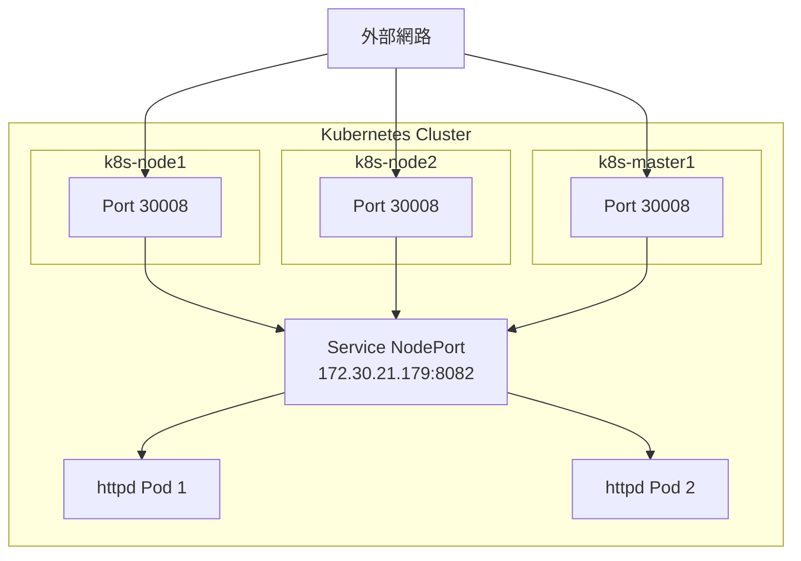
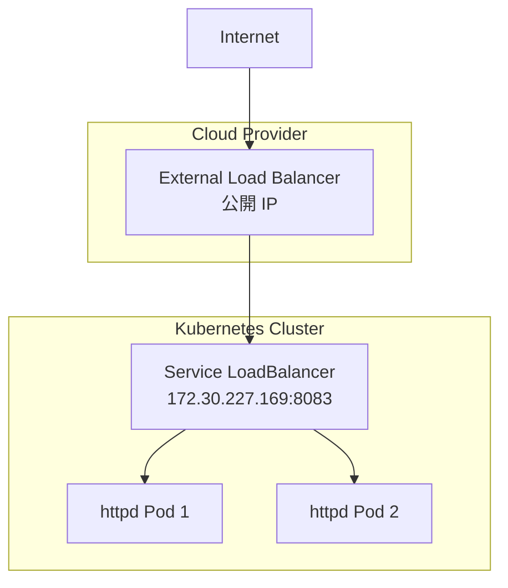

# LAB 15 Kubernetes Service

## 學習目標

完成本章節後，你將能夠：

- [ ] 理解 Kubernetes Service 的三種類型
- [ ] 建立 ClusterIP 類型的 Service
- [ ] 建立 NodePort 類型的 Service
- [ ] 建立 LoadBalancer 類型的 Service
- [ ] 使用 curl 驗證 Service 的負載均衡功能

## 前置知識

開始之前，請確保你已經：

- 完成 LAB 14 Namespace 與 Rolling Update
- 熟悉 Pod、Deployment 基本概念
- 準備好 Kubernetes 叢集環境（k8s-master1）

---

## 核心概念說明

### Service 是什麼？

**Service（服務）** 是 Kubernetes 中用來**暴露應用程式的穩定網路端點**。由於 Pod 的 IP 是動態的，每次重建可能會改變，Service 提供了一個固定的 IP 和 DNS 名稱，讓其他應用程式可以穩定地存取 Pod。



---

### Service 類型比較

| 類型 | 存取範圍 | 使用場景 |
|------|----------|----------|
| **ClusterIP** | 叢集內部 | 內部服務、微服務間通訊 |
| **NodePort** | 叢集外部（透過 Node IP） | 開發測試、小型部署 |
| **LoadBalancer** | 叢集外部（透過 LB IP） | 生產環境、雲端部署 |



---

### Port 對應關係

Service 涉及三種 Port：

| Port 名稱 | 說明 | 範例 |
|-----------|------|------|
| **port** | Service 的 Port（ClusterIP 使用） | 8081 |
| **targetPort** | Pod/Container 的 Port | 80 |
| **nodePort** | Node 對外開放的 Port（30000-32767） | 30008 |



---

## Lab 實作練習：ClusterIP Service

### ClusterIP 概述

**ClusterIP** 是 Service 的預設類型，只能從叢集**內部**存取。



---

### 步驟 1：下載 ClusterIP YAML

```bash title="下載 ClusterIP 範例"
wget http://10.0.1.249/k8s/yaml/service-clusterIP.yaml
```

查看 YAML 內容：

```bash title="查看 YAML"
cat service-clusterIP.yaml
```

**YAML 內容**：

```yaml title="service-clusterIP.yaml"
---
apiVersion: v1
kind: Namespace
metadata:
  name: service-clusterip-2
---
apiVersion: v1
kind: Service
metadata:
  name: svc-2-httpd
  labels:
    app: svc-2-httpd
  namespace: service-clusterip-2
spec:
  type: ClusterIP
  ports:
  - port: 8081        # Service Port
    targetPort: 80    # Pod Port
  selector:
    app: httpd-2      # 選擇帶有此 Label 的 Pod
---
apiVersion: apps/v1
kind: Deployment
metadata:
  name: httpd-2
  labels:
    app: httpd-2
  namespace: service-clusterip-2
spec:
  replicas: 2
  selector:
    matchLabels:
      app: httpd-2
  template:
    metadata:
      labels:
        app: httpd-2
    spec:
      containers:
      - image: docker1.training.lab:5000/httpd
        name: httpd
        ports:
        - containerPort: 80
```

!!! info "YAML 結構說明"
    此 YAML 包含三個資源：
    
    1. **Namespace**：建立 `service-clusterip-2` 命名空間
    2. **Service**：建立 ClusterIP 類型的 Service
    3. **Deployment**：建立 2 個 httpd Pod

---

### 步驟 2：套用 YAML

```bash title="套用 YAML"
kubectl apply -f service-clusterIP.yaml
```

**預期結果**：

```
namespace/service-clusterip-2 created
service/svc-2-httpd created
deployment.apps/httpd-2 created
```

---

### 步驟 3：查看 Service

```bash title="查看所有 Service"
kubectl get service -A
```

**預期結果**：

```
NAMESPACE             NAME          TYPE        CLUSTER-IP       EXTERNAL-IP   PORT(S)                  AGE
default               kubernetes    ClusterIP   172.30.0.1       <none>        443/TCP                  13m
kube-system           antrea        ClusterIP   172.30.116.178   <none>        443/TCP                  105m
kube-system           kube-dns      ClusterIP   172.30.0.10      <none>        53/UDP,53/TCP,9153/TCP   106m
service-clusterip-2   svc-2-httpd   ClusterIP   172.30.24.63     <none>        8081/TCP                 95s
```

---

### 步驟 4：查看 Pod 並修改內容

查看 Pod：

```bash title="查看 Pod"
kubectl get pods --namespace=service-clusterip-2 -o wide
```

**預期結果**：

```
NAME                       READY   STATUS    RESTARTS   AGE     IP            NODE
httpd-2-68b85d46c7-t4v87   1/1     Running   0          5m16s   10.128.1.14   k8s-node1.training.lab
httpd-2-68b85d46c7-trhk5   1/1     Running   0          5m16s   10.128.2.9    k8s-node2.training.lab
```

進入第一個 Pod 修改首頁：

```bash title="進入 Pod 1 修改內容"
kubectl exec httpd-2-68b85d46c7-t4v87 --namespace=service-clusterip-2 -it -- bash
```

```bash title="在容器內執行"
cd htdocs/
echo AAA > index.html
exit
```

進入第二個 Pod 修改首頁：

```bash title="進入 Pod 2 修改內容"
kubectl exec httpd-2-68b85d46c7-trhk5 --namespace=service-clusterip-2 -it -- bash
```

```bash title="在容器內執行"
cd htdocs/
echo BBB > index.html
exit
```

---

### 步驟 5：測試 ClusterIP 負載均衡

直接存取 Pod IP：

```bash title="直接存取 Pod IP"
curl 10.128.1.14
curl 10.128.2.9
```

**預期結果**：

```
AAA
BBB
```

透過 Service ClusterIP 存取（會自動負載均衡）：

```bash title="存取 Service ClusterIP"
curl 172.30.24.63:8081
curl 172.30.24.63:8081
```

**預期結果**（每次可能不同）：

```
BBB
AAA
```

!!! success "負載均衡驗證"
    多次存取 Service IP，會發現回應內容在 AAA 和 BBB 之間切換，這表示 Service 正在進行負載均衡。

---

## Lab 實作練習：NodePort Service

### NodePort 概述

**NodePort** 會在每個 Node 上開放一個固定的 Port（30000-32767），允許從叢集**外部**存取。



---

### 步驟 1：下載 NodePort YAML

```bash title="下載 NodePort 範例"
wget http://10.0.1.248/k8s/yaml/service-nodeport.yaml
```

查看 YAML 內容：

```bash title="查看 YAML"
cat service-nodeport.yaml
```

**YAML 重點**：

```yaml title="service-nodeport.yaml（摘錄）"
apiVersion: v1
kind: Service
metadata:
  name: svc-2-httpd-nodeport
  namespace: service-nodeport-2
spec:
  type: NodePort          # NodePort 類型
  ports:
  - port: 8082            # Service Port
    targetPort: 80        # Pod Port
    nodePort: 30008       # Node 對外 Port
  selector:
    app: httpd-2-nodeport
```

---

### 步驟 2：套用 YAML

```bash title="套用 YAML"
kubectl apply -f service-nodeport.yaml
```

**預期結果**：

```
namespace/service-nodeport-2 created
service/svc-2-httpd-nodeport created
deployment.apps/httpd-2-nodeport created
```

---

### 步驟 3：查看 Service

```bash title="查看 Service"
kubectl get services -A
```

**預期結果**：

```
NAMESPACE             NAME                   TYPE        CLUSTER-IP       EXTERNAL-IP   PORT(S)          AGE
service-clusterip-2   svc-2-httpd            ClusterIP   172.30.24.63     <none>        8081/TCP         9m25s
service-nodeport-2    svc-2-httpd-nodeport   NodePort    172.30.21.179    <none>        8082:30008/TCP   72s
```

!!! note "Port 格式說明"
    `8082:30008/TCP` 表示：
    
    - **8082**：Service 的 ClusterIP Port
    - **30008**：Node 對外的 NodePort

---

### 步驟 4：測試 NodePort 存取

透過 Pod IP 存取：

```bash title="存取 Pod IP"
kubectl get pods --namespace=service-nodeport-2 -o wide
curl 10.128.1.15
curl 10.128.2.10
```

透過 Service ClusterIP 存取：

```bash title="存取 Service ClusterIP"
curl 172.30.21.179:8082
```

**透過任意 Node 的 NodePort 存取**：

```bash title="存取 NodePort"
curl k8s-node1:30008
curl k8s-node2:30008
curl k8s-master1:30008
```

**預期結果**（三個都可以存取）：

```
<html><body><h1>It works!</h1></body></html>
```

!!! success "NodePort 特性"
    NodePort 會在**所有 Node**（包含 Master 和 Worker）上開放相同的 Port，無論 Pod 實際運行在哪個 Node 上。

---

## Lab 實作練習：LoadBalancer Service

### LoadBalancer 概述

**LoadBalancer** 是最高級的 Service 類型，會向雲端供應商請求一個**外部負載均衡器 IP**。



---

### 步驟 1：下載 LoadBalancer YAML

```bash title="下載 LoadBalancer 範例"
wget http://192.168.66.248/k8s/yaml/service-loadbalancer.yaml
```

查看 YAML 內容：

```bash title="查看 YAML"
cat service-loadbalancer.yaml
```

**YAML 重點**：

```yaml title="service-loadbalancer.yaml（摘錄）"
apiVersion: v1
kind: Service
metadata:
  name: svc-2-httpd-lb
  namespace: service-loadbalancer-1
spec:
  type: LoadBalancer      # LoadBalancer 類型
  ports:
  - port: 8083            # Service Port
    targetPort: 80        # Pod Port
  selector:
    app: httpd-2-lb
```

---

### 步驟 2：套用 YAML

```bash title="套用 YAML"
kubectl apply -f service-loadbalancer.yaml
```

**預期結果**：

```
namespace/service-loadbalancer-1 created
service/svc-2-httpd-lb created
deployment.apps/httpd-2-lb created
```

---

### 步驟 3：查看 Service

```bash title="查看 Service"
kubectl get services --namespace=service-loadbalancer-1
```

**預期結果**：

```
NAME             TYPE           CLUSTER-IP       EXTERNAL-IP   PORT(S)          AGE
svc-2-httpd-lb   LoadBalancer   172.30.227.169   <pending>     8083:32254/TCP   60s
```

!!! warning "EXTERNAL-IP 顯示 pending"
    在非雲端環境（如本地 VMware），沒有外部負載均衡器可用，所以 EXTERNAL-IP 會一直顯示 `<pending>`。
    
    在 AWS、GCP、Azure 等雲端環境中，會自動分配一個公開 IP。

---

### 步驟 4：測試 LoadBalancer 存取

```bash title="查看 Pod"
kubectl get pods --namespace=service-loadbalancer-1 -o wide
```

透過 Pod IP 存取：

```bash title="存取 Pod IP"
curl 10.128.2.11
curl 10.128.1.16
```

透過 Service ClusterIP 存取：

```bash title="存取 Service ClusterIP"
curl 172.30.227.169:8083
```

透過 NodePort 存取（LoadBalancer 自動分配）：

```bash title="存取自動分配的 NodePort"
curl k8s-node1:32254
curl k8s-node2:32254
curl k8s-master1:32254
```

!!! info "LoadBalancer 自動分配 NodePort"
    LoadBalancer 類型的 Service 會自動分配一個 NodePort（此例為 32254），所以也可以透過 Node IP:NodePort 存取。

---

## Service 類型總結

| 特性 | ClusterIP | NodePort | LoadBalancer |
|------|-----------|----------|--------------|
| **存取範圍** | 叢集內部 | 叢集內外 | 叢集內外 |
| **固定 IP** | ClusterIP | ClusterIP + NodePort | ClusterIP + NodePort + External IP |
| **使用場景** | 微服務內部通訊 | 開發測試 | 生產環境 |
| **Port 範圍** | 不限 | 30000-32767 | 不限 |
| **需要雲端** | 否 | 否 | 是 |

---

## 常見問題

??? question "Q1：Service 如何找到對應的 Pod？"
    **解答**：透過 `selector` 標籤選擇器。Service 會將流量導向所有符合 selector 條件的 Pod。
    
    ```yaml
    spec:
      selector:
        app: httpd-2  # 選擇帶有 app=httpd-2 標籤的 Pod
    ```

??? question "Q2：LoadBalancer 的 EXTERNAL-IP 一直是 pending？"
    **原因**：在非雲端環境沒有外部負載均衡器。
    
    **解決方案**：
    
    - 使用 MetalLB 在本地環境模擬 LoadBalancer
    - 或直接使用 NodePort 類型

??? question "Q3：NodePort 的 Port 範圍可以修改嗎？"
    **解答**：可以，修改 kube-apiserver 的 `--service-node-port-range` 參數。
    
    預設範圍：30000-32767

??? question "Q4：Pod 一直處於 Pending 狀態？"
    **原因**：通常是節點或 CNI 未就緒。
    
    **Debug 流程**：
    
    ```bash
    # 1. 檢查節點狀態
    kubectl get nodes
    
    # 2. 檢查 CNI Pod（Antrea）
    kubectl get pods -n kube-system | grep antrea
    
    # 3. 查看 Pod 事件
    kubectl describe pod <pod-name> -n <namespace>
    
    # 4. 查看容器日誌
    kubectl logs <pod-name> -n kube-system -c <container-name> --tail=50
    ```
    
    詳細 Debug 流程請參考 [LAB 18 RBAC 與 Event/Log](lab18_rbac_event_log.md)。

---

## 小結

本章節重點回顧：

- ✅ **Service 概念**：提供穩定的網路端點存取 Pod
- ✅ **ClusterIP**：預設類型，僅叢集內部存取
- ✅ **NodePort**：透過 Node IP:Port 從外部存取（30000-32767）
- ✅ **LoadBalancer**：透過外部負載均衡器存取（需雲端環境）
- ✅ **Port 對應**：port（Service）→ targetPort（Pod）→ nodePort（Node）
- ✅ **負載均衡**：Service 自動將流量分散到多個 Pod

## 延伸閱讀

- [Kubernetes Service](https://kubernetes.io/docs/concepts/services-networking/service/)
- [Service Types](https://kubernetes.io/docs/concepts/services-networking/service/#publishing-services-service-types)
- [MetalLB - LoadBalancer for Bare Metal](https://metallb.io/)

## YAML 實用工具

| 工具 | 用途 | 連結 |
|------|------|------|
| **YAMLint** | 驗證 YAML 語法 | [www.yamllint.com](http://www.yamllint.com/) |
| **YAML to JSON** | 將 YAML 轉換為 JSON | [www.convertjson.com](https://www.convertjson.com/yaml-to-json.htm) |
| **YAML to JSON/XML/CSV** | 多格式轉換 | [codebeautify.org](https://codebeautify.org/yaml-to-json-xml-csv) |

!!! tip "YAML 驗證技巧"
    在套用 YAML 檔案之前，建議先使用線上工具驗證語法是否正確，避免因縮排或格式錯誤導致部署失敗。

