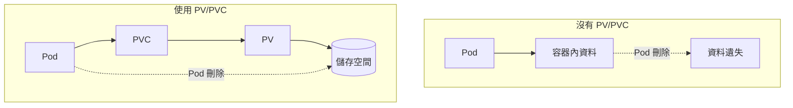
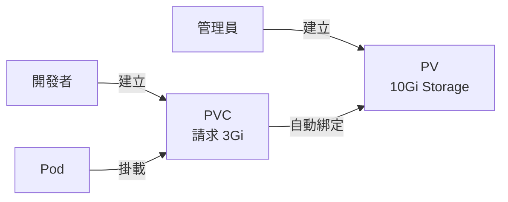
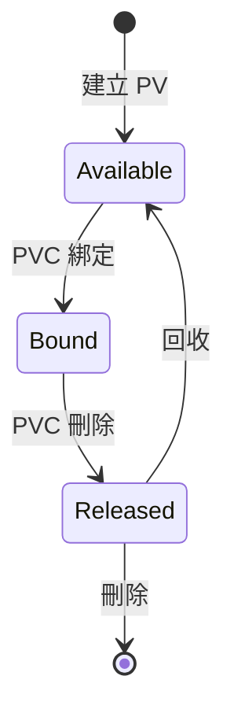

# LAB 16 Persistent Volume（PV）與 Persistent Volume Claim（PVC）

## 學習目標

完成本章節後，你將能夠：

- [ ] 理解 PV 與 PVC 的概念與關係
- [ ] 使用 hostPath 建立本地儲存的 PV
- [ ] 建立 PVC 並綁定 PV
- [ ] 在 Pod 中掛載 PVC
- [ ] 設定 NFS Server 提供網路儲存
- [ ] 使用 NFS 類型的 PV 實現跨節點共享儲存

## 前置知識

開始之前，請確保你已經：

- 完成 LAB 15 Service
- 熟悉 Pod、Deployment 基本概念
- 準備好 Kubernetes 叢集環境（k8s-master1、k8s-node1、k8s-node2）

---

## 核心概念說明

### 為什麼需要 PV/PVC？

Pod 的儲存是**臨時性的**，當 Pod 被刪除或重新調度時，容器內的資料也會消失。PV/PVC 提供了**持久化儲存**的解決方案。



---

### PV 與 PVC 的關係

| 概念 | 說明 | 誰管理 |
|------|------|--------|
| **PV（Persistent Volume）** | 叢集中的儲存資源，類似 Node | 管理員 |
| **PVC（Persistent Volume Claim）** | 使用者對儲存的請求，類似 Pod | 開發者 |



---

### PV 的生命週期



| 狀態 | 說明 |
|------|------|
| **Available** | 可用，尚未被 PVC 綁定 |
| **Bound** | 已綁定，被某個 PVC 使用中 |
| **Released** | PVC 已刪除，但資源尚未回收 |
| **Failed** | 自動回收失敗 |

---

### 儲存類型比較

| 類型 | 說明 | 優點 | 缺點 |
|------|------|------|------|
| **hostPath** | 節點本地路徑 | 簡單、快速 | Pod 只能在特定節點運行 |
| **NFS** | 網路檔案系統 | 跨節點共享 | 需要 NFS Server |
| **CSI** | 容器儲存介面 | 支援各種雲端儲存 | 設定較複雜 |

---

## Lab 實作練習：hostPath 本地儲存

### 架構說明

使用 hostPath 時，Pod 會使用節點上的本地目錄作為儲存空間。

```mermaid
graph TB
    subgraph "k8s-node1"
        Pod1[pv1-pod-local]
        Path1[/mnt/data<br/>index.html: node1...AAA]
        Pod1 --> Path1
    end
    
    subgraph "k8s-node2"
        Path2[/mnt/data<br/>index.html: node2...BBB]
    end
```

!!! warning "hostPath 限制"
    使用 hostPath 時，Pod 只能運行在有該路徑的節點上。如果 Pod 被調度到其他節點，可能會找不到資料或看到不同的資料。

---

### 步驟 1：在 Worker Node 準備本地目錄

**在 k8s-node1 上執行**：

```bash title="在 node1 建立目錄和測試檔案"
mkdir -p /mnt/data
echo "node1...AAA" > /mnt/data/index.html
cat /mnt/data/index.html
```

**預期結果**：

```
node1...AAA
```

**在 k8s-node2 上執行**：

```bash title="在 node2 建立目錄和測試檔案"
mkdir -p /mnt/data
echo "node2...BBB" > /mnt/data/index.html
cat /mnt/data/index.html
```

**預期結果**：

```
node2...BBB
```

---

### 步驟 2：建立 PV（Persistent Volume）

回到 k8s-master1，下載並查看 PV YAML：

```bash title="下載 PV YAML"
wget http://10.0.1.248/k8s/yaml/pv1-local.yaml
```

**PV YAML 內容**：

```yaml title="pv1-local.yaml"
apiVersion: v1
kind: PersistentVolume
metadata:
  name: pv1-local
spec:
  capacity:
    storage: 10Gi            # 儲存容量
  accessModes:
    - ReadWriteOnce          # 存取模式
  persistentVolumeReclaimPolicy: Retain  # 回收策略
  storageClassName: manual   # 儲存類別
  hostPath:
    path: "/mnt/data"        # 節點本地路徑
```

| 欄位 | 說明 |
|------|------|
| **capacity** | 儲存容量（10Gi = 10 GiB） |
| **accessModes** | RWO（單節點讀寫）、ROX（多節點唯讀）、RWX（多節點讀寫） |
| **persistentVolumeReclaimPolicy** | Retain（保留）、Delete（刪除）、Recycle（回收） |
| **storageClassName** | 用於 PVC 配對的類別名稱 |
| **hostPath** | 節點本地路徑 |

套用 PV：

```bash title="建立 PV"
kubectl apply -f pv1-local.yaml
```

查看 PV 狀態：

```bash title="查看 PV"
kubectl get pv
```

**預期結果**：

```
NAME        CAPACITY   ACCESS MODES   RECLAIM POLICY   STATUS      CLAIM   STORAGECLASS   AGE
pv1-local   10Gi       RWO            Retain           Available           manual         3s
```

!!! success "PV 狀態"
    狀態顯示 `Available`，表示 PV 可用，尚未被 PVC 綁定。

---

### 步驟 3：建立 PVC（Persistent Volume Claim）

```bash title="下載 PVC YAML"
wget http://10.0.1.248/k8s/yaml/pvc1-local.yaml
```

**PVC YAML 內容**：

```yaml title="pvc1-local.yaml"
apiVersion: v1
kind: PersistentVolumeClaim
metadata:
  name: pvc1-local
spec:
  accessModes:
    - ReadWriteOnce          # 必須與 PV 相容
  resources:
    requests:
      storage: 3Gi           # 請求的容量
  storageClassName: manual   # 必須與 PV 相同
```

套用 PVC：

```bash title="建立 PVC"
kubectl apply -f pvc1-local.yaml
```

查看 PV 和 PVC 狀態：

```bash title="查看 PV 狀態"
kubectl get pv
```

**預期結果**：

```
NAME        CAPACITY   ACCESS MODES   RECLAIM POLICY   STATUS   CLAIM                STORAGECLASS   AGE
pv1-local   10Gi       RWO            Retain           Bound    default/pvc1-local   manual         95s
```

```bash title="查看 PVC 狀態"
kubectl get pvc
```

**預期結果**：

```
NAME         STATUS   VOLUME      CAPACITY   ACCESS MODES   STORAGECLASS   AGE
pvc1-local   Bound    pv1-local   10Gi       RWO            manual         5s
```

!!! success "綁定成功"
    PV 和 PVC 的狀態都變成 `Bound`，表示綁定成功。CLAIM 欄位顯示 `default/pvc1-local`，表示被哪個 Namespace 的 PVC 綁定。

---

### 步驟 4：建立使用 PVC 的 Pod

```bash title="下載 Pod YAML"
wget http://10.0.1.248/k8s/yaml/pv1-pod-local.yaml
```

**Pod YAML 內容**：

```yaml title="pv1-pod-local.yaml"
apiVersion: v1
kind: Pod
metadata:
  name: pv1-pod-local
spec:
  containers:
  - name: nginx
    image: docker1.training.lab:5000/nginx
    ports:
    - containerPort: 80
    volumeMounts:
    - mountPath: "/usr/share/nginx/html"  # 容器內掛載路徑
      name: pv1-storage
  volumes:
  - name: pv1-storage
    persistentVolumeClaim:
      claimName: pvc1-local                # 使用的 PVC 名稱
```

套用 Pod：

```bash title="建立 Pod"
kubectl apply -f pv1-pod-local.yaml
```

查看 Pod 狀態：

```bash title="查看 Pod"
kubectl get pods -o wide
```

**預期結果**：

```
NAME            READY   STATUS    RESTARTS   AGE   IP            NODE
pv1-pod-local   1/1     Running   0          21s   10.128.1.17   k8s-node1.training.lab
```

測試存取：

```bash title="測試存取"
curl 10.128.1.17
```

**預期結果**：

```
node1...AAA
```

!!! info "hostPath 的侷限"
    Pod 被調度到 node1，所以看到的是 node1 上的 `/mnt/data/index.html` 內容（node1...AAA）。如果 Pod 被調度到 node2，會看到不同的內容（node2...BBB）。

---

## Lab 實作練習：NFS 網路儲存

### 架構說明

使用 NFS 時，所有節點都可以存取相同的共享儲存空間。

```mermaid
graph TB
    subgraph "k8s-master1 (NFS Server)"
        NFS[NFS 服務]
        Data[/data<br/>index.html: master...CCC]
        NFS --> Data
    end
    
    subgraph "k8s-node1"
        Pod1[pv2-pod-nfs]
        Pod1 -.->|NFS 掛載| NFS
    end
    
    subgraph "k8s-node2"
        Pod2[Pod]
        Pod2 -.->|NFS 掛載| NFS
    end
```

---

### 步驟 1：安裝 NFS 工具

**在所有節點（master1、node1、node2）安裝 nfs-utils**：

```bash title="安裝 nfs-utils"
yum install nfs-utils -y
```

---

### 步驟 2：設定 NFS Server（k8s-master1）

**在 k8s-master1 上執行**：

建立共享目錄：

```bash title="建立共享目錄"
mkdir -p /data
echo "master...CCC" > /data/index.html
```

設定 NFS 匯出：

```bash title="編輯 /etc/exports"
vi /etc/exports
```

加入以下內容：

```title="/etc/exports"
/data *(rw,no_root_squash)
```

| 選項 | 說明 |
|------|------|
| `*` | 允許所有主機存取 |
| `rw` | 讀寫權限 |
| `no_root_squash` | root 使用者保持 root 權限 |

啟動 NFS 服務：

```bash title="啟動並啟用 NFS"
systemctl start nfs-server.service
systemctl enable nfs-server.service
systemctl status nfs-server.service
```

**預期結果**：

```
● nfs-server.service - NFS server and services
     Loaded: loaded (/usr/lib/systemd/system/nfs-server.service; enabled)
     Active: active (exited)
```

---

### 步驟 3：測試 NFS 掛載（k8s-node1）

**在 k8s-node1 上執行**：

```bash title="建立掛載點並掛載 NFS"
mkdir -p /mnt/nfs
mount -t nfs k8s-master1:/data /mnt/nfs
```

驗證掛載：

```bash title="驗證掛載"
df -Th | grep nfs
cat /mnt/nfs/index.html
```

**預期結果**：

```
k8s-master1:/data   nfs4   70G  7.4G  63G  11% /mnt/nfs
master...CCC
```

卸載（測試完成後）：

```bash title="卸載 NFS"
umount /mnt/nfs
```

---

### 步驟 4：建立 NFS PV

**回到 k8s-master1**：

```bash title="下載 NFS PV YAML"
wget http://10.0.1.248/k8s/yaml/pv2-nfs.yaml
```

**NFS PV YAML 內容**：

```yaml title="pv2-nfs.yaml"
apiVersion: v1
kind: PersistentVolume
metadata:
  name: pv2-nfs
spec:
  capacity:
    storage: 10Gi
  accessModes:
    - ReadWriteOnce
  persistentVolumeReclaimPolicy: Retain
  storageClassName: manual
  nfs:
    server: k8s-master1              # NFS Server 主機名稱
    path: "/data"                    # NFS 共享路徑
```

套用 PV：

```bash title="建立 NFS PV"
kubectl apply -f pv2-nfs.yaml
kubectl get pv
```

**預期結果**：

```
NAME        CAPACITY   ACCESS MODES   RECLAIM POLICY   STATUS      CLAIM                STORAGECLASS   AGE
pv1-local   10Gi       RWO            Retain           Bound       default/pvc1-local   manual         19m
pv2-nfs     10Gi       RWO            Retain           Available                        manual         3s
```

---

### 步驟 5：建立 NFS PVC

```bash title="下載 NFS PVC YAML"
wget http://10.0.1.248/k8s/yaml/pvc2-nfs.yaml
```

**NFS PVC YAML 內容**：

```yaml title="pvc2-nfs.yaml"
apiVersion: v1
kind: PersistentVolumeClaim
metadata:
  name: pvc2-nfs
spec:
  accessModes:
    - ReadWriteOnce
  resources:
    requests:
      storage: 3Gi
  storageClassName: manual
```

套用 PVC：

```bash title="建立 NFS PVC"
kubectl apply -f pvc2-nfs.yaml
kubectl get pv
kubectl get pvc
```

**預期結果**：

```
NAME        CAPACITY   ACCESS MODES   RECLAIM POLICY   STATUS   CLAIM                STORAGECLASS   AGE
pv1-local   10Gi       RWO            Retain           Bound    default/pvc1-local   manual         20m
pv2-nfs     10Gi       RWO            Retain           Bound    default/pvc2-nfs     manual         91s

NAME         STATUS   VOLUME      CAPACITY   ACCESS MODES   STORAGECLASS   AGE
pvc1-local   Bound    pv1-local   10Gi       RWO            manual         19m
pvc2-nfs     Bound    pv2-nfs     10Gi       RWO            manual         5s
```

---

### 步驟 6：建立使用 NFS PVC 的 Pod

```bash title="下載 NFS Pod YAML"
wget http://10.0.1.248/k8s/yaml/pv2-pod-nfs.yaml
```

**NFS Pod YAML 內容**：

```yaml title="pv2-pod-nfs.yaml"
apiVersion: v1
kind: Pod
metadata:
  name: pv2-pod-nfs
spec:
  containers:
  - name: nginx
    image: docker1.training.lab:5000/nginx
    ports:
    - containerPort: 80
    volumeMounts:
    - mountPath: "/usr/share/nginx/html"
      name: pv2-storage
  volumes:
  - name: pv2-storage
    persistentVolumeClaim:
      claimName: pvc2-nfs              # 使用 NFS PVC
```

套用 Pod：

```bash title="建立 NFS Pod"
kubectl apply -f pv2-pod-nfs.yaml
kubectl get pods -o wide
```

**預期結果**：

```
NAME            READY   STATUS    RESTARTS   AGE   IP            NODE
pv1-pod-local   1/1     Running   0          19m   10.128.1.17   k8s-node1.training.lab
pv2-pod-nfs     1/1     Running   0          18s   10.128.1.18   k8s-node1.training.lab
```

測試存取：

```bash title="測試 NFS Pod"
curl 10.128.1.18
```

**預期結果**：

```
master...CCC
```

!!! success "NFS 共享儲存"
    無論 Pod 運行在哪個節點，都會看到相同的內容（master...CCC），因為資料來自共享的 NFS Server。

---

## hostPath vs NFS 比較

| 特性 | hostPath | NFS |
|------|----------|-----|
| **資料位置** | 節點本地 | 網路共享 |
| **跨節點存取** | ❌ 不支援 | ✅ 支援 |
| **Pod 調度** | 限制在特定節點 | 可調度到任意節點 |
| **設定複雜度** | 簡單 | 需要設定 NFS Server |
| **使用場景** | 測試、單節點 | 生產環境、多節點共享 |

---

## 常見問題

??? question "Q1：PVC 一直處於 Pending 狀態？"
    **原因**：找不到符合條件的 PV。
    
    **檢查項目**：
    
    - storageClassName 是否相同
    - accessModes 是否相容
    - 請求的 storage 是否超過 PV 容量

??? question "Q2：NFS 掛載失敗？"
    **解決方案**：
    
    1. 確認 NFS Server 有啟動：`systemctl status nfs-server`
    2. 確認所有節點都安裝了 nfs-utils
    3. 確認防火牆沒有阻擋 NFS 連線
    4. 使用 `showmount -e k8s-master1` 查看匯出的目錄

??? question "Q3：PV 刪除後如何重新使用？"
    **解答**：當 persistentVolumeReclaimPolicy 設為 Retain 時：
    
    1. 手動清除 PV 上的資料
    2. 刪除舊的 PV
    3. 重新建立 PV

---

## 小結

本章節重點回顧：

- ✅ **PV/PVC 概念**：PV 是儲存資源，PVC 是使用請求，兩者透過 storageClassName 配對
- ✅ **hostPath**：使用節點本地目錄，簡單但無法跨節點
- ✅ **NFS**：提供網路共享儲存，支援跨節點存取
- ✅ **綁定流程**：建立 PV → 建立 PVC → 自動綁定 → Pod 掛載 PVC
- ✅ **存取模式**：RWO（單節點讀寫）、ROX（多節點唯讀）、RWX（多節點讀寫）
- ✅ **回收策略**：Retain（保留）、Delete（刪除）

## 延伸閱讀

- [Kubernetes Persistent Volumes](https://kubernetes.io/docs/concepts/storage/persistent-volumes/)
- [Configure a Pod to Use a PersistentVolume](https://kubernetes.io/docs/tasks/configure-pod-container/configure-persistent-volume-storage/)
- [NFS 儲存設定](https://kubernetes.io/docs/concepts/storage/volumes/#nfs)
