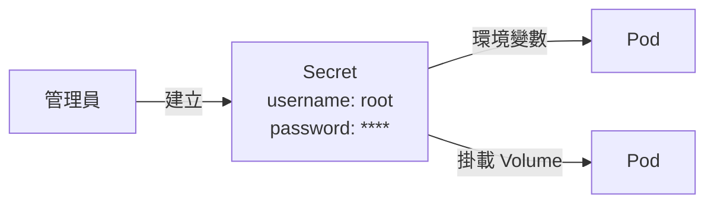
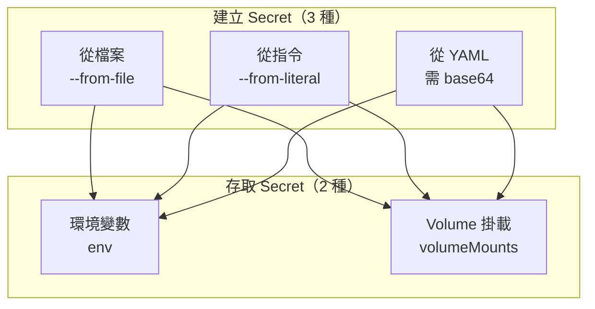

# LAB 17 Kubernetes Secret

## 學習目標

完成本章節後，你將能夠：

- [ ] 理解 Secret 的用途與類型
- [ ] 使用三種方式建立 Secret（從檔案、從指令、從 YAML）
- [ ] 透過環境變數將 Secret 傳遞給 Pod
- [ ] 透過 Volume 掛載將 Secret 傳遞給 Pod
- [ ] 理解 base64 編碼在 Secret 中的作用

## 前置知識

開始之前，請確保你已經：

- 完成 LAB 16 PV/PVC
- 熟悉 Pod、Volume 基本概念
- 準備好 Kubernetes 叢集環境（k8s-master1）

---

## 核心概念說明

### Secret 是什麼？

**Secret** 是 Kubernetes 中用來儲存**敏感資訊**的資源，例如密碼、API 金鑰、憑證等。Secret 會以 base64 編碼儲存，避免明文暴露在 YAML 檔案中。



---

### Secret 建立與存取的組合

Secret 有 **3 種建立方式** 和 **2 種存取方式**，共 **6 種組合**：

| 建立方式 | 說明 | base64 編碼 |
|----------|------|-------------|
| **從檔案**（--from-file） | 將檔案內容匯入成 Secret | 自動處理 |
| **從指令**（--from-literal） | 直接在指令中指定值 | 自動處理 |
| **從 YAML** | 使用 YAML 檔案定義 | ⚠️ 需手動編碼 |

| 存取方式 | 說明 |
|----------|------|
| **環境變數** | Secret 值注入為環境變數 |
| **Volume 掛載** | Secret 掛載為檔案 |



---

## Lab 實作練習：建立 Secret

### 方式一：從檔案建立 Secret

#### 步驟 1：建立包含敏感資料的檔案

```bash title="建立 username 和 password 檔案"
echo -n "root" > ./username.txt
echo -n "pass1234" > ./password.txt
```

!!! warning "注意 -n 參數"
    使用 `echo -n` 避免在檔案末尾加入換行符號，否則密碼會包含多餘的換行。

驗證檔案內容：

```bash title="查看檔案內容"
cat username.txt
cat password.txt
```

**預期結果**（注意沒有換行）：

```
root[root@k8s-master1 ~]#
pass1234[root@k8s-master1 ~]#
```

#### 步驟 2：從檔案建立 Secret

```bash title="從檔案建立 Secret"
kubectl create secret generic demo-secret-from-file \
  --from-file=./username.txt \
  --from-file=./password.txt
```

**預期結果**：

```
secret/demo-secret-from-file created
```

查看 Secret：

```bash title="查看 Secret 列表"
kubectl get secrets
```

**預期結果**：

```
NAME                    TYPE     DATA   AGE
demo-secret-from-file   Opaque   2      7s
```

```bash title="查看 Secret 詳細資訊"
kubectl describe secrets demo-secret-from-file
```

**預期結果**：

```
Name:         demo-secret-from-file
Namespace:    default
Type:  Opaque

Data
====
password.txt:  8 bytes
username.txt:  4 bytes
```

!!! info "檔名作為 Key"
    使用 `--from-file` 時，**檔名會成為 Secret 的 Key**（如 `password.txt`、`username.txt`）。

---

### 方式二：從指令建立 Secret（--from-literal）

```bash title="從指令建立 Secret"
kubectl create secret generic demo-secret-from-literal \
  --from-literal=username=root \
  --from-literal=password=pass1234
```

**預期結果**：

```
secret/demo-secret-from-literal created
```

查看 Secret：

```bash title="查看 Secret"
kubectl describe secrets demo-secret-from-literal
```

**預期結果**：

```
Name:         demo-secret-from-literal
Namespace:    default
Type:  Opaque

Data
====
password:  8 bytes
username:  4 bytes
```

!!! tip "自訂 Key 名稱"
    使用 `--from-literal` 時，可以直接指定 Key 名稱（如 `username`、`password`），比 `--from-file` 更靈活。

---

### 方式三：從 YAML 建立 Secret

#### 步驟 1：使用 base64 編碼資料

```bash title="base64 編碼"
echo -n "root" | base64
echo -n "pass1234" | base64
```

**預期結果**：

```
cm9vdA==
cGFzczEyMzQ=
```

!!! warning "YAML 方式需要手動 base64 編碼"
    只有使用 YAML 建立 Secret 時，需要先將資料進行 base64 編碼。`--from-file` 和 `--from-literal` 會自動處理。

#### 步驟 2：下載並查看 YAML

```bash title="下載 Secret YAML"
wget http://10.0.1.248/k8s/yaml/my-secret.yaml
cat my-secret.yaml
```

**YAML 內容**：

```yaml title="my-secret.yaml"
apiVersion: v1
kind: Secret
metadata:
  name: demo-secret-from-yaml
type: Opaque
data:
  username: cm9vdA==          # base64 編碼的 "root"
  password: cGFzczEyMzQ=      # base64 編碼的 "pass1234"
```

| 欄位 | 說明 |
|------|------|
| **type: Opaque** | 通用型 Secret |
| **data** | 存放 base64 編碼的資料 |

#### 步驟 3：套用 YAML

```bash title="建立 Secret"
kubectl apply -f my-secret.yaml
```

查看所有 Secret：

```bash title="查看所有 Secret"
kubectl get secrets
```

**預期結果**：

```
NAME                       TYPE     DATA   AGE
demo-secret-from-file      Opaque   2      3m32s
demo-secret-from-literal   Opaque   2      2m13s
demo-secret-from-yaml      Opaque   2      5s
```

---

## Lab 實作練習：Pod 存取 Secret

### 方式一：透過環境變數存取

```bash title="下載 Pod YAML"
wget http://10.0.1.248/k8s/yaml/my-pod.yaml
```

**Pod YAML 內容**：

```yaml title="my-pod.yaml"
apiVersion: v1
kind: Pod
metadata:
  name: my-pod
spec:
  containers:
  - name: my-container
    image: docker1.training.lab:5000/nginx
    env:
    - name: SECRET_USERNAME           # 環境變數名稱
      valueFrom:
        secretKeyRef:
          name: demo-secret-from-yaml # Secret 名稱
          key: username               # Secret 中的 Key
    - name: SECRET_PASSWORD
      valueFrom:
        secretKeyRef:
          name: demo-secret-from-yaml
          key: password
```

套用 Pod：

```bash title="建立 Pod"
kubectl apply -f my-pod.yaml
kubectl get pods
```

**預期結果**：

```
NAME     READY   STATUS    RESTARTS   AGE
my-pod   1/1     Running   0          16s
```

進入 Pod 驗證環境變數：

```bash title="驗證環境變數"
kubectl exec my-pod -it -- bash
```

```bash title="在容器內執行"
env | grep SEC
```

**預期結果**：

```
SECRET_USERNAME=root
SECRET_PASSWORD=pass1234
```

!!! success "自動解碼"
    Pod 存取 Secret 時，Kubernetes 會**自動將 base64 解碼**，應用程式直接取得原始值。

---

### 方式二：透過 Volume 掛載存取

```bash title="下載 Pod YAML"
wget http://192.168.66.248/k8s/yaml/my-pod-with-mounting-secret.yaml
```

**Pod YAML 內容**：

```yaml title="my-pod-with-mounting-secret.yaml"
apiVersion: v1
kind: Pod
metadata:
  name: my-pod-with-mounting-secret
spec:
  containers:
  - name: my-container
    image: docker1.training.lab:5000/nginx
    volumeMounts:
    - name: secret-volume
      mountPath: "/etc/creds"         # 掛載路徑
      readOnly: true
  volumes:
  - name: secret-volume
    secret:
      secretName: demo-secret-from-yaml  # Secret 名稱
```

套用 Pod：

```bash title="建立 Pod"
kubectl apply -f my-pod-with-mounting-secret.yaml
kubectl get pods
```

**預期結果**：

```
NAME                          READY   STATUS    RESTARTS   AGE
my-pod                        1/1     Running   0          22m
my-pod-with-mounting-secret   1/1     Running   0          7s
```

進入 Pod 驗證掛載的檔案：

```bash title="驗證掛載"
kubectl exec my-pod-with-mounting-secret -it -- bash
```

```bash title="在容器內執行"
ls -l /etc/creds
cat /etc/creds/username
cat /etc/creds/password
```

**預期結果**：

```
total 0
lrwxrwxrwx 1 root root 15 Feb  4 08:06 password -> ..data/password
lrwxrwxrwx 1 root root 15 Feb  4 08:06 username -> ..data/username

root
pass1234
```

!!! info "掛載方式的特點"
    - Secret 的每個 Key 會變成一個檔案
    - 檔案內容是解碼後的原始值
    - 適合需要以檔案形式讀取的場景（如憑證、設定檔）

---

## 環境變數 vs Volume 掛載

| 特性 | 環境變數 | Volume 掛載 |
|------|----------|-------------|
| **存取方式** | `$ENV_NAME` | 讀取檔案 |
| **更新行為** | Pod 重啟才更新 | 自動更新（kubelet 同步） |
| **資料格式** | 字串 | 檔案 |
| **適用場景** | 簡單的 key-value | 憑證、設定檔 |

---

## 三種建立方式比較

| 特性 | --from-file | --from-literal | YAML |
|------|-------------|----------------|------|
| **base64 編碼** | 自動 | 自動 | ⚠️ 手動 |
| **Key 名稱** | 檔名 | 自訂 | 自訂 |
| **版本控制** | 需額外管理檔案 | 不易版控 | ✅ 易於版控 |
| **適用場景** | 現有檔案 | 快速測試 | 生產環境 |

---

## 常見問題

??? question "Q1：如何查看 Secret 的實際內容？"
    **解答**：使用 `kubectl get secret -o yaml` 並解碼：
    
    ```bash
    kubectl get secret demo-secret-from-yaml -o yaml
    # 解碼 base64
    echo "cm9vdA==" | base64 -d
    ```

??? question "Q2：Secret 和 ConfigMap 有什麼差別？"
    **解答**：
    
    | 特性 | Secret | ConfigMap |
    |------|--------|-----------|
    | **用途** | 敏感資料 | 一般設定 |
    | **編碼** | base64 | 明文 |
    | **儲存** | 記憶體（tmpfs） | 一般儲存 |

??? question "Q3：忘記加 -n 導致密碼包含換行怎麼辦？"
    **解答**：重新建立檔案或使用 `tr` 移除換行：
    
    ```bash
    echo "pass1234" | tr -d '\n' > password.txt
    ```

---

## 小結

本章節重點回顧：

- ✅ **Secret 用途**：儲存敏感資訊（密碼、金鑰、憑證）
- ✅ **三種建立方式**：
  - `--from-file`：從檔案建立，自動 base64
  - `--from-literal`：從指令建立，自動 base64
  - YAML：需手動 base64 編碼
- ✅ **兩種存取方式**：
  - 環境變數（env + secretKeyRef）
  - Volume 掛載（volumes + volumeMounts）
- ✅ **自動解碼**：Pod 存取時自動將 base64 解碼為原始值

## 延伸閱讀

- [Kubernetes Secrets](https://kubernetes.io/docs/concepts/configuration/secret/)
- [Distribute Credentials Securely Using Secrets](https://kubernetes.io/docs/tasks/inject-data-application/distribute-credentials-secure/)
- [Secret Types](https://kubernetes.io/docs/concepts/configuration/secret/#secret-types)
