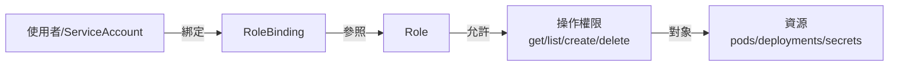
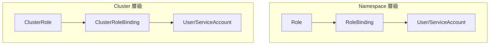
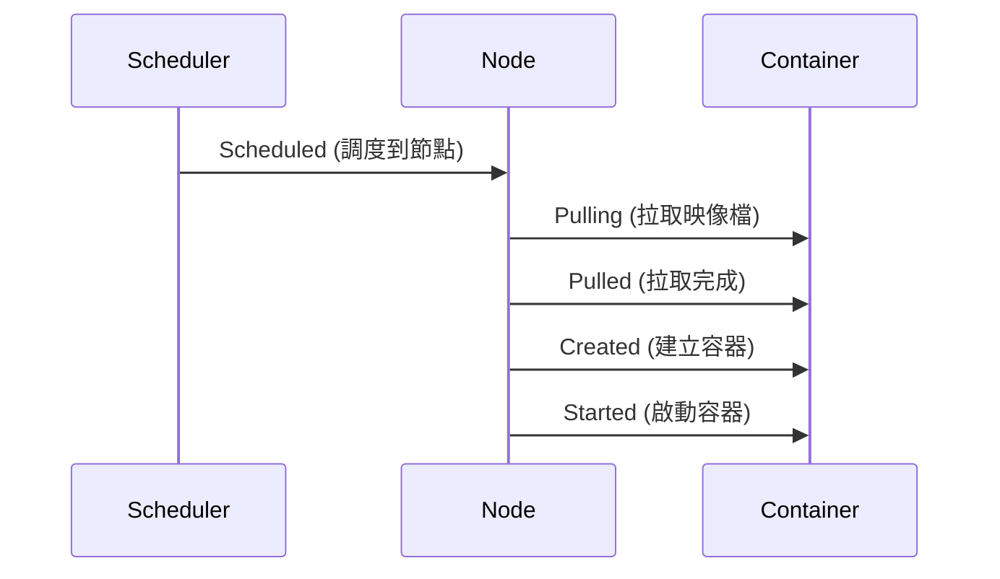
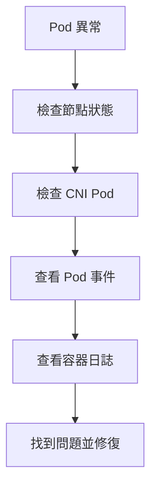

# LAB 18 RBAC 與 Event/Log

## 學習目標

完成本章節後，你將能夠：

- [ ] 理解 RBAC（Role-Based Access Control）的概念
- [ ] 使用 ClusterRoleBinding 設定叢集層級的權限
- [ ] 使用 kubectl get events 查看叢集事件
- [ ] 使用 kubectl logs 查看 Pod 日誌

## 前置知識

開始之前，請確保你已經：

- 完成 LAB 17 Secret
- 熟悉 Pod、Deployment 基本概念
- 準備好 Kubernetes 叢集環境（k8s-master1）

---

## 核心概念說明

### RBAC 是什麼？

**RBAC（Role-Based Access Control）** 是 Kubernetes 的**權限控制機制**，用來控制「誰」可以對「什麼資源」執行「什麼操作」。



---

### RBAC 四種資源

| 資源 | 作用範圍 | 說明 |
|------|----------|------|
| **Role** | Namespace | 定義單一 Namespace 內的權限 |
| **RoleBinding** | Namespace | 將 Role 綁定給使用者 |
| **ClusterRole** | 叢集 | 定義叢集層級的權限 |
| **ClusterRoleBinding** | 叢集 | 將 ClusterRole 綁定給使用者 |



---

### 內建 ClusterRole

Kubernetes 預設提供多個內建的 ClusterRole：

| ClusterRole | 權限 |
|-------------|------|
| **view** | 唯讀權限（get、list、watch） |
| **edit** | 讀寫權限（不含 RBAC 設定） |
| **admin** | 完整管理權限（含 RBAC 相關） |
| **cluster-admin** | 超級管理員（所有權限） |

---

## Lab 實作練習：RBAC ClusterRoleBinding

### 步驟 1：套用 ClusterRoleBinding

```bash title="套用 RBAC YAML"
kubectl apply -f http://192.168.66.248/k8s/yaml/rbac3.yaml
```

**預期結果**：

```
clusterrolebinding.rbac.authorization.k8s.io/my-global-access created
```

**rbac3.yaml 內容範例**：

```yaml title="rbac3.yaml（範例）"
apiVersion: rbac.authorization.k8s.io/v1
kind: ClusterRoleBinding
metadata:
  name: my-global-access
subjects:
- kind: User
  name: my-user              # 或 ServiceAccount
  apiGroup: rbac.authorization.k8s.io
roleRef:
  kind: ClusterRole
  name: view                 # 使用內建的 view ClusterRole
  apiGroup: rbac.authorization.k8s.io
```

| 欄位 | 說明 |
|------|------|
| **subjects** | 權限授予的對象（User、Group、ServiceAccount） |
| **roleRef** | 參照的 Role 或 ClusterRole |

---

### 步驟 2：查看 ClusterRoleBinding

```bash title="查看 ClusterRoleBinding"
kubectl get clusterrolebindings.rbac.authorization.k8s.io | grep my-global
```

**預期結果**：

```
my-global-access   ClusterRole/view   21s
```

!!! info "綁定說明"
    此 ClusterRoleBinding 將 `view` ClusterRole 綁定給指定的使用者，讓該使用者擁有叢集的唯讀權限。

---

### 步驟 3：刪除 ClusterRoleBinding

```bash title="刪除 ClusterRoleBinding"
kubectl delete -f http://192.168.66.248/k8s/yaml/rbac3.yaml
```

**預期結果**：

```
clusterrolebinding.rbac.authorization.k8s.io "my-global-access" deleted
```

---

## Lab 實作練習：Event 事件監控

### Event 是什麼？

**Event（事件）** 是 Kubernetes 記錄叢集中發生的重要事件，例如 Pod 調度、映像檔拉取、容器啟動等。

---

### 步驟 1：建立測試 Pod

```bash title="建立測試 Pod"
kubectl apply -f http://192.168.66.248/k8s/yaml/log1.yaml
```

**預期結果**：

```
pod/log1 created
```

**log1.yaml 內容範例**：

```yaml title="log1.yaml（範例）"
apiVersion: v1
kind: Pod
metadata:
  name: log1
spec:
  containers:
  - name: count
    image: docker1.training.lab:5000/nginx
    command: ["/bin/sh", "-c"]
    args:
    - i=0; while true; do echo "$i: $(date)"; i=$((i+1)); sleep 1; done
```

---

### 步驟 2：查看事件

```bash title="查看叢集事件"
kubectl get events
```

**預期結果**：

```
LAST SEEN   TYPE     REASON      OBJECT     MESSAGE
13s         Normal   Scheduled   pod/log1   Successfully assigned default/log1 to k8s-node1.training.lab
13s         Normal   Pulling     pod/log1   Pulling image "docker1.training.lab:5000/nginx"
13s         Normal   Pulled      pod/log1   Successfully pulled image "docker1.training.lab:5000/nginx" in 177ms
13s         Normal   Created     pod/log1   Created container: count
13s         Normal   Started     pod/log1   Started container count
```

| 欄位 | 說明 |
|------|------|
| **LAST SEEN** | 事件發生時間 |
| **TYPE** | 事件類型（Normal、Warning） |
| **REASON** | 事件原因（Scheduled、Pulling、Started 等） |
| **OBJECT** | 相關的資源 |
| **MESSAGE** | 詳細訊息 |

---

### Event 生命週期



---

## Lab 實作練習：Log 日誌查看

### 步驟 1：查看 Pod 日誌

```bash title="查看 Pod 日誌"
kubectl logs pod/log1
```

**預期結果**：

```
0: Tue Feb  4 08:17:29 UTC 2025
1: Tue Feb  4 08:17:30 UTC 2025
2: Tue Feb  4 08:17:31 UTC 2025
3: Tue Feb  4 08:17:32 UTC 2025
4: Tue Feb  4 08:17:33 UTC 2025
...
```

---

### 常用 logs 參數

```bash title="即時追蹤日誌（類似 tail -f）"
kubectl logs pod/log1 -f
```

```bash title="顯示最近 10 行"
kubectl logs pod/log1 --tail=10
```

```bash title="顯示最近 1 小時的日誌"
kubectl logs pod/log1 --since=1h
```

```bash title="顯示時間戳記"
kubectl logs pod/log1 --timestamps
```

```bash title="指定容器（多容器 Pod）"
kubectl logs pod/log1 -c count
```

| 參數 | 說明 |
|------|------|
| `-f` | 即時追蹤（follow） |
| `--tail=N` | 顯示最後 N 行 |
| `--since=時間` | 顯示指定時間內的日誌 |
| `--timestamps` | 顯示時間戳記 |
| `-c 容器名` | 指定容器 |
| `--previous` | 顯示前一個容器的日誌（重啟後） |

---

### 步驟 2：清理資源

```bash title="刪除測試 Pod"
kubectl delete -f http://192.168.66.248/k8s/yaml/log1.yaml
```

**預期結果**：

```
pod "log1" deleted
```

---

## Event vs Log 比較

| 特性 | Event | Log |
|------|-------|-----|
| **內容** | 叢集事件（調度、拉取映像檔） | 容器輸出（stdout/stderr） |
| **來源** | Kubernetes 元件 | 應用程式 |
| **用途** | 排查調度問題 | 排查應用程式問題 |
| **保留時間** | 約 1 小時 | 取決於日誌輪替設定 |
| **指令** | `kubectl get events` | `kubectl logs` |

---

## Lab 實作練習：Debug 實戰流程

當 Pod 無法正常運行時，可以按照以下流程進行故障排除：



---

### 步驟 1：檢查節點狀態

```bash title="檢查節點狀態"
kubectl get nodes
```

**預期結果**：

```
NAME                       STATUS     ROLES           AGE   VERSION
k8s-master1.training.lab   Ready      control-plane   21h   v1.32.11
k8s-node1.training.lab     NotReady   <none>          21h   v1.32.11
k8s-node2.training.lab     Ready      <none>          21h   v1.32.11
```

!!! warning "NotReady 狀態"
    如果節點顯示 `NotReady`，通常是 CNI（Container Network Interface）或 kubelet 有問題。

---

### 步驟 2：檢查 CNI Pod 狀態

```bash title="檢查 Antrea CNI Pod"
kubectl get pods -n kube-system | grep antrea
```

**預期結果**：

```
antrea-agent-7zn4h                                 2/2     Running   0          2m33s
antrea-agent-mdw2f                                 2/2     Running   0          2m34s
antrea-agent-sbv79                                 2/2     Running   0          2m34s
antrea-controller-57964d858f-bqwf8                 1/1     Running   0          37s
```

!!! tip "其他 CNI"
    如果使用的是 Calico 或 Flannel，請改用：
    
    - Calico：`kubectl get pods -n kube-system | grep calico`
    - Flannel：`kubectl get pods -n kube-system | grep flannel`

---

### 步驟 3：查看 Pod 詳細事件

```bash title="查看 Pod 事件（底部會顯示 Events）"
kubectl describe pod <pod-name> -n <namespace>
```

**範例**：

```bash
kubectl describe pod antrea-agent-mdw2f -n kube-system | tail -20
```

**預期結果**：

```
Events:
  Type     Reason     Age   From               Message
  ----     ------     ----  ----               -------
  Normal   Scheduled  82s   default-scheduler  Successfully assigned kube-system/antrea-agent-mdw2f to k8s-node1.training.lab
  Normal   Pulling    82s   kubelet            Pulling image "antrea/antrea-agent-ubuntu:v2.2.0"
  Normal   Pulled     57s   kubelet            Successfully pulled image
  Normal   Created    57s   kubelet            Created container: install-cni
  Normal   Started    57s   kubelet            Started container install-cni
  Warning  Unhealthy  43s   kubelet            Readiness probe failed: HTTP probe failed with statuscode: 500
```

---

### 步驟 4：查看容器日誌

```bash title="查看特定容器的日誌"
kubectl logs <pod-name> -n <namespace> -c <container-name> --tail=50
```

**範例**：

```bash
kubectl logs antrea-agent-mdw2f -n kube-system -c antrea-agent --tail=50
```

---

### 完整狀態檢查腳本

```bash title="一次檢查所有關鍵狀態"
echo "=== 節點狀態 ==="
kubectl get nodes

echo -e "\n=== CNI Pods ==="
kubectl get pods -n kube-system | grep antrea

echo -e "\n=== 應用 Pods ==="
kubectl get pods -A -o wide

echo -e "\n=== 系統核心 Pods ==="
kubectl get pods -n kube-system | grep -E 'coredns|kube-proxy'
```

---

## Debug 常見問題對照表

| 症狀 | 可能原因 | 檢查指令 |
|------|----------|----------|
| Node `NotReady` | CNI 未就緒 | `kubectl get pods -n kube-system` |
| Pod `Pending` | 無可用節點 | `kubectl describe pod <name>` |
| Pod `ImagePullBackOff` | 映像檔拉取失敗 | `kubectl describe pod <name>` |
| Pod `CrashLoopBackOff` | 容器持續崩潰 | `kubectl logs <pod> --previous` |
| Service 無法存取 | Endpoint 未綁定 | `kubectl get endpoints` |

---

## 常見問題

??? question "Q1：如何查看特定 Pod 的事件？"
    **解答**：使用 `kubectl describe pod` 會在底部顯示相關事件：
    
    ```bash
    kubectl describe pod log1
    ```

??? question "Q2：Pod 重啟後日誌消失了怎麼辦？"
    **解答**：使用 `--previous` 參數查看前一個容器的日誌：
    
    ```bash
    kubectl logs pod/log1 --previous
    ```

??? question "Q3：如何將日誌導出到檔案？"
    **解答**：使用 shell 重導向：
    
    ```bash
    kubectl logs pod/log1 > pod-log.txt
    ```

---

## 小結

本章節重點回顧：

- ✅ **RBAC 概念**：Role-Based Access Control 控制資源存取權限
- ✅ **四種 RBAC 資源**：Role、RoleBinding（Namespace 層級）、ClusterRole、ClusterRoleBinding（叢集層級）
- ✅ **內建 ClusterRole**：view（唯讀）、edit（讀寫）、admin（管理）、cluster-admin（超級管理員）
- ✅ **Event 監控**：`kubectl get events` 查看叢集事件
- ✅ **Log 查看**：`kubectl logs` 查看容器輸出，支援 `-f`、`--tail`、`--since` 等參數

## 延伸閱讀

- [Kubernetes RBAC](https://kubernetes.io/docs/reference/access-authn-authz/rbac/)
- [Using RBAC Authorization](https://kubernetes.io/docs/reference/access-authn-authz/rbac/)
- [Kubectl Logs](https://kubernetes.io/docs/reference/kubectl/generated/kubectl_logs/)
