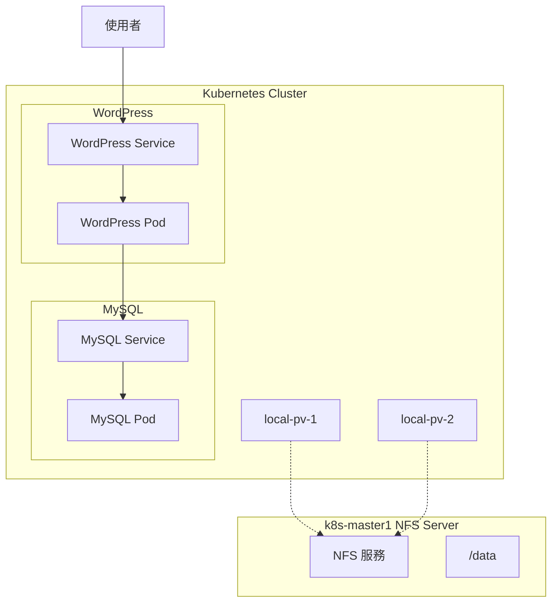

# LAB 19 Kubernetes + WordPress + MySQL 部署

## 學習目標

完成本章節後，你將能夠：

- [ ] 設定 NFS Server 提供共享儲存
- [ ] 設定 Worker Node 開機自動掛載 NFS
- [ ] 建立 ConfigMap 和 Secret
- [ ] 建立 PV/PVC 持久化儲存
- [ ] 部署 MySQL 資料庫和 WordPress

## 前置知識

開始之前，請確保你已經：

- 完成 LAB 16 PV/PVC
- 完成 LAB 17 Secret
- 熟悉 Service、Deployment 基本概念

---

## 核心概念說明

### 整體架構



---

## Lab 實作練習

!!! info "操作環境"
    本 Lab **所有操作都在 k8s-master1** 上執行，不需要切換到其他虛擬機的 Console。

---

### 步驟 1：確認 Kubernetes 環境正常

```bash title="檢查節點狀態"
kubectl get nodes
```

**預期結果**：

```
NAME                       STATUS   ROLES           AGE   VERSION
k8s-master1.training.lab   Ready    control-plane   22h   v1.32.11
k8s-node1.training.lab     Ready    <none>          22h   v1.32.11
k8s-node2.training.lab     Ready    <none>          22h   v1.32.11
```

!!! warning "節點必須 Ready"
    確保所有節點都是 `Ready` 狀態再繼續。

---

### 步驟 2：建立 NFS 共享目錄

在 Master 建立資料目錄：

```bash title="在 k8s-master1 建立目錄"
mkdir -p /data/db
mkdir -p /data/wordpress
```

在 Worker Node 建立掛載點：

```bash title="透過 SSH 在 Worker Node 建立目錄"
sshpass -p container ssh -p 22 root@k8s-node1 "mkdir -p /data"
sshpass -p container ssh -p 22 root@k8s-node2 "mkdir -p /data"
```

---

### 步驟 3：安裝 NFS 套件

**在 k8s-master1（NFS Server）安裝**：

```bash title="安裝 NFS Server"
yum install nfs-utils -y
```

**在 Worker Node（NFS Client）安裝**：

```bash title="透過 SSH 安裝 NFS Client"
sshpass -p container ssh -p 22 root@k8s-node1 "yum install nfs-utils -y"
sshpass -p container ssh -p 22 root@k8s-node2 "yum install nfs-utils -y"
```

---

### 步驟 4：設定 NFS Server

編輯 /etc/exports：

```bash title="編輯 NFS 匯出設定"
vi /etc/exports
```

加入以下內容：

```title="/etc/exports"
/data *(rw,no_root_squash)
```

啟動並啟用 NFS 服務：

```bash title="啟動 NFS Server"
systemctl start nfs-server.service
systemctl enable nfs-server.service
```

**預期結果**：

```
Created symlink /etc/systemd/system/multi-user.target.wants/nfs-server.service → /usr/lib/systemd/system/nfs-server.service.
```

---

### 步驟 5：掛載 NFS 並驗證

在 Worker Node 掛載 NFS：

```bash title="掛載 NFS"
sshpass -p container ssh -p 22 root@k8s-node1 "mount -t nfs k8s-master1:/data /data"
sshpass -p container ssh -p 22 root@k8s-node2 "mount -t nfs k8s-master1:/data /data"
```

!!! warning "主機名稱很重要"
    必須使用 `k8s-master1:/data`，使用 `master:/data` 會卡住無回應！

驗證掛載成功：

```bash title="驗證 NFS 掛載"
sshpass -p container ssh -p 22 root@k8s-node1 "df -Th | grep nfs"
sshpass -p container ssh -p 22 root@k8s-node2 "df -Th | grep nfs"
```

**預期結果**：

```
k8s-master1:/data   nfs4       70G  8.0G   62G  12% /data
```

---

### 步驟 6：設定開機自動掛載

修改 fstab 並複製到 Worker Node：

```bash title="建立修改後的 fstab"
cp /etc/fstab /tmp/fstab
echo "k8s-master1:/data /data nfs defaults 0 0" >> /tmp/fstab
```

查看修改內容：

```bash title="確認 fstab 內容"
cat /tmp/fstab
```

**預期結果**（最後一行）：

```
k8s-master1:/data /data nfs defaults 0 0
```

複製到 Worker Node：

```bash title="複製 fstab 到 Worker Node"
sshpass -p container scp /tmp/fstab root@k8s-node1:/etc/fstab
sshpass -p container scp /tmp/fstab root@k8s-node2:/etc/fstab
```

---

### 步驟 7：建立 ConfigMap

```bash title="建立 ConfigMap"
kubectl create configmap mydb-env \
  --from-literal=MYSQL_ROOT_PASSWORD=container \
  --from-literal=TZ="Asia/Taipei"
```

驗證：

```bash title="查看 ConfigMap"
kubectl get configmaps
kubectl describe configmaps mydb-env
```

**預期結果**：

```
Data
====
MYSQL_ROOT_PASSWORD:
----
container

TZ:
----
Asia/Taipei
```

---

### 步驟 8：建立 Secret

```bash title="建立 Secret"
kubectl create secret generic mysql-pass \
  --from-literal=password=container
```

驗證：

```bash title="查看 Secret"
kubectl get secrets
kubectl describe secrets mysql-pass
```

**預期結果**：

```
Data
====
password:  9 bytes
```

---

### 步驟 9：建立 PV

```bash title="建立 PV"
kubectl apply -f http://10.0.1.249/k8s/yaml/volumes.yaml
kubectl get pv
```

**預期結果**：

```
NAME         CAPACITY   ACCESS MODES   RECLAIM POLICY   STATUS      CLAIM   STORAGECLASS   AGE
local-pv-1   20Gi       RWO            Retain           Available                          8s
local-pv-2   20Gi       RWO            Retain           Available                          8s
```

---

### 步驟 10：部署 MySQL

```bash title="部署 MySQL"
kubectl apply -f http://10.0.1.249/k8s/yaml/mysql-deployment.yaml
```

驗證：

```bash title="查看 MySQL 資源"
kubectl get services
kubectl get deployments.apps
kubectl get pods
```

**預期結果**：

```
NAME              TYPE        CLUSTER-IP   EXTERNAL-IP   PORT(S)    AGE
wordpress-mysql   ClusterIP   None         <none>        3306/TCP   13s

NAME              READY   UP-TO-DATE   AVAILABLE   AGE
wordpress-mysql   1/1     1            1           28s

NAME                               READY   STATUS    RESTARTS   AGE
wordpress-mysql-57444c5587-kkwq4   1/1     Running   0          36s
```

!!! info "Headless Service"
    `wordpress-mysql` Service 的 ClusterIP 是 `None`，這是 Headless Service，WordPress 會透過 DNS 名稱直接連接 MySQL Pod。

---

### 步驟 11：部署 WordPress

```bash title="部署 WordPress"
kubectl apply -f http://10.0.1.249/k8s/yaml/wordpress-deployment.yaml
```

驗證：

```bash title="查看 WordPress 資源"
kubectl get deployments.apps
kubectl get services
kubectl get pods
```

**預期結果**：

```
NAME              READY   UP-TO-DATE   AVAILABLE   AGE
wordpress         1/1     1            1           14s
wordpress-mysql   1/1     1            1           101s

NAME              TYPE           CLUSTER-IP      EXTERNAL-IP   PORT(S)        AGE
wordpress         LoadBalancer   172.30.184.40   <pending>     80:31294/TCP   23s
wordpress-mysql   ClusterIP      None            <none>        3306/TCP       110s
```

!!! note "LoadBalancer 類型"
    WordPress Service 是 `LoadBalancer` 類型，在本地環境 EXTERNAL-IP 會顯示 `<pending>`，但可以透過 NodePort（如 31294）或 ClusterIP 存取。

---

### 步驟 12：初始化 WordPress

使用瀏覽器開啟 WordPress（使用 ClusterIP）：

```bash title="開啟 WordPress"
firefox http://172.30.184.40
```

或使用 Node IP + NodePort：

```bash title="使用 NodePort 存取"
firefox http://k8s-node1:31294
firefox http://k8s-node2:31294
```

!!! success "WordPress 安裝頁面"
    如果看到 WordPress 安裝頁面（語言選擇），表示部署成功！選擇語言後依照畫面指示完成設定。

**WordPress 安裝成功畫面**：


---

## 資源總覽

```bash title="查看所有資源"
kubectl get all
kubectl get pv,pvc
kubectl get configmaps,secrets
```

---

## 清理資源

```bash title="清理所有資源"
kubectl delete -f http://10.0.1.249/k8s/yaml/wordpress-deployment.yaml
kubectl delete -f http://10.0.1.249/k8s/yaml/mysql-deployment.yaml
kubectl delete -f http://10.0.1.249/k8s/yaml/volumes.yaml
kubectl delete secret mysql-pass
kubectl delete configmap mydb-env
```

---

## 常見問題

??? question "Q1：NFS 掛載卡住無回應？"
    **原因**：使用了錯誤的主機名稱。
    
    **解決方案**：使用完整主機名稱 `k8s-master1:/data`，不要用簡寫 `master:/data`。

??? question "Q2：WordPress 無法連接 MySQL？"
    **檢查項目**：
    
    1. MySQL Pod 是否 Running：`kubectl get pods -l app=wordpress`
    2. Secret 是否存在：`kubectl get secret mysql-pass`
    3. 查看 WordPress 日誌：`kubectl logs -l app=wordpress,tier=frontend`

??? question "Q3：PVC 處於 Pending 狀態？"
    **原因**：找不到符合條件的 PV。
    
    **檢查**：確認 PV 已建立且狀態是 Available。

---

## 小結

本章節重點回顧：

- ✅ **NFS Server 設定**：`/data *(rw,no_root_squash)`
- ✅ **NFS Client 掛載**：使用 `k8s-master1:/data`（不是 `master:/data`）
- ✅ **fstab 自動掛載**：透過 scp 複製到 Worker Node
- ✅ **ConfigMap**：儲存 MySQL 環境變數
- ✅ **Secret**：儲存 MySQL 密碼
- ✅ **PV/PVC**：NFS 持久化儲存
- ✅ **Headless Service**：MySQL 使用 `clusterIP: None`
- ✅ **LoadBalancer Service**：WordPress 對外暴露

## 延伸閱讀

- [Kubernetes WordPress + MySQL Example](https://kubernetes.io/docs/tutorials/stateful-application/mysql-wordpress-persistent-volume/)
- [NFS Persistent Volumes](https://kubernetes.io/docs/concepts/storage/volumes/#nfs)
