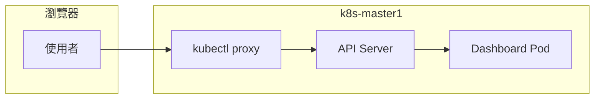
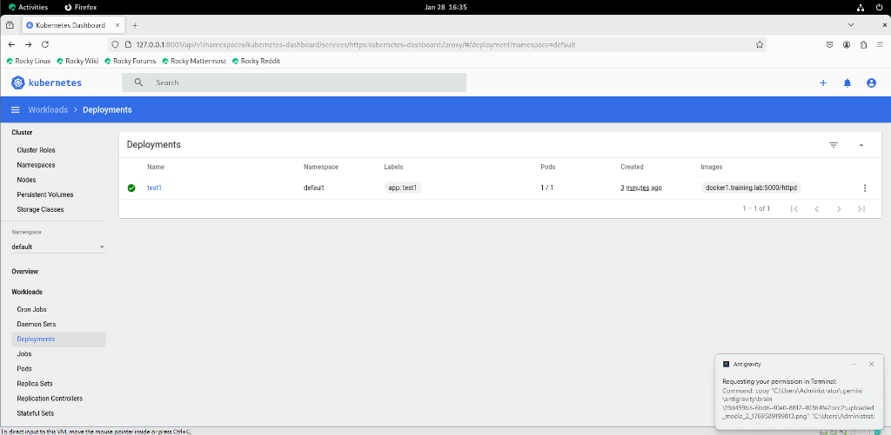
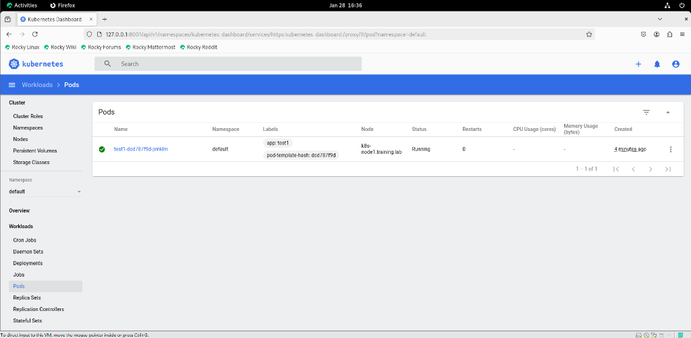
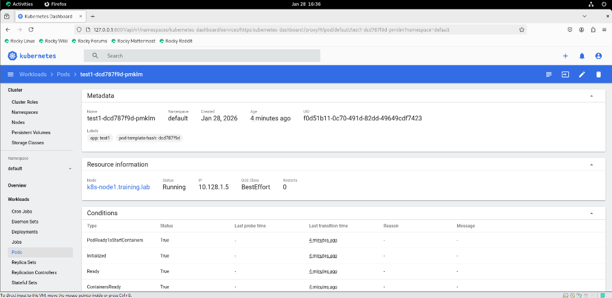

# LAB 20 圖形管理工具 Kubernetes Dashboard

## 學習目標

完成本章節後，你將能夠：

- [ ] 部署 Kubernetes Dashboard
- [ ] 使用 kubectl proxy 連接 Dashboard
- [ ] 建立 ServiceAccount 並取得登入 Token
- [ ] 透過 Dashboard 管理 Kubernetes 資源

## 前置知識

開始之前，請確保你已經：

- 完成 LAB 19 WordPress + MySQL 部署
- 熟悉 RBAC 基本概念
- 準備好 Kubernetes 叢集環境（k8s-master1）

---

## 核心概念說明

### Kubernetes Dashboard 是什麼？

**Kubernetes Dashboard** 是 Kubernetes 官方提供的**網頁式管理介面**，讓你可以透過圖形化界面管理叢集中的資源，而不需要記憶大量的 kubectl 指令。



### Dashboard 功能

| 功能 | 說明 |
|------|------|
| **資源檢視** | 查看 Pods、Deployments、Services 等資源狀態 |
| **資源建立** | 透過 YAML 或表單建立新資源 |
| **日誌查看** | 即時查看 Pod 的容器日誌 |
| **Shell 連線** | 直接在瀏覽器中開啟容器的 Shell |
| **資源編輯** | 編輯現有資源的 YAML 設定 |

---

## Lab 實作練習

!!! note "操作環境"
    本 Lab 所有操作都在 **k8s-master1** 的**圖形環境**下執行，需要開啟 gnome-terminal。

---

### 步驟 1：清除現有資源

在開始前，先清除之前 Lab 建立的資源：

```bash title="清除資源"
kubectl delete all --all
kubectl delete pvc --all
kubectl delete pv --all
kubectl delete secrets mysql-pass
kubectl delete configmap mysql-config
```

---

### 步驟 2：部署 Kubernetes Dashboard

Dashboard 使用官方提供的 YAML 檔部署：

!!! info "YAML 來源"
    官方 YAML：`https://raw.githubusercontent.com/kubernetes/dashboard/v2.2.0/aio/deploy/recommended.yaml`
    
    本課程使用講師提供的版本：`http://10.0.1.249/k8s/yaml/recommended.yaml`

```bash title="部署 Dashboard"
kubectl apply -f http://10.0.1.249/k8s/yaml/recommended.yaml
```

**預期結果**：

```
namespace/kubernetes-dashboard created
serviceaccount/kubernetes-dashboard created
service/kubernetes-dashboard created
secret/kubernetes-dashboard-certs created
secret/kubernetes-dashboard-csrf created
secret/kubernetes-dashboard-key-holder created
configmap/kubernetes-dashboard-settings created
role.rbac.authorization.k8s.io/kubernetes-dashboard created
clusterrole.rbac.authorization.k8s.io/kubernetes-dashboard created
rolebinding.rbac.authorization.k8s.io/kubernetes-dashboard created
clusterrolebinding.rbac.authorization.k8s.io/kubernetes-dashboard created
deployment.apps/kubernetes-dashboard created
service/dashboard-metrics-scraper created
deployment.apps/dashboard-metrics-scraper created
```

驗證部署狀態：

```bash title="檢查 Dashboard Pod"
kubectl get pods -n kubernetes-dashboard
```

**預期結果**：

```
NAME                                         READY   STATUS    RESTARTS   AGE
dashboard-metrics-scraper-5cb4f4bb9c-xxxxx   1/1     Running   0          30s
kubernetes-dashboard-6967859bff-xxxxx        1/1     Running   0          30s
```

---

### 步驟 3：建立管理員帳號

Dashboard 預設的 ServiceAccount 權限有限，我們需要建立一個擁有管理員權限的帳號：

```bash title="建立 admin-user"
kubectl apply -f http://10.0.1.249/k8s/yaml/KubernetesDashboard.yaml
```

**預期結果**：

```
serviceaccount/admin-user created
clusterrolebinding.rbac.authorization.k8s.io/admin-user created
```

!!! warning "注意檔名大小寫"
    檔名是 `KubernetesDashboard.yaml`（K 和 D 大寫），不是 `kubernetesDashboard.yaml`！

這個 YAML 會建立：

1. **ServiceAccount `admin-user`**：在 `kubernetes-dashboard` namespace
2. **ClusterRoleBinding**：將 `cluster-admin` 角色綁定給 `admin-user`

---

### 步驟 4：啟動 kubectl proxy

在圖形環境中開啟 **gnome-terminal**，執行 kubectl proxy：

```bash title="啟動 Proxy（保持此視窗開啟）"
kubectl proxy
```

**預期結果**：

```
Starting to serve on 127.0.0.1:8001
```


!!! danger "重要：不要關閉這個視窗！"
    `kubectl proxy` 需要持續執行，關閉視窗會中斷與 Dashboard 的連線。

---

### 步驟 5：開啟 Dashboard 網頁

在圖形環境中開啟瀏覽器（Firefox），連線到 Dashboard：

**Dashboard URL**：

```
http://127.0.0.1:8001/api/v1/namespaces/kubernetes-dashboard/services/https:kubernetes-dashboard:/proxy/#/login
```

!!! tip "開啟新分頁"
    在 gnome-terminal 按 `Ctrl+Shift+T` 開啟新分頁，或開啟新視窗。

你會看到 Dashboard 登入頁面：


---

### 步驟 6：取得登入 Token

在**另一個終端機視窗**（新分頁）執行：

```bash title="產生 Token"
kubectl create token admin-user -n kubernetes-dashboard
```

**預期結果**：

```
eyJhbGciOiJSUzI1NiIsImtpZCI6Ik5na0NBUnl2Z1o4dU1uZmJqcER5ZnVjdDZa...
```

!!! note "Token 有效期限"
    預設 Token 有效期限為 1 小時。如需更長時間，可使用 `--duration` 參數：
    ```bash
    kubectl create token admin-user -n kubernetes-dashboard --duration=24h
    ```

---

### 步驟 7：登入 Dashboard

1. 在登入頁面選擇 **Token** 選項
2. 將上一步產生的 Token 複製貼上
3. 點選 **Sign in**


---

### 步驟 8：使用 Dashboard 管理資源

登入成功後，你可以透過 Dashboard 進行各種操作：

#### 建立測試 Deployment

先用 kubectl 建立一個測試資源：

```bash title="建立測試 Deployment"
kubectl create deployment test1 --image=docker1.training.lab:5000/httpd
```

驗證：

```bash title="檢查 Deployment"
kubectl get deployments.apps
kubectl get pods
```

**預期結果**：

```
NAME    READY   UP-TO-DATE   AVAILABLE   AGE
test1   1/1     1            1           11s

NAME                    READY   STATUS    RESTARTS   AGE
test1-dcd787f9d-pmklm   1/1     Running   0          22s
```

#### 檢視 Deployments

在左側選單點選 **Workloads** > **Deployments**，可以看到剛建立的 test1：



可以看到：

- **Name**：Deployment 名稱（test1）
- **Namespace**：所屬命名空間（default）
- **Pods**：Pod 數量（1/1 表示 1 個就緒）
- **Images**：使用的映像檔（docker1.training.lab:5000/httpd）

#### 檢視 Deployment 詳細資訊

點選 Deployment 名稱可以查看詳細資訊：


詳細頁面顯示：

- **Metadata**：名稱、命名空間、建立時間、UID
- **Labels**：標籤（app: test1）
- **Resource information**：更新策略（RollingUpdate）、Selector
- **Rolling update strategy**：滾動更新參數（maxSurge: 25%, maxUnavailable: 25%）

#### 檢視 Pods

在左側選單點選 **Workloads** > **Pods**：



Pods 列表顯示：

- **Name**：Pod 完整名稱
- **Node**：Pod 運行的節點（k8s-node1.training.lab）
- **Status**：運行狀態（Running）
- **Restarts**：重啟次數
- **CPU/Memory Usage**：資源使用量

#### 檢視 Pod 詳細資訊

點選 Pod 名稱可以查看完整詳細資訊：



Pod 詳細頁面顯示：

- **Metadata**：Pod 名稱、命名空間、建立時間、UID、Labels
- **Resource information**：運行節點、IP（10.128.1.5）、QoS Class（BestEffort）
- **Conditions**：Pod 狀態條件（PodReadyToStartContainers、Initialized、Ready、ContainersReady）

!!! success "Dashboard 功能"
    除了檢視資源，你還可以：
    
    - 📝 **編輯 YAML**：點選右上角的編輯圖示
    - 📋 **查看日誌**：點選右上角的日誌圖示
    - 💻 **開啟 Shell**：直接在瀏覽器中連線容器

---

## 資源總覽

Dashboard 部署後會建立以下資源：

| 資源類型 | 名稱 | 說明 |
|----------|------|------|
| Namespace | kubernetes-dashboard | Dashboard 專用命名空間 |
| Deployment | kubernetes-dashboard | Dashboard 主程式 |
| Deployment | dashboard-metrics-scraper | 指標收集器 |
| Service | kubernetes-dashboard | Dashboard 服務 |
| ServiceAccount | admin-user | 管理員帳號 |
| ClusterRoleBinding | admin-user | 綁定 cluster-admin 權限 |

---

## 常見問題

??? question "Q1：Dashboard 頁面顯示空白或 403 錯誤"
    **原因**：Token 過期或權限不足
    
    **解決方案**：
    ```bash
    # 重新產生 Token
    kubectl create token admin-user -n kubernetes-dashboard
    ```

??? question "Q2：無法連線到 Dashboard"
    **原因**：kubectl proxy 沒有執行
    
    **解決方案**：
    1. 確認 kubectl proxy 視窗是否開啟
    2. 重新執行 `kubectl proxy`

??? question "Q3：Dashboard Pod 一直處於 Pending"
    **原因**：資源不足或 Node 沒有 Ready
    
    **解決方案**：
    ```bash
    kubectl get nodes
    kubectl describe pod -n kubernetes-dashboard
    ```

---

## 清理資源

完成練習後，可以清理 Dashboard 相關資源：

```bash title="清理 Dashboard"
kubectl delete -f http://10.0.1.249/k8s/yaml/KubernetesDashboard.yaml
kubectl delete -f http://10.0.1.249/k8s/yaml/recommended.yaml
kubectl delete deployment test1
```

---

## 小結

本章節重點回顧：

- ✅ **Dashboard 部署**：使用官方 recommended.yaml 部署
- ✅ **kubectl proxy**：建立本地代理連線到 API Server
- ✅ **Token 認證**：使用 `kubectl create token` 產生登入憑證
- ✅ **圖形化管理**：透過網頁介面管理 Kubernetes 資源

## 延伸閱讀

- [Kubernetes Dashboard 官方文件](https://kubernetes.io/docs/tasks/access-application-cluster/web-ui-dashboard/)
- [Dashboard GitHub](https://github.com/kubernetes/dashboard)
- [Dashboard 認證方式](https://github.com/kubernetes/dashboard/blob/master/docs/user/access-control/README.md)
