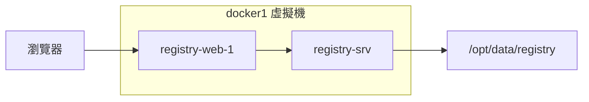

# LAB 21 私庫圖形管理工具 docker-registry-web

## 學習目標

完成本章節後，你將能夠：

- [ ] 部署 docker-registry-web 圖形介面
- [ ] 透過網頁管理 Private Registry
- [ ] 查看映像檔清單與標籤

## 前置知識

開始之前，請確保你已經：

- 完成 LAB 05 Private Registry 建置
- 熟悉 Docker 基本操作
- 準備好 docker1 虛擬機環境

---

## 核心概念說明

### docker-registry-web 是什麼？

**docker-registry-web** 是一個開源的 Web UI 工具，讓你可以透過瀏覽器管理 Private Registry：

- 查看 Registry 中的所有映像檔（Repositories）
- 瀏覽映像檔的標籤（Tags）
- 查看映像檔的詳細資訊

!!! info "官方文件"
    Docker Hub: [https://hub.docker.com/r/hyper/docker-registry-web](https://hub.docker.com/r/hyper/docker-registry-web)

### 架構說明



| 容器 | 說明 | Port |
|------|------|------|
| registry-srv | Private Registry 服務 | 5000 |
| registry-web-1 | Web 管理介面 | 8080 |

---

## Lab 實作練習

!!! note "操作環境"
    本 Lab 所有操作都在 **docker1** 虛擬機上執行。

---

### 步驟 1：清除現有容器與映像檔

首先清除 docker1 上的所有容器和映像檔：

```bash title="清除所有容器和映像檔"
./docker_clean_all.sh
```

或手動執行：

```bash title="手動清除"
docker stop $(docker ps -aq)
docker rm $(docker ps -aq)
docker rmi $(docker images -q)
```

---

### 步驟 2：啟動 Private Registry

!!! warning "容器名稱注意事項"
    根據官方文件說明，**容器名稱不可以使用 `registry`**！
    
    因為 docker-registry-web 使用 `--link` 連接，如果 Registry 容器名稱是 `registry`，會與環境變數衝突導致錯誤。

啟動 Registry 服務（使用 `registry-srv` 作為名稱）：

```bash title="啟動 Registry"
docker run -d \
  -p 5000:5000 \
  -v /opt/data/registry:/var/lib/registry \
  --restart=always \
  --name registry-srv \
  registry
```

**預期結果**：

```
Unable to find image 'registry:latest' locally
latest: Pulling from library/registry
...
Status: Downloaded newer image for registry:latest
238cf2ffba02232cb0356f437f9e6dafb9d0f531827b2feea7da24a35da670eb
```

驗證：

```bash title="檢查 Registry"
docker ps
```

---

### 步驟 3：啟動 docker-registry-web

啟動 Web 管理介面：

```bash title="啟動 docker-registry-web"
docker run -it \
  -p 8080:8080 \
  --name registry-web-1 \
  --link registry-srv \
  -e REGISTRY_URL=http://registry-srv:5000/v2 \
  -e REGISTRY_NAME=localhost:5000 \
  hyper/docker-registry-web
```

**參數說明**：

| 參數 | 說明 |
|------|------|
| `-p 8080:8080` | 映射 Web 介面到 port 8080 |
| `--link registry-srv` | 連接到 Registry 容器 |
| `REGISTRY_URL` | Registry API 位址 |
| `REGISTRY_NAME` | 顯示在 Web 介面的 Registry 名稱 |

**預期結果**（等待 Tomcat 啟動）：

```
Jan 28, 2026 8:49:21 AM org.apache.coyote.AbstractProtocol start
INFO: Starting ProtocolHandler ["http-bio-8080"]
Jan 28, 2026 8:49:21 AM org.apache.catalina.startup.Catalina start
INFO: Server startup in 12013 ms
```

!!! danger "保持此視窗開啟"
    docker-registry-web 使用 `-it` 前景執行，關閉視窗會停止服務。
    
    如需背景執行，可改用 `-d` 參數。

---

### 步驟 4：開啟 Web 管理介面

在圖形環境中開啟瀏覽器，連線到：

```
http://192.168.66.21:8080
```

或在 docker1 本機：

```
http://localhost:8080
```

你會看到 Registry 中的所有映像檔清單：


### 介面說明

| 欄位 | 說明 |
|------|------|
| **Registry** | Registry 名稱（localhost:5000） |
| **Repository** | 映像檔名稱 |
| **Tags** | 該映像檔的標籤數量 |

從畫面可以看到 Registry 中有多個映像檔：

- alpine (1 tag)
- httpd (1 tag)
- mariadb (1 tag)
- mysql (3 tags)
- nginx (3 tags)
- ubuntu (1 tag)
- wordpress (1 tag)

點選映像檔名稱可以查看該映像檔的所有標籤和詳細資訊。

---

## 清理資源

完成練習後，可以清理相關資源：

```bash title="停止並刪除容器"
docker stop registry-web-1 registry-srv
docker rm registry-web-1 registry-srv
```

---

## 常見問題

??? question "Q1：Web 介面顯示空白或連線錯誤"
    **原因**：Registry 容器名稱使用了 `registry`
    
    **解決方案**：
    刪除容器後重新建立，使用不同的名稱（如 `registry-srv`）

??? question "Q2：無法連線到 8080 埠"
    **原因**：docker-registry-web 尚未啟動完成
    
    **解決方案**：
    等待 Tomcat 啟動完成（看到 `Server startup in xxxxx ms`）

??? question "Q3：映像檔列表是空的"
    **原因**：Registry 沒有映像檔，或 REGISTRY_URL 設定錯誤
    
    **解決方案**：
    1. 確認 Registry 有映像檔：`curl http://localhost:5000/v2/_catalog`
    2. 確認 REGISTRY_URL 指向正確的 Registry 容器

---

## 小結

本章節重點回顧：

- ✅ **docker-registry-web**：Private Registry 的網頁管理介面
- ✅ **容器命名注意**：Registry 容器名稱不可使用 `registry`
- ✅ **--link 連接**：Web 容器透過 Docker link 連接 Registry
- ✅ **映像檔管理**：透過圖形介面查看 Repository 和 Tags

## 延伸閱讀

- [docker-registry-web Docker Hub](https://hub.docker.com/r/hyper/docker-registry-web)
- [docker-registry-web GitHub](https://github.com/mkuchin/docker-registry-web)
- [Docker Registry API v2](https://docs.docker.com/registry/spec/api/)
