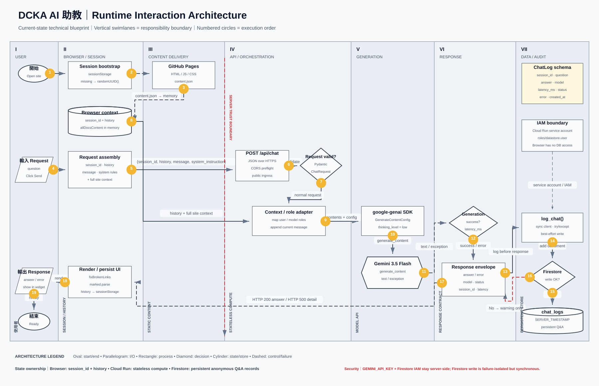
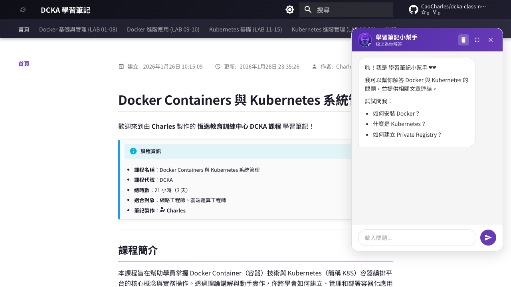
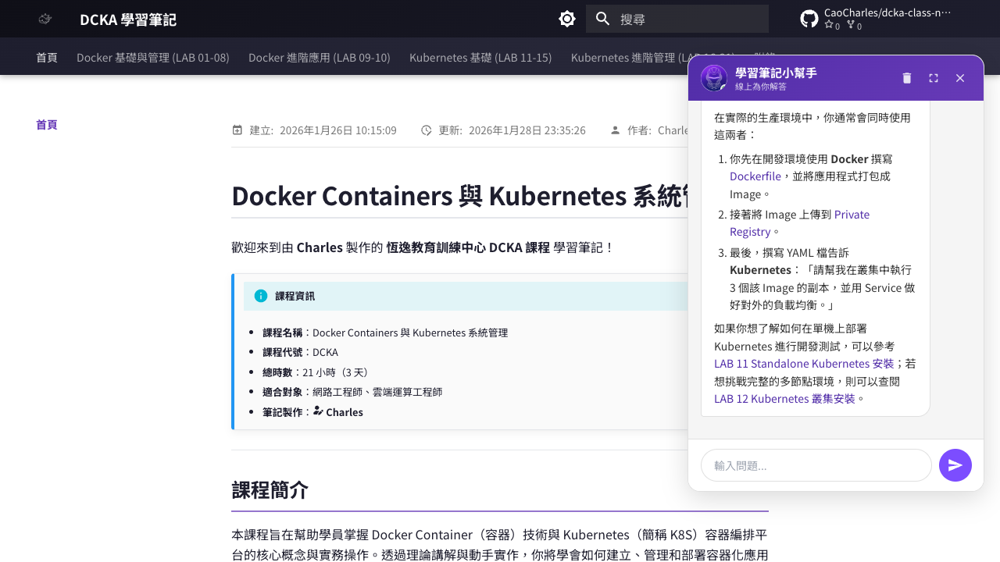

# AI Assistant Runtime Interaction Architecture



這一頁使用技術架構常見的垂直泳道表示責任邊界。從左到右依序為匿名使用者、Browser／Session、GitHub Pages、Cloud Run API、Gemini Generation，以及 Firestore／Cloud Logging。圖中的編號表示目前程式實作的主要執行順序。

## 使用者看到的功能

點擊網站右下角的機器人圖示後，會開啟「學習筆記小幫手」。



使用者輸入問題後，前端將問題、對話歷史與教材上下文送到 Cloud Run。成功回應會以 Markdown 顯示，並可提供相關文章連結與程式碼區塊。



## 從教材到 AI 上下文

`hooks/generate_content.py` 在 MkDocs build 完成後：

1. 掃描 `docs/` 下所有 `.md`。
2. 取得文章標題、正式網址與 Markdown 內容。
3. 產生 `site/content.json`。
4. GitHub Pages 一併發布這個 JSON。

Chatbot 開啟時，`chatbot.js` 下載 `content.json`，把全站文章組合成 System Instruction 的文件區段。

> 目前是「全站內容直接放入提示詞」的 full-context RAG，尚未使用 embedding、vector database 或 top-k retrieval。

## 一次問答的資料流程

1. 使用者開啟網站，Browser 向 GitHub Pages 取得 HTML、CSS、`chatbot.js` 與 `marked.js`。
2. `chatbot.js` 再向 GitHub Pages 取得 `content.json`，保存成 Browser memory 中的 `allDocsContent`。
3. 對話歷史與匿名 `session_id` 使用 `sessionStorage` 保存；清除歷史時會重新產生 UUID。
4. 使用者送出問題後，Browser 組合 `session_id`、`history`、`message` 與 `system_instruction`；其中 System Instruction 包含回答規則與全站文件。
5. 因 GitHub Pages 與 Cloud Run 是不同 Origin，Browser 會先進行 CORS preflight。
6. Browser 以 `application/json` 呼叫 Cloud Run 的 `POST /api/chat`。
7. FastAPI 套用 1 MiB body、Pydantic 欄位與 instance-local rate limit，再把 role 對應成 `user`／`model`。
8. `google-genai` SDK 以 `GenerateContentConfig` 分開傳入 `system_instruction`，並設定 `thinking_level="low"`。
9. Cloud Run 呼叫 `gemini-3.5-flash`，取得 `response.text` 或 exception，並計算 `latency_ms`。
10. FastAPI 先回傳 `{ "text": "..." }` 或一般化 4xx／5xx；Cloud Run 本身不保存跨 request 的 Session。
11. 回應送出後，`BackgroundTasks` 遮罩問答並組合 `created_at`、90 天 `expires_at` 等欄位，寫入 Firestore `chat_logs`。
12. Firestore 寫入位於 `try/except` 中；失敗只進 Cloud Logging，不會改變原本的聊天結果。
13. Browser 執行 `fixBrokenLinks()` 與 `marked.parse()`，將回答渲染到 DOM。
14. 更新後的對話歷史寫回 `sessionStorage`。

## Runtime 性質

- **State placement**：教材快取、畫面對話與 `session_id` 在 Browser；Cloud Run 是 stateless compute；匿名問答紀錄持久化在 Firestore。
- **Network boundary**：網站由 GitHub Pages 提供，AI API 由 Cloud Run 提供，因此是跨 Origin HTTPS request。
- **Security boundary**：Gemini API Key 與 Firestore IAM 僅存在 Server side；Cloud Run endpoint 是 public anonymous，但已有 exact-origin CORS、bounded input 與 rate limiting；Browser 不直接存取 Firestore。
- **Identity semantics**：`session_id` 是 correlation ID，不是 Login、身份或授權憑證。
- **Logging semantics**：同步 Firestore client 位於 response 後的 `BackgroundTasks`，並由 `try/except` failure isolation；它不是具 durability guarantee 的外部 Queue。
- **Retrieval behavior**：沒有 query rewrite、embedding、vector search、reranker 或 top-k context selection；每次都傳送完整教材。

## API 格式

請求：

```json
{
  "session_id": "7e930f52-...",
  "history": [
    {"role": "user", "parts": [{"text": "什麼是 Docker？"}]},
    {"role": "model", "parts": [{"text": "Docker 是容器化平台。"}]}
  ],
  "message": "Kubernetes 的角色是什麼？",
  "system_instruction": "回答規則與全站教材內容"
}
```

回應：

```json
{
  "text": "Kubernetes 是用來部署、調度與管理容器工作負載的編排平台。"
}
```

## 為什麼需要 FastAPI Proxy

若瀏覽器直接呼叫 Gemini，API Key 必須出現在 JavaScript 或網路請求中，任何使用者都能取得。透過 FastAPI Proxy，可讓 Key 只存在 Cloud Run 的環境變數。

不過「Key 不在瀏覽器」不等於 API 已有完整存取控制。Cloud Run 端點仍允許匿名呼叫，目前已加入：

- GitHub Pages 與 localhost exact-origin 白名單。
- 單一 Cloud Run instance 的 API rate limiting。
- Request body、訊息與 History 長度限制。
- 一般化 Client Error 與 Cloud Logging 詳細例外。
- Cloud Logging 與用量告警。

若要跨 instances 的全域配額，仍需 Cloud Armor、API Gateway 或集中式 rate-limit store。

## Firestore 問答紀錄

Firestore 位於 Google Cloud trust boundary，由 Cloud Run service account 存取。`chat_logs` 每次問答新增一筆 document：

```json
{
  "session_id": "匿名對話 UUID",
  "question": "Kubernetes 的角色是什麼？",
  "answer": "模型回答；失敗時為 null",
  "model": "gemini-3.5-flash",
  "latency_ms": 3700,
  "status": "success",
  "error": null,
  "created_at": "SERVER_TIMESTAMP",
  "expires_at": "建立時間 + 90 天"
}
```

這個資料庫用途是匿名稽核、熱門問題分析與品質觀測，不提供使用者身份識別，也不等同於登入後的跨裝置聊天歷史。問答寫入前會遮罩 Email、手機、台灣身分證字號、付款卡號與常見 Secret；`expires_at` 的 Firestore TTL policy 已啟用並為 `ACTIVE`。若要開放其他人查閱，管理者應透過專用群組取得唯讀 `roles/datastore.viewer`。

## CI/CD 介接

後端修改推到 `main` 後：

1. GitHub Actions 偵測 `backend/**` 變更。
2. GitHub Actions 使用 OIDC，透過 Workload Identity Federation 取得 `github-actions-deployer` 的短效憑證。
3. 執行 `gcloud run deploy --source backend`。
4. Cloud Build 建置 Docker image。
5. Cloud Run 建立新 revision。
6. `GEMINI_API_KEY` 注入服務環境變數。
7. GitHub Pages 的 `chatbot.js` 透過固定 Cloud Run URL 呼叫新版服務。

## 線上驗證紀錄

驗證日期：2026-08-19（Asia/Taipei）

- `GET /`：HTTP 200。
- `POST /api/chat`：HTTP 200。
- CORS：允許 `https://caocharles.github.io`。
- 簡短問題回應時間：約 3.70 秒。
- 模型回覆：繁體中文正常。
- Chatbot 長回答、文章連結及程式碼區塊正常顯示。
