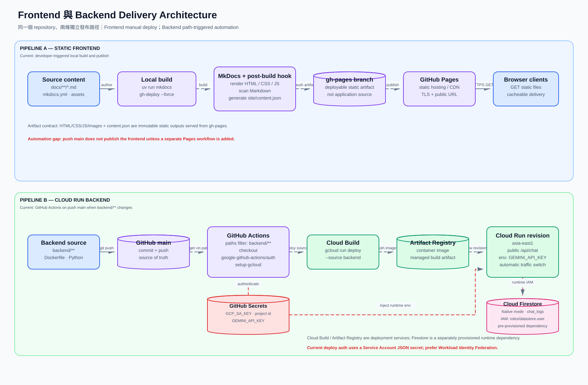
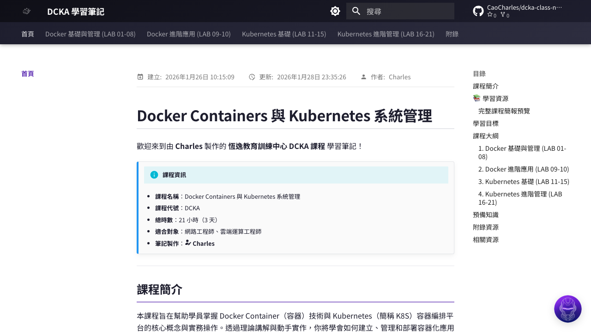

# Frontend & Backend Delivery Architecture



這張圖把同一個 GitHub repository 的兩條發布路徑分開呈現。前端的 deployment artifact 是由 Actions 上傳的 GitHub Pages Artifact；後端的 deployment artifact 是 Google Cloud 建置並保存的 container image。兩者不共用 build，也不會因相同事件一起發布。

## Markdown 如何變成網頁

### 1. 撰寫教材

課程文章放在 `docs/`，格式是 Markdown。圖片與附件同樣位於 `docs/` 下，讓 MkDocs 建置時一起複製。

### 2. 設定網站

`mkdocs.yml` 負責：

- `nav`：網站分頁與選單順序。
- `theme`：Material 主題、配色、字型與深色模式。
- `plugins`：搜尋、圖片燈箱、Git 日期、作者及 PDF 功能。
- `extra_javascript`／`extra_css`：載入 Chatbot 前端。
- `hooks`：建置後生成 `content.json`。

### 3. Git 版本控制

修改完成後，透過 commit 保存版本，再 push 到 GitHub 的 `main` branch。GitHub 保存的是網站原始碼，不是使用者最後看到的 HTML。

### 4. MkDocs Build

正式流程由 `deploy-pages.yml` 執行：

```bash
uv sync --locked
uv run mkdocs build
```

Actions 會：

1. 將 Markdown 轉成 HTML。
2. 整合 CSS、JavaScript、圖片與附件。
3. 執行 Hook，產生 `content.json`。
4. 將 `site/` 上傳為 Pages Artifact。

### 5. GitHub Pages 發布

`actions/deploy-pages` 將 Pages Artifact 發布至公開網址：

```text
https://caocharles.github.io/dcka-class-notes/
```

## 前端與後端部署差異

### 前端

- `.github/workflows/deploy-pages.yml` 已存在。
- 網站相關檔案推到 `main` 後，GitHub Actions 依 `uv.lock` 建置 MkDocs 並部署 Pages Artifact。
- Repository 的 **Settings → Pages → Source** 已設為 **GitHub Actions**。
- `mkdocs gh-deploy` 只適用於把 Source 暫時切回 **Deploy from a branch** 的緊急情境，不是目前正式發布路徑。

### 後端

- `.github/workflows/deploy-backend.yml` 已存在。
- 當 `backend/**` 變更推到 `main`，GitHub Actions 會執行 `gcloud run deploy --source backend`。
- GitHub Actions 透過 OIDC／Workload Identity Federation 取得短效 GCP 憑證；`GCP_PROJECT_ID`、WIF Provider 與 deployer/runtime Service Account 使用 GitHub Variables，`GEMINI_API_KEY` 使用 GitHub Secret。
- `gcloud run deploy --source backend` 會委派 Cloud Build 建置 image，並由 Artifact Registry 保存 managed build artifact。
- Cloud Run 建立新 revision 並切換流量；服務保持 stateless。
- Firestore 是另行建立的 runtime dependency，不會因每次後端 deploy 重建；Cloud Run service account 需具備 `roles/datastore.user`。

## 架構治理重點

- 前端與後端各有獨立 paths-filtered workflow；push `main` 後只建置有變更的一側。
- GitHub Pages Artifact 不應手動維護內容。
- Backend authentication 已改用 Workload Identity Federation，並限制只有 `CaoCharles/dcka-class-notes` 的 `main` 分支可以 impersonate `github-actions-deployer`。
- `GEMINI_API_KEY` 現況是部署時寫入 Cloud Run environment；若需要更完整的 rotation 與稽核，可再評估 Secret Manager。
- Firestore database、location 與 IAM 是一次性基礎設施設定；應與應用程式 deployment pipeline 分開管理與記錄。

## 網頁畫面



首頁包含課程分類、全文搜尋、深色模式、GitHub 連結與右下角 AI 助教入口。

## 新增文章的實際步驟

1. 在 `docs/` 新增 Markdown。
2. 在 `mkdocs.yml` 的 `nav` 加入路徑。
3. 執行 `uv run mkdocs serve` 本地預覽。
4. commit 並 push `main`。
5. 觀察 `Deploy MkDocs to GitHub Pages` workflow 完成。
6. 開啟 GitHub Pages 確認文章、圖片與連結。
